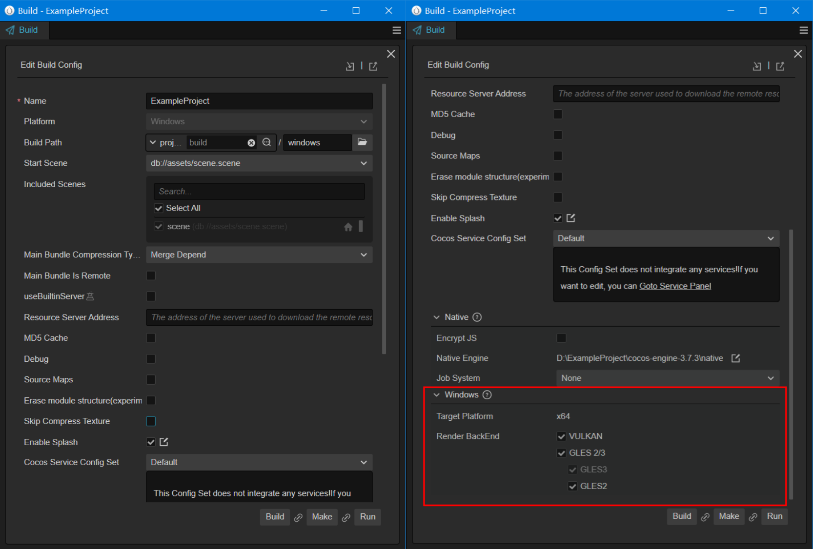
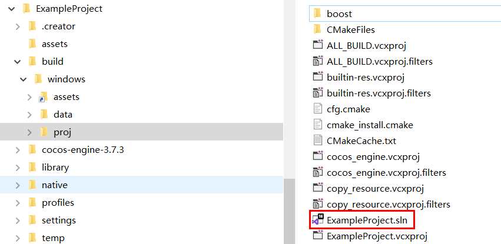
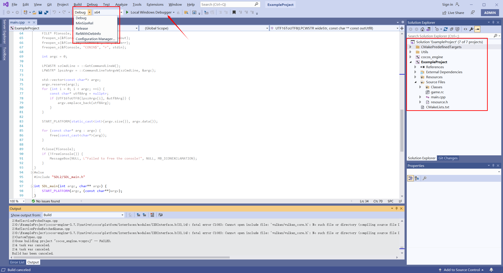
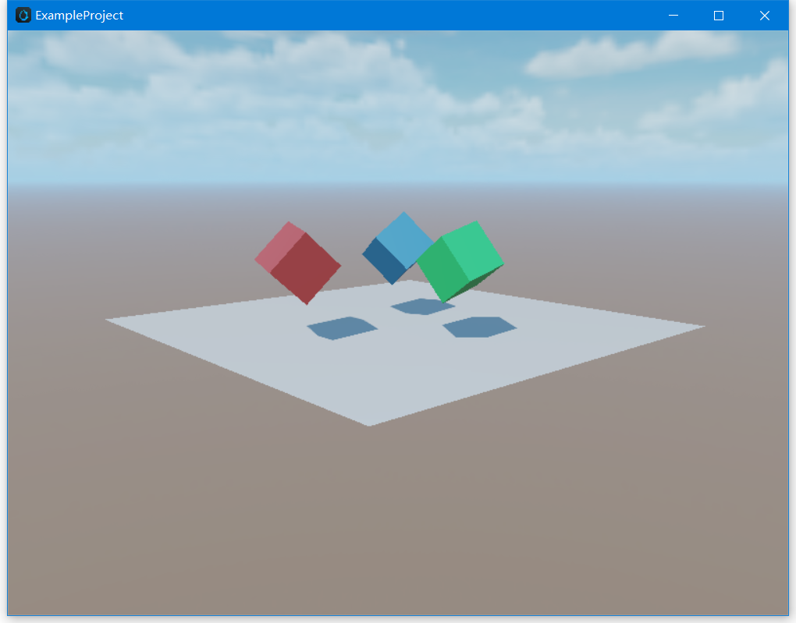
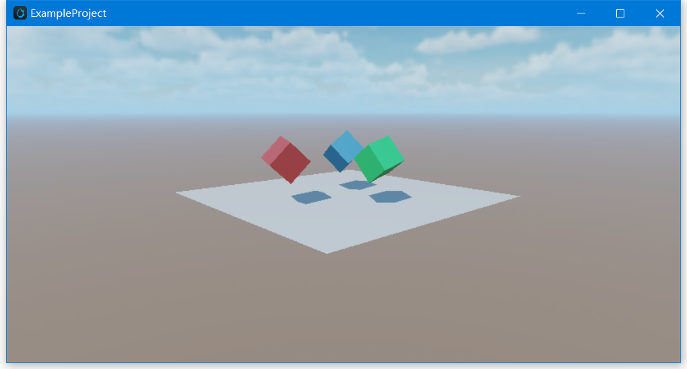

# Windows Publishing Example

This guide demonstrates how to publish a project created with Cocos Creator as a Windows application. Before proceeding, make sure you have the following prerequisites:

本文将演示将 Cocos Creator 开发的项目发布为 Windows 应用程序，需要以下准备工作：
- A Windows computer
- C++ development environment

## Installing C++ Development Environment

First, you need to install [Visual Studio 2017/2019 Community](https://www.visualstudio.com/downloads/download-visual-studio-vs).

During the installation of Visual Studio, make sure to select the modules `Desktop development with C++` and `Game development with C++`.

> **Note:** Within the Game development with C++ module, there is an option for **Cocos**. Please do not select this option.

## Publishing Process

### Prepare a Project for Testing

Open an existing project or create a new test project.

### Build


As shown in the above image, select **Project -> Build** from the top menu of Cocos Creator to open the **Build** panel.



#### General Options

In the left section of the image above, you can find the common parameters that need to be configured for all platforms supported by Cocos Creator. For more details, refer to [General Build Options](./../build-options.md).

#### Windows-specific Options

Select the platform as **Windows**, and scroll down the panel to see the native and Windows-specific options as shown in the image on the right. For more information, refer to [General Native Build Options](./../native-options.md) and [Build Options - Windows](./build-options-windows.md).

#### Start to Build

Once the configuration is complete, click the **Build** button to generate the Visual Studio `*.sln` project.

After a successful build, you can click the open file button as shown below to open the generated project folder.


If you haven't changed the build path, you can find the `build/windows/proj` directory located in the project root, which contains the following files:



### Compile and Run in Visual Studio

Double-click on `build/windows/proj/<project_name>.sln` to open the project with Visual Studio.



As shown in the image above, the project includes the `cocos-engine` library and **project code**. Click the compile and run button to start the project.



> `*.sln` is a Visual Studio project solution file, and it is recommended to open it with Visual Studio. You can also use IDEs such as **Rider** that support `*.sln` files.

### Modifying the Resolution

You can modify the resolution in `native/engine/common/classes/Game.cpp` using the `_windowInfo` property.

The default resolution is set to **800 x 600**. Let's take an example of changing it to **800 x 400**.

```C++
int Game::init() {
  _windowInfo.title = GAME_NAME;
  // configure window size
  _windowInfo.width  = 800;
  _windowInfo.height = 400;
}
```

After making the modification, compile and run again in Visual Studio. The effect will be as shown in the image below:



## Read More

### Script-Native Communication

Sometimes, projects need to call Windows system functions or, when integrating a third-party SDK, use script code to call its APIs. In such cases, the communication mechanism between the script layer and the native layer is required.

For information on the JS script and C++ communication mechanism, please refer to the [Tutorial: JSB 2.0](../../../advanced-topics/JSB2.0-learning.md)。

### Debugging JavaScript on Native Platforms

Some issues only occur on specific devices and environments. If you can debug the code on the corresponding situation, you can quickly identify the problem and find a solution.

Cocos Creator provides a native debugging mechanism that allows you to easily debug game code on a device. For more details, please refer to [Debugging JavaScript on Native Platforms](./../debug-jsb.md).
