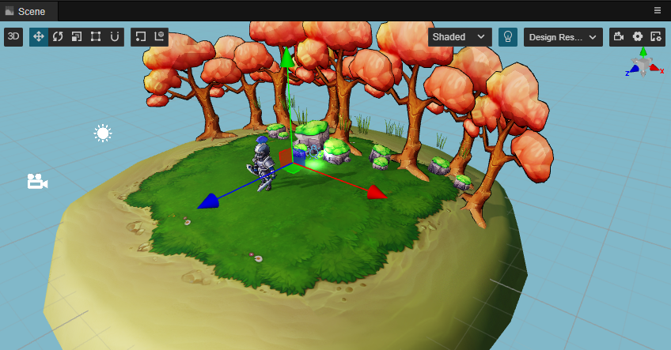
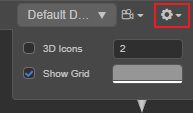
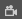
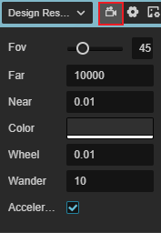
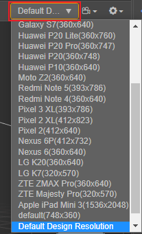
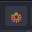
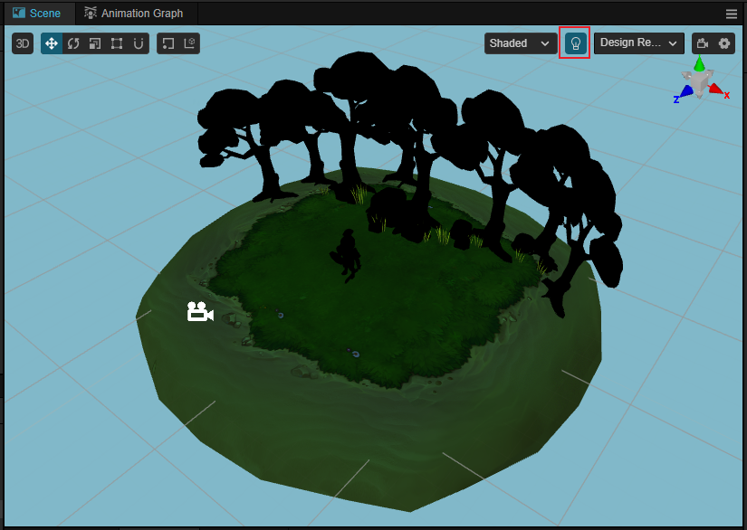
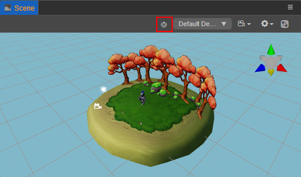

# Scene Panel

The **Scene** panel is the central work area for content creation, used for selecting and placing scene images, characters, effects, UI, and other game elements. This workspace allows to select and modify the position, rotation, and scaling of nodes with the **Transform Gizmos**, and get a WYSIWYG scene preview.

## View Introduction

The **Scene** panel includes two views, **3D** and **2D**. The 3D view is used for 3D scene editing, while the 2D view is mainly used for editing 2D elements such as UI nodes, etc. The scene view can be switched via the **3D/2D** button in the toolbar at the top left of the editor.

### 3D view

In the 3D view, you can move and position the view of the **Scene** panel by the following actions:
- Left mouse button + Alt: rotates the view centered on its center point.
- Middle mouse button: pans the view.
- Mouse wheel: zoom the view centered on the view center point.
- Right mouse button + WASD: camera roaming.
- **F** Shortcut: focus the camera on the currently selected node.

### 2D view

In 2D view, the view of the **Scene** panel can be moved and positioned by the following actions:
- Middle mouse button: pans the view.
- Mouse wheel: zooms the view centered on the current mouse hover position.
- Right mouse button: pans the view.
- **F** Shortcut: focus the camera on the currently selected node.

## Scene settings

The options in the upper right corner of the **Scene** panel can be used to set the scene grid, scene camera properties, etc. Please refer to the following description for details.

### Grid settings

The grid in the scene is an important reference for the position of the scene elements when we place them, and can be set via the button on the top right of the **Scene** panel.

| Option | Description |
| :-- | :-- |
| 3D Icons | Whether to enable the 3D icon for the scene, the input box after it is used to set the size of the icon gizmo, the value range is 0 ~ 8. If this option is checked, the 3D icon will be enabled and the icon gizmo in the **Scene** panel will be a 3D slice with a foreshortening effect. If this option is unchecked, the icon gizmo will be displayed as a fixed size image. |
| Show Grid | Whether to display the grid in the **Scene** panel, with the color setting box behind it used to set the color of the grid. |

### Scene camera settings

Click the  button in the upper-right corner of the **Scene** panel to set the properties of the scene camera (not the user-created camera):

| Option | Description |
| :-- | :-- |
| Fov | Set the field of view of the scene camera. |
| Far | Set the far clipping distance of the scene camera. |
| Near  | Set the near clipping distance of the scene camera. |
| Color | Set the scene background color. |
| Wheel Speed  | Set the speed at which the scene camera moves back and forth when the mouse wheel is scrolled. |
| Wander Speed | Set the movement speed when the scene camera is roaming. |
| Wander Acceleration | Whether to enable acceleration in Wander Mode (new in v3.3). If enable, the camera will moving faster along time, otherwise the camera will move in a constant speed.|

### Render target resolution settings

The render output target resolution of the scene camera can be selected in the upper right corner of the **Scene** panel as needed, which will affect the visual range of the scene camera, and facilitate a similar display to the resolution selected in the final preview:

Resolutions can be added/modified/deleted in [Device manager](../preferences/index.md#device-manager) of the **Preferences** on the top menu bar.

For descriptions about the visual range of the camera, please refer to the [Camera component](../components/camera-component.md) documentation.

## Scene Light Configure

The  button above the **Scene** panel is mainly used to set whether to use scene lights when editing the scene, and is used by default.

If scene lighting is enabled, the scene will be illuminated by the lights added to the scene, as follows:

When there is no added light in the scene, the scene is completely black:

At this point, the button can be switched to white, indicating that not using the scene lights, and the editor will automatically create a hidden directional light aligned with the scene camera view to illuminate the scene, as shown below:

## Scene Gizmo

The Scene Gizmo is in the upper right corner of the scene view. It shows the current viewing direction of the scene camera and can be clicked to quickly switch between different viewing angles.

- Click on the 6 directional axes to quickly switch to the top, bottom, left, right, front, and back angles to view the scene.
- Click the center cube to switch between orthogonal view and perspective view.

### Select node

Click the left mouse button in the scene view to select the node where the object is located. Selecting the node is a prerequisite for using transform gizmos to set the node position, rotation, scaling, etc.

### Gizmo operation introduction

The core function of **Scene** panel is to edit and arrange the visible elements in the scene in a WYSIWYG way. **Gizmos** are mainly used to assist in the visual editing of the scene.

- [Transform Gizmo](./transform-gizmo.md)
- [Camera Gizmo](./camera-gizmo.md)
- [Light Gizmo](./light-gizmo.md)
- [Collider Gizmo](./collider-gizmo.md)
- [Particle System Gizmo](./particle-system-gizmo.md)
