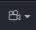
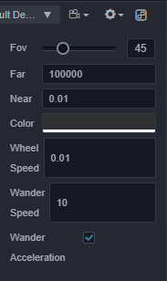
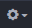
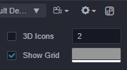

# Scene Panel

The **Scene** panel is the central work area for content creation, used for selecting and placing scene images, characters, effects, UI, and other game elements. This workspace allows to select and modify the position, rotation, and scaling of nodes with the **Transform Gizmos**, and get a WYSIWYG scene preview.

## View Introduction

The **Scene** panel includes two views, **3D** and **2D**. The 3D view is used for 3D scene editing, while the 2D view is mainly used for editing 2D elements such as UI nodes, etc. The scene view can be switched via the **3D/2D** button in the toolbar at the top left of the editor.

### 3D view

In the 3D view, you can move and position the view of the **Scene** panel by the following actions:
- Left mouse button + Alt: rotates the view centered on its center point.
- Middle mouse button: pans the view.
- Mouse wheel: zoom the view centered on the view center point.
- Right mouse button + WASD: camera roaming.
- **F** Shortcut: focus the camera on the currently selected node.

### 2D view

In 2D view, the view of the **Scene** panel can be moved and positioned by the following actions:
- Middle mouse button: pans the view.
- Mouse wheel: zooms the view centered on the current mouse hover position.
- Right mouse button: pans the view.
- **F** Shortcut: focus the camera on the currently selected node.

## Coordinate System and Grid

The grid in the scene is an important reference information for the position of the scene elements when we place them. For the relationship between the coordinate system and the position and other node properties, please read the [Coordinate System and Node Transformation](../../concepts/scene/coord.md) documentation.

## Scene Light Configure

The  button above the **Scene** panel is mainly used to set whether to use scene lights when editing the scene, and is used by default.

If scene lighting is enabled, the scene will be illuminated by the lights added to the scene, as follows:

When there is no added light in the scene, the scene is completely black:

At this point, the button can be switched to white, indicating that not using the scene lights, and the editor will automatically create a hidden directional light aligned with the scene camera view to illuminate the scene, as shown below:

## Scene Camera Configuration
The button above the **Scene** panel is used to open the Scene Camera Configuration Panel.

| Name | Description |
| :-- | :-- |
| Fov | Set the Fov of camera |
| Far | Set the distance of far clip panel |
| Near | set the distance of near clip panel |
| Color | Set the background color of scene |
| Wheel Speed | Set the move speed of camera when scrolling mouse wheel |
| Wander Speed | Set the move speed of camera in Wander Mode|
| Wander Acceleration | Whether to enable acceleration in Wander Mode. If enable, the camera will moving faster along time, otherwise the camera will move in a constant speed.|

## Scene Configuration
The button above the **Scene** panel is used to open the Scene Configuration Panel.

| Name | Description |
| :-- | :-- |
| 3DIcons | Whether to enable 3DIcons. If enabled, the image of IconGizmo will show as a 3D billboard, otherwise the image will show in constant size. You can modify the size of icon in the number input field|
| ShowGrid | Whether to show grid in the scene. You can set the color of the grid.|

## Scene Gizmo

The Scene Gizmo is in the upper right corner of the scene view. It shows the current viewing direction of the scene camera and can be clicked to quickly switch between different viewing angles.

- Click on the 6 directional axes to quickly switch to the top, bottom, left, right, front, and back angles to view the scene.
- Click the center cube to switch between orthogonal view and perspective view.

### Select node

Click the left mouse button in the scene view to select the node where the object is located. Selecting the node is a prerequisite for using transform gizmos to set the node position, rotation, scaling, etc.

### Gizmo operation introduction

The core function of **Scene** panel is to edit and arrange the visible elements in the scene in a WYSIWYG way. **Gizmos** are mainly used to assist in the visual editing of the scene.

- [Transform Gizmo](./transform-gizmo.md)
- [Camera Gizmo](./camera-gizmo.md)
- [Light Gizmo](./light-gizmo.md)
- [Collider Gizmo](./collider-gizmo.md)
- [Particle System Gizmo](./particle-system-gizmo.md)
