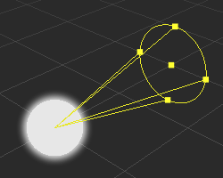

# Light Gizmo

For more information about the light of __Cocos Creator__, you can read the [Light Introduction](../../concepts/scene/light.md) documentation.

## Directional Light

**Directional Light Gizmo** shows the direction of the directional light.

## Sphere Light

**Sphere light Gizmo** shows the color and area of light, you can edit the area of light by dragging the control quad.

## Spot Light

**Spot Light Gizmo** shows the color, area and spot angle of spot light, you can edit the area and angle of light by dragging the control quad.

