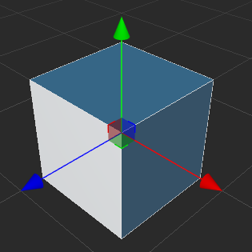
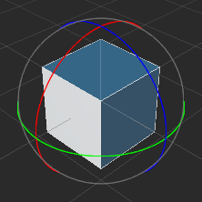
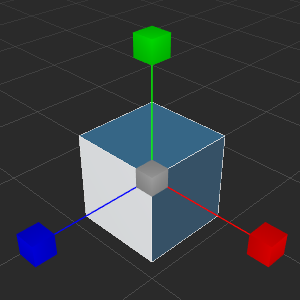
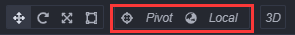

# Transform Gizmo

We mainly use the **Transform Tool** on the toolbar which is in the left top of main window to arrange the node in the scene.

## Move transform tool

**Move transform tool** is the default active transform tool. This tool can be activated by clicking the first button on top left corner of main window's tool bar, or press the keyboard shortcut **W** in scene editor.

After you selected a node, You can see three move handle which is made up of red, green, blue arrow and plane in the center(or the anchor position) of the node.

Gizmo refers to a controller that can interactive with mouse and appears in certain editing states in the scene editor. These controllers are only to assist editing without being shown in the game while it is running.

When the move transform tool is active:
- Press **red, green, blue** arrow and drag mouse, then the node will be moved on the **x, y, z** axis.
- Press **red, green, blue** plane and drag mouse, then the node will be moved freely on **y-z, x-z, x-y** plane.

## Rotate transform tool

Click the second button on the tool bar located at the main window's top left corner or press the keyboard shortcut **E** in scene editor and you can activate **Rotate transform tool**.

The gizmo of rotate transform tool is made up of three orthogonal circles(an arrow and a circle in 2D view).By dragging arrow or any point in the circle, you can rotate the node and you can see the rotation area on gizmo before you release the mouse.

When the move transform tool is active:
- Press **red, green, blue** circle and drag mouse, then the node will be rotated on the **x, y, z** axis.

## Scale transform tool

Click the third button on the tool bar located at main window's top left corner or press the keyboard shortcut **R** in the scene editor and you can activate **scale transform tool**.

The gizmo of scale transform tool is made up of red,green,blue cube align the three axis and a gray cube in the center.

When the scale transform tool is active:
- Press **red, green, blue** cube and drag mouse, then the node will be scaled on the **x, y, z** axis.
- Press **gray** cube and drag mouse, then the node will be scaled on all the **x, y, z** axis at the same time.

## Rect transform tool

Click the fourth button on the tool bar located at the main window's top left corner or press the keyboard shortcut **T** in scene editor and you can activate **rect transform tool**.

The gizmo of rect transform tool is made up of four conner control point, four edge control point and one center control point.

When the rect transform tool is active:
- Drag any conner control point of the gizmo so you can change the attributes of width and height in node size while the opposite angles end points position keep the same.
- Drag any side control point of the gizmo so you can change the attributes of width and height in node size while the opposite sides position keep the same.

In UI elements layout, **rect transform tool** is always used to precisely control the position and length of the node's dimensions. As to the image elements that must keep original image aspect ratio, the rectangle transform tool is normally not the best choice for size adjustment.

## Transform Snapping

The transform snapping feature can be used to manipulate nodes in a set step size when using the move/rotate/scale transform tools in the scene editor. The transform snapping feature can be triggered in the following two ways:

1. Press and hold the <kdb>Ctrl</kdb> key while using transform tools to trigger the transform snapping feature.
2. In the transform snapping configuration panel, use the button to enable the automatic snapping feature of corresponding transform tools. See below for details.

Click on the fifth **Transform snapping configuration** button in the toolbar in the upper left corner of the editor's main window:

The transform snapping configuration panel will pop up, which can be used to set the step size of corresponding transform tools, and enable the auto snapping feature:

| Button | Description |
| :-- | :-- |
| | This button is used to set whether to enable the automatic snapping when using the **Move Transform Tool**. X, Y, and Z are used to set the move steps on the X, Y, and Z axes respectively, and the default X, Y, and Z values are the same for X, or you can click the  button to set the step size for each axis separately.  |
| | This button is used to set whether to enable automatic snapping when using the **Rotation Transform Tool**. The box on the right side is used to set the rotation step, the default is 1. |
| | This button is used to set whether to enable automatic snapping when using the **Scale Transform Tool**. The box on the right side is used to set the rotation step, the default is 1. |

## Transform Gizmo Based Point Configure

Transform Gizmo Based Point Configure is used to set the position and rotation of transform gizmo.

### Position

Click the **Pivot/Center** button to toggle between **Pivot** and **Center**.

- **Pivot**: use the world position of node.
- **Center**: use the center position of all selected nodes.

### Rotation

Click the **Local/Global** button to toggle between **Local** and **Global**.

- **Local**: use the rotation of node.
- **Global**: use the rotation of world space.
