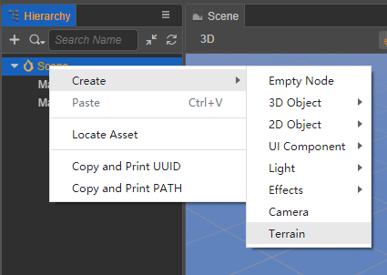
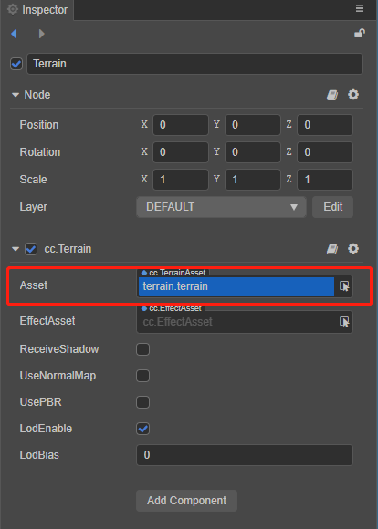
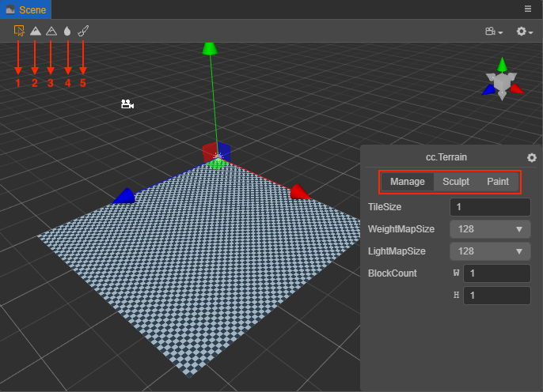
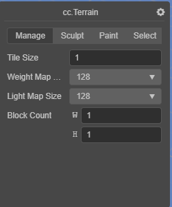
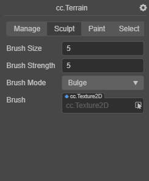
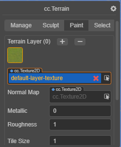

# Terrain system

The __terrain system__ displays the mountainous landscape of nature in an efficient way. Developers can easily use a __brush__ to sculpt basins, mountains, valleys, plains and other landforms.

## Creating a terrain

Two steps are required to create a terrain:

1. Click the right mouse button in __Hierarchy__ panel and click __Create -> Terrain__ to create a terrain node. Terrain nodes can be moved, but rotation and zoom are not yet supported.

    

2. Click the right mouse button in the __Assets__ panel and click __Create -> Terrain__ in the pop-up menu to create the necessary terrain assets.

    

## Terrain component properties

| Property   | Description |
| :----- | :---- |
| **Asset**  | Terrain asset |
| **EffectAsset** | Terrain effect asset |
| **ReceiveShadow** | Accept the shadow |
| **UseNormalMap** | Use normal map |
| **UsePBR** | Use physical materials |
| **LodEnable** | Enable terrain lod |
| **LodBias** | lod start distance |

## Using a terrain

Click on the created terrain node. There is a terrain component (`cc.Terrain`) in the __Inspector__ panel, and the created terrain assets are assigned to the __Asset__ in the terrain component.

## Editing a terrain

After assigning the terrain assets, the **cc.Terrain** editing panel can be accessed from the **Scene** panel. The terrain editing system includes three major functions: **Manage**, **Sculpt**, and **Paint**. These three functions can be switched between by clicking on the corresponding tabs.

It is also possible to switch functions via the tools in the upper left corner of the **Scene** panel:
- 1 -- Corresponds to the **Manage** function.
- 2 -- Corresponds to the **Bulge** `BrushMode` in the **Sculpt** function.
- 3 -- Corresponds to the **Sunken** `BrushMode` in the **Sculpt** function.
- 4 -- Corresponds to the **Smooth** `BrushMode` in the **Sculpt** function.
- 5 -- Corresponds to the **Paint** function.

### Management of terrains

Management is adjusting various parameters of a terrain. Tile is the smallest unit of terrain. Tile constitutes one 32x32 block of tiles with each terrain needing to consist of at least one tile block.

| Parameter | Description |
| :--- | :-- |
| **TileSize** | The size of the terrain tile. Currently, a terrain block consists of 32 x 32 tiles, so the side length of a terrain block is **32 x TileSize**. |
| **BlockCount** | Number of terrain blocks in two dimensions |
| **WeightMapSize** | Weight map size |
| **LightmapSize** | Lightmap size |

### Sculpting a terrain

Sculpting is changing the shape of a terrain.

| Parameter | Description |
| :--- | :--- |
| **BrushSize**     | The size of the brush |
| **BrushStrength** | The strength of the brush |
| **BrushMode** | The type of the brush, including **Bulge**、**Sunken** and **Smooth** |
| **Brush** | Custom brush style, by selecting a style picture to generate a custom brush. |

To control the bulging/depression of the terrain, use the **left mouse** button and the **Shift + left mouse** button, respectively. The bulge and depression operation often makes the terrain look sharp, use the smoothing function to overdo it.

### Painting a terrain

Painting is the texture used to depict the appearance of a terrain.

| Parameter | Description |
| :--- | :--- |
| **TileLayer** | Set the Layer of the terrain, as described in section **Layer editing** below. |
| **BrushSize** | The size of the brush |
| **BrushStrength** | The strength of the brush  |
| **BrushFalloff** | Brush falloff, this value determines the sharpness of the brush edge. **0.0** means that the brush has full effect in the whole range (all covered by the current layer texture), with sharp edges. **1.0** means that the brush has full effect only in its center, and the influence will be attenuated when reaching the edge. |
| **Brush** | Custom brush style. by selecting a style picture to generate a custom brush. |

#### Layer editing

Click the **+** or **-** button at the top right to **add** or **delete** layers (up to **4** layers are supported). Once a Layer is selected, you can edit the Layer and its texture.

| Parameter | Description |
| :--- | :--- |
| **TerrainLayer** | Current Layer texture |
| **NormalMap** | To set the normal map of the current Layer, check the UseNormalMap property for the terrain component |
| **Metallic** | Set the metal properties of the current Layer |
| **Roughness** | Sets the roughness of the current Layer |
| **TileSize**       | The tile size of the texture. The smaller the value, the more tiles will be used in the same size area |
