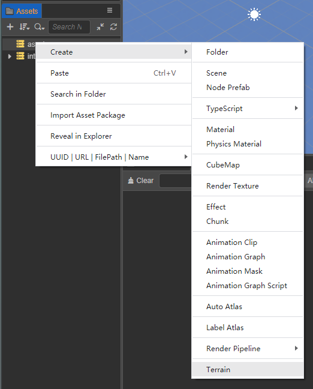
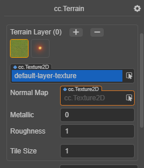
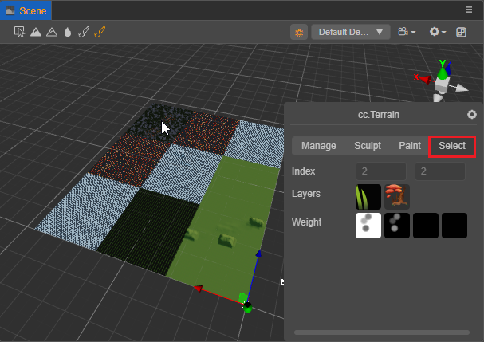

# Terrain system

The **terrain system** displays the mountainous landscape of nature in an efficient way. Developers can easily use a **brush** to sculpt basins, mountains, valleys, plains and other landforms.

## Creating a terrain

Two steps are required to create a terrain:

1. Click the right mouse button in **Hierarchy** panel and click **Create -> Terrain** to create a terrain node. Terrain nodes can be moved, but rotation and zoom are not yet supported.

    

2. Click the right mouse button in the **Assets** panel and click **Create -> Terrain** in the pop-up menu to create the necessary terrain assets.

    

## Using a terrain

Click on the created terrain node. There is a terrain component (`cc.Terrain`) in the **Inspector** panel, and the created terrain assets are assigned to the `Asset` in the terrain component.

| Property   | Description |
| :----- | :---- |
| Asset  | Terrain asset |
| Effect Asset | Terrain effect asset |
| Receive Shadow | Accept the shadow |
| Use Normal Map | Use normal map |
| Use PBR | Use physical materials |
| Lod Enable | Enable Terrain Lod, used to reduce the number of rendered faces and improve rendering performance |
| Lod Bias | Set the starting distance of Lod |

## Editing a terrain

After assigning the terrain assets, the **cc.Terrain** editing panel can be accessed from the **Scene** panel. The terrain editing system includes three major functions: **Manage**, **Sculpt**, **Paint** and **Select**. These three functions can be switched between by clicking on the corresponding tabs.

It is also possible to switch functions via the tools in the upper left corner of the **Scene** panel:
- **Manage** function.
- **Bulge** `BrushMode` in the **Sculpt** function.
- **Sunken** `BrushMode` in the **Sculpt** function.
- **Smooth** `BrushMode` in the **Sculpt** function.
- **Paint** function.
- **Select** function.

### Management of terrains

Management is adjusting various parameters of a terrain. Tile is the smallest unit of terrain. Tile constitutes one 32x32 block of tiles with each terrain needing to consist of at least one tile block.

| Parameter | Description |
| :--- | :-- |
| Tile Size | The size of the terrain tile. Currently, a terrain block consists of 32 x 32 tiles, so the side length of a terrain block is **32 x Tile Size**. |
| Weight Map Size | Weight map size |
| Light Map Size | Light map size |
| Block Count | Number of terrain blocks in two dimensions |

### Sculpting a terrain

Sculpting is changing the shape of a terrain.

| Parameter | Description |
| :--- | :--- |
| Brush Size | The size of the brush |
| Brush Strength | The strength of the brush |
| Brush Mode | The mode of the brush, including **Bulge**, **Sunken**, **Smooth**, **Flatten**, **Set Height** |
| Brush Height | The height of the brush, only use for **Set Height** mode |
| Brush | Custom brush style, by selecting a style picture to generate a custom brush, use a channel as brush mask |

| Brush mode | Description |
| :--- | :--- |
| Bulge | Bulge terrain |
| Sunken | Sunken terrain |
| Smooth | Smooth terrain |
| Flatten | Flatten terrain |
| Set Height | Use **Brush Height** to set terrain height |

use the **left mouse** button to sculpt terrain, also use the **Shift + left mouse** button to depression terrain when in **Bulge** mode, 

### Painting a terrain

Painting is the texture used to depict the appearance of a terrain.

| Parameter | Description |
| :--- | :--- |
| Terrain Layer | Set the Layer of the terrain, as described in section **Layer editing** below. |
| Brush Size | The size of the brush |
| Brush Strength | The strength of the brush  |
| Brush Falloff | Brush falloff, this value determines the sharpness of the brush edge. **0.0** means that the brush has full effect in the whole range (all covered by the current layer texture), with sharp edges. **1.0** means that the brush has full effect only in its center, and the influence will be attenuated when reaching the edge. |
| Brush | Custom brush style. by selecting a style picture to generate a custom brush. |

#### Layer editing

Click the **+** or **-** button at the top right to **add** or **delete** layers (up to **4** layers are supported). Once a Layer is selected, you can edit the Layer and its texture.

| Parameter | Description |
| :--- | :--- |
| Terrain Layer | Current Layer texture |
| Normal Map | To set the normal map of the current Layer, check the **Use Normal Map** property for the terrain component |
| Metallic | Set the metal properties of the current Layer |
| Roughness | Sets the roughness of the current Layer |
| Tile Size | The tile size of the texture. The smaller the value, the more tiles will be used in the same size area |

### Select

When switching to the **Select** tab and selecting a terrain block in the **Scene** panel, information about the current terrain block will be displayed.

| Parameter | Description |
| :--- | :--- |
| Index  | The index of the currently selected terrain block.    |
| Layers | The texture list of the currently selected terrain block. |
| Wight  | The weight map of the currently selected terrain block.  |
