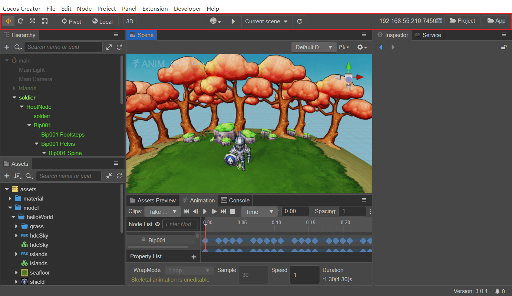
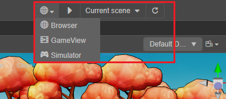
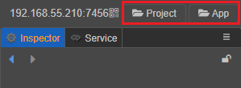

# 工具栏

**工具栏** 位于编辑器主窗口的正上方，包含了七组控制按钮或信息，用来为特定面板提供编辑功能或方便我们实施工作流。

## 选择变换工具

为 **场景编辑器** 提供编辑节点变换属性（移动、旋转、缩放、矩形变换）的功能，详情请阅读 [变换工具 Gizmo](../editor/scene/transform-gizmo.md)。

## Gizmo 坐标系工具

控制变换工具出现在节点的位置和变换工具的坐标系。

变换工具位置：

- Pivot：变换工具将显示在节点 **锚点（Anchor）** 所在位置
- Center：变换工具将显示在节点中心点所在位置（受约束框大小影响）

变换工具坐标系：

- Local：变换工具中手柄箭头的朝向表示相对于节点的方向
- Global：变换工具中手柄箭头的朝向以世界坐标系为准，不会考虑节点的旋转

## 切换编辑模式

通过点击下图按钮，可以切换 2D 编辑模式与 3D 编辑模式

- 2D: 变为 2D 视图，在2D视图下的操作视图方式可以查看 [场景编辑器](../editor/scene/index.md)
- 3D: 变为 3D 视图，在3D视图下的操作视图方式可以查看 [场景编辑器](../editor/scene/index.md)

## 运行预览游戏

用来在编辑器运行或暂停游戏的测试

包括三个按钮：

- 选择预览平台：点击下拉菜单选择预览平台为 **浏览器**、**预览窗口** 和 **模拟器**
- 运行预览：点击后在浏览器中运行当前编辑的场景
- 运行场景：点击后运行的首场景。可以选择 **当前场景** 或 固定某一场景

## 预览地址

这里显示运行 Cocos Creator 的桌面电脑的局域网地址，连接同一局域网的移动设备可以访问这个地址来预览和调试游戏。将鼠标悬浮在局域网地址上，会浮现一个二维码，通过扫描二维码的方式也可以访问这个地址来预览和调试游戏。

## 打开项目文件夹

- **项目**：打开项目所在的文件夹
- **编辑器**：打开程序的安装路径

## Cocos 小秘书

点击 **场景编辑器** 右上角的  按钮，可以打开小秘书面板，对遇到的问题进行咨询，详情可查看 [Cocos 小秘书](https://www.cocos.com/assistant)。

>**注意**: Cocos小秘书目前仅支持中文版本，后续优化请关注版本公告。
