# Toolbar

The **Toolbar** is located directly above the main editor window and contains seven groups of control buttons or messages that are used to provide editing functionality for specific panels or to facilitate our implementation of development workflows.

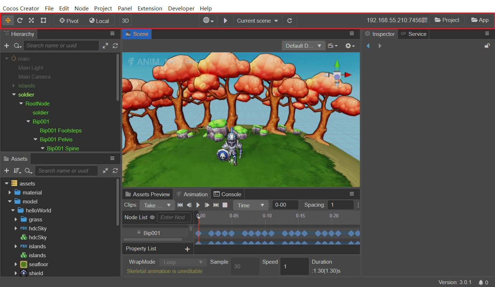

## Arrange Nodes Using Gizmos

The core function of the **Scene** panel is to edit and arrange the visible elements of the scene in a WYSIWYG manner, mainly by arranging the nodes in the scene the way we want them to be arranged, using a series of **Transform Gizmos** in the upper left corner of the main window toolbar.

The **Gizmos** include **Move**, **Rotate**, **Scale**, and **Rect**, and hovering over any of these tools will display a prompt.

### Move Gizmo

The **Move Gizmo** is the default transform gizmo that is activated when the editor is opened. It can also be activated by clicking the first button in the toolbar in the upper left corner of the main window, or by pressing the shortcut **W** while editing a scene.

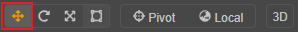

When selecting any node, notice a movement control handle consisting of red, green, and blue arrows and red, green, and blue squares in the center of the node in the **Scene** panel.

The **control handles** are controllers that can be interacted with by the mouse in a particular editing state in the **Scene** panel. These controllers are only used to assist in editing and will not be displayed while the game is running.

When the Move Gizmo is active:
- Holding the red/green/blue arrows and dragging the mouse will move the node in the X, Y and Z directions respectively.
- Holding the red/green/blue square and dragging the mouse will move the node in the Y-Z plane, X-Z plane, X-Y plane, respectively.

### Rotate Gizmo

Click the second button on the toolbar in the upper left corner of the main window, or press the **E** shortcut key while editing the scene to switch to the **Rotate Gizmo**.

The handle of the Rotate Gizmo consists of three orthogonal red, green and blue circles (in 2D view it consists of an arrow and a circle). When you drag the mouse on any of the red/green/blue circles, the nodes will rotate around the X, Y and Z axes respectively.

When the mouse hovers over any circle, the circle will be displayed in yellow, click on it to select it, and a yellow arrow will be displayed to indicate which axis the current node is rotated by. Drag any point on the circle to rotate the node, and before releasing the mouse, notice the rotation angle on the control handle.

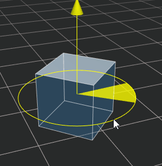

### Scale Gizmo

Click the third button on the toolbar in the upper left corner of the main window, or press the **R** shortcut while editing a scene to switch to the **Scale Gizmo**.

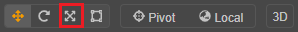

The scale tool consists of three axes with red, green and blue squares at the head and a gray square at the center. When the mouse is hovered over any of the squares, it appears yellow and can be selected and dragged by clicking on.

- Holding the red/green/blue square and dragging the mouse will scale the node in the X, Y and Z axis directions respectively.
- Dragging the mouse on a gray square will scale the node in X, Y, and Z directions at the same time.

### Rect Gizmo

Click the fourth button on the toolbar in the upper left corner of the main window, or press the **T** shortcut while editing a scene to switch to the **Rect Gizmo**. Note that the Rect Gizmo is only available for UI nodes.

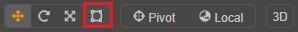

The Rect Gizmo consists of four vertex control points, four edge control points, and one center control point.

When the Rect Gizmo is active:
- Dragging either vertex control point of the control handle can modify both the `Position` property of the UI node and the `ContentSize` property in the UITransform component while keeping the position of the diagonal vertices unchanged.
- Dragging either side of the control handle modifies both the `Position` (`X` or `Y` property) of the UI node and the `ContentSize` property (`width` or `height` property) of the UITransform component, while keeping the position of the opposite side unchanged.
- Dragging the center control point of a control handle allows to modify both the `Position` property of the UI node and the `AnchorPoint` property of the UITransform component while keeping the size of the UI node unchanged.

In the layout of UI elements, it is often necessary to use the **Rect Gizmo** to directly control the position and length of the node's four edges precisely. For image elements where the original image aspect ratio must be maintained, the Rect Gizmo is not usually used to resize.

## Gizmo Control Point Setting

The gizmo control point is used to set the position of the gizmo and to control the orientation of the handles.

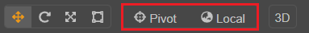

Gizmo position:

- Pivot: the gizmo will be displayed in the location of the 2D object **AnchorPoint** or in the 3D object's **world coordinate system**.
- Center: the gizmo will be displayed at the center of the node. If multiple nodes are selected at the same time, the center of all nodes will be displayed.

Direction of the control handle of the gizmo:

- Local: the control handle of the gizmo is based on the direction of rotation of the node, as follows:

  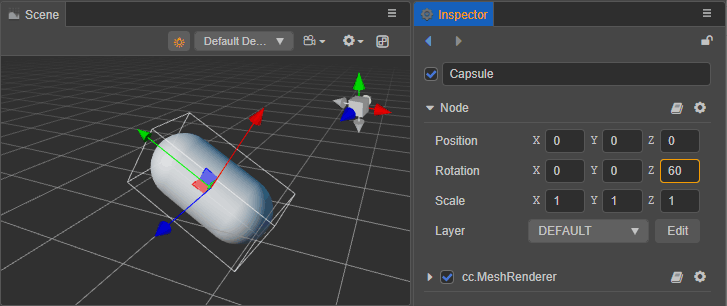

- Global: the direction of the control handles in the gizmo is based on the world coordinate system, and is not affected by the node rotation, as follows:

  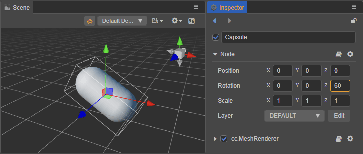

## Toggle Edit Mode

Click the 3D/2D button in the figure below to switch the **Scene** panel to 2D edit mode or 3D edit mode. For details, please refer to the [Scene - View Introduction](../scene/index.md#view-introduction) documentation.

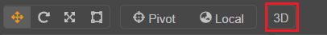

## Play on Device

This option is used to preview the running effect of the project, please refer to the [Project Preview & Debugging](../preview/index.md) documentation.

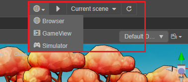

## Mobile Preview Address

This shows the LAN address of the desktop computer running Cocos Creator. Mobile devices connected to the same LAN can access this address to preview and debug the game. Hovering over the LAN address will bring up a QR code, which can also be accessed by scanning the QR code to preview and debug the game.

## Open the Project/Editor Directory

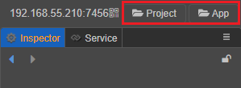

- **Project**: opens the folder where the project is located
- **App**: opens the installation path of the program
<!-- 
## Cocos Little Secretary

Click on the rightmost part of the toolbar  button on the rightmost side of the toolbar to open the Cocos Small Secretary panel, where users can initiate communication with the official technical staff at any time if they encounter any problems. For more details, please check [Cocos Small Secretary](https://www.cocos.com/assistant).

>**Note**: Cocos Little Secretary currently only supports Chinese version, please pay attention to the version announcement for subsequent optimization. -->
