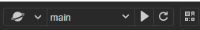
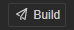

# Toolbar

The **Toolbar** is located directly above the main editor window and contains seven groups of control buttons or messages that are used to provide editing functionality for specific panels or to facilitate our implementation of development workflows.

## Preview

Multiple preview types are allowed before the preview section, including **in-editor**, **browser** and **emulator**, please refer to [Project Preview & Debugging](../preview/index.md).

## Build

 Click the build button to build the project, please refer to [Cross-Platform Game Publishing](../publish/index.md) for more information.

## Mobile Preview Address

This shows the LAN address of the desktop computer running Cocos Creator. Mobile devices connected to the same LAN can access this address to preview and debug the game. Hovering over the LAN address will bring up a QR code, which can also be accessed by scanning the QR code to preview and debug the game.

## Open the Project/App Directory

- **Project**: opens the folder where the project is located
- **App**: opens the installation path of the program
