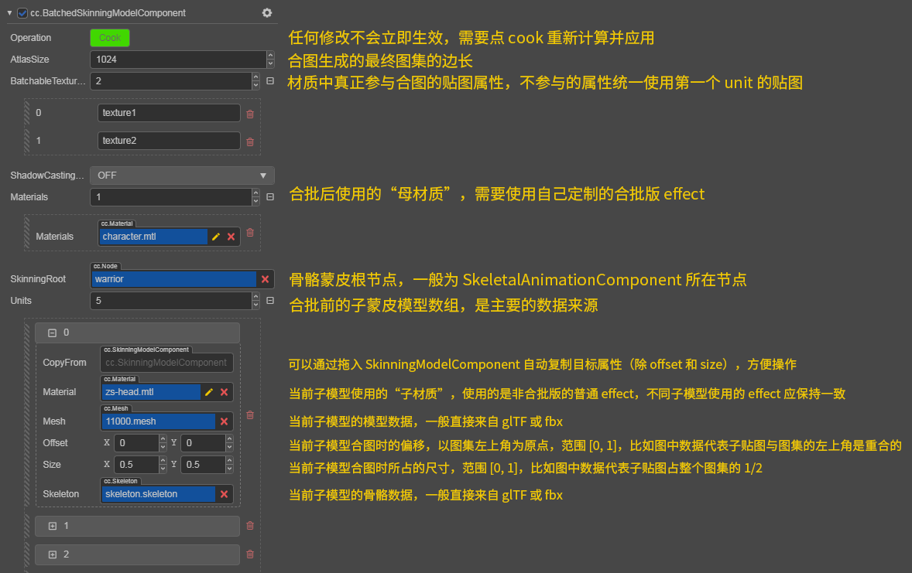

# Skeletal animation

__Skeletal Animation__ is a common but special type of animation. Two different systems are provided and each is optimized for different purposes. Seamless switching between these two systems can be as simple as toggle the `useBakedAnimation` switch on `SkeletalAnimation`, even at runtime. when enabled, the pre-baked system will be used, or the real-time calculated system if otherwise.

To use `SkeletalAnimation`, please refer to the [SkeletalAnimation API](https://docs.cocos.com/creator3d/api/en/classes/animation.skeletalanimation.html).

## Pre-baked Skeletal Animation System

The dominant purpose of this system is performance, and some sacrifices in expressiveness are also considered acceptable. __Cocos Creator__ has made many low-level optimizations in a targeted manner. The current runtime process is roughly as follows:
  * All animation data will be pre-sampled in advance according to the specified frame rate and baked onto a global-managed joint texture atlas.
  * Depending on whether the operating platform supports floating-point textures, the corresponding texture format will be RGBA32F, or automatically fallback to RGBA8 if not available (The rendering results should be identical, it is only the fail-safe approach for really low-end devices, and shouldn't be of any concern for game developers).
  * Each __Skeletal Animation Component__ (`SkeletalAnimation`) is responsible for maintaining the current playback progress, stored in the form of UBO (a `vec4`).
  * Each skinning model component (`SkinnedMeshRenderer`) holds a pre-baked skinning model class (`BakedSkinningModel`). Based on the bounding box information pre-baked in the same way to do frustum culling, update the UBO, and get the current data from the texture atlas on the GPU to complete the skinning.

## Real-time calculated Skeletal Animation System

The dominant purpose of this system is expressiveness, ensuring the correct display of all details, and complete program control capabilities.

The current runtime process is roughly as follows:
  * All animation data are calculated dynamically according to the current global time.
  * Animation data will be output to the skeleton node tree of the scene.
  * Users and any other system can affect the skin effect by manipulating this node tree.
  * Each __Skinning Model Component__ (`SkinnedMeshRenderer`) holds a common __Skinning Model__ class (`SkinningModel`). Extract the transformation data from joint node tree, do frustum culling, upload the complete joint transformation information of the current frame to UBO, and complete the skinning in the GPU.

This provides the fundamental support for all the following functions:
  * Blendshape support
  * Mixing and masking of any number of __Animation Clips__
  * Inverse kinematics, secondary physics
  * Explicit procedural control over any joint tranformations

## Selection and best practice of two systems

After importing all model assets, all prefabs use the pre-baked system by default to achieve the best performance. It is recommended that you only use the real-time calculated system if you clearly feel that the performance of the pre-baked system cannot reach the standard. Although the two systems can be switched seamlessly at runtime, try to do this as less frequent as possible, because each switch involves the reconstruction of the underlying rendering data.

## Skinning algorithm

We have two built-in common standard skinning algorithms, which have similar performance and only affect the rendering results:

  1. __LBS (Linear Blend Skinning)__: joint information is stored in the form of a 3x4 matrix, and the matrix is ​​interpolated directly to achieve skinning, and there are well-known problems such as volume loss, etc.
  2. __DQS (Dual Quaternion Skinning)__: The joint information is interpolated in the form of dual quaternions, which is more accurate and natural for the skeleton animation without scaling transformation, but for performance reasons, there are pragmatic approximation measures for scaling animations.

The engine uses LBS by default. You can switch the skinning algorithm by modifying the `updateJointData` function reference of the engine skeletal-animation-utils.ts and the header file reference in cc-skinning.chunk.

It is recommended that projects with higher pursuit of skin animation quality can try to enable DQS, but since there is no `fma` instruction before GLSL 400, operations such as `cross` cannot bypass floating-point cancellation on some GPUs, and the error is relatively high. This may introduce some visible defects.

## Socket system

If you need to attach some external nodes to the specified joint joints, you need to use the __Socket system__ of the __Skeleton Animation Component__:

* Create a new child node directly under the node of `SkeletalAnimation` to be attached to.

* Add an array element in the sockets list of the `SkeletalAnimation`. Select the path of the joint to be attached to from the drop-down list (note that the `defaultClip` property of the `SkeletalAnimation` must be a valid clip, the content of the drop-down list depend on this), and specify the target as the child node just created.

* This child node becomes a socket node, you can put any node under and it will follow the transformations of the specified joint.

`FBX` or `glTF` assets will be automatically adapted to use this socket system at import time, without any manual interference.

## About Dynamic Instancing

Based on the framework of the pre-baked skeletal animation system, the instancing of the skin model has also become a function within reach, but to ensure correctness, you need to collect some relatively low-level information.

The fundamental problem here is that the joint texture atlass used by each model in the same drawcall must be the same. If they are not the same, the display effect will be completely messy.

The way to distribute all the animation data used at runtime to each joint texture atlases becomes a project-specific information, thus needs developer's input. See the [joint texture layout panel](../../editor/project/joints-texture-layout.md) documentation for more details on how to configure this.

> **Note**: instancing is only supported under the pre-baked system. Although we do not strictly prohibit instancing under the real-time calculated system (will only trigger some warnings in the editor), there will be problems with the rendering results. Depending on the asset allocation situation at the time, all the instances could be playing the same clip at best, or more often, completely mad rendering results.

> **Note**: for models with instancing turned on in the material, the planar shadow system will also automatically draw using instancing. In particular, the shadow of the skin model has a higher requirement for the layout of the joint texture atlas, because the pipeline state of the shadow is unified, all the animation of the skin model with the shadow turned on needs to be put into the same texture (Compared to when drawing the model itself, only the instances in the same drawcall need to be put into the same texture).

## Batched Skinning Model Component

The joint texture uploaded by the GPU on the bottom layer has been globally automatically batched and reused. The upper layer data can currently be combined with all the sub-skin models controlled by the same joint animation component by using the `BatchedSkinningModelComponent`:

The batch version of the effect is relatively complicated to write, but it can basically be based on the common effects used by the sub-materials, adding some relatively direct preprocessing and interface changes. The built-in assets in the editor (util/batched-unlit) provide a The integrated version of builtin-unlit can be referenced.

> **Note**: only using the Batched Skinning Model Component under the pre-baked system can guarantee the correctness. Although it can also be used under the real-time calculated system, there **will** be rendering problems when the number of joints after the merger exceeds 30 (the maximum number of Uniform arrays).
