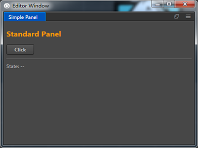

# Extends Editor Panel

Cocos Creator allow user custom the panel UI.

## Register Editor Panel

Define the `panel` field in `package.json`:

```json
{
  "name": "simple-package",
  "panel": {
    "main": "panel/index.js",
    "type": "dockable",
    "title": "Simple Panel",
    "width": 400,
    "height": 300
  }
}
```

Currently the extension allow user define one panel in the `package.json`. The `main` field is the entry point of the panel, it is similar to the entry point of the package.

Also you should be known about the `type` field:

- `dockable`: The panel can be docked in the workspace.
- `simple`: Simple web page, a standalone window that loads a simple HTML page. Read more about it at [Define Simple Panel](define-simple-panel.md).

Other panel field reference [Panel Json Reference](reference/panel-json-reference.md).

## Define the panel's entry point

To define the panel's entry point, we needs to use `Editor.Panel.extend()`:

```javascript
// panel/index.js
Editor.Panel.extend({
  style: `
    :host { margin: 5px; }
    h2 { color: #f90; }
  `,

  template: `
    <h2>Panel</h2>
    <ui-button id="btn">点击</ui-button>
    <hr />
    <div>State: <span id="label">--</span></div>
  `,

  $: {
    btn: '#btn',
    label: '#label',
  },

  ready () {
    this.$btn.addEventListener('confirm', () => {
      this.$label.innerText = 'Hello World';
      setTimeout(() => {
        this.$label.innerText = '--';
      }, 500);
    });
  },
});
```

The `Editor.Panel.extend()` accept an object which will descript the style and methods of the panel.

In the examples above, we define the style, template and selector `$`. In the end we use `ready` method to init the panel.

After we finish the code, we can open the panel by `Editor.Panel.open('simple-package')`.

More details, please reference [Panel API](api/editor-framework/main/panel.md).

About the object used in `Editor.Panel.extend()` please read [Panel Reference](reference/panel-reference.md).

## Open panel in main menu

Some time we would like to quickly access a panel, usually we do this by register a menu item in main menu. To do this, we can define menu item in `package.json` and wirte the action in main process:

```json
{
  "name": "simple-package",
  "main": "main.js",
  "main-menu": {
    "Panel/Simple Panel": {
      "message": "simple-package:open"
    }
  },
  "panel": {
    "main": "panel/index.js",
    "type": "dockable",
    "title": "Simple Panel",
    "width": 400,
    "height": 300
  }
}
```

```javascript
'use strict';

module.exports = {
  load () {
  },

  unload () {
  },

  messages: {
    open() {
      Editor.Panel.open('simple-package');
    },
  },
};
```

Once it is done, you can open the panel below:



More about the `package.json` field, read [Panel Json Reference](reference/panel-json-reference.md).

## Communication through Panel and Main Process

Usually we put some UI in panel, user interact with it and send IPC message to main process. We use `Editor.Ipc` to achieve this. For example:

```javascript
  this.$btn.addEventListener('confirm', () => {
    Editor.Ipc.sendToMain('simple-package:say-hello', 'Hello, this is simple panel');
  });
```

When you click the button, he will send 'say-hello' message to main process with arguments. You can use any front end techinque you like to programme the panel UI, you are also free to use node technique since we are in Electron.

---

For more about IPC communication between panel and main process, read [Ipc Workflow](ipc-workflow.md).