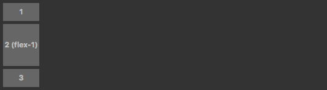
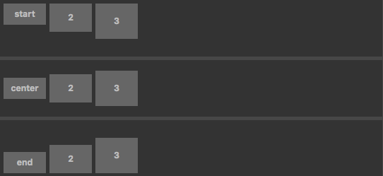
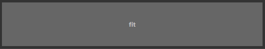

# Interface layout

Cocos Creator's interface layout is done by writing CSS using `style`. To review CSS, please read the [W3 School's CSS Tutorial [cn]](https://www.w3school.com.cn/css/index.asp) documentation.

However, ordinary CSS layout is not suitable for interface elements. For this reason, the latest CSS standard has added [CSS Flex](https://css-tricks.com/snippets/css/a-guide-to-flexbox/) layout. With Flex layout, it is easy to arrange the interface elements horizontally and vertically. In order to facilitate developers to use CSS Flex, Cocos Creator also encapsulates it. This section mainly introduces the interface layout method in Cocos Creator.

## Horizontal and vertical

**layout horizontal**

```html
<div class="layout horizontal">
  <div>1</div>
  <div class="flex-1">2 (flex-1)</div>
  <div>3</div>
</div>
```


**layout vertical**

```html
<div class="layout vertical">
  <div>1</div>
  <div class="flex-1">2 (flex-1)</div>
  <div>3</div>
</div>
```



## Aligning elements

When using horizontal and vertical rows, aligning all sub-elements is necessary. Use `start`, `center` and `end` to align child elements.

For horizontal elements, they represent top, center, and bottom alignment respectively.<br>For vertical elements, they represent left, center, and right alignment respectively.

Taking horizontal layout as an example and look at a set of examples:

```html
<div class="layout horizontal start">
  <div>1</div>
  <div>2</div>
  <div>3</div>
</div>
<div class="layout horizontal center">
  <div>1</div>
  <div>2</div>
  <div>3</div>
</div>
<div class="layout horizontal end">
  <div>1</div>
  <div>2</div>
  <div>3</div>
</div>
```



Sometimes, it is necessary to adjust the alignment of an element in the typesetting container. Use the `self-` keyword to operate. Cocos Creator provides: `self-start`, `self-center`, `self-end` and `self-stretch`.

Taking a horizontal layout as an example to see the effect of this:

```html
<div class="layout horizontal">
  <div class="self-start">self-start</div>
  <div class="self-center">self-center</div>
  <div class="self-end">self-end</div>
  <div class="self-stretch">self-stretch</div>
</div>
```


## Element distribution

Element distribution mainly describes how the elements are distributed in the layout direction. For example, all elements are arranged from the left side of the typesetting container, or from the right side, or scattered in the typesetting container according to the size of the element.

Cocos Creator provides: `justified`, `around-justified`, `start-justified`, `center-justified` and `end-justified`.

Taking a horizontal layout as an example to see the effect of this:

```html
<div class="layout horizontal justified">
  <div>1</div>
  <div>2</div>
  <div>3</div>
</div>
<div class="layout horizontal around-justified">
  <div>1</div>
  <div>2</div>
  <div>3</div>
</div>
  ...
  ...
```


## Adaptive Elements

Sometimes elements need to fill the remaining controls of the layout. This can be done by using `flex-1`, `flex-2`, ... `flex-12` in the child elements of the layout container.

Look at a set of examples:

```html
<div class="layout horizontal">
  <div class="flex-1">flex-1</div>
  <div class="flex-2">flex-2</div>
  <div class="flex-3">flex-3</div>
</div>
<div class="layout horizontal">
  <div class="flex-none">flex-none</div>
  <div class="flex-1">flex-1</div>
  <div class="flex-none">flex-none</div>
</div>
  ...
  ...
```


Sometimes the element itself needs to fill the entire space of the container. At this time, consider using the `fit` class. The methods and effects are as follows:

```html
<div class="wrapper">
  <div class="fit">fit</div>
</div>
```


