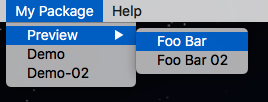

# package.json referernce

### name (String)

The package name. Make sure your package name is uniqued, it relate to many things in package programming.

### version (String)

The version number, we highly recommend you use [semver](http://semver.org/) standards for your version.

### description (String)

Describe your package in one sentence.

### author (String)

Author name.

### main (String)

Package entry point. Usually we set this to "main.js". But you are free to set any path relate to your package, such as `main/index.js`.

### main-menu (Object)

Main menu registry. The key is the menu path of your menu item. The value is the menu options. More details check [main-menu reference](main-menu-reference.md).

The menu path is a posix format path. For instance: "My Package/Preview/Foo Bar" will search the menu in "My Package" > "Preview" and add the menu item "Foo Bar" under it:

