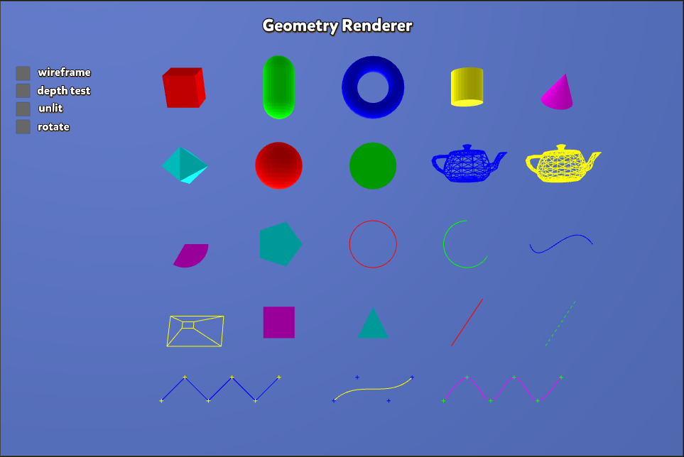
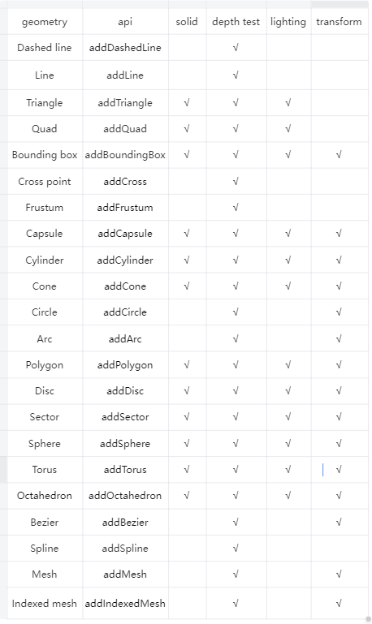
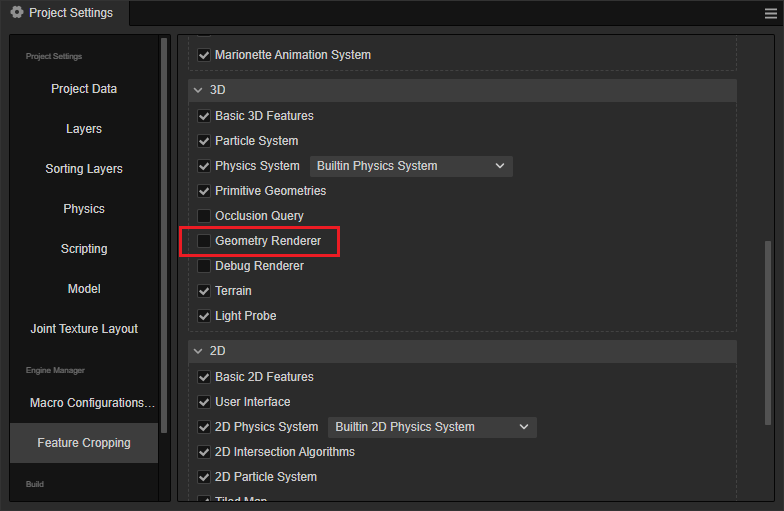
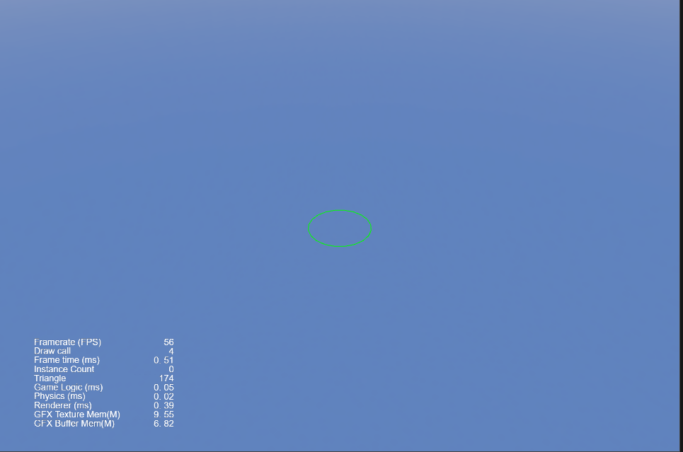

# Geometry Renderer

Geometry renderer is a functional interface provided by the engine for batch rendering of various geometries, mainly used for debugging (such as displaying the enclosing boxes of objects) and the gizmo batch display of Cocos Creator.

The effect of the geometry renderer is shown in the following figure.



The features of Geometry Renderer is as follows:



where.
- solid: whether to support solid mode, if not, then display wireframe mode
- depth test: whether to support depth test, if support then the blocked part of the translucent display, not blocked part of the opaque display, if not support then all opaque display
- lighting: whether to support simple lighting, if not, use no light mode
- transform: whether support transform, if support, developer can pass in a transform matrix, the transform matrix will act on the geometry of the vertices, convenient to display the geometry of any coordinate space

## API

- Typescript: [geometry-render.ts](https://github.com/cocos/cocos-engine/blob/v3.6.0/cocos/core/pipeline/geometry-renderer.ts).
- Native: [GeometryRenderer.h](https://github.com/cocos/cocos-engine/blob/v3.6.0/native/cocos/renderer/pipeline/GeometryRenderer.h).

### Supported Geometry Types

| Geometry Type | Interface |
|:--|:--|
| Dashed Line | addDashedLine |
| Line | addLine |
| Triangle | addTriangle |
| Quad | addQuad |
| BoundingBox | addBoundingBox |
| Cross | addCross |
| Frustum | addFrustum |
| Capsule | addCapsule |
| Cylinder | addCylinder |
| Cone | addCone |
| Circle | addCircle |
| Arc | addArc |
| Polygon | addPolygon |
| Disc | addDisc |
| Sector | addSector |
| Sphere | addSphere |
| Torus | addTorus |
| Octahedron | addOctahedron |
| Bezier curves | addBezier |
| Spline curves with three modes: Folded segments, Multi-segment Bessel curves, Catmull-Rom curves | addSpline |
| Mesh | addMesh |
| Index Based Mesh | addIndexedMesh |

### Example

Since the vertex cache is cleared after rendering these geometries per frame, it is necessary to add geometries to the geometry renderer object (located in the camera) per frame in functions like update.

To use this feature you need to enable **Geometry Renderer** in **Project Settings** -> **Feature Cropping**.



> **Note**: Please make sure your project is 3D based.

The code example is as follows:

```ts
import { _decorator, Component, Camera, Color } from 'cc';
const { ccclass, property, executeInEditMode} = _decorator;

@ccclass('Geometry')
@executeInEditMode(true)
export class Geometry extends Component {

    @property(Camera)
    mainCamera:Camera = null;

    start() {        
        this.mainCamera?.camera.initGeometryRenderer();
    }

    update(deltaTime: number) {
        this.mainCamera?.camera?.geometryRenderer?.addCircle(this.node.worldPosition, 1, Color.GREEN, 20);
    }
}
```

The result is as follows:


