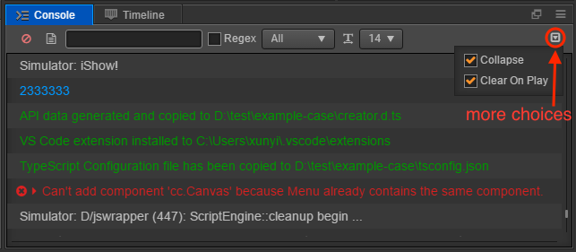

# Console

**console** will report errors, warnings or other log information generated by Cocos Creator editor and engine. Information with different priority will show in different color:

## Log level

- **Log**: gray text, is normally used to indicate operation on-going.
- **Info**: blue text, is used to indicate important prompt information.
- **Success**: green text, is used to indicate that current operation has successfully done.
- **Warn**: yellow text, is used to warn user to deal with the abnormal situation which won't influence operations if not being dealt with.
- **Error**: red text, indicates gross error and measures must be took before going on to the next operation or running the game.

## Console settings and features

When there are too much information in console, you can filter these information effective by widgets in console. The operations include:

- **Clear**  Clear all the current information in console panel.
- **Filter input**  Filter the information in console according to the input text. If the `Regex` next to it is checked, then the input text will be took as a regular expression to match the text.
- **Information levels**  You can choose one information level from this drop-down menu. From log level to error level, console will only show information in specific level. The default option `All` represents information in all levels will be showed.
- **Switch Fonts**  This drop-down menu allows you to adjust the font size of the console.
- **Merge same type information**  When this selection is being activated, the same and repeat information will be merged into one, but there will be yellow numbers next to the information to prompt how many information of the same type have been merged.

## View log

- : **Open the log file**, click this button to open the log file
- **View log information**: if the log contains call stack information or detailed information, a small triangle appears on the left side of the log. Click on the triangle to see hidden information
- **Copy logs**: press the mouse and drag it to select the log text. At this point, press <kbd>ctrl + c</kbd> (Windows) or <kbd>command + c</kbd> (Mac) to copy the selected text so that it can be used elsewhere.
