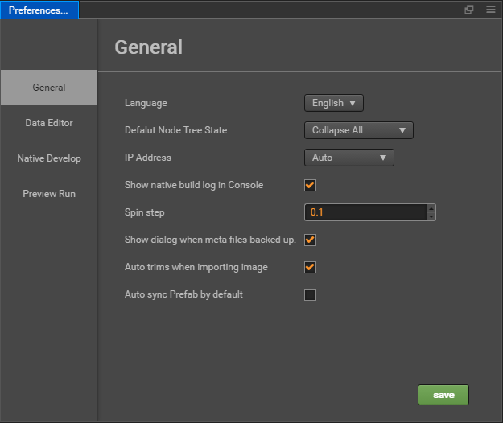
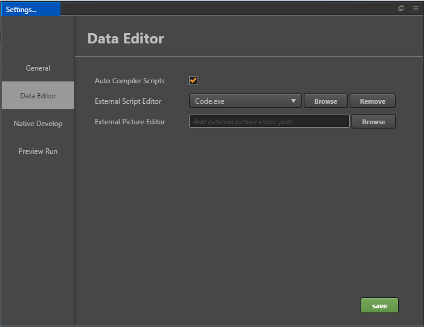
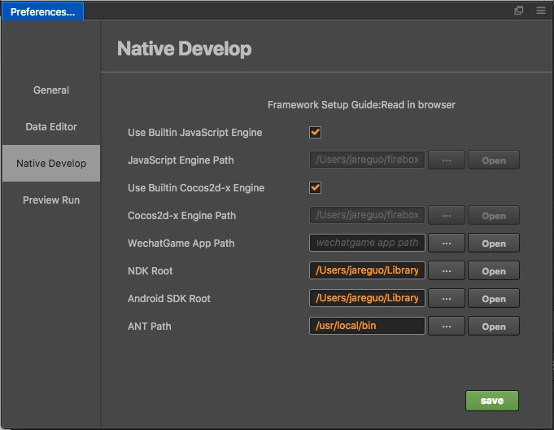
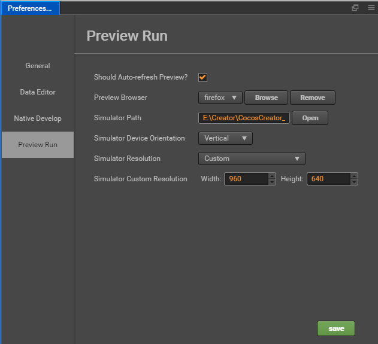

# Settings

**Settings** the panel provides a variety of personalized global editor settings. To open **Settings** window, please select the main menu `CocosCreator -> Settings`.

**Settings** is composed of several different pages, all settings are divided into the following categories.
After modifying the settings, click the **Save** button.

## General

* **Language**: Can choose `中文` or `English`, it will take effect after Cocos Creator editor restarts.

* **Default Node Tree State**: To switch the default state of all child nodes of the "node tree" node tree, include three options: `Expand All`, `Collapse All` and `Memory Last State`.

* **IP Address**: Case the user may have multiple IP addresses on this computer, Manually select one and two-dimensional code as a default when previewing address address. This will list all native IP, You can also choose `Auto` get an IP editor automatically picked for you.

* **Show native build log in console**: This item is selected, Build log will be displayed directly in the process of publishing original project Console panel.
Non-selected, Building the release of primary logs are saved in the `%USER/.CocosCreator/logs/native.log` project, you can also use the Console Log button in the upper left corner of the panel Cocos Console Log option to open the document.

* **Spin step**: In the Properties, all numeric property has a set of UP and DOWN arrows next to the input box, values that can be used to step Input:

  .

  When hovering close to the value of the property name, The cursor will turn into  such a shape, then Drag the mouse, can also according to a continuous increase or decrease the value of step amplitude.

  The above two ways to modify the value. The default step size is `0.1`, Spin step says each time you click the step button or drag the mouse to change the step amplitude. For example, if you mainly use numbers to integers in the script, you can take the step size is set to `1`, can be adjusted more easily.

  > **Note**: after modifying the steps to refresh the Editor window (Ctrl/Cmd + R), set the Stride length will take effect

* **Show dialog when meta files backed up**: When the resource to which the meta file belongs is lost, whether a dialog pops up prompts you to back up or delete the meta file. If you choose to back up, you can manually restore the resources later, and manually copy the meta file back to the project assets directory to prevent loss of important resource-related settings (such as scenarios, prefabs).

* **Auto trims when importing image**: Whether the transparent pixels of the picture are automatically cropped when the picture is imported. Whatever you choose by default, you can manually set the cropping options on the picture asset after importing the picture.

* **Auto sync Prefab by default**: Does the `Auto Sync option` on the prefab resource start automatically when creating a new prefab? When Auto Sync is enabled, all prefab instances in the scene are automatically synchronized when the prefab resource is saved.

## Data Editor

This category is used to set the default open mode for scripts and resources. Internal script editor is not recommended.

* **External Script Editor**: You can use the executable file of any external text editing tool as the opening method when you double-click the script file in `Assets` panel. You can click the `Browse` button to select the preferred text editor executable file. And the built-in script editor is not recommended.

* **External Picture Editor**: Similar to the above option, used here to set when Assets, double-click the picture file, open the picture with the default application path.

## Native Develop

This classification is used to set the build is released to the native platform (iOS, Android, Mac, Windows), the required development environment path.

* **Use Builtin JavaScript Engine**: Whether to use Cocos Creator the built-in 'engine' path as JavaScript engine path. This engine is used for Scene to render the scene,
declarations and other built-in components engine module in the Web environment.

* **JavaScript Engine Path**: In addition to using `engine`, you can also customize to <https://github.com/cocos/cocos-engine> to clone or fork a copy of the engine to the local anywhere, then uncheck **Use Builtin JavaScript Engine** and set the **Use Builtin JavaScript Engine** path to your custom engines. You can use the editor to customize your engine.

* **Use Builtin Cocos2d-x Engine**: Whether to use Cocos Creator the built-in `cocos2d-x` path as cocos2d-x c++ engine path. This engine is used for all Build native platform (iOS, Android, Mac, Windows) project to build and compile.

* **Cocos2d-x Path**: **Use Builtin Cocos2d-x Engine** cancel previous selections, you can manually specify the path cocos2d-x. Note cocos2d-x engine used here must be downloaded from the <https://github.com/cocos/engine-native> or the warehouse's fork.

* **WeChatGame App Path**: Set the WeChatGame App Path, See [WeChat Mini Games](../../../publish/publish-wechatgame.md#%E4%BD%BF%E7%94%A8-cocos-creator-%E5%8F%91%E5%B8%83%E5%BE%AE%E4%BF%A1%E5%B0%8F%E6%B8%B8%E6%88%8F).

* **NDK Path**: Set the NDK Path, See [Setup Native Development Environment](../../../publish/setup-native-development.md).

* **Android SDK Path**: Set the Android SDK Path, See [Setup Native Development Environment](../../../publish/setup-native-development.md).

## Preview Run

When using **Play** button directly above the main window, you can set various options.

* **Should Auto-refresh Preview?**: When browsers or simulator have when running your scene. After you save the scene or recompile the script is whether you should refresh the preview device.

* **Preview Browser**: From the drop-down menu, select system default browser or click the **Browse** button to manually specify a path to the browser.

* **Simulator Path**: Starting with version v1.1.0, cocos simulator used in the Cocos Creator is placed on the cocos2d-x engine path. When using a customized version of the engine, you need to compile your own path simulator to the engine. Click **Open** button you can open the currently specified in the file system path of the simulator. Convenient debugging positioning.

* **Simulator Device Orientation**: Specify the simulator runtime is a landscape or portrait.

* **Simulator Resolution**: Select a resolution from the default device as a simulator for resolution.

* **Simulator Custom Resolution**: If the default resolution does not meet the requirements, you can manually enter the Height and Width of the screen to set the simulator resolution.

* **Open Simulator Debugger Panel**: Open simulator debugger panel when start simulator (New in **v2.0.7**).

* **Wait For Debugger Connect**: This option is turned on when **Open Simulator Debugger Panel** is checked, and the effect of this option is to pause simulator until debugger connected (New in **v2.0.7**).
