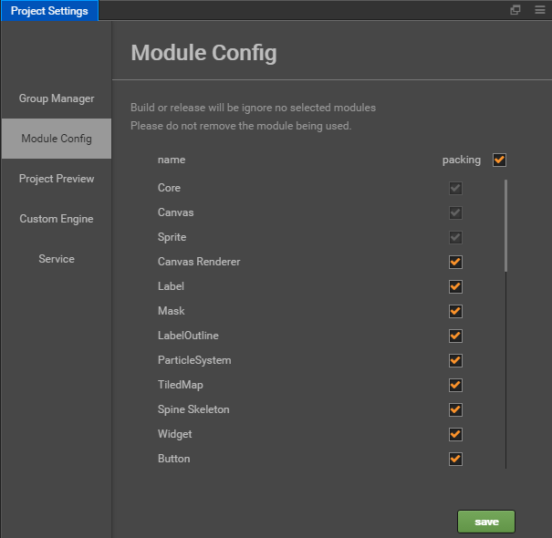
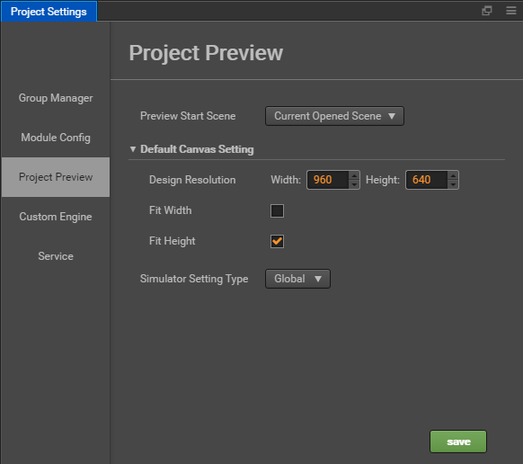

# Project Settings

**Project Settings** panel can be accessed from main menu `Project->Project Settings...`. This setting panel is for project specific customization. All these settings will be saved in `settings/project.json`. If you need to synchronize project settings across computers, please include `settings` folder in your version control.

## Group Manager

The **Group Manager** tab in **Project Settings** is mainly for [Physics system](../../../physics/index.md) to provide collision group support. Please refer to [Collision Group](../../../physics/collision/collision-group.md).

## Module Config

The setting here is for building game engine for release version of Web platform, including only modules checked in this page. The unselected module will be cropped.

Crop the unused module here will significantly reduce the engine package size. It is recommended to completely test published package after build, to avoid the use of cropped module in your script.

## Project Preview

**Project Preview** provides similar options as in the **Preview Run** page in [Settings](preferences.md), which are used to set the initial preview scene, web preview port, resolution, etc., but only for the current project.

### Preview Start Scene

This option will set which scene to run when you press **Preview** button at the top of the editor. If you set it to **Current Opened Scene**, it will run the scene you are currently editing. In addition you can also set this option to a specific scene from your scene list (for project that always need to start from the login scene).

### Default Canvas Setting

Default Canvas Setting include Design Resolution and Fit Width / Fit Height, Use these settings to specify the default design resolution values ​​in the Canvas node, as well as the **Fit Height** and **Fit Width** option when creating a new scene or **Canvas Component**.

### Simulator Setting Type

Use this setting to set the simulator preview resolution and screen orientation. When this option is set to **Global**, the simulator resolution and screen orientation settings in **Settings** are used. When set to **Project**, the following simulator settings are displayed:

- Simulator Device Orientation
- Simulator Resolution
- Simulator Custom Resolution

The above options are the same as those in the [Settings](preferences.md) panel.

## Service

**Facebook Services**, including **Facebook Live Video** and **Facebook Audience Network**. Please refer to [Facebook Live Video and Audience Network](../../../sdk/fb-an-and-live.md) for details.
