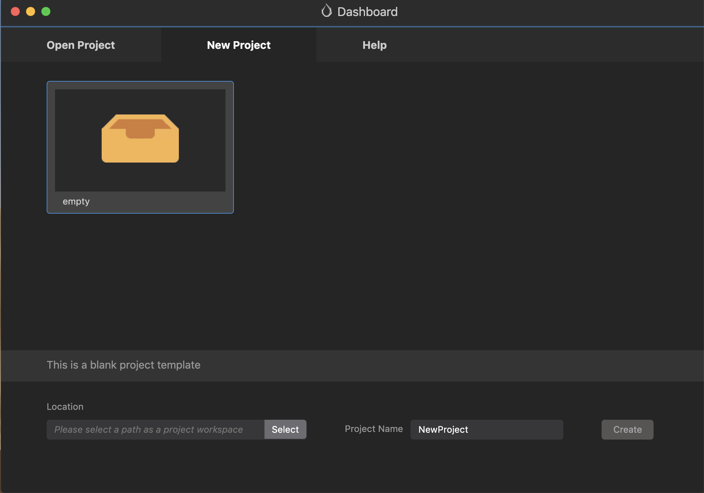
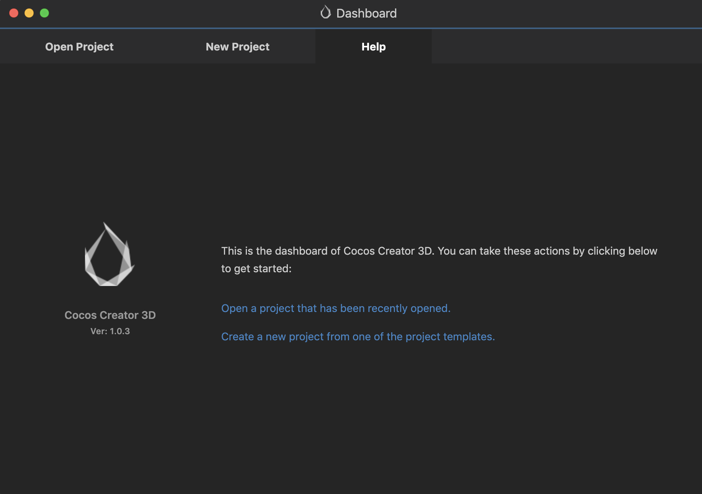

# Using the Dashboard
The __Dashboard__ is the starting page, you can *browse*, *create*, and *import* projects.

## Interface Overview

### Opening a project
Select __Open Project__ from the __tab bar__.

### Creating a New Project
Select __New Project__ from the __tab bar__. __Next__, select a __project template__ and __path__, and click the __New Project__ button below.

### Getting Help
Select __Help__ from the __tab bar__ to help you get an initial understanding of __Cocos Creator__.

