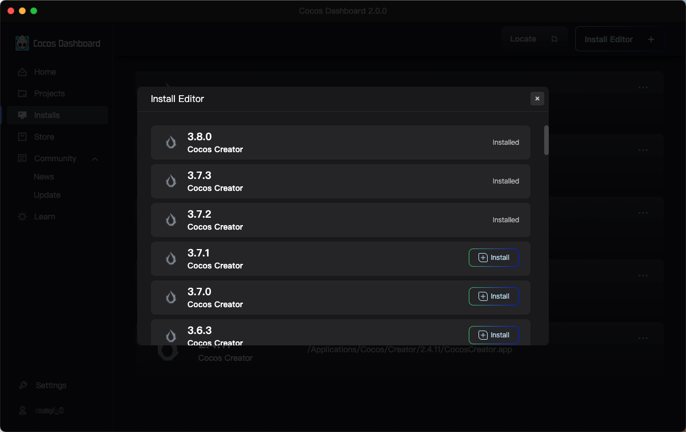

# Using Cocos Dashboard

Upon launching the Cocos Dashboard and logging in with your Cocos Developer account, the Dashboard interface opens. Dashboard allows downloading the engine, creating a new project, opening an existing project, or getting help information.

The left navigation menu bar includes: **Home**, **Projects**, **Installs**, **Store**, **Community**, **Learn**, **Settings**, and **Account**. See below for specific instructions.

## Home

The home page contains the Cocos product news, editor version news, and user's recently opened projects. Here you can quickly open projects, create new projects, install editors, get the latest editor version, etc.

It mainly consists of the following three parts:

- Rotator: shows the latest Cocos product news.
- Recently Projects: Shows recently opened projects, double-click to open a project; the **New Project** button on the top right quickly opens the New Project page to create a project, and the **View More** button takes you to the project list page.
- Editors: Shows released products of Cocos, where you can quickly install editor versions, create new projects, and get the latest released editor versions.

## Projects

The Projects page shows all created/imported projects, **double click** opens the project. The list is empty when you run Cocos Dashboard for the first time, and you can create/import a new project in the top right.

- **1**: Search for projects directly by project name.
- **2**: Sorts projects in forward/reverse order according to the most recent open time.
- **3**: Select another version of the editor that has been successfully installed to open the project.
- **4**: Operation menu, which can also be opened by right-clicking. Support **Open (project)**, **Show in Finder/Explorer**, **Remove from list**, **Select the icon of the project**, **Rename the project**, **Set the description of the project**:
    - **Select the icon of the project**: Customize the project cover image, currently supports four formats: BMP, PNG, GIF and JPG.
    - **Rename the project**: Renaming the project name will also rename the project folder.
    - **Set the description of project**: Can be used to note descriptive information related to the project.

### New Project

Creator provides a number of project templates, including basic architectures for different types of games, as well as sample resources and scripts for learning to help developers get into creative work faster. As Cocos Creator becomes more complete, we will continue to add more project templates.

Click **Templates** and **Examples** in the upper left to switch the project type. **Editor Version** is used to select the editor version for creating the project, and the drop-down box includes all successfully installed versions.

Check any of the project templates and at the bottom of the page you can see **Project Name** and **Location**:

- **Name**: The project name can only contain **a-z**, **A-Z**, **0-9** as well as **_** and **-**.
- **Location**: Click the icon behind the Project Path input box to select the project's storage path, or you can manually enter it in the input box.

Once everything is set up, click the **Create and Open** button to finish creating the project; the Dashboard window will be hidden and the newly created project will open in the main Cocos Creator editor window.

## Installs

The Installs page displays the successfully installed product editor, and you can import/install the editor version by clicking the button on the top right.

> **Note**: When Cocos Dashboard is first run, this list is empty. Click the two buttons in the top right corner to import existing Creator editors locally or download and install them directly.

- **Locate**: Used to add locally existing editors, supports dragging and dropping locally existing Creator editors directly from the operating system's file manager into the version list.
- **Install Editor**: Clicking on this button opens the Install Editor pag, showing all installed and uninstalled versions of the editor, which can be downloaded and installed as needed.

  

## Store

Cocos game development resource center, you can browse, download and install official or third-party plugins, source code, resources and so on, specific instructions can refer to the [Cocos Store](https://store.cocos.com/document/en/).

## Community

This tab is used to post official announcements or events of Cocos Creator, including the **News** and **Update** modules.

## Learn

The Learn page collects official tutorial resources from Cocos, as well as editor's choice and forum Pinned Topics.

## Account

Displays information about the currently logged in account, the ability to go to the account center, and logging out.

Developers can also visit the official Cocos website for tutorials and other information by clicking the icon below:

- [Twitter](https://twitter.com/CocosEngine)
- [Facebook](https://www.facebook.com/CocosEngine)
- [Forum](https://discuss.cocos2d-x.org/c/33)
- [Discord](https://discord.com/invite/pVqab4K)
- [YouTube](https://www.youtube.com/cocosengine)
- [GitHub](https://github.com/cocos/cocos-engine)
