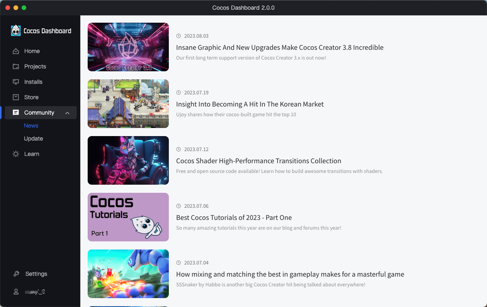

# Using Cocos Dashboard

Upon launching the Cocos Dashboard and logging in with your Cocos Developer account, the Dashboard interface opens. Dashboard allows downloading the engine, creating a new project, opening an existing project, or getting help information.

## Dashboard Overview

The above image shows the Cocos Dashboard interface. You can click the Settings icon in the upper-right corner to specify the location of Cocos Creator downloaded through Dashboard, and the language in which the Dashboard interface is displayed.

The Cocos Dashboard interface mainly consists of the following tabs:

- **Projects**: Lists recently opened projects. When you first run Cocos Dashboard, this list is empty. You can create a new project in this tab.
- **Editor**: Lists all downloaded versions of the editor, or you can click the **Download** button in the bottom right corner to continue downloading the editor.
- **Community**: Used to post official information or events of Cocos Creator, including **Announcement**, **News** and **Update**.
- **Learn**: Help, a static page with information and documentation for beginners.

## Project

Recently opened projects can be quickly accessed through the **Project** tab. The project will be opened when you click on the specific project entry.

- **1** - Includes **Open with another editor**, **Open folder**, **Remove from list**, **Select the icon of the project**, **Set the description of project**, and **Rename the project**.
    - **Select the icon of the project**: Project icons currently support BMP, PNG, GIF, and JPG formats (new in Dashboard 1.0.12).
    - **Rename the project**: Renaming the project will rename the project folder (new in Dashboard 1.0.12)。
    - **Set the description of project**: The project notes are recorded in the `description` field of the `package.json` file in the project directory (new in Dashboard 1.0.19).
- **2** - Other versions of the editor can be selected to open the project.
- **3** - Sort projects by time in forward/reverse order (new in Dashboard 1.0.12).
- **4** - Search projects directly by project name (new in Dashboard 1.0.12).
- **Add** button - For importing other projects. Since **v1.0.13**, allows dragging and droping project into the project list directly.
- **New** button - Used to create a new project. Clicking this button will bring you to the **New Project** page, see below for details.

### New Project

On the **New Project** page, click **Editor Version** above to select Creator's editor version.

Creator provides a number of project templates, including basic architectures for different types of games, as well as sample resources and scripts for learning to help developers get into creative work faster. As Cocos Creator becomes more complete, we will continue to add more project templates.

Click on one of the project templates and you will see **Name** and **Position** at the bottom of the page.
- **Name**: The project name can only contain **a-z**, **A-Z**, **0-9** as well as **_** and **-**.
- **Position**: Click the icon behind the project path input box to select the project storage path.

Once everything is set up, click the **Create and Open** button to finish creating the project. the Dashboard interface will be closed and the newly created project will be opened in the main Cocos Creator window.

## Editor

This tab lists all the editor versions that have been downloaded and installed.

> **Note**: when Cocos Dashboard is first run, this list is empty. Click the two buttons in the bottom right corner to import existing Creator editors locally or download and install them directly.

- **Locate**: Add a local editor to the **Editor** version list. Since **v1.0.13**, allows dragging and droping the local Creator Editor into the **Editor** version list directly.
- **Download**: Click this button to jump to the editor download page, which will list all installed and uninstalled editor versions, you can select the desired editor version to download.

  

## Community

This tab is used to post official announcements or events of Cocos Creator, including the **Announcement**, **News** and **Update** modules.

## Learn

The **Learn** tab provides access to the Cocos Creator user manual, API manual, and other help documentation, as well as tutorials, sample projects, and more.

Developers can also visit the official Cocos website for tutorials and other information by clicking on the icons in the lower-left corner of Cocos Dashboard. Connect with the team on [Twitter](https://twitter.com/cocos2dx), [LinkedIn](https://www.linkedin.com/company/cocos-technologies/), [YouTube](https://www.youtube.com/channel/UCAsPLdpiAQbFuYqiZvi0P5A) and [GitHub](https://github.com/cocos-creator/engine).
