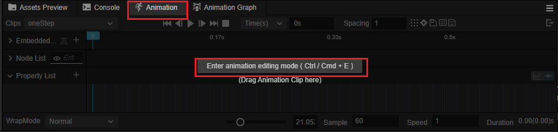
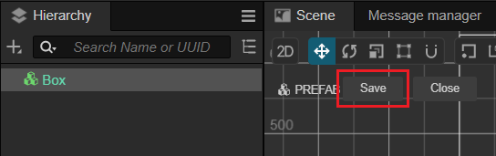

# Quick Start: Making Your First 2D Game

Platform jumping games are a very common and popular game genre, ranging from simple games on the original NES console to large-scale games made with complex 3D technology on modern gaming platforms. You can always find platform jumping games.

In this section, we will demonstrate how to use the 2D features provided by Cocos Creator to create a simple platform jumping game.

## Environment Setup

### Download Cocos Dashboard

Visit the [Cocos Creator official website](https://www.cocos.com/creator-download) to download the latest version of Cocos Dashboard, which allows for unified management of the Cocos Creator versions and your projects. After installing, open the Cocos Dashboard.


### Install Cocos Creator


In the **Editor** tab, click on the Install button for the desired version to install the editor, Cocos Creator.

> We usually recommend using the latest version of Cocos Creator to get started. it will obtain more features and support.

### Create Project

In the **Project** tab, find the **Create** button, select **Empty(2D)**.


Next, just enter your project name in the highlighted field shown in the image above.

For example, you could input: cocos-tutorial-mind-your-step-2d.

Let's make a game that is similar to the one in [Quick Start: Making Your First 3D Game](../first-game/index.md).

If you haven't read [Quick Start: Making Your First 3D Game](../first-game/index.md) yet, that's okay. In this section, we'll assume you haven't used Cocos Creator before, and we'll start from scratch!

Without further ado, let's get started.

## Create the Character

In a 2D game, all visible objects are made of images, including the character.

To keep things simple, we'll be using the images that come bundled with Cocos Creator to create our game. These images can be found in `internal/default_ui/`.

In Cocos Creator, we use a `Sprite` node ( a node with a Sprite component ) to show an image.

To create a new node of type Sprite, right-click in the Hierarchy panel, select "Create", and then choose "2D -> Sprite" from the pop-up menu.

Right-click in the Hierarchy and select "Create" from the pop-up menu, and we can see different types of nodes. Here, we select "2D -> Sprite" to create a new `Sprite` node.


Next, we find the `internal/default_ui/default_btn_normal` and assign it to the `Sprite Frame` property of the `Sprite` node we just created.


Next, create an `Empty` node and name it "Player":


If you didn't name the node when you created it, there are two ways to change its name:

- In the **Inspector** panel, find the name and rename it
- In the **Hierarchy**, select the node then press `F2`

We can adjust the parent-child relationship of nodes by dragging and dropping them in the Hierarchy. Here, drag the `Sprite` node onto the `Player` node to make it a child, then rename the `Sprite` node to "Body".


> **Note**：
> - The hierarchy relationship determines the rendering order. if may cause the node to not be visible when the order is wrong.
> - 2D/UI elements must be under a `Canvas` node in order to be visible.
> - The layer of 2D/UI elements must be set to `UI_2D`

Next, Let's adjust the position's Y of the `Body` node to 40:


Finally, let's adjust the color of the `Body`.

In the Inspector panel, find the `Color` property and expand it, then set the color to red.


## The First Script

Scripts, also known as code, are used to implement game logic, such as character movement, jumping, and other gameplay mechanics.

Cocos Creator uses TypeScript as its scripting programming language. It has simple and easy-to-learn syntax, a large user base, and widespread applications. You can encounter it in web development, app development, game development, etc.

Creating a script component in Cocos Creator is very simple. All you need to do is right-click in the Assets Manager window, and select "Create -> TypeScript -> NewComponent" option.

</img>

For ease of management, it is often recommended to create a folder named `Script` to put all of your scripts in.

Next, right-click on the `Scripts` folder, and create a new script component named `PlayerController` to control the player.


The engine will generate the following code for the script component that we just created.

```ts
import { _decorator, Component, Node } from 'cc';
const { ccclass, property } = _decorator;

@ccclass('PlayerController')
export class PlayerController extends Component {
    start() {

    }

    update(deltaTime: number) {
        
    }
}
```

**Note** Cocos Creator uses a Node + Component architecture, meaning that a component must be attached to a node in order to function. Scripts in Cocos Creator are also designed as components.

So, let's drag the `PlayerController` script onto the  Inspector of Player node.


You should see that a `PlayerController` component has been added to the Player node.

> **Note**: You can also click on the **Add Component** button to add different types of components.
> `import { _decorator, Component, Node } from 'cc'`

## Map

A map in a game is an area where your character can move around and interact within a game.

As mentioned before, all visible objects in 2D games are made up of images. The map is no exception.

Just like the steps we used to create the `Body` node, we will now create an object called `Box` which will be used to construct the map.

- Right-click in the Hierarchy
- Create a `Sprite` node by selecting "Create -> 2D Objects -> Sprite" through the pop-up menu.
- Name it as "Box"
- Select the "Box" node, set its **Sprite Frame** property by using `internal/default_ui/default_btn_normal`


### Prefab

A prefab is a special type of resource that can save the information of a node as a file. so that it can be reused in other situations.

In Cocos Creator, creating a prefab is quite simple. We just need to drag the node into the Assets Manager window, a *.prefab file will be automatically generated.

Now, let's create a folder named Prefab in the Assets Manager window, which will be used to organize all prefabs together.

Then, find the Box node and drag it to the Prefab folder, a prefab file named "Box" will be generated.

The box node in the hierarchy can be deleted, because it won't be used when the game is running. Instead, we will create nodes in the script using Box.prefab to build the game map during gameplay.


> **Tips:** Generally, We will use different folders to manage different types of resources. It's a good habit to keep your project well-organized.

### Scene

In the game engine, a scene is used to manage all game objects. It contains characters, maps, gameplay, UI. you name it in a game.

A game can be divided into different scenes based on its functionalities. Such as the loading-scene, start-menu-scene, gameplay-scene, etc.

A game requires at least one scene to start.

So, in Cocos Creator, an unsaved empty scene will be opened by default, just like the one we are currently editing.

To ensure that we can find this scene the next time we open Cocos Creator, we need to save it.

First, let's create a folder named "Scene" to save our scenes in the Assets Manager window.


Then, press the <kbd>Ctrl</kbd> + <kbd>S</kbd> shortcut key.

Since it is the first time we are saving this scene, the scene-saving window will pop up.

We choose the "Scene" folder that we just created as the location, and name it "game.scene". Click save.


Now the scene is saved. We can see a scene resource file named "game" under the assets/Scene folder in the Assets Manager window.


The scene now can be observed as below, the red block represents the player, and the white represents the ground.


> Don't forget to press <kbd>Ctrl</kbd> + <kbd>S</kbd> shortcut key to save your scene when there are changes to the scene. Avoid losing work progress due to unexpected events such as power outages.

## Make the character move

We have created the "Player" node before, but it can not move.

Next, we will add code and animations to control its movement and make it move.

### PlayerController

The player should have the following behaviors：

- it starts jumping when the mouse is clicked.
- When it has been jumping for a certain amount of time, the jumping ends.

To achieve the above goals, we need to add some methods in the `PlayerController` component.

- Listen for mouse-click events

    ```ts
    onMouseUp(event: EventMouse) {}
    ```

- Jump according to the given steps

    ```ts
    jumpByStep(step: number) {}
    ```

- Calculate the position of the player

    ```ts
    update (deltaTime: number) {}
    ```

Next, let's complete these methods.

#### Listen for mouse-click events

Cocos Creator supports various common control devices, such as the mouse, keyboard, touchpad, and gamepad. You can easily access the relevant content through `Input` class.

For ease of use, Cocos Creator provides a global instance object `input` for the `Input` class.

> **Note** It's easy to confuse, `input` is the instance, and `Input` is the class.

To make the `onMouseUp` method be called by the engine when the mouse is clicked, we need to add the following code to the `start` method.

```ts
start () {
    input.on(Input.EventType.MOUSE_UP, this.onMouseUp, this);
}
```

The `onMouseUp` method has an `event` parameter of type `EventMouse`.

Through the `event.getButton()` method, we can get which button of the mouse is clicked.

Add the following code to the `onMouseUp` method:

```ts
onMouseUp(event: EventMouse) {
    if (event.getButton() === EventMouse.BUTTON_LEFT) {
        this.jumpByStep(1);
    } else if (event.getButton() === EventMouse.BUTTON_RIGHT) {
        this.jumpByStep(2);
    }
}
```

In the `EventMouse` class, there are three values have been defined:
- public static BUTTON_LEFT = 0;
- public static BUTTON_MIDDLE = 1;
- public static BUTTON_RIGHT = 2;

The code has implemented that:
- When the left mouse button is clicked, the player jumps forward one step.
- When the right mouse button is clicked, the player jumps forward two steps.

#### Move the player

In our game, the player moves horizontally to the right, so we need to use a simple physics formula as below:

```math
P_1 = P_0 + v*t
```

Where `P_1` is the final position, `P_0` is the original position, v is the speed of the object, and t is the unit time.

> Final Position = Original Position + Speed * deltaTime

The `update` function in the PlayerController component will be automatically called by the game engine. And also pass in a `deltaTime` parameter.

```ts
update (deltaTime: number) {}
```

The times that `update` will be called per second is determined by the frame rate (also known as FPS) when the game running.

For example, if a game is running at 30 FPS, the `deltaTime` will be  1.0 / 30.0 = 0.03333333... second.

In game development, we use `deltaTime` as the `t` in the physics formula to ensure consistent movement results at any frame rate.

Here, let's add some properties needed for calculating player movement `PlayerController` component.

```ts
//used to judge if the player is jumping.
private _startJump: boolean = false;

//the number of steps will the player jump, should be 1 or 2. determined by which mouse button is clicked.
private _jumpStep: number = 0;

//the time it takes for the player to jump once.
private _jumpTime: number = 0.1;

//the time that the player's current jump action has taken, should be set to 0 each time the player jumps, when it reaches the value of `_jumpTime`, the jump action is completed.
private _curJumpTime: number = 0;

// The player's current vertical speed, used to calculate the Y value of position when jumping.
private _curJumpSpeed: number = 0;

// The current position of the player, used as the original position in the physics formula.
private _curPos: Vec3 = new Vec3();

//movement calculated by deltaTime.
private _deltaPos: Vec3 = new Vec3(0, 0, 0);

// store the final position of the player, when the player's jumping action ends, it will be used directly to avoid cumulative errors.
private _targetPos: Vec3 = new Vec3();   
```

Now, what we need to do next is very simple:

- Calculating the data needed for player movement in the `jumpByStep` method.
- Processing player movement in the `update` method.

In the `jumpByStep` method, we add the following code:

```ts
jumpByStep(step: number) {
    if (this._startJump) {
        //if the player is jumping, do nothing.
        return;
    }
    //mark player is jumping.
    this._startJump = true;
    //record the number of steps the jumping action will take.
    this._jumpStep = step;
    //set to 0 when a new jumping action starts
    this._curJumpTime = 0;
    //because the player will finish the jumping action in the fixed duration(_jumpTime), so it needs to calculate jump speed here.
    this._curJumpSpeed = this._jumpStep / this._jumpTime;
    //copy the current position of the node which will be used when calculating the movement.
    this.node.getPosition(this._curPos);
    //calculate the final position of the node which will be used when the jumping action ends.
    Vec3.add(this._targetPos, this._curPos, new Vec3(this._jumpStep, 0, 0));
}
```

`Vec3` is the vector class in Cocos Creator, the name is short for `Vector3`, which has 3 components, x,y,z. all vector operations are placed in `Vec3` class. Such as `Vec3.add`, `Vec3.subtract` etc.

In Cocos Creator, 2D games also use `Vec3` as the property type for position, scale, and rotation. Just ignore the irrelevant components, e.g. the z component in position.

Next, let's calculate the movement of the player while jumping.

In this game, the player only moves when jumping, and keeps still when not jumping.

Let's add the following code to the `update` method in `PlayerController`.

```ts
update (deltaTime: number) {
    //we only do something when the player is jumping.
    if (this._startJump) {
        //accumulate the jumping time.
        this._curJumpTime += deltaTime;
        //check if it reaches the jump time.
        if (this._curJumpTime > this._jumpTime) {
            // When the jump ends, set the player's position to the target position. 
            this.node.setPosition(this._targetPos);
            //clear jump state
            this._startJump = false;
        } else {
            //if it still needs to move.
            // copy the position of the node.
            this.node.getPosition(this._curPos);
            //calculate the offset x by using deltaTime and jumping speed.
            this._deltaPos.x = this._curJumpSpeed * deltaTime;
            //calculate the final pos by adding deltaPos to the original position
            Vec3.add(this._curPos, this._curPos, this._deltaPos);
            //update the position of the player.
            this.node.setPosition(this._curPos);
        }
    }
}
```

Now, click the **Preview** button at the top of Cocos Creator.


The **Player** will move by clicking the mouse buttons.


As you can see, the player only moves a little each time you click the mouse button.

This is because we use `pixels/s` as the unit of speed for the Player.

```ts
this._curJumpSpeed = this._jumpStep / this._jumpTime;
```

The above code indicates that the player will only move one pixel per step.

In fact, we want the Player to move a certain distance per step.

To fix this, we need to add a constant to express the step size.

Below, the `BLOCK_SIZE` is used for this purpose.

```ts
import { _decorator, Component, Node } from 'cc';
const { ccclass, property } = _decorator;

//
export const BLOCK_SIZE = 40; 

@ccclass('PlayerController')
export class PlayerController extends Component {
    //...
}
```

As you can see, in TypeScript:
- A constant can be defined outside of the class and exported separately.
- Values declared as const cannot be modified and are often used for fixed configurations.

Next, find the code line in `jumpByStep` method:

```ts
this._curJumpSpeed = this._jumpStep / this._jumpTime;
```

Change it to:

```ts
this._curJumpSpeed = this._jumpStep * BLOCK_SIZE/ this._jumpTime;
```

Here is the updated `jumpByStep`:

```ts
jumpByStep(step: number) {
    if (this._startJump) {
        return;
    }
    this._startJump = true;
    this._jumpStep = step;
    this._curJumpTime = 0;
    
    this._curJumpSpeed = this._jumpStep * BLOCK_SIZE/ this._jumpTime;

    this.node.getPosition(this._curPos);
    Vec3.add(this._targetPos, this._curPos, new Vec3(this._jumpStep* BLOCK_SIZE, 0, 0));    
}
```

Restart the game, and you can see that the distance of the player's movement is as expected now.


At this moment, the code of `PlayerController` is as follows.

```ts
import { _decorator, Component, Vec3, EventMouse, input, Input } from "cc";
const { ccclass, property } = _decorator;

export const BLOCK_SIZE = 40;

@ccclass("PlayerController")
export class PlayerController extends Component {

    private _startJump: boolean = false;
    private _jumpStep: number = 0;
    private _curJumpTime: number = 0;
    private _jumpTime: number = 0.3;
    private _curJumpSpeed: number = 0;
    private _curPos: Vec3 = new Vec3();
    private _deltaPos: Vec3 = new Vec3(0, 0, 0);
    private _targetPos: Vec3 = new Vec3();

    start () {
        input.on(Input.EventType.MOUSE_UP, this.onMouseUp, this);
    }

    reset() {
    }   

    onMouseUp(event: EventMouse) {
        if (event.getButton() === 0) {
            this.jumpByStep(1);
        } else if (event.getButton() === 2) {
            this.jumpByStep(2);
        }

    }

    jumpByStep(step: number) {
        if (this._startJump) {
            return;
        }
        this._startJump = true;
        this._jumpStep = step;
        this._curJumpTime = 0;

        this._curJumpSpeed = this._jumpStep * BLOCK_SIZE/ this._jumpTime;
        this.node.getPosition(this._curPos);
        Vec3.add(this._targetPos, this._curPos, new Vec3(this._jumpStep* BLOCK_SIZE, 0, 0));    
    }
   
    update (deltaTime: number) {
        if (this._startJump) {
            this._curJumpTime += deltaTime;
            if (this._curJumpTime > this._jumpTime) {
                // end
                this.node.setPosition(this._targetPos);
                this._startJump = false;              
            } else {
                // tween
                this.node.getPosition(this._curPos);
                this._deltaPos.x = this._curJumpSpeed * deltaTime;
                Vec3.add(this._curPos, this._curPos, this._deltaPos);
                this.node.setPosition(this._curPos);
            }
        }
    }
}
```

### Player Animation

For 2D game development, Cocos Creator supports various types of animation, including keyframe animation, Spine, DragonBones, and Live2D.

In this tutorial, the jump animation of the Player is very simple and it is enough to use keyframe animation.

Using Cocos Creator's built-in animation editor, it's easy to make it.

Let's take a step-by-step approach to creating it.

First, let's add the Animation component to the Body node of the Player.


In the Assets Manager window, create a new folder named "Animation", Inside that folder, create a new AnimationClip named "oneStep".


In the Hierarchy, select the "Body" node and drag "oneStep" from the Animation folder onto the "Clips" property in the Inspector panel.


In the editor console area, switch to the "Animation" tab and click the "Enter animation editing mode" button:



In the animation editor, we add a track for the node's position property.


After adding the track, we can set the indicator of the current frame to a certain frame and then change the position of the node, the current frame will be set to be a keyframe automatically.

> Both modify the value on the Inspector panel and dragging the node in the scene can change the position of a node.


Finally, we have the following keyframes:

- 0 frame：set position to x = 0, y = 40
- 10 frame: set position to x = 0, y = 120
- 20 frame: set position to x = 0, y = 40

> Don't forget to click the **Save** button to save it.

You can click the **Play** button to preview the animation clip.


Follow the steps of making `oneStep` animation, and make another one: `twoStep`.


After completing the animation creation, click the **Close** button to exit the Animation editing mode.

### Play animations in code

Next, let's add some code lines into PlayerController to play the animation we've just made.

Playing an animation using TypeScript in Cocos Creator is quite simple:

```ts
animation.play(animName);
```

- animation is the Animation component on Body node.
- play is the method of Animation component to play animation
- animName is the name of an animation file that you want to play

> In Cocos Creator, we must ensure the animation which will be played is included in the clips of the node's Animation component,

Add the following code at the beginning of the PlayerController class:

```ts
@ccclass("PlayerController")
export class PlayerController extends Component {
    @property(Animation)
    BodyAnim:Animation = null;
    //...
}
```

> **Note**：The TypeScript and Cocos Creator both have an Animation class, please make sure the `Animation` is included in the code line `import { ... } from "cc" `. Otherwise, the code will use the `Animation` from TypeScript, and unpredictable errors may occur.

Here we added a property named `BodyAnim` and added `@property` above it. This syntax is called: [Decorator](../../scripting/decorator.md). The `@property` decorator allows the editor to be aware of the type of `BodyAnim` and display the exported properties of the Animation component on the Inspector panel.

To make sure there is a code line in your PlayerController file as below, or the code will fail to compile.

```ts
`const { ccclass, property } = _decorator;`
```

Here `_decorator` is a class containing all of the decorators that can be used in Cocos Creator, it should be imported from namespace cc before using it.

The related code lines are as follows:

```ts
import { _decorator, Component, Vec3, EventMouse, input, Input, Animation } from "cc";
const { ccclass, property } = _decorator;

```

In `jumpByStep` method, we add to the following code lines:

```ts
if (this.BodyAnim) {
    if (step === 1) {
        this.BodyAnim.play('oneStep');
    } else if (step === 2) {
        this.BodyAnim.play('twoStep');
    }
}
```

Now, the `jumpByStep` method is like this:

```ts
jumpByStep(step: number) {
    if (this._startJump) {
        return;
    }
    this._startJump = true;
    this._jumpStep = step;
    this._curJumpTime = 0;
    this._curJumpSpeed = this._jumpStep * BLOCK_SIZE/ this._jumpTime;
    this.node.getPosition(this._curPos);
    Vec3.add(this._targetPos, this._curPos, new Vec3(this._jumpStep* BLOCK_SIZE, 0, 0));  
    
    //the code can explain itself
    if (this.BodyAnim) {
        if (step === 1) {
            this.BodyAnim.play('oneStep');
        } else if (step === 2) {
            this.BodyAnim.play('twoStep');
        }
    }
}
```

Back to the Cocos Creator, select **Player** node, and then drag the **Body** node on the `BodyAnim` property.


The engine will automatically get the Animation component on the Body node and assign it to `BodyAnim`. As a result, the `PlayerController`'s `BodyAnim` property references the `Animation` component of **Body** node.

Hit **Play** button at the top of Cocos Creator to preview, you can see the **Player** jumps while clicking the mouse buttons.


Because of using the unified.

Here we use a unified jumpTime value, `jumpTime = 0.1`, But since the duration of the two animations is not the same, you can find it a little weird when animations are played.

To solve this, it's better to use the real duration of the animations as the value of `jumpTime`.

```ts
// Get jump time from animation duration.
const clipName = step == 1? 'oneStep' : 'twoStep';
const state =  this.BodyAnim.getState(clipName);        
this._jumpTime = state.duration;
```


## GameManager

In game development, we can manually place nodes using Box.prefab to build the map, but the map will be fixed. To make the map change whenever the game starts and provide some surprises for the players, we can randomly build the map in code.

Now, let's create a new TypeScript component called `GameManger`  in the Assets Manager window to archive this.

> **Note**：If you forget to rename the script or input the wrong name you don't want to use when creating a script component, The best way to fix it is to delete it and create a new one.
> **Note**：If you modify the name of a script, the content in the script file will not change accordingly.

After creating the `GameManger` script component, let's create a new node named **GameManager**, then attach `GameManager` to it.

> **Note** Generally, we can attach the `GameManager` script component to any node in the scene, but for keeping the project structure well-organized, we usually create a node with the same name and attach the `GameManager` to it. This rule applies to all XXXManager script components.


To build the map, we will use the `Box.prefab` to create the nodes.

So, the first thing we need to do is to add a property to the `GameManager` class for referencing the `Box.prefab`.

Now, the content of the `GameManager` class is as follows:

```ts
import { _decorator, Component, Prefab } from 'cc';
const { ccclass, property } = _decorator;

@ccclass('GameManager')
export class GameManager extends Component {

    @property({type: Prefab})
    public boxPrefab: Prefab|null = null;

    start(){}

    update(dt: number): void {
        
    }
}
```

Go back to the Cocos Creator, select the **GameManager** node, and drag `Box` prefab onto the `boxPrefab` property of **GameManager** node.


The map in this game is made up of two types of blocks. the two types of blocks alternate to form the map.

- None： an empty block, if the Player steps on a block of this type, the game is over.
- Stone: The Player can stand on.

To make the code more understandable, we often use `enum` to define the types of objects.

We define an enum named `BlockType` which has two elements as below.

```ts
enum BlockType{
    BT_NONE,
    BT_STONE,
};
```

 > In TypeScript, if the first element of an enum hasn't been given a value, it will take 0 as default. Here, `BT_NONE = 0`, `BT_STONE = 1`.

In the following code, you can see how we use it.

We put it above the definition of GameManager class, and without giving it an `export`. As a result, it only can be used in this single file.

Next, it is needed to determine where to place a new block. We add a property named `roadLength` to record the length of the road made up of the blocks.

To manage all the types of blocks we have created, we add the private property `_road` of type Array to store the generated block types.

Now, the code of the `GameManager` is as follows:

```ts
import { _decorator, CCInteger, Component, Prefab } from 'cc';
const { ccclass, property } = _decorator;

enum BlockType{
    BT_NONE,
    BT_STONE,
};

@ccclass('GameManager')
export class GameManager extends Component {

    @property({type: Prefab})
    public boxPrefab: Prefab|null = null;
    @property({type: CCInteger})
    public roadLength: number = 50;
    private _road: BlockType[] = [];

    start() {
       
    }  
}
```

The flow of constructing the map is as follows:

- Clear all data when the game starts
- The type of the first block is always `BlockType.BT_STONE` to prevent the Player from falling off.
- The type of a block after a block with the type of `BlockType.BT_STONE` should always be `BlockType.BT_STONE`.

Next, let's add the following method to `GameManger`.

- Method to generate the map：

    ```ts
    generateRoad() {

        this.node.removeAllChildren();

        this._road = [];
        // startPos
        this._road.push(BlockType.BT_STONE);

        for (let i = 1; i < this.roadLength; i++) {
            if (this._road[i - 1] === BlockType.BT_NONE) {
                this._road.push(BlockType.BT_STONE);
            } else {
                this._road.push(Math.floor(Math.random() * 2));
            }
        }
        
        for (let j = 0; j < this._road.length; j++) {
            let block: Node | null = this.spawnBlockByType(this._road[j]);
            if (block) {
                this.node.addChild(block);
                block.setPosition(j * BLOCK_SIZE, 0, 0);
            }
        }
    }
    ```

    >`Math.floor`： rounds down and returns the largest integer less than or equal to a given number. refer to [Math.floor](https://developer.mozilla.org/en-US/docs/Web/JavaScript/Reference/Global_Objects/Math/floor) for more detail.
    >`Math.random`：returns a floating-point in a range of [0.0,1.0), refer to [Math.random](https://developer.mozilla.org/en-US/docs/Web/JavaScript/Reference/Global_Objects/Math/random) for more detail.

    Obviously, the code `Math.floor(Math.random() * 2)` will only produce two integer numbers, 0 or 1, which are exactly correspond to the value of  `BT_NONE` and `BT_STONE` declared in the `BlockType` enum.

- Create a new block by the given type：

    ```ts
    spawnBlockByType(type: BlockType) {
        if (!this.boxPrefab) {
            return null;
        }

        let block: Node|null = null;
        switch(type) {
            case BlockType.BT_STONE:
                block = instantiate(this.boxPrefab);
                break;
        }

        return block;
    }
    ```

    If the given type is `BT_STONE`, we create a new block from `boxPrefab` using `instantiate` method.

    If the given type is `BT_NONE`, we just do nothing.

    > `instantiate`: is a built-in method provided by Cocos Creator, it is used for making a copy of an existing node and creating a new instance for a prefab.

Let's call `generateRoad` in the `start` method of   `GameManager`:

```ts
start() {
    this.generateRoad()
}  
```

You can see the generated map when running the game.


## Camera Follow

In a game that has a movable player, we often let the camera follow the player. As a result, you can see the screen scrolling when the player is moving.

It's very simple to archive it in Cocos Creator. Just make the following changes.

1. Select the Canvas node, and uncheck the **Align Canvas With Screen** property of cc.Canvas component on the Inspector panel.

2. Drag the Camera node on the Player node, and make it a child node.


Now, run the game, and you can see the camera is following the player.


## UI layout

UI ( User Interface ) is a very important part of most games. it displays information about the game and allows users to interact with the game systems.

As we mentioned before, In Cocos Creator, all 2D elements should be put directly or indirectly under the Canvas node, or they will not be rendered.

In Cocos Creator, UI is a special collection of 2D elements, they are text, buttons, toggles, etc.

As 2D elements, they also need to be put under the Canvas node.

As we know, UI elements are always fixed on the screen, so we need a fixed camera to render them.

In the previous section, the camera of the Canvas has been changed to follow our Player, it is no longer suitable for UI rendering.

Thus, we need to create a new Canvas for UI.

### UICanvas

In the Hierarchy, right lick the scene root and select "Create -> UI Component -> Canvas" in the pop-up menu.


Name it "UICanvas".


Create an empty node named **StartMenu** under the UICanvas.

Then, create a button node under the **StartMenu** node, you can find there is a node named 'Label' under the button node. Select it and set the String property to 'Play'.

Now, we have made a 'Play' button.


### Background & Text

Next, let's add a background and text to tell users how to play this game.

Create a Sprite node under the 'StartMenu' node and name it 'Bg'.

Assign `internal/default_ui/default_panel` to the `Sprite Frame` property of 'Bg' node.

Set the value of `Type` property to `SLICED`.

Set the `Content Size` of `UITransform` to a certain value (e.g. 400,250) .


Create a new Label node named 'Title' under the 'StartMenu' node, and set the properties as below:
- position： 0,80
- cc.Label Color: black
- cc.Label String： Mind Your Step 2D
- cc.Label Font Size：40


Continue creating some `Label` nodes to describe the gameplay. Name them 'Tip'.


Create a `Label` node **under UICanvas**, and name it 'Step', to show how many steps the player has taken.


Now, we have completed the UI layout, let's write some code to finish the game logic.

## Game state

There are 3 states in most games.
- **INIT**: game is ready to start
- **PLAYING**: game is playing
- **END**: game is over, will restart or exit

We can define these states using an enum type as below:

```ts
enum GameState{
    GS_INIT,
    GS_PLAYING,
    GS_END,
};
```

For better readability, let's put it after the `BlockType` enum.

Let's add a `setCurState` method to `GameManger`, which will be used to control the state of the game.

The code is as follows.

```ts
setCurState (value: GameState) {
    switch(value) {
        case GameState.GS_INIT:            
            break;
        case GameState.GS_PLAYING:           
            break;
        case GameState.GS_END:
            break;
    }
}
```

Add a new method named `init` to initialize game data.

```ts
init() {
    //to do something
}
```

Then, call it in `setCurState` when the game state is set to `GameState.GS_INIT`.

```ts
setCurState (value: GameState) {
    switch(value) {
        case GameState.GS_INIT:            
            this.init();
            break;
        case GameState.GS_PLAYING:           
            break;
        case GameState.GS_END:
            break;
    }
}
```

As designed, the **Player** only can be controlled by users when the game is running.

So, we make a small change to the input event listener in the `PlayerController`.

The input event is no longer listening in the `start` method, instead, we create a new method named `setInputActive` to handle it. the `setInputActive` method will be called when needed.

```ts
start () {

}

setInputActive(active: boolean) {
    if (active) {
        input.on(Input.EventType.MOUSE_UP, this.onMouseUp, this);
    } else {
        input.off(Input.EventType.MOUSE_UP, this.onMouseUp, this);
    }
}
```

Here, the code of `GameManager` is like this:

```ts
import { _decorator, CCInteger, Component, instantiate, Node, Prefab } from 'cc';
import { BLOCK_SIZE, PlayerController } from './PlayerController';
const { ccclass, property } = _decorator;

enum BlockType{
    BT_NONE,
    BT_STONE,
};

enum GameState{
    GS_INIT,
    GS_PLAYING,
    GS_END,
};

@ccclass('GameManager')
export class GameManager extends Component {

    @property({type: Prefab})
    public boxPrefab: Prefab|null = null;
    @property({type: CCInteger})
    public roadLength: number = 50;
    private _road: BlockType[] = [];

    start() {
    }    

    init() {         
    }

    setCurState (value: GameState) {
        switch(value) {
            case GameState.GS_INIT:
                this.init();
                break;
            case GameState.GS_PLAYING:                
                
                break;
            case GameState.GS_END:
                break;
        }
    }

    generateRoad() {

        this.node.removeAllChildren();

        this._road = [];
        // startPos
        this._road.push(BlockType.BT_STONE);

        for (let i = 1; i < this.roadLength; i++) {
            if (this._road[i - 1] === BlockType.BT_NONE) {
                this._road.push(BlockType.BT_STONE);
            } else {
                this._road.push(Math.floor(Math.random() * 2));
            }
        }
        
        for (let j = 0; j < this._road.length; j++) {
            let block: Node | null = this.spawnBlockByType(this._road[j]);
            if (block) {
                this.node.addChild(block);
                block.setPosition(j * BLOCK_SIZE, 0, 0);
            }
        }
    }

    spawnBlockByType(type: BlockType) {
        if (!this.boxPrefab) {
            return null;
        }

        let block: Node|null = null;
        switch(type) {
            case BlockType.BT_STONE:
                block = instantiate(this.boxPrefab);
                break;
        }

        return block;
    }
}
```

Next, let's add the logic code.

### Game Start

This is not a state, but we must start from here. When the game is launched, the `start` method of `GameManager` will be called.

We call `setCurState` here to initialize the game.

```ts
    start(){
        this.setCurState(GameState.GS_INIT);
    }
```

### GS_INIT

In this game state, we should initialize the map, reset the position of the player, show the game UI, etc.

So, we need to add the needed properties to `GameManager.

```ts
// References to the startMenu node.
@property({ type: Node })
public startMenu: Node | null = null;

//references to player
@property({ type: PlayerController }) 
public playerCtrl: PlayerController | null = null;

//references to UICanvas/Steps node.
@property({type: Label}) 
public stepsLabel: Label|null = null;
```

In the `init` method, we add code lines as below:

```ts
init() {
    //show the start menu
    if (this.startMenu) {
        this.startMenu.active = true;
    }

    //generate the map
    this.generateRoad();


    if (this.playerCtrl) {

        //disable input
        this.playerCtrl.setInputActive(false);

        //reset player data.
        this.playerCtrl.node.setPosition(Vec3.ZERO);
        this.playerCtrl.reset();
    }
}
```

### Handle Button Click Event

Next, let's implement when users click the 'Play' button on the UI, the game starts playing.

Add a new method named `onStartButtonClicked` to the `GameManager` class, which is used to handle the click event of 'Play' button on the 'startMenu` node.

In `onStartButtonClicked`, we just call `setCurState` to set the game state to `GameState.GS_PLAYING`.

```ts
onStartButtonClicked() {
    this.setCurState(GameState.GS_PLAYING);
}
```

Go back to Cocos Creator,  and select the `UICanvas/StartMenu/Button` node.

On the Inspector panel, type `1` into the input box after `Click Events` property.

Then drag the `GameManager` node to the first slot, select `GameManager` for the second slot, and choose `onStartButtonClicked` for the third slot.


### GS_PLAYING

After users click the 'Play' button, the game is going to this state. We need to:

- Hide the StartMenu
- Reset the number of steps
- Enable user input

The related code in `setCurState` method is as below:

```ts
setCurState(value: GameState) {
    switch (value) {
        //...
        case GameState.GS_PLAYING:
            if (this.startMenu) {
                this.startMenu.active = false;
            }

            //reset steps counter to 0
            if (this.stepsLabel) {
                this.stepsLabel.string = '0';
            }

            //enable user input after 0.1 second.
            setTimeout(() => {
                if (this.playerCtrl) {
                    this.playerCtrl.setInputActive(true);
                }
            }, 0.1);
            break;
        //...
    }
}
```

### GS_END

We do nothing for now. you can add anything you want to make the game perfect.

### Bind properties

Go back to Cocos Creator, and drag the corresponding node to each property for `GameManager`.


Look! We can play it now.


## Game Over

Next, let's handle the situation when the player steps on an empty block.

### Handle jump end

Add a new property called `_curMoveIndex` to `PlayerController`, which is used to record how many steps the player has taken.

```ts
private _curMoveIndex: number = 0;
```

Set it to 0 in the `reset` method.

```ts
reset() {
    this._curMoveIndex = 0;
}   
```

In the `jumpByStep` method, increase it by `step`.

```ts
jumpByStep(step: number) {
    if (this._startJump) {
        return;
    }
    this._startJump = true;
    this._jumpStep = step;
    this._curJumpTime = 0;
    this._curJumpSpeed = this._jumpStep * BLOCK_SIZE/ this._jumpTime;
    this.getPosition(this._curPos);
    Vec3.add(this._targetPos, this._curPos, new Vec3(this._jumpStep* BLOCK_SIZE, 0, 0));  
    
    if (this.BodyAnim) {
        if (step === 1) {
            this.BodyAnim.play('oneStep');
        } else if (step === 2) {
            this.BodyAnim.play('twoStep');
        }
    }

    this._curMoveIndex += step;
}
```

Add `onOnceJumpEnd` to `PlayerController` to emit an 'JumpEnd' event and pass in `_curMoveIndex` as a parameter.

```ts
onOnceJumpEnd() {
    this.node.emit('JumpEnd', this._curMoveIndex);
}
```

Call `onOnceJumpEnd` in the `update` of `PlayerController` when the jump action is over.

```ts
update (deltaTime: number) {
    if (this._startJump) {
        this._curJumpTime += deltaTime;
        if (this._curJumpTime > this._jumpTime) {
            // end
            this.node.setPosition(this._targetPos);
            this._startJump = false;      
            this.onOnceJumpEnd();        
        } else {
            // tween
            this.node.getPosition(this._curPos);
            this._deltaPos.x = this._curJumpSpeed * deltaTime;
            Vec3.add(this._curPos, this._curPos, this._deltaPos);
            this.node.setPosition(this._curPos);
        }
    }
}
```

Go back to `GameManager` and add the following code.

- Add `onPlayerJumpEnd` method to handle the jump end event.

    ```ts
    onPlayerJumpEnd(moveIndex: number) {
     
    }
    ```

- Listen 'JumpEnd' event in the `start` method.

    ```ts
    start() {
        this.setCurState(GameState.GS_INIT);
        this.playerCtrl?.node.on('JumpEnd', this.onPlayerJumpEnd, this);
    }
    ```

    > In Cocos Creator, an event dispatched through the `emit` of a node can only be listened to by using its `on`.

- Add `checkResult` to check the type of block the player steps on.

    ```ts
    checkResult(moveIndex: number) {
        if (moveIndex < this.roadLength) {
            if (this._road[moveIndex] == BlockType.BT_NONE) {   //steps on empty block, reset to init.
                this.setCurState(GameState.GS_INIT);
            }
        } else {    //out of map, reset to init.
            this.setCurState(GameState.GS_INIT);
        }
    }
    ```

- Finish the `onPlayerJumpEnd` method.

    ```ts
    onPlayerJumpEnd(moveIndex: number) {
        //update steps label.
        if (this.stepsLabel) {
            this.stepsLabel.string = '' + (moveIndex >= this.roadLength ? this.roadLength : moveIndex);
        }
        this.checkResult(moveIndex);
    }
    ```

## Layers & Visibility

When playing the game, you may notice the overlapping graphics, this is because the both cameras ( Canvas/Camera, UICanvas/Camera) are rendering all objects.


In Cocos Creator, a node can only be put in one of the layers, a camera can choose which layers will be rendered by itself.

To solve this problem, we need to allocate the role of the layers and the visibility of cameras.

In this game, we have two types of objects.
- Scene Object： player, blocks
- UI Object: windows, buttons, labels

So, we just need to put all of the scene objects to `DEFAULT` layer and put all of the UI objects to `UI_2D` layer.

Then, we need to change a little about the visibility of cameras to let the `Canvas/Camera` only render the objects in `DEFAULT` layer, the `UICanvas/Camera` only render the object in `UI_2D` layer, and everything will be ok.

It's so clear, now, let's do it.

## DEFAULT

- Set the layer of Canvas **and all its children** to `DEFAULT`：

    

- Set the layer of `Box.prefab` to `DEFAULT`：

    

    Double-click the left mouse button on the prefab file to enter the prefab editing mode, don't forget to hit the 'Save' button after finishing the modification.

    

- Set the **Visibility** of `Canvas/Player/Camera` as follows：

    

## UI_2D

- Set the **Visibility** of  `UICanvas/Camera` as follows：

    

    Since the default layer for 2D nodes is `UI_2D`, we don't need to set the layer for nodes under `UICanvas`.

Play the game again, everything is ok now.


## Summary

Here we come to the end of this tutorial, hope it has been helpful to you.

In the future, you can add more gameplay and features based on this game, such as replacing the Player with an animation role, adding a beautiful background image, adding rhythmic background music and sounds, etc.

If you have any questions, please refer to [Get Help and Support](../support.md).

## Full Source Code

PlayerController.ts:

```ts
import { _decorator, Component, Vec3, EventMouse, input, Input, Animation } from "cc";
const { ccclass, property } = _decorator;

export const BLOCK_SIZE = 40;

@ccclass("PlayerController")
export class PlayerController extends Component {

    @property(Animation)
    BodyAnim:Animation = null;

    private _startJump: boolean = false;
    private _jumpStep: number = 0;
    private _curJumpTime: number = 0;
    private _jumpTime: number = 0.1;
    private _curJumpSpeed: number = 0;
    private _curPos: Vec3 = new Vec3();
    private _deltaPos: Vec3 = new Vec3(0, 0, 0);
    private _targetPos: Vec3 = new Vec3();   
    private _curMoveIndex: number = 0;
    start () {
        //input.on(Input.EventType.MOUSE_UP, this.onMouseUp, this);
    }

    setInputActive(active: boolean) {
        if (active) {
            input.on(Input.EventType.MOUSE_UP, this.onMouseUp, this);
        } else {
            input.off(Input.EventType.MOUSE_UP, this.onMouseUp, this);
        }
    }

    reset() {
        this._curMoveIndex = 0;
    }   

    onMouseUp(event: EventMouse) {
        if (event.getButton() === 0) {
            this.jumpByStep(1);
        } else if (event.getButton() === 2) {
            this.jumpByStep(2);
        }

    }

    jumpByStep(step: number) {
        if (this._startJump) {
            return;
        }
        this._startJump = true;
        this._jumpStep = step;
        this._curJumpTime = 0;

        // get jump time from animation duration.
        const clipName = step == 1? 'oneStep' : 'twoStep';
        const state =  this.BodyAnim.getState(clipName);        
        this._jumpTime = state.duration;


        this._curJumpSpeed = this._jumpStep * BLOCK_SIZE/ this._jumpTime;
        this.node.getPosition(this._curPos);
        Vec3.add(this._targetPos, this._curPos, new Vec3(this._jumpStep* BLOCK_SIZE, 0, 0));  
        
        if (this.BodyAnim) {
            if (step === 1) {
                this.BodyAnim.play('oneStep');
            } else if (step === 2) {
                this.BodyAnim.play('twoStep');
            }
        }

        this._curMoveIndex += step;
    }

    
    onOnceJumpEnd() {
        this.node.emit('JumpEnd', this._curMoveIndex);
    }
   
    update (deltaTime: number) {
        if (this._startJump) {
            this._curJumpTime += deltaTime;
            if (this._curJumpTime > this._jumpTime) {
                // end
                this.node.setPosition(this._targetPos);
                this._startJump = false;   
                this.onOnceJumpEnd();           
            } else {
                // tween
                this.node.getPosition(this._curPos);
                this._deltaPos.x = this._curJumpSpeed * deltaTime;
                Vec3.add(this._curPos, this._curPos, this._deltaPos);
                this.node.setPosition(this._curPos);
            }
        }
    }
}
```

GameManager.ts：

```ts
import { _decorator, CCInteger, Component, instantiate, Label, Node, Prefab, Vec3 } from 'cc';
import { BLOCK_SIZE, PlayerController } from './PlayerController';
const { ccclass, property } = _decorator;

enum BlockType {
    BT_NONE,
    BT_STONE,
};

enum GameState {
    GS_INIT,
    GS_PLAYING,
    GS_END,
};

@ccclass('GameManager')
export class GameManager extends Component {

    @property({ type: Prefab })
    public boxPrefab: Prefab | null = null;
    @property({ type: CCInteger })
    public roadLength: number = 50;
    private _road: BlockType[] = [];

    @property({ type: Node })
    public startMenu: Node | null = null;
    @property({ type: PlayerController })
    public playerCtrl: PlayerController | null = null;
    @property({type: Label})
    public stepsLabel: Label|null = null;

    start() {
        this.setCurState(GameState.GS_INIT);
        this.playerCtrl?.node.on('JumpEnd', this.onPlayerJumpEnd, this);
    }

    init() {
        if (this.startMenu) {
            this.startMenu.active = true;
        }

        this.generateRoad();

        if (this.playerCtrl) {
            this.playerCtrl.setInputActive(false);
            this.playerCtrl.node.setPosition(Vec3.ZERO);
            this.playerCtrl.reset();
        }
    }

    setCurState(value: GameState) {
        switch (value) {
            case GameState.GS_INIT:
                this.init();
                break;
            case GameState.GS_PLAYING:
                if (this.startMenu) {
                    this.startMenu.active = false;
                }

                if (this.stepsLabel) {
                    this.stepsLabel.string = '0';
                }

                setTimeout(() => {
                    if (this.playerCtrl) {
                        this.playerCtrl.setInputActive(true);
                    }
                }, 0.1);
                break;
            case GameState.GS_END:
                break;
        }
    }

    generateRoad() {

        this.node.removeAllChildren();

        this._road = [];
        // startPos
        this._road.push(BlockType.BT_STONE);

        for (let i = 1; i < this.roadLength; i++) {
            if (this._road[i - 1] === BlockType.BT_NONE) {
                this._road.push(BlockType.BT_STONE);
            } else {
                this._road.push(Math.floor(Math.random() * 2));
            }
        }
        
        for (let j = 0; j < this._road.length; j++) {
            let block: Node | null = this.spawnBlockByType(this._road[j]);
            if (block) {
                this.node.addChild(block);
                block.setPosition(j * BLOCK_SIZE, 0, 0);
            }
        }
    }

    spawnBlockByType(type: BlockType) {
        if (!this.boxPrefab) {
            return null;
        }

        let block: Node | null = null;
        switch (type) {
            case BlockType.BT_STONE:
                block = instantiate(this.boxPrefab);
                break;
        }

        return block;
    }

    onStartButtonClicked() {
        this.setCurState(GameState.GS_PLAYING);
    }

    checkResult(moveIndex: number) {
        if (moveIndex < this.roadLength) {
            if (this._road[moveIndex] == BlockType.BT_NONE) {
                this.setCurState(GameState.GS_INIT);
            }
        } else { 
            this.setCurState(GameState.GS_INIT);
        }
    }

    onPlayerJumpEnd(moveIndex: number) {
        if (this.stepsLabel) {
            this.stepsLabel.string = '' + (moveIndex >= this.roadLength ? this.roadLength : moveIndex);
        }
        this.checkResult(moveIndex);
    }

}

```
