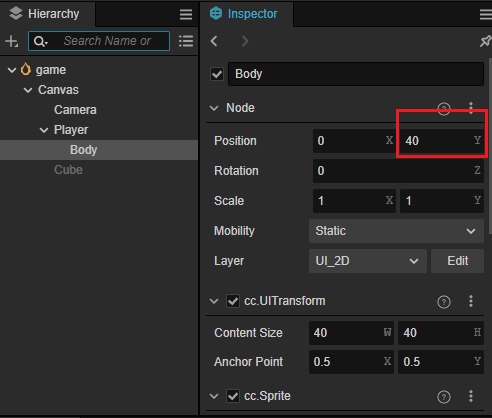
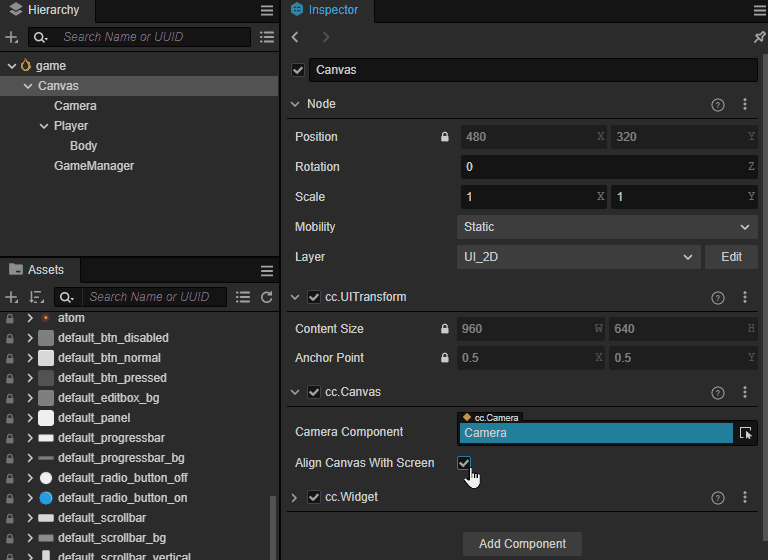
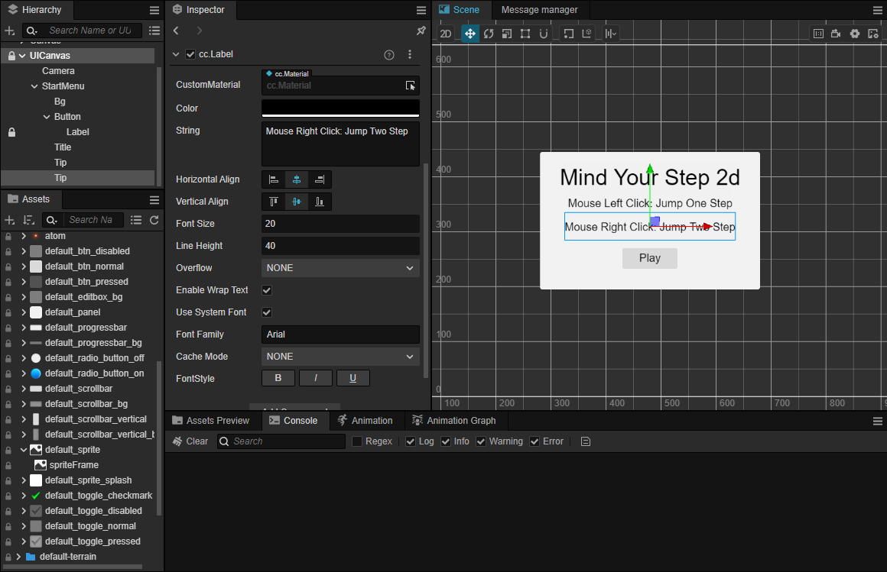

# Quick Start: Making Your First 2D Game

Platform jumping games are a very common and popular game genre, ranging from simple games on the original NES console to large-scale games made with complex 3D technology on modern gaming platforms. You can always find platform jumping games.

In this section, we will demonstrate how to use the 2D features provided by Cocos Creator to create a simple plaftorm jumping game.

## Environment Setup

### Download Cocos Dashboard

Visit the [Cocos Creator official website](https://www.cocos.com/creator-download) to download the latest version of Cocos Dashboard, which allows for unified management of the Cocos Creator versions and your projects. After installing, open the Cocos Dashboard.


### Install Cocos Creator


In the **Editor** tab, click on the Install button for the desired version to install the editor, Cocos Creator.

> We usually recommend using the latest version of Cocos Creator to get started. it will obtain more features and support.

### Create Project

In the **Project** tab, find the **Create** button, select **Empty(2D)**.


Next, just enter your project name in the highlighted field shown in the image above.

For example, you could input: cocos-turtorial-mind-your-step-2d.

Let's make a game that is similar to the one in [Quick Start: Making Your First 3D Game](../first-game/index.md).

If you haven't read [Quick Start: Making Your First 3D Game](../first-game-2d/index.md) yet, that's okay. In this section, we'll assume you haven't used Cocos Creator before, and we'll start from scratch!

Without further ado, let's get started.

## Create the Character

In a 2D game, all visible objects are made of images, including the charactor.

To keep things simple, we'll be using the images that come bundled with Cocos Creator to create our game. These images can be found in `internal/default_ui/`.

In Cocos Creator, we use a `Sprite` node ( a node with Sprite component ) to show an image.

To create a new node of type Sprite, right-click in the Hierarchy panel, select "Create", and then choose "2D -> Sprite" from the pop-up menu.

Right-click in the Hierarchy and select "Create" from the pop-up menu, we can see differfent types of nodes. Here, we select "2D -> Sprite" to create a new `Sprite` node.


Next, we find the `internal/default_ui/defualt_btn_normal` and assign it to the `Sprite Frame` property of the `Sprite` node we just created.


Next, create an `Empty` node and name it "Player":


If you didn't name the node when you created it, there are two ways to change its name:

- In the **Inspector** panel, find the name and rename it
- In the **Hierarchy**, select the node then press `F2`

We can adjust the parent-child relationship of nodes by dragging and dropping them in the Hierarchy. Here, drag the `Sprite` node onto the `Player` node to make it as a child, then rename the `Sprite` node to "Body".


> **Note**：
> - The heirarchy relationship determines the rendering order. if may cause the node to not be visible when the order is wrong.
> - 2D/UI elements must be under a `Canvas` node in order to be visbile.
> - The layer of 2D/UI elements must be set to `UI_2D` 

Next, Let's adjust the position's Y of the `Body` node to 40:



Finally, let's adjust the color of the `Body`.

In the Inspector panel, find the `Color` property and expand it, then set the color to red.


## The First Script

Scripts, also known as code, are used to implement game logic, such as character movement, jumping, and other gameplay mechanics.

Cocos Creator uses TypeScript as its scrpting programming language. It has simple and easy-to-learn syntax, a large user base, and widespread applications. You can encounter it in web development, app development, and game development etc.

Creating a script component in Cocos Creator is very simple. All you need to do is right-click in the Assets Manager window, select "Create -> TypeScript -> NewComponent" option.

</img>

For ease of management, it is often recommended to create a folder named `Script` to put all of your scripts in.

Next, right-click on the `Scripts` folder, and create a new script component named `PlayerController` to control the player.


The engine will generate the following code for the script component that we just created.

```ts
import { _decorator, Component, Node } from 'cc';
const { ccclass, property } = _decorator;

@ccclass('PlayerController')
export class PlayerController extends Component {
    start() {

    }

    update(deltaTime: number) {
        
    }
}
```

**Note** Cocos Creator uses a Node + Component architechure, meaning that a component must be attached to a node in order to function. Scripts in Cocos Creator are also designed as components.

So, let's drag the `PlayerController` script onto the  Inspector of Player node.


You should see that a `PlayerController` component has been added to the Player node.

> **Note**: You can also click on the **Add Component** button to add different types of components.

> 由于 `Node` 这个类名在 TypeScript 内置库内也有同名的类，因此需要注意在导入时需要确保导入的是 `cc` 命名空间下的 `Node`，代码示例如下：
> `import { _decorator, Component, Node } from 'cc'`

## Map

A map in a game is an area where your character can move around and interact within a game.

As mentioned before, all visible objects in 2D games are made up of images. The map is no exeption.

Just like the steps we used to created the `Body` node, we will now create an object called `Box` which will be used to construct the map.

- Right-click in the Hierarchy
- Create a `Sprite` node by selecting "Create -> 2D Objects -> Sprite" through the pop-up menu.
- Name it as "Box"
- Select the "Box" node, set its **Sprite Frame** property by using `internal/defualt_ui/default_btn_normal`


### Prefab

A prefab is a special type of resource which can save the information of node as a file. so that it can be reused in other situations.

In Cocos Creator, creating a prefab is quite simle. We just need to drag the node into the Assets Manager window, a *.prefab file will be automatically generated.

Now, let's create a folder named Prefab in the Assets Manager window , which will be used to organize all prefabs together.

Then, find the Box node and drag it to the Prefab folder, a prefab file named "Box" will be generated.

The box node in the hierarchy can be deleted, because it won't be used when game is running. Instead, we will create nodes in script using Box.prefab to build the game map during gameplay.


> **Tips:** Generally, We will use different folders to manage different types of resources. It's a good habit to keep your project well-organized.

### Scene

In the game engine, a scene is used to manage all game objects. It contains charaters, maps, gameplay, ui. you name it in a game.

A game can be divided into different scenes based on its funcionalities. Such as loading scene, start menu scene, gameplay scene etc.

A game requires at least on scene to start.

So, in Cocos Creator, an unsaved empty scene will be opened by default, just as the one we are currently editing.

To ensure that we can find this scene the next time we open Cocos Creator, we need to save it.

First, let's create a folder named "Scene" to save our scenes in the Assets Manager window.


Then, press the <kbd>Ctrl</kbd> + <kbd>S</kbd> shorcut key.

Since it is the first time we are saving this scene, the scene saving window will pop up.

We choose the "Scene" folder that we just created as the location, and name it "game.scene". Click save.


Now the scene is saved. We can see a scene resource file named "game" under the assets/Scene folder in the Assets Manager window.


此时就可以观察到整个场景的状态，红色用于代表玩家而白色代表地面的地块。


> Don't forget to press <kbd>Ctrl</kbd> + <kbd>S</kbd> shorcut key to save your scene when there are changes to the scene. Avoid losing work progress due to unexpected events such as power outages.

## Make the character move

We have created the "Player" node before, but it can not move.

Next, we will add code and animations to control its movement and make it move.

### PlayerController

The player should have the following behaviors：

- it starts jumping when the mouse is clicked.
- When it has been jumping for a certain amount of time, the jumping ends.

To achieve the above goals, we need to add some methods in the `PlayerController` component.

- Listen for mouse click events

    ```ts
    onMouseUp(event: EventMouse) {}
    ```

- Jump according to the given steps

    ```ts
    jumpByStep(step: number) {}
    ```

- Calculate the position of the player

    ```ts
    update (deltaTime: number) {}
    ```

Next, let's complete these methods.

#### Listen for mouse click events

Cocos Creator supports various common control devices, such as mouse, keyboard, touchpad and gamepad. You can easily access the relevant content through `Input` class.

For ease of use, Cocos Creator provides a global instance object `input` for the `Input` class.

> **Note** It's easy to confuse, `input` is the instance and `Input` is the class.

To make the `onMouseUp` method be called by the engine when the mouse is clicked, we need to add the following code to the `start` method.

```ts
start () {
    input.on(Input.EventType.MOUSE_UP, this.onMouseUp, this);
}
```

The `onMouseUp` method has an `event` parameter of type `EventMouse`.

Through the `event.getButton()` method, we can get which button of the mouse is clicked.

Add the following code to the `onMouseUp` method:

```ts
onMouseUp(event: EventMouse) {
    if (event.getButton() === EventMouse.BUTTON_LEFT) {
        this.jumpByStep(1);
    } else if (event.getButton() === EventMouse.BUTTON_RIGHT) {
        this.jumpByStep(2);
    }
}
```

In the `EventMouse` class, there are three values has been defined:
- public static BUTTON_LEFT = 0;
- public static BUTTON_MIDDLE = 1;
- public static BUTTON_RIGHT = 2;

The code has implemented that:
- When the left mouse button is clicked, the player jumps forward one step.
- When the right mouse button is clicked, the player jumps forward two steps.

#### Move the player

In our game, the player moves horizontally to the right, so we need to use a simple physics formula as below:

```math
P_1 = P_0 + v*t
```

Where `P_1` is the final position, `P_0` is the orignal position, v is the speed of the object, and t is the unit time.

> Final Position = Orignal Position + Speed * deltaTime

The `update` function in the PlayerController component will be automatically called by the game engine. And also pass in a `deltaTime` parameter.

```ts
update (deltaTime: number) {}
```

The times that `update` will be called per second is determined by the frame rate (also known as FPS) when game running.

For exapmle, if a game is runing at 30 FPS, the `deltaTime` will be  1.0 / 30.0 = 0.03333333... second.

In game development , we use `deltaTime` as the `t` in physics formula to ensure consistent movement results at any frame rate.

Here, let's add some properties needed for calculating player movement `PlayerController` component.

```ts
//used to judge if the player is jumping.
private _startJump: boolean = false;

//the number of steps will the player jump, shoule be 1 or 2. determined by which mouse button is clicked.
private _jumpStep: number = 0;

//the time it takes for the player to jump once.
private _jumpTime: number = 0.3;

//the time that the player's current jump action has taken, should be set to 0 each time the player jumps, when it‘s reaches the value of `_jumpTime`, the jump action is completed.
private _curJumpTime: number = 0;

//the player's current vertical speed, used to calculate the Y value of position when junmping.
private _curJumpSpeed: number = 0;

//the current postion of player, used as the oringal position in the physics formula.
private _curPos: Vec3 = new Vec3();

//movement calculated by deltaTime.
private _deltaPos: Vec3 = new Vec3(0, 0, 0);

// store the final position of player, when the player's jumping action ends, it will be used directly to avoid cumulative errors.
private _targetPos: Vec3 = new Vec3();   
```

Now, what we need to do next is very simple:

- Calculating the data needed for player movement in the `jumpByStep` method.
- Processing player movement in the `update` method.

In the `jumpByStep` method, we add the following code:

```ts
jumpByStep(step: number) {
    if (this._startJump) {
        //if player is jumping, do nothing.
        return;
    }
    //mark player is jumping.
    this._startJump = true;
    //record the number of step the jumpping action will take.
    this._jumpStep = step;
    //set to 0 when a new jumping action starts
    this._curJumpTime = 0;
    //because the player will finish the jumping action in the fixed duration(_jumpTime), so it needs to calculate jump speed here.
    this._curJumpSpeed = this._jumpStep / this._jumpTime;
    //copy the current position of node, will be used when calculating the movement.
    this.node.getPosition(this._curPos);
    //calculate the final position of node, will be used when jumping action ends.
    Vec3.add(this._targetPos, this._curPos, new Vec3(this._jumpStep, 0, 0));
}
```

`Vec3` is the vector class in Cocos Creator, the name is short for `Vector3`, which has 3 components, x,y,z. all vector operations are placed in `Vec3` class. Such as `Vec3.add`, `Vec3.substrct` etc.

In Cocos Creator, 2D games also use `Vec3` as the property type for poistion, scale and rotation. Just ignore the irrelevant components, e.g. the z component in position.

Next, let's calculate the movement of the player while jumping.

In this game, the player only moves when jumping, and keeps still when not jumping.

Let's add the following code to the `update` method in `PlayerController`.

```ts
update (deltaTime: number) {
    //we only do something when the player is jumping.
    if (this._startJump) {
        //acumulate the jumping time.
        this._curJumpTime += deltaTime;
        //check if it reaches the jump time.
        if (this._curJumpTime > this._jumpTime) {
            //jump end, set the player's position to target position. 
            this.node.setPosition(this._targetPos);
            //clear jump state
            this._startJump = false;
        } else {
            //if it still needs to move.
            // copy the postion of the node.
            this.node.getPosition(this._curPos);
            //calculate the offset x by using deltaTime and jumping speed.
            this._deltaPos.x = this._curJumpSpeed * deltaTime;
            //calculate the final pos by adding deltaPos to original pos
            Vec3.add(this._curPos, this._curPos, this._deltaPos);
            //update the position of the player.
            this.node.setPosition(this._curPos);
        }
    }
}
```

Now, click the **Preview** button at the top of Cocos Creator.

 

The **Player** will move by clicking the mouse buttons.


As you can see, the player only moves a little each time you click the mouse button.

This is because that we use `pixels/s` as the unit of speed for the Player.

```ts
this._curJumpSpeed = this._jumpStep / this._jumpTime;
```

The above code indicates that the player will only move one pixel per step.

In fact, we want the Player to move a certain distance per step.

To fix this, we need to add a constant to express the step size.

Below, the `BLOCK_SIZE` is used for this purpose.

```ts
import { _decorator, Component, Node } from 'cc';
const { ccclass, property } = _decorator;

//
export const BLOCK_SIZE = 40; 

@ccclass('PlayerController')
export class PlayerController extends Component {
    //...
}
```

As you can see, in TypeScript:
- A constant can be defined outside of the class and exported separately.
- Values declared as const cannot be modified and are often used for fixed configurations.

Next, find the code line in `jumpByStep` mehod:

```ts
this._curJumpSpeed = this._jumpStep / this._jumpTime;
```

Change it to:

```ts
this._curJumpSpeed = this._jumpStep * BLOCK_SIZE/ this._jumpTime;
```

Here is the updated `jumpByStep`:

```ts
jumpByStep(step: number) {
    if (this._startJump) {
        return;
    }
    this._startJump = true;
    this._jumpStep = step;
    this._curJumpTime = 0;
    
    this._curJumpSpeed = this._jumpStep * BLOCK_SIZE/ this._jumpTime;

    this.node.getPosition(this._curPos);
    Vec3.add(this._targetPos, this._curPos, new Vec3(this._jumpStep* BLOCK_SIZE, 0, 0));    
}
```

Restart the game, and you can see that the distance of the player's movement is as expected now.


At this moment, the code of `PlayerController` is as follows.

```ts
import { _decorator, Component, Vec3, EventMouse, input, Input } from "cc";
const { ccclass, property } = _decorator;

export const BLOCK_SIZE = 40;

@ccclass("PlayerController")
export class PlayerController extends Component {

    private _startJump: boolean = false;
    private _jumpStep: number = 0;
    private _curJumpTime: number = 0;
    private _jumpTime: number = 0.3;
    private _curJumpSpeed: number = 0;
    private _curPos: Vec3 = new Vec3();
    private _deltaPos: Vec3 = new Vec3(0, 0, 0);
    private _targetPos: Vec3 = new Vec3();

    start () {
        input.on(Input.EventType.MOUSE_UP, this.onMouseUp, this);
    }

    reset() {
    }   

    onMouseUp(event: EventMouse) {
        if (event.getButton() === 0) {
            this.jumpByStep(1);
        } else if (event.getButton() === 2) {
            this.jumpByStep(2);
        }

    }

    jumpByStep(step: number) {
        if (this._startJump) {
            return;
        }
        this._startJump = true;
        this._jumpStep = step;
        this._curJumpTime = 0;
        this._curJumpSpeed = this._jumpStep * BLOCK_SIZE/ this._jumpTime;
        this.node.getPosition(this._curPos);
        Vec3.add(this._targetPos, this._curPos, new Vec3(this._jumpStep* BLOCK_SIZE, 0, 0));    
    }
   
    update (deltaTime: number) {
        if (this._startJump) {
            this._curJumpTime += deltaTime;
            if (this._curJumpTime > this._jumpTime) {
                // end
                this.node.setPosition(this._targetPos);
                this._startJump = false;              
            } else {
                // tween
                this.node.getPosition(this._curPos);
                this._deltaPos.x = this._curJumpSpeed * deltaTime;
                Vec3.add(this._curPos, this._curPos, this._deltaPos);
                this.node.setPosition(this._curPos);
            }
        }
    }
}
```

### Player Animation

For 2D game development, Cocos Creator supports various types of animation, including keyframe animation, Spine, DragonBones and Live2D.


In this tutorial, the jump animation of the Player is very simple and it is enough to use keyframe animation.

Using Cocos Creator's built-in animation editor, it's easy to make it.

Let's take a step-by-step approach to creating it.


首先在角色的 Body 节点上，增加一个 Animation 的组件：


在 **资源管理器** 内新建 Animation 的目录，并创建一个名为 oneStep 的动画剪辑。


在 **层级管理器** 里面选中 Body 节点，并将 oneStep 拖拽到 **Clips** 属性上：


在编辑器下方控制台处切换到 **动画** 分页并点击下方的 **进入编辑模式** 按钮：


在动画编辑器里面，可以添加不同的动画轨道。


添加完成 postion 这个轨道以后，就可以添加不同的关键帧，添加方式也比较简单，我们可以在编辑模式下，只要在场景中或者属性检查器内修改物体的位置，此时如果动画轨道上没有关键帧，则会在轨道上添加一个新的关键帧。

这里我们将指向当前帧的指针拖拽到不同位置，并改变物体的位置，此时就会创建新的关键帧。


布局下列的关键帧：

- 0 帧：位置信息为：[0,40]
- 10 帧: 位置信息为：[0,120]
- 20 帧: 位置信息为：[0,40]

> 记得点击 **保存** 按钮对动画剪辑进行保存。

可以通过点击 **播放** 按钮在场景中预览动画。


参考 oneStep 动画的制作过程，制作 twoStep 动画。


### 播放动画

在制作好动画之后，我们可以驱动 PlayerController 来播放动画，播放动画的代码很简单：

```ts
animation.play('oneStep');
```

- animation 是 Body 动画的动画组件的 ‘引用’。
- play 指的是播放动画的方法，他的参数是我们之前创建好的 oneStep 这个动画剪辑，在 Cocos Creator 中，如果要播放对应的动画，必须将该动画配置在 Animation 组件的 Clips 属性内

在 PlayerController 中将如下的代码：

```ts
@property(Animation)
BodyAnim:Animation = null;
```

添加的位置如下：

```ts
@ccclass("PlayerController")
export class PlayerController extends Component {

    @property(Animation)
    BodyAnim:Animation = null;
    ...
}
```

这里我们给 BodyAnim 添加了一个名为 `@property` 的属性，这样的语法被称为 [装饰器](../../scripting/decorator.md)，这里的 `@property` 可以帮助编辑器，使其将 BodyAnim 在编辑器内视为 Animation 类型。

如果这里代码没有编译通过，请查看是否有 `const { ccclass, property } = _decorator;` 代码，这里的语句将会正确的将 `property` 方法导出，完整的导出如下：

```ts
import { _decorator, Component, Vec3, EventMouse, input, Input, Animation } from "cc";
const { ccclass, property } = _decorator;

```

> **注意**：TypeScript 的内置库和 Cocos Creator 都有名为 Animation 的类，请确保上述代码中 `import { ... } from "cc" ` 包含 Animation。

在 `jumpByStep` 方法内，添加如下的代码：

```ts
if (this.BodyAnim) {
    if (step === 1) {
        this.BodyAnim.play('oneStep');
    } else if (step === 2) {
        this.BodyAnim.play('twoStep');
    }
}
```

此时的 `jumpByStep` 看起来是这样的：

```ts
jumpByStep(step: number) {
    if (this._startJump) {
        return;
    }
    this._startJump = true;
    this._jumpStep = step;
    this._curJumpTime = 0;
    this._curJumpSpeed = this._jumpStep * BLOCK_SIZE/ this._jumpTime;
    this.node.getPosition(this._curPos);
    Vec3.add(this._targetPos, this._curPos, new Vec3(this._jumpStep* BLOCK_SIZE, 0, 0));  
    
    if (this.BodyAnim) {
        if (step === 1) {
            this.BodyAnim.play('oneStep');
        } else if (step === 2) {
            this.BodyAnim.play('twoStep');
        }
    }
}
```

回到编辑器，此时可以通过拖拽的方式添加 BodyAnim 到 PlayerController 上：


点击运行游戏，点击鼠标都可以看到角色正常的跳起来：


如果仔细观察的话，现在我们使用的是统一的 `_jumpTime = 0.3`，实际上两个动画的时长并不一致，因此可以看到如上图奇怪的动画效果，可以通过获取动画剪辑的时长来动态调整 `_jumpTime`。
这里举个例子：

```ts
const oneStep = 'oneStep';
const state = this.BodyAnim.getState(oneStep);        
this._jumpTime = state.duration;
```

twoStep 动画和上文代码类似，您可以自己尝试完成：


## 游戏管理器（GameManager）

在游戏中，我们可以通过手动布置 Box 节点来生成地图，但是这样的话地图就是固定了，为了让每次开始游戏的地图有变化并为玩家提供一些惊喜，可以选择通过动态生成方块的方式来创建地图。

这样我们就需要将生成的过程和结果保存起来，一般情况为了保存游戏的数据，我们需要创建一些类来辅助这类工作。这样的类我们称之为 **Manager** 管理器。

在 **资源管理器** 的 **Scripts** 目录内，点击右键创建新的 TypeScript 组件并将其命名为： **GameManager**。

> 在 Cocos Creator 内创建组件时会同时确定组件内根据模板生成的内容。
> 如果您在不熟悉的情况下输入了错误的名字，可以选择删除再重新创建一个新的文件。
> 如果只是修改文件名，不修改里面的内容，会导致类名与文件名不一致，而无法在 **属性检查器** 内找到对应的类。

创建好 GameManager 之后，我们可以将其挂在在场景内任何一个节点上，但出于清晰的考虑我们一般会选择创建一个同名的节点，并将 GameManager 挂在在他上面：


首先我们需要让 GameManager 知道他应该用那个资源作为地图块来创建，因此我们可以在代码中添加 `boxPrefab` 来指向我们之前已经创建好的 Box 预制体。

```ts
@property({type: Prefab})
public boxPrefab: Prefab|null = null;
```

> @property 依旧是装饰器的用法，如果你不记得了，可以回到之前角色 **播放动画** 部分。

将上述的代码添加下如下位置：

```ts
import { _decorator, Component, Prefab } from 'cc';
const { ccclass, property } = _decorator;

@ccclass('GameManager')
export class GameManager extends Component {

    @property({type: Prefab})
    public boxPrefab: Prefab|null = null;

    start(){}

    update(dt: number): void {
        
    }
}
```

之后回到编辑器并将 Box 预制体拖拽到 GameManager 上：


我们可以用一个数值类型的数组来存储当前的位置到底是方块还是坑，但实际上有更好的办法，我们声明如下的枚举，用 `BT_NONE` 来表示坑，而 `BT_STONE` 来表示方块，这样的表示会让我们的代码更加的易读。

```ts
enum BlockType{
    BT_NONE,
    BT_STONE,
};
```

在 TypeScript 里面您可以将这个枚举放在类的上面，这样可以确保 GameManager 可以访问他，同时由于没有添加 export 关键字，这意味着这个枚举只有在 GameManager.ts 这个模块内才可以访问。

接下来我们需要生成并记录下地图的生成情况，可以声明如下的成员变量来存储它们，同时如果想要在编辑器里面配置初始化时道路的长度，可以声明一个变量 `roadLength` 来记录：

```ts
import { _decorator, CCInteger, Component, Prefab } from 'cc';
const { ccclass, property } = _decorator;

enum BlockType{
    BT_NONE,
    BT_STONE,
};

@ccclass('GameManager')
export class GameManager extends Component {

    @property({type: Prefab})
    public boxPrefab: Prefab|null = null;
    @property({type: CCInteger})
    public roadLength: number = 50;
    private _road: BlockType[] = [];

    start() {
       
    }  
}
```

> 用数组来存储这些地图数据是很好的主意，因为数组可以进行快速的访问，我们可以通过索引很快查询到某个位置是方块还是坑。

填充地图的流程是这样的：

- 每次生成时，需要将上次的结果清除
- 第一个地块永远是方块，保证角色不会掉下去
- 由于我们的角色可以选择跳 1 个方块或者 2 个方块，和某个戴红帽子穿背带裤家伙比起来太弱鸡了，因此坑最多不应该连续超过 2 个，也就意味着如果前面 1 个地块是坑，那么接下来的地块必须是方块

接下来为 `GameManager` 添加几个方法：

- 生成地图的方法：

    ```ts
   generateRoad() {

        // 清理上次的结果
        this.node.removeAllChildren();

        this._road = [];
        // startPos 开始位置必须是方块
        this._road.push(BlockType.BT_STONE);

        // 随机的方法生成地图
        for (let i = 1; i < this.roadLength; i++) {
            if (this._road[i-1] === BlockType.BT_NONE) {
                this._road.push(BlockType.BT_STONE);
            } else {
                this._road.push(Math.floor(Math.random() * 2));
            }
        }

        let linkedBlocks = 0;
        for (let j = 0; j < this._road.length; j++) {
            if(this._road[j]) {
                ++linkedBlocks;
            }
            if(this._road[j] == 0) {
                if(linkedBlocks > 0) {
                    this.spawnBlockByCount(j - 1, linkedBlocks);
                    linkedBlocks = 0;
                }
            }        
            if(this._road.length == j + 1) {
                if(linkedBlocks > 0) {
                    this.spawnBlockByCount(j, linkedBlocks);
                    linkedBlocks = 0;
                }
            }
        }
    }
    ```

    > `Math.floor`： 这个方法是 TypeScript 数学库的方法之一：我们知道 floor 是地板的意思，这表示取这个方法参数的 "地板"，也就是向下取整。
    > `Math.random`：同样 random 也是标准数学库的方法之一，用于随机一个 0 到 1 之间的小数，注意取值范围是 [0, 1)。
    > 所以 `Math.floor(Math.random() * 2)` 这段代码的意思很简单，就是从 [0, 2) 中随机取 1个数并向下取整，得到的结果是 0 或者 1，恰好和 枚举 `BlockType` 中声明的 `BT_NONE` 和 `BT_STONE` 对应。
    > 顺便说一句，在 TypeScript 的枚举中，如果你没有给枚举赋值，那么枚举的值会顺序的从 0 开始分配。

- 根据 `BlockType` 生成方块：

    ```ts
    spawnBlockByType(type: BlockType) {
        if (!this.boxPrefab) {
            return null;
        }

        let block: Node|null = null;
        switch(type) {
            case BlockType.BT_STONE:
                block = instantiate(this.boxPrefab);
                break;
        }

        return block;
    }
    ```

    通过 `BlockType` 来确定是否要真的创建这个方块，当然只在 `type` 为 `BT_STONE` 的时候我们通过 `instantiate` 方法来创建方块，其他情况下，返回一个空值。

    > instantiate: 是 Cocos Creator 提供的克隆预制体的方法。当然它不仅能克隆预制体，你甚至可以用它克隆别的类型比如某个对象！

- 根据所需的数量和前 1 个位置来生成方块：

    ```ts
    spawnBlockByCount(lastPos: number, count: number) {
        let block: Node|null = this.spawnBlockByType(BlockType.BT_STONE);
        if(block) {
            this.node.addChild(block);
            block?.setScale(count, 1, 1);
            block?.setPosition((lastPos - (count - 1) * 0.5)*BLOCK_SIZE, -1.5, 0);
        }
    }
    ```

    `spawnBlockByCount` 会根据 `spawnBlockByType` 的结果来创建方块，当然如果连续某个方块不仅仅占据 1 个格子时，会根据他所占的格子数来调整他在 X 轴的缩放：`block?.setScale`。之后通过 `setPosition` 将其放在合适的位置上。

    > 在 Cocos Creator 中，设置节点的位置需要使用 `setPosition` 方法或者 `set position` 这样的读取器。

此时如果我们在 `GameManager` 的 `start` 内调用 `generateRoad` 来创建地图：

```ts
start() {
    this.generateRoad()
}  
```

运行游戏后可以观察到地图的生成的情况：


## 相机和卷轴

2D 横版游戏中必须要处理卷轴问题，所谓的卷轴就是相机随着角色的运动而运动，导致看到的场景不太一样的情况。

为了实现卷轴，我们需要允许 Camera 可以移动并不在强制和 Canvas 对齐，取消 Canvas 节点上 `cc.Canvas` 组件的 **Align Canvas With Screen** 属性：



此时运行游戏就可以观察到相机的跟随情况：


## 菜单制作

对于大多数游戏来说，UI 都是比较重要的部分，通过 UI 的提示，可以让玩家知道某些游戏内的信息，让玩家选择不同的游戏策略。

2D 游戏类型下，我们本身有一个名为 Canvas 的节点的，但是这个节点我们将只会拿它来作为角色、地图和游戏逻辑的父节点。因为 Cavans 的相机会移动，如果依然使用 Canvas 的相机，会导致 UI 无法渲染，所以我们必须创建一个新的 Canvas 来作为 UI 的容器。

在 **层级管理器** 中点击右键选择创建一个新的 Canvas 并将其命名为 UICanvas：


在 UICanvas 上点击右键并创建一个空的节点命名为 'StartMenu'，并在 StartMenu 节点下创建一个按钮将其子节点 Label 的 **String** 属性修改为 Play。


之后可以添加一个背景框和一些文本提示用于提示用户游戏的操作是怎么样的：

选中 StartMenu 点击右键创建一个 Sprite，将其名字修改为 Bg，从 **资源管理器** 的 internal 目录内，找到 default_panel 资源并赋予给 Bg 的 **Sprite Frame** 属性，调整 **Type** 为 **SLICED**，并调整好 Bg 的 UITransform 内的 Content Size 属性：


在 StartMenu 下方创建一个名为 Title 的 Label，并修改其属性如下所示：


继续创建一些 Label 用于描述游戏的玩法：



同理添加一个 Label 用于代表角色走了几步，注意 Step 这个 Label 不要作为 StartMenu 的子节点：


接下来我们就可以完善整个游戏逻辑。

## 游戏状态

我们游戏有三种状态，初始化、游戏中、游戏重置或者结算，和下棋类似，大部分游戏都可以粗略分解为这样的三个状态。

因此我们也可以定义这样的枚举来描述游戏状态。

```ts
enum GameState{
    GS_INIT,
    GS_PLAYING,
    GS_END,
};
```

将上述的代码放在枚举 `BlockType` 附近。

这里我们为 GameManager 添加一个 `curState` 的读取器提供给外界，使其可以用于控制游戏的状态：

```ts
set curState (value: GameState) {
    switch(value) {
        case GameState.GS_INIT:            
            break;
        case GameState.GS_PLAYING:           
            break;
        case GameState.GS_END:
            break;
    }
}
```

> 读取器是 TypeScript 的一种语法，用于保护某些属性，观察上述的代码可以看到 curState 并不会被直接设置，而是由我们在读取器内做了某些判断，这样可以保护 curState 的逻辑。

添加一个 `init` 方法用于表示进入到 GS_INIT 时游戏的处理：

```ts
init() {}
```

同时在 `set curState` 的时候调用它：

```ts
set curState (value: GameState) {
    switch(value) {
        case GameState.GS_INIT:            
            this.init();
            break;
        case GameState.GS_PLAYING:           
            break;
        case GameState.GS_END:
            break;
    }
}
```

为了在游戏开始时不让用户操作角色，而在游戏进行时让用户操作角色，我们需要动态地开启和关闭角色对鼠标消息的监听。在 `PlayerController` 脚本中做如下修改：

```ts
start () {
    //input.on(Input.EventType.MOUSE_UP, this.onMouseUp, this);
}

setInputActive(active: boolean) {
    if (active) {
        input.on(Input.EventType.MOUSE_UP, this.onMouseUp, this);
    } else {
        input.off(Input.EventType.MOUSE_UP, this.onMouseUp, this);
    }
}
```

此时的 GameManager 看起来是这样的：

```ts
import { _decorator, CCInteger, Component, instantiate, Node, Prefab } from 'cc';
import { BLOCK_SIZE, PlayerController } from './PlayerController';
const { ccclass, property } = _decorator;

enum BlockType{
    BT_NONE,
    BT_STONE,
};

enum GameState{
    GS_INIT,
    GS_PLAYING,
    GS_END,
};

@ccclass('GameManager')
export class GameManager extends Component {

    @property({type: Prefab})
    public boxPrefab: Prefab|null = null;
    @property({type: CCInteger})
    public roadLength: number = 50;
    private _road: BlockType[] = [];

    start() {
        this.curState = GameState.GS_INIT; // 第一初始化要在 start 里面调用
    }    

    init() {       
        this.generateRoad();        
    }

    set curState (value: GameState) {
        switch(value) {
            case GameState.GS_INIT:
                this.init();
                break;
            case GameState.GS_PLAYING:                
                
                break;
            case GameState.GS_END:
                break;
        }
    }

    generateRoad() {

        this.node.removeAllChildren();

        this._road = [];
        // startPos
        this._road.push(BlockType.BT_STONE);

        for (let i = 1; i < this.roadLength; i++) {
            if (this._road[i-1] === BlockType.BT_NONE) {
                this._road.push(BlockType.BT_STONE);
            } else {
                this._road.push(Math.floor(Math.random() * 2));
            }
        }

        let linkedBlocks = 0;
        for (let j = 0; j < this._road.length; j++) {
            if(this._road[j]) {
                ++linkedBlocks;
            }
            if(this._road[j] == 0) {
                if(linkedBlocks > 0) {
                    this.spawnBlockByCount(j - 1, linkedBlocks);
                    linkedBlocks = 0;
                }
            }        
            if(this._road.length == j + 1) {
                if(linkedBlocks > 0) {
                    this.spawnBlockByCount(j, linkedBlocks);
                    linkedBlocks = 0;
                }
            }
        }
    }

    spawnBlockByCount(lastPos: number, count: number) {
        let block: Node|null = this.spawnBlockByType(BlockType.BT_STONE);
        if(block) {
            this.node.addChild(block);
            block?.setScale(count, 1, 1);
            block?.setPosition((lastPos - (count - 1) * 0.5)*BLOCK_SIZE, 0, 0);
        }
    }

    spawnBlockByType(type: BlockType) {
        if (!this.boxPrefab) {
            return null;
        }

        let block: Node|null = null;
        switch(type) {
            case BlockType.BT_STONE:
                block = instantiate(this.boxPrefab);
                break;
        }

        return block;
    }
}
```

接下来我们分析下在每个状态下所需要处理的事情：

- GS_INIT：状态下需要初始化地图、将角色放回到初始点、显示游戏的UI，因此在属性中下列属性：

    ```ts
    @property({ type: Node })
    public startMenu: Node | null = null; // 开始的 UI
    @property({ type: PlayerController }) 
    public playerCtrl: PlayerController | null = null; // 角色控制器
    @property({type: Label}) 
    public stepsLabel: Label|null = null; // 计步器
    ```

    在 `init` 方法中需要做如下的处理：

    ```ts
    init() {       
        if (this.startMenu) {
            this.startMenu.active = true;
        }

        this.generateRoad();

        if (this.playerCtrl) {
            this.playerCtrl.setInputActive(false);
            this.playerCtrl.node.setPosition(Vec3.ZERO);
            this.playerCtrl.reset();
        }
    }
    ```

    init 时我们先显示 StartMenu、创建地图以及重设角色的为和状态并禁用角色输入。

- GS_PLAYING：在状态下隐藏 StartMenu、重设计步器的数值以及启用用户输入：

    ```ts
    if (this.startMenu) {
        this.startMenu.active = false;
    }

    if (this.stepsLabel) {
        this.stepsLabel.string = '0';   // 将步数重置为0
    }

    setTimeout(() => {      //直接设置active会直接开始监听鼠标事件，做了一下延迟处理
        if (this.playerCtrl) {
            this.playerCtrl.setInputActive(true);
        }
    }, 0.1);
    ```

- GS_END：暂时没有什么好添加的，当然您可以根据喜好添加一些结算用的逻辑让游戏看起来更完善

回到编辑器，绑定好 GameManager 需要的属性：


### 绑定按钮事件

在 GameManager 内添加如下的方法，用于响应 Play 按钮按下的事件：

```ts
onStartButtonClicked() {
    this.curState = GameState.GS_PLAYING;
}
```

回到编辑器，找到开始按钮，并在 **Click Events** 属性后的输入框内输入 1，然后找到 GameManager 节点并拖拽到下方的 cc.Node 属性内，之后从第二栏的下拉中找到 GameManager 脚本，再从第三栏中选择 `onStartButtonClicked` 事件。


此时已可以正常的开始玩游戏：


接下来就来处理掉到坑里后游戏失败的情况。

### 监听跳跃结束

在 PlayerController 里面添加一个属性用于记录角色当前为多少步：

```ts
private _curMoveIndex: number = 0;
```

在 `reset` 方法中重置这个属性：

```ts
reset() {
    this._curMoveIndex = 0;
}   
```

在 `jumpByStep` 中将这个步数增加，每次的增量是输入的步数：

```ts
jumpByStep(step: number) {
    if (this._startJump) {
        return;
    }
    this._startJump = true;
    this._jumpStep = step;
    this._curJumpTime = 0;
    this._curJumpSpeed = this._jumpStep * BLOCK_SIZE/ this._jumpTime;
    this.getPosition(this._curPos);
    Vec3.add(this._targetPos, this._curPos, new Vec3(this._jumpStep* BLOCK_SIZE, 0, 0));  
    
    if (this.BodyAnim) {
        if (step === 1) {
            this.BodyAnim.play('oneStep');
        } else if (step === 2) {
            this.BodyAnim.play('twoStep');
        }
    }

    this._curMoveIndex += step;
}
```

在 PlayerController 中添加一个监听跳跃结束的方法：

```ts
onOnceJumpEnd() {
    this.node.emit('JumpEnd', this._curMoveIndex);
}
```

该方法派发了一个名为 `JumpEnd` 的事件，并将 `_curMoveIndex` 作为参数传递出去。

并在 PlayerController 的 `update` 方法中调用：

```ts
update (deltaTime: number) {
    if (this._startJump) {
        this._curJumpTime += deltaTime;
        if (this._curJumpTime > this._jumpTime) {
            // end
            this.node.setPosition(this._targetPos);
            this._startJump = false;      
            this.onOnceJumpEnd();        
        } else {
            // tween
            this.node.getPosition(this._curPos);
            this._deltaPos.x = this._curJumpSpeed * deltaTime;
            Vec3.add(this._curPos, this._curPos, this._deltaPos);
            this.node.setPosition(this._curPos);
        }
    }
}
```

回到 GameManager 并增加以下的处理：

- 增加一个 `onPlayerJumpEnd` 的方法

    ```ts
    onPlayerJumpEnd(moveIndex: number) {
     
    }
    ```

- 在 `start` 中监听 `` 的事件：

    ```ts
    start() {
        this.curState = GameState.GS_INIT;
        this.playerCtrl?.node.on('JumpEnd', this.onPlayerJumpEnd, this);
    }
    ```

    可以看到这里我们使用的 `this.playerCtrl?.node` 也就是 PlayerController 的节点来接收事件，在 Cocos Creator 中，某个节点派发的事件，只能用这个节点的引用去监听。

- 增加一个用于判定角色是否跳跃到坑或者跳完所有地块的方法：

    ```ts
    checkResult(moveIndex: number) {
        if (moveIndex < this.roadLength) {
            if (this._road[moveIndex] == BlockType.BT_NONE) {   //跳到了空方块上
                this.curState = GameState.GS_INIT;
            }
        } else {    // 跳过了最大长度
            this.curState = GameState.GS_INIT;
        }
    }
    ```

- 填充 `onPlayerJumpEnd` 如下：

    ```ts
    onPlayerJumpEnd(moveIndex: number) {
        if (this.stepsLabel) {
            this.stepsLabel.string = '' + (moveIndex >= this.roadLength ? this.roadLength : moveIndex);
        }
        this.checkResult(moveIndex);
    }
    ```

    上述的方法更新的计步器并检查角色是调到坑里面还是跳所有的方块，如果满足这两个条件，则重置整个游戏逻辑。

## 层级

在 2D 中我们需要小心的规划物体的层级以确保显示正确的内容。

此时如果我们启动游戏，则可以看到重叠的现象，这是因为 UICanvas 下的相机也绘制了 Canvas 下的内容：


为了解决这个问题我们可以做如下的处理：

- 将 Canvas 下相关的节点层级修改为 DEFAULT：

    

- 将 Box 这个资源的层级修改为 DEFAULT：

    

    双击该预制体就可以进入到预制体编辑器界面，修改后记得点击场景视图内的 **保存** 按钮保存预制体的变更。

    

- 修改 Canvas/Player 下的 Camera 的 **Visibility** 属性如下：

    

- 修改 UICavans 下的 Camera 如下：

    

再次启动游戏则显示正常：


## 更多功能

接下来您可以处理更多的游戏功能，比如将主角替换为序列关键帧或者通过龙骨/Spine 制作的动画，亦或者增加一些玩法和特效等等。

## Summary

至此，我们的游戏核心逻辑就全部完成了，最后我们稍微梳理下一些需要注意的地方：

- 2D/UI 节点必须放在 Canvas 下面才会显示（实际上是 RenderRoot2D，因为 Canvas 继承自 RenderRoot2D）
- 小心规划物体的层级，需要调整相机的 **Visiblity** 属性来让不同的 Canvas 分开渲染

到此为止，如果您还觉得有困难的话，或有任何意见和建议，欢迎您在 [论坛](https://forum.cocos.org/) 或 [GIT](https://github.com/cocos/cocos-docs) 联系我们。

## Full Code

PlayerController：

```ts
import { _decorator, Component, Vec3, EventMouse, input, Input, Animation } from "cc";
const { ccclass, property } = _decorator;

export const BLOCK_SIZE = 40;

@ccclass("PlayerController")
export class PlayerController extends Component {

    @property(Animation)
    BodyAnim:Animation = null;

    private _startJump: boolean = false;
    private _jumpStep: number = 0;
    private _curJumpTime: number = 0;
    private _jumpTime: number = 0.3;
    private _curJumpSpeed: number = 0;
    private _curPos: Vec3 = new Vec3();
    private _deltaPos: Vec3 = new Vec3(0, 0, 0);
    private _targetPos: Vec3 = new Vec3();   
    private _curMoveIndex: number = 0;
    start () {
        //input.on(Input.EventType.MOUSE_UP, this.onMouseUp, this);
    }

    setInputActive(active: boolean) {
        if (active) {
            input.on(Input.EventType.MOUSE_UP, this.onMouseUp, this);
        } else {
            input.off(Input.EventType.MOUSE_UP, this.onMouseUp, this);
        }
    }

    reset() {
        this._curMoveIndex = 0;
    }   

    onMouseUp(event: EventMouse) {
        if (event.getButton() === 0) {
            this.jumpByStep(1);
        } else if (event.getButton() === 2) {
            this.jumpByStep(2);
        }

    }

    jumpByStep(step: number) {
        if (this._startJump) {
            return;
        }
        this._startJump = true;
        this._jumpStep = step;
        this._curJumpTime = 0;
        this._curJumpSpeed = this._jumpStep * BLOCK_SIZE/ this._jumpTime;
        this.node.getPosition(this._curPos);
        Vec3.add(this._targetPos, this._curPos, new Vec3(this._jumpStep* BLOCK_SIZE, 0, 0));  
        
        if (this.BodyAnim) {
            if (step === 1) {
                this.BodyAnim.play('oneStep');
            } else if (step === 2) {
                this.BodyAnim.play('twoStep');
            }
        }

        this._curMoveIndex += step;
    }

    
    onOnceJumpEnd() {
        this.node.emit('JumpEnd', this._curMoveIndex);
    }
   
    update (deltaTime: number) {
        if (this._startJump) {
            this._curJumpTime += deltaTime;
            if (this._curJumpTime > this._jumpTime) {
                // end
                this.node.setPosition(this._targetPos);
                this._startJump = false;   
                this.onOnceJumpEnd();           
            } else {
                // tween
                this.node.getPosition(this._curPos);
                this._deltaPos.x = this._curJumpSpeed * deltaTime;
                Vec3.add(this._curPos, this._curPos, this._deltaPos);
                this.node.setPosition(this._curPos);
            }
        }
    }
}
```

GameManager.ts：

```ts
import { _decorator, CCInteger, Component, instantiate, Label, Node, Prefab, Vec3 } from 'cc';
import { BLOCK_SIZE, PlayerController } from './PlayerController';
const { ccclass, property } = _decorator;

enum BlockType {
    BT_NONE,
    BT_STONE,
};

enum GameState {
    GS_INIT,
    GS_PLAYING,
    GS_END,
};

@ccclass('GameManager')
export class GameManager extends Component {

    @property({ type: Prefab })
    public boxPrefab: Prefab | null = null;
    @property({ type: CCInteger })
    public roadLength: number = 50;
    private _road: BlockType[] = [];

    @property({ type: Node })
    public startMenu: Node | null = null;
    @property({ type: PlayerController })
    public playerCtrl: PlayerController | null = null;
    @property({type: Label})
    public stepsLabel: Label|null = null;

    start() {
        this.curState = GameState.GS_INIT;
        this.playerCtrl?.node.on('JumpEnd', this.onPlayerJumpEnd, this);
    }

    init() {
        if (this.startMenu) {
            this.startMenu.active = true;
        }

        this.generateRoad();

        if (this.playerCtrl) {
            this.playerCtrl.setInputActive(false);
            this.playerCtrl.node.setPosition(Vec3.ZERO);
            this.playerCtrl.reset();
        }
    }

    set curState(value: GameState) {
        switch (value) {
            case GameState.GS_INIT:
                this.init();
                break;
            case GameState.GS_PLAYING:
                if (this.startMenu) {
                    this.startMenu.active = false;
                }

                if (this.stepsLabel) {
                    this.stepsLabel.string = '0';   // 将步数重置为0
                }

                setTimeout(() => {      //直接设置active会直接开始监听鼠标事件，做了一下延迟处理
                    if (this.playerCtrl) {
                        this.playerCtrl.setInputActive(true);
                    }
                }, 0.1);
                break;
            case GameState.GS_END:
                break;
        }
    }

    generateRoad() {

        this.node.removeAllChildren();

        this._road = [];
        // startPos
        this._road.push(BlockType.BT_STONE);

        for (let i = 1; i < this.roadLength; i++) {
            if (this._road[i - 1] === BlockType.BT_NONE) {
                this._road.push(BlockType.BT_STONE);
            } else {
                this._road.push(Math.floor(Math.random() * 2));
            }
        }

        let linkedBlocks = 0;
        for (let j = 0; j < this._road.length; j++) {
            if (this._road[j]) {
                ++linkedBlocks;
            }
            if (this._road[j] == 0) {
                if (linkedBlocks > 0) {
                    this.spawnBlockByCount(j - 1, linkedBlocks);
                    linkedBlocks = 0;
                }
            }
            if (this._road.length == j + 1) {
                if (linkedBlocks > 0) {
                    this.spawnBlockByCount(j, linkedBlocks);
                    linkedBlocks = 0;
                }
            }
        }
    }

    spawnBlockByCount(lastPos: number, count: number) {
        let block: Node | null = this.spawnBlockByType(BlockType.BT_STONE);
        if (block) {
            this.node.addChild(block);
            block?.setScale(count, 1, 1);
            block?.setPosition((lastPos - (count - 1) * 0.5) * BLOCK_SIZE, 0, 0);
        }
    }

    spawnBlockByType(type: BlockType) {
        if (!this.boxPrefab) {
            return null;
        }

        let block: Node | null = null;
        switch (type) {
            case BlockType.BT_STONE:
                block = instantiate(this.boxPrefab);
                break;
        }

        return block;
    }

    onStartButtonClicked() {
        this.curState = GameState.GS_PLAYING;
    }

    checkResult(moveIndex: number) {
        if (moveIndex < this.roadLength) {
            if (this._road[moveIndex] == BlockType.BT_NONE) {   //跳到了空方块上
                this.curState = GameState.GS_INIT;
            }
        } else {    // 跳过了最大长度
            this.curState = GameState.GS_INIT;
        }
    }

    onPlayerJumpEnd(moveIndex: number) {
        if (this.stepsLabel) {
            this.stepsLabel.string = '' + (moveIndex >= this.roadLength ? this.roadLength : moveIndex);
        }
        this.checkResult(moveIndex);
    }

}

```
