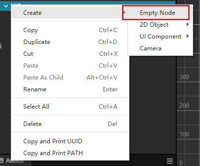
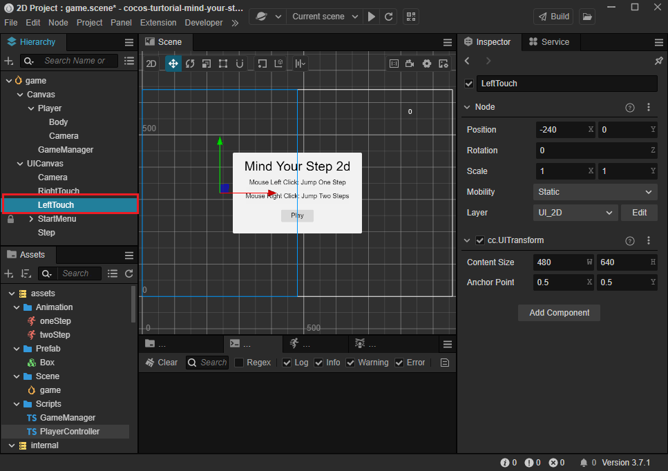
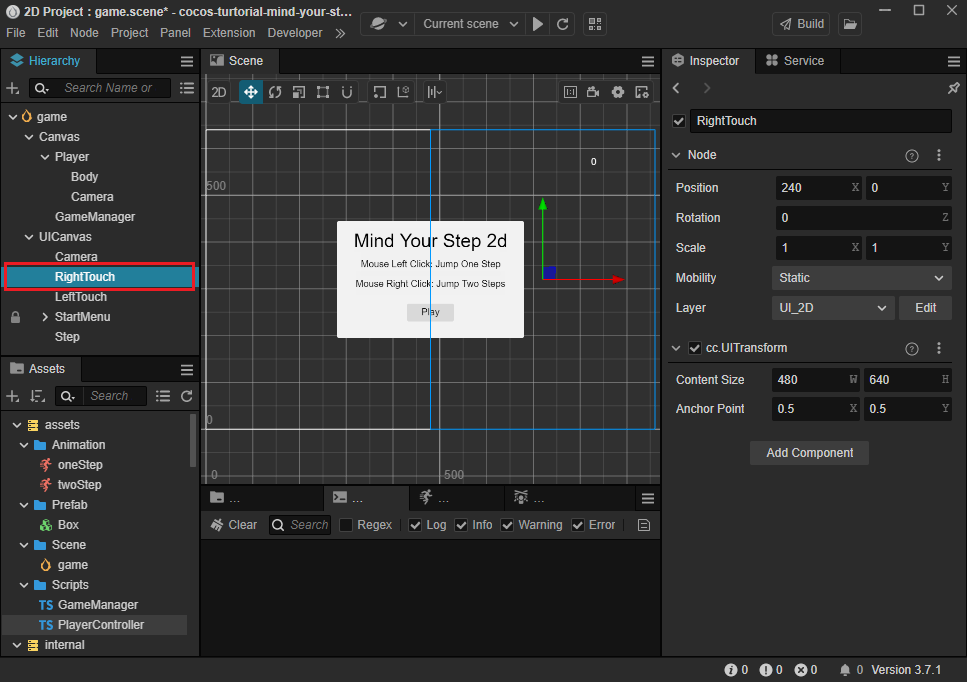
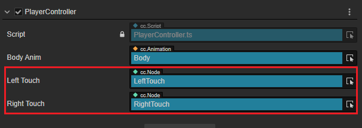
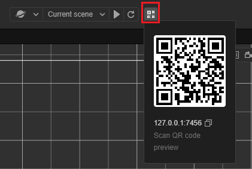

# Handle Touch Events

If we want our game to run on mobile devices, we need to handle touch events instead of mouse-clicked events, since the latter are only fired on PCs.

In Cocos Creator, we can handle touch events from the screen by listening to `Input.EventType.TOUCH_START` event.

There are two ways can be used.

- handle all touch events from the screen using`input.on`
- listen to touch events that occur within the content size of a node by using the `node.on` method

We partition the screen into two sides, when users touch the left side, the player moves one step, when they touch the right side, the player moves two steps. It's better to use `node.on` in this situation.

Next, let's take a look at how to accomplish it.

Under the `UICanvas` node, create two nodes and name them `LeftTouch` and `RightTouch`.



Set their positions and content size as shown below.





Back to `PlayerController`, add the following properties for referencing the touch nodes.

```ts
@property(Node)
leftTouch: Node = null;

@property(Node)
rightTouch: Node = null;
```

Select the `Player` node and then drag the nodes created before onto the corresponding properties added above.



In `PlayerController`, add the following code.

- Listen touch events:

    ```ts
    setInputActive(active: boolean) {
        if (active) {
            //for pc
            input.on(Input.EventType.MOUSE_UP, this.onMouseUp, this);
            //for mobile
            this.leftTouch.on(Input.EventType.TOUCH_START, this.onTouchStart, this);
            this.rightTouch.on(Input.EventType.TOUCH_START, this.onTouchStart, this);
        } else { 
            //for pc
            input.off(Input.EventType.MOUSE_UP, this.onMouseUp, this);
            //for mobile
            this.leftTouch.off(Input.EventType.TOUCH_START, this.onTouchStart, this);
            this.rightTouch.off(Input.EventType.TOUCH_START, this.onTouchStart, this);
        }
    }
    ```

- Add the method for handling touch events

    ```ts
    onTouchStart(event: EventTouch) {
        const target = event.target as Node;    
        if (target?.name == 'LeftTouch') {
            this.jumpByStep(1);
        } else {
            this.jumpByStep(2);
        }
    }
    ```

    `target` is of type  `any`, so we need to use `as` to convert it into the `Node` type.

    After obtaining the touched target node, we can determine whether it is touching on the left or right side based on its name.

Now, you can run the game on your phone by using the browser to scan the QR code on the Cocos Creator operation bar shown as below.

> **Note**: your computer running Cocos Creator and your mobile devices must be connected to the same LAN.



The complete code of `PlayerController` is shown below.

```ts
import { _decorator, Component, Vec3, EventMouse, input, Input, Animation, EventTouch, Node } from "cc";
const { ccclass, property } = _decorator;

export const BLOCK_SIZE = 40;

@ccclass("PlayerController")
export class PlayerController extends Component {

    @property(Animation)
    BodyAnim: Animation = null;

    private _startJump: boolean = false;
    private _jumpStep: number = 0;
    private _curJumpTime: number = 0;
    private _jumpTime: number = 0.3;
    private _curJumpSpeed: number = 0;
    private _curPos: Vec3 = new Vec3();
    private _deltaPos: Vec3 = new Vec3(0, 0, 0);
    private _targetPos: Vec3 = new Vec3();
    private _curMoveIndex = 0;

    @property(Node)
    leftTouch: Node = null;

    @property(Node)
    rightTouch: Node = null;

    start() {
        //input.on(Input.EventType.MOUSE_UP, this.onMouseUp, this);
    }

    setInputActive(active: boolean) {
        if (active) {
            input.on(Input.EventType.MOUSE_UP, this.onMouseUp, this);
            this.leftTouch.on(Input.EventType.TOUCH_START, this.onTouchStart, this);
            this.rightTouch.on(Input.EventType.TOUCH_START, this.onTouchStart, this);
        } else {
            input.off(Input.EventType.MOUSE_UP, this.onMouseUp, this);
            this.leftTouch.off(Input.EventType.TOUCH_START, this.onTouchStart, this);
            this.rightTouch.off(Input.EventType.TOUCH_START, this.onTouchStart, this);
        }
    }

    reset() {
        this._curMoveIndex = 0;
    }

    onTouchStart(event: EventTouch) {
        const target = event.target as Node;        
        if (target?.name == 'LeftTouch') {
            this.jumpByStep(1);
        } else {
            this.jumpByStep(2);
        }
    }

    onMouseUp(event: EventMouse) {
        if (event.getButton() === 0) {
            this.jumpByStep(1);
        } else if (event.getButton() === 2) {
            this.jumpByStep(2);
        }

    }

    jumpByStep(step: number) {
        if (this._startJump) {
            return;
        }
        this._startJump = true;
        this._jumpStep = step;
        this._curJumpTime = 0;

        const clipName = step == 1 ? 'oneStep' : 'twoStep';
        const state = this.BodyAnim.getState(clipName);
        this._jumpTime = state.duration;

        this._curJumpSpeed = this._jumpStep * BLOCK_SIZE / this._jumpTime;
        this.node.getPosition(this._curPos);
        Vec3.add(this._targetPos, this._curPos, new Vec3(this._jumpStep * BLOCK_SIZE, 0, 0));

        if (this.BodyAnim) {
            if (step === 1) {
                this.BodyAnim.play('oneStep');
            } else if (step === 2) {
                this.BodyAnim.play('twoStep');
            }
        }

        this._curMoveIndex += step;
    }


    onOnceJumpEnd() {
        this.node.emit('JumpEnd', this._curMoveIndex);
    }

    update(deltaTime: number) {
        if (this._startJump) {
            this._curJumpTime += deltaTime;
            if (this._curJumpTime > this._jumpTime) {
                // end
                this.node.setPosition(this._targetPos);
                this._startJump = false;
                this.onOnceJumpEnd();
            } else {
                // tween
                this.node.getPosition(this._curPos);
                this._deltaPos.x = this._curJumpSpeed * deltaTime;
                Vec3.add(this._curPos, this._curPos, this._deltaPos);
                this.node.setPosition(this._curPos);
            }
        }
    }
}
```
