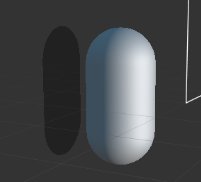

# Quick Start: Make Your First 3D Game (Advanced)

In this section, we will introduce to you how to use third-part assets such as animation, etc to complete the prototype we made in [Quick Start: Make Your First 3D Game](index.md)

## Lighting and Shadows

Lighting and shadows are important rendering features that describe the game. With light sources and shadows, we can simulate a more realistic game world, providing better immersion and immersion.

Next, we add a simple shadow to the character.

### Turn on shadows

1. Click the top `Scene` node in the **Hierarchy** panel, then in the **Inspector** panel check Enabled in `shadows` and modify the **Distance** and **Normal** properties to:

    

2. Click on the Body node under the Player node and set **ShadowCastingMode** to **ON** in the `cc.MeshRenderer` component.

    

At this point, you will see a shadow sheet in the **Scene Editor**. The preview will show that the shadow is not visible because it is directly behind the model, covered by the capsule.



### Adjusting lighting

By default, a **Main Light** node with `cc.DirectionalLight` component is added when creating a new scene. So to make the shadows appear in a different position, we can adjust the direction of this parallel light. Click in the **Hierarchy** panel to select the **Main Light** node and adjust the `Rotation` property to (-10, 17, 0).


The shadow effect can be seen by clicking on the preview at


## Adding a protagonist model

As an official tutorial, it's a bit shabby to use a capsule as the main character, so we spent (low) money (pre) to make the main character.

### Importing model resources

Importing models, materials, animations and other resources from the original sources is not the focus of this basic tutorial, so we will directly use the resources that have been imported into the project. Put **project** ([GitHub](https://github.com/cocos-creator/tutorial-mind-your-step-3d)  tutorial-mind-your-step-3d)) in the assets directory and copy the cocos folder to the assets directory of your own project.

### Adding to the scene

A Prefab named Cocos is already included in the Cocos file. Drag it to the Body node under the Player node in the **Hierarchy** panel as a child node of the Body node.


Also, remove the original capsule model from the **Inspector** panel:


You can add a Spotlight under the Cocos node to highlight its shiny head.


### Add jump animation

Now the preview shows that the main character will have a standby animation initially, but it will look very inconsistent to use this standby animation when jumping, so we can change it to a jump animation during jumping. Add a variable to the `PlayerController.ts` class that references the model animation:

```ts
@property({type: SkeletalAnimation})
public CocosAnim: SkeletalAnimation|null = null;
```

Also, since we have changed the protagonist from a capsule body to a character model, we can discard the animation previously created for the capsule body and comment on the relevant code as follows:

```ts
// @property({type: Animation})
// public BodyAnim: Animation|null = null;

jumpByStep(step: number) {
    // ...
    // if (this.BodyAnim) {
    //     if (step === 1) {
    //         this.BodyAnim.play('oneStep');
    //     } else if (step === 2) {
    //         this.BodyAnim.play('twoStep');
    //     }
    // }
}
```

Then in the **Hierarchy** panel drag and drop the Cocos node into the `CocosAnim` property box of the Player node:


Play the jump animation in the `jumpByStep` function of the `PlayerController` script:

```ts
jumpByStep(step: number) {
    if (this._startJump) {
        return;
    }
    this._startJump = true;
    this._jumpStep = step;
    this._curJumpTime = 0;
    this._curJumpSpeed = this._jumpStep / this._jumpTime;
    this.node.getPosition(this._curPos);
    Vec3.add(this._targetPos, this._curPos, new Vec3(this._jumpStep, 0, 0));

    if (this.CocosAnim) {
        this.CocosAnim.getState('cocos_anim_jump').speed = 3.5; // Jump animation time is relatively long, here to speed up the playback
        this.CocosAnim.play('cocos_anim_jump'); // Play jump animation
    }

    // if (this.BodyAnim) {
    //     if (step === 1) {
    //         this.BodyAnim.play('oneStep');
    //     } else if (step === 2) {
    //         this.BodyAnim.play('twoStep');
    //     }
    // }

    this._curMoveIndex += step;
}
```

Here `_jumpStep` time is 0.3 seconds, if the animation length and `_jumpStep` don't match, it may cause the following problem:

- The animation transition is not smooth when the animation is not finished yet
- or the animation is finished but the jump time is not yet up, resulting in slippage

One way to handle this is to recalculate the speed of the animation directly from the length of the animation clip and `_jumpStep` instead of using a constant: `_jumpStep`:

```ts
var state = this.CocosAnim.getState('cocos_anim_jump');            
state.speed = state.duration/this._jumpTime;
```

Developers can try it themselves, or manually modify `_jumpStep` and `speed` to the right values to control the game's pace.

In the `OnceJumpEnd` function of the `PlayerController` script, make the main character standby and play the standby animation.

```ts
onOnceJumpEnd() {
    if (this.CocosAnim) {
        this.CocosAnim.play('cocos_anim_idle');
    }
    this.node.emit('JumpEnd', this._curMoveIndex);
}
```

> **Note**: `onOnceJumpEnd` will be triggered when the jump is completed, see the `update` function in `PlayerController.ts` for details.
> 
The preview effect is as follows:


## Final Code

**PlayerController.ts**

```ts
import { _decorator, Component, Vec3, input, Input, EventMouse, Animation, SkeletalAnimation } from 'cc';
const { ccclass, property } = _decorator;

@ccclass("PlayerController")
export class PlayerController extends Component {

    @property({type: Animation})
    public BodyAnim: Animation|null = null;
    @property({type: SkeletalAnimation})
    public CocosAnim: SkeletalAnimation|null = null;

    // for fake tween
    private _startJump: boolean = false;
    private _jumpStep: number = 0;
    private _curJumpTime: number = 0;
    private _jumpTime: number = 0.3;
    private _curJumpSpeed: number = 0;
    private _curPos: Vec3 = new Vec3();
    private _deltaPos: Vec3 = new Vec3(0, 0, 0);
    private _targetPos: Vec3 = new Vec3();
    private _curMoveIndex = 0;

    start () {
    }

    reset() {
        this._curMoveIndex = 0;
    }

    setInputActive(active: boolean) {
        if (active) {
            input.on(Input.EventType.MOUSE_UP, this.onMouseUp, this);
        } else {
            input.off(Input.EventType.MOUSE_UP, this.onMouseUp, this);
        }
    }

    onMouseUp(event: EventMouse) {
        if (event.getButton() === 0) {
            this.jumpByStep(1);
        } else if (event.getButton() === 2) {
            this.jumpByStep(2);
        }

    }

    jumpByStep(step: number) {
        if (this._startJump) {
            return;
        }
        this._startJump = true;
        this._jumpStep = step;
        this._curJumpTime = 0;
        this._curJumpSpeed = this._jumpStep / this._jumpTime;
        this.node.getPosition(this._curPos);
        Vec3.add(this._targetPos, this._curPos, new Vec3(this._jumpStep, 0, 0));

        if (this.CocosAnim) {
            this.CocosAnim.getState('cocos_anim_jump').speed = 3.5; // Jump animation time is relatively long, here to speed up the playback
            this.CocosAnim.play('cocos_anim_jump'); // Play jump animation
        }

        // if (this.BodyAnim) {
        //     if (step === 1) {
        //         this.BodyAnim.play('oneStep');
        //     } else if (step === 2) {
        //         this.BodyAnim.play('twoStep');
        //     }
        // }

        this._curMoveIndex += step;
    }

    onOnceJumpEnd() {
        if (this.CocosAnim) {
            this.CocosAnim.play('cocos_anim_idle');
        }

        this.node.emit('JumpEnd', this._curMoveIndex);
    }

    update (deltaTime: number) {
        if (this._startJump) {
            this._curJumpTime += deltaTime;
            if (this._curJumpTime > this._jumpTime) {
                // end
                this.node.setPosition(this._targetPos);
                this._startJump = false;
                this.onOnceJumpEnd();
            } else {
                // tween
                this.node.getPosition(this._curPos);
                this._deltaPos.x = this._curJumpSpeed * deltaTime;
                Vec3.add(this._curPos, this._curPos, this._deltaPos);
                this.node.setPosition(this._curPos);
            }
        }
    }
}
```

**GameManager.ts**

```ts
import { _decorator, Component, Prefab, instantiate, Node, Label, CCInteger, Vec3 } from 'cc';
import { PlayerController } from "./PlayerController";
const { ccclass, property } = _decorator;

// The runway type, pit (BT_NONE) or solid road (BT_STONE)
enum BlockType{
    BT_NONE,
    BT_STONE,
};

enum GameState{
    GS_INIT,
    GS_PLAYING,
    GS_END,
};

@ccclass("GameManager")
export class GameManager extends Component {

    // The runway prefab
    @property({type: Prefab})
    public cubePrfb: Prefab | null = null;
    // Length of the road
    @property({type: CCInteger})
    public roadLength: Number = 50;
    private _road: BlockType[] = [];
    // Node of the start menu
    @property({type: Node})
    public startMenu: Node | null = null;
    // The reference of the PlayerController instance on the Player node
    @property({type: PlayerController})
    public playerCtrl: PlayerController | null = null;
    // Label to display the step
    @property({type: Label})
    public stepsLabel: Label | null = null!;

    start () {
        this.curState = GameState.GS_INIT;
        this.playerCtrl?.node.on('JumpEnd', this.onPlayerJumpEnd, this);
    }

    init() {
        // Active the start menu
        if (this.startMenu) {
            this.startMenu.active = true;
        }
        // Generate the runway
        this.generateRoad();
        if(this.playerCtrl){            
            // Disable user input
            this.playerCtrl.setInputActive(false);
            // Reset the player's position
            this.playerCtrl.node.setPosition(Vec3.ZERO);
            // Reset the steps
            this.playerCtrl.reset();
        }
    }

    set curState (value: GameState) {
        switch(value) {
            case GameState.GS_INIT:
                this.init();
                break;
            case GameState.GS_PLAYING: 
                if (this.startMenu) {
                    this.startMenu.active = false;
                }

                if (this.stepsLabel) {
                    this.stepsLabel.string = '0';   // Reset the number of steps to 0
                }
                // What happens is that the character already starts moving at the moment the game starts
                // Therefore, a delay is needed here
                setTimeout(() => { 
                    if (this.playerCtrl) {
                        this.playerCtrl.setInputActive(true);
                    }
                }, 0.1);
                break;
            case GameState.GS_END:
                break;
        }
    }

    generateRoad() {        
        // Prevent the track from being the old track when the game is restarted
        // Therefore, the old track needs to be removed and the old track data cleared
        this.node.removeAllChildren();
        this._road = [];
        // Make sure that the character is standing on the real road when the game is running
        this._road.push(BlockType.BT_STONE);

        // Determine the type of track for each frame
        for (let i = 1; i < this.roadLength; i++) {
            // If the last track is a pit, then this frame must not be a pit
            if (this._road[i-1] === BlockType.BT_NONE) {
                this._road.push(BlockType.BT_STONE);
            } else {
                this._road.push(Math.floor(Math.random() * 2));
            }
        }

        // Generate tracks based on track type
        let linkedBlocks = 0;
        for (let j = 0; j < this._road.length; j++) {
            if(this._road[j]) {
                ++linkedBlocks;
            }
            if(this._road[j] == 0) {
                if(linkedBlocks > 0) {
                    this.spawnBlockByCount(j - 1, linkedBlocks);
                    linkedBlocks = 0;
                }
            }        
            if(this._road.length == j + 1) {
                if(linkedBlocks > 0) {
                    this.spawnBlockByCount(j, linkedBlocks);
                    linkedBlocks = 0;
                }
            }
        }
    }

    spawnBlockByCount(lastPos: number, count: number) {
        let block: Node|null = this.spawnBlockByType(BlockType.BT_STONE);
        if(block) {
            this.node.addChild(block);
            block?.setScale(count, 1, 1);
            block?.setPosition(lastPos - (count - 1) * 0.5, -1.5, 0);
        }
    }
    spawnBlockByType(type: BlockType) {
        if (!this.cubePrfb) {
            return null;
        }

        let block: Node|null = null;
        switch(type) {
            case BlockType.BT_STONE:
                block = instantiate(this.cubePrfb);
                break;
        }

        return block;
    }

    onStartButtonClicked() {
        // To start the game by clicking the Play button
        this.curState = GameState.GS_PLAYING;
    }

    checkResult(moveIndex: number) {
        if (moveIndex < this.roadLength) {
            // Jumped on the pit
            if (this._road[moveIndex] == BlockType.BT_NONE) {
                this.curState = GameState.GS_INIT;
            }
        } else {    // Jumped over the maximum length
            this.curState = GameState.GS_INIT;
        }
    }

    onPlayerJumpEnd(moveIndex: number) {
        if (this.stepsLabel) {
            // Because in the last step there may be a jump with a large pace, but at this time, whether the jump is a large pace or a small pace should not increase the score more
            this.stepsLabel.string = '' + (moveIndex >= this.roadLength ? this.roadLength : moveIndex);
        }
        // Check the type of the currently falling road and get the result
        this.checkResult(moveIndex);
    }

    // update (deltaTime: number) {
    //     // Your update function goes here.
    // }
}
```

## Conclusion

Congratulations on completing your first game made with Cocos Creator! You can download the full project at [GitHub](https://github.com/cocos-creator/tutorial-mind-your-step-3d) to download the complete project. We hope this quick start tutorial will help you understand the basic concepts and workflow of the Cocos Creator game development process. If you are not interested in writing and learning to script, you can also copy the script directly from the finished project.

Next, you can continue to improve all aspects of the game, here are some recommended improvements:
- Add difficulty to the game, when the character stays in the same place for 1 second it is considered a failure
- Change the runway to infinite, dynamically delete the runway that has been run and extend the runway behind.
- Add game sound effects
- Add an end menu for the game, count the number of jumps and the time spent by the player
- Replace characters and runways with more beautiful resources
- Add some pickup items to guide the player to "make mistakes"
- Add some particle effects, such as trailing when the character is moving, dust when it hits the ground
- Add two buttons for touchscreen devices instead of left and right mouse buttons

In addition, if you want to publish your finished game to the server and share it with your friends, you can read the [Cross-Platform Game Publishing](../../editor/publish/index.md) section.
