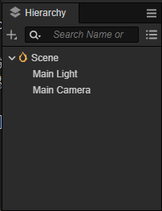
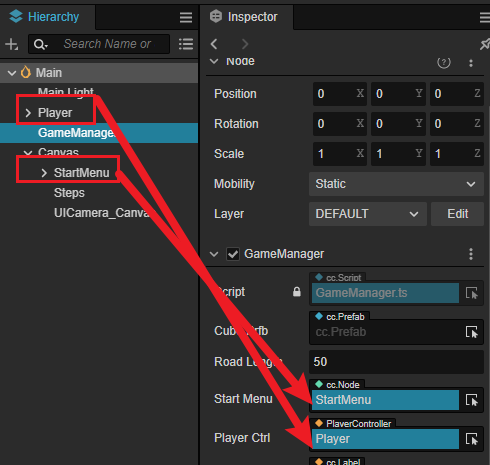

# Quick Start: Make Your First 3D Game

In this section, we will introduce you to some of the 3D features in Cocos Creator, and how to use them to make a simple but complete platform jump game.

The following tutorial shows a mini-game named "Mind Your Step". This game tests the user's reflexes, choosing whether to jump one step or two steps according to the road.

You can experience the finished form of the game at [here](https://gameall3d.github.io/MindYourStep_Tutorial/index.html).

## Add Player

A manipulable character is always needed for most games. Here we will make our main character in the game, Miss/Mr. Capsule.

For the sake of production, let's review a little here how nodes are created within the editor.



The**Hierarchy** panel will demonstrate all nodes in the scene, and you can create a new node right-clicking on the popup menu of the **Hierarchy** panel.

### Create Player Node

First, you need to create an empty Node named 'Player', and then create another Node named 'Body' to represent the character's model node. To make it simple, we use the built-in capsule model as our main character.


You may notice that our player is divided into two nodes, the advantage of the division is that when we move the Player node horizontally, this movement will not affect the vertical animation on the Body node(such as jump up and fall). The entire jump animation is combined with horizontal movement and vertical jump-fall animation.

Then place the Player node at (0, 0, 0), so that it can stand on the first block. The effect is as follows:


### Scripting the Main Character

To make a character move by mouse-events, one shall write some custom scripts. Don't worry even if you don't have any programming experience, we will provide all code and all you need to do is copy and paste all those codes to the right place. And of course, we will explain all the code provided to help you get started with Cocos Creator as soon as possible.

#### How to Create Script Components

1. If you haven't created the Scripts folder yet, first right-click on the **assets** folder in **Assets**, select the **Create -> Folder** menu to create a new fold, and rename it with 'Scripts';
2. Right-click on the Scripts folder, and select **Create -> Typescript -> New Component** on the popup menu to create a new TypeScript component. More references can be found on [official TypeScript](https://www.typescriptlang.org/).
3. Rename the created component to `PlayerController` and double-click on the script file to open any code editor(such as VSCode).

    

> **Note**: The script name in Cocos Creator is case-sensitive! If the capitalization is incorrect, you can't use the component based on its name.
>
> About renaming: If you enter the name of a component by mistake, you need to change the file name, class name, and decorator name to correct it. Therefore if you do not familiar with the whole operation, consider deleting the file and re-creating it.

#### Writing Script Code

Within the opened `PlayerController` script there is already some pre-set blocks for code, as follows:

```ts
import { _decorator, Component } from 'cc';
const { ccclass, property } = _decorator;

@ccclass("PlayerController")
export class PlayerController extends Component {
    /* class member could be defined like this */
    // dummy = '';

    /* use the `property` decorator if you want the member to be serializable */
    // @property
    // serializableDummy = 0;

    start () {
        // Your initialization goes here.
    }

    // update (deltaTime: number) {
    //     // Your update function goes here.
    // }
}
```

The above code demonstrates the necessary structure of a component(script). Any class that inherits from a `cc.Component` is called a Component and can be attached to any node in a scene to control the behavior of the node, for more details please refer to [Scripting](../../scripting/index.md).

Next, let's refine the `PlayerController` code so that the character can actually move.

#### Listening to the Input

We need to listen to the computer input(mouse, keyboard, or joystick, etc.) to manipulate the character in games, and in Cocos Creator, you can do this by listening to the `input` events.

```ts
input.on(Input.EventType.MOUSE_UP, this.onMouseUp, this);
```

The above code demonstrates use how we are listening to the mouse-up event(`MOUSE_UP`) of the Input-System(`input`), and when the mouse-up event is emitted, the `onMouseUp` in this script will be invoked.

Usually, we will put all the initial code in the `start` method of a Component to make sure the input events can listen correctly right after the initialization.

> The invocation of the `start` method indicates that the component has been properly initialized and you can use it with confidence.

So the following code could be seen.

```ts
import { _decorator, Component, input, Input, EventMouse } from 'cc';
const { ccclass, property } = _decorator;

@ccclass("PlayerController")
export class PlayerController extends Component {

    start () {
        // Your initialization goes here.
        input.on(Input.EventType.MOUSE_UP, this.onMouseUp, this);
    }

    onMouseUp(event: EventMouse) {
       

    }
}
```

#### Make Character Moves

To make our Player move, we have to add some additional properties to the Player to describe it. Think of some questions in the high school physics class about cubes or balls. Yes, indeed, we change the position, speed, and other factors to achieve a movable character in game development.

In the current game, we want to accomplish this behavior: the user presses the left/right mouse button -> determines that it is a displacement of one/two steps -> moves the character forward according to the input until it reaches the destination point.

So we could add a property to the script like the following:

```typescript
// Whether to receive the jump command
private _startJump: boolean = false;
```

With a boolean variable like `_startJump`, we can mark whether the current character is in the jump or not, to help us distinguish between different branching logic in the `update` method. Because obviously, we don't need to move the character when no input is received.

> Q: Why do we handle it in the `update` method?
>
> A: The `update` method will be invoked by the engine in a specific time interval. If the FPS of our game is 60 (60 renders per second), then the `update` method will be called 60 times per second. We can simulate realistic continuous behaviors by using `update` as much as possible.

So we can change the code as follows:

```typescript
import { _decorator, Component, input, Input, EventMouse } from 'cc';
const { ccclass, property } = _decorator;

@ccclass("PlayerController")
export class PlayerController extends Component {

    // Whether to receive the jump command
    private _startJump: boolean = false;
    // The jump step count
    private _jumpStep: number = 0;

    start () {
        // Your initialization goes here.
        input.on(Input.EventType.MOUSE_UP, this.onMouseUp, this);
    }

    onMouseUp(event: EventMouse) {
       

    }

    update(dt: number): void {
        if( this._startJump){ // Handle branching logic of jump

        }
    }
}
```

Good, here we have completed the main framework of our Player controller, so we just need to think about how to move the Player in the `update` method.

In Newtonian mechanics, we have learned that if an object is to move with uniform velocity, then its position must be like the following:

```math
P_1 = P_0 + v*t
```

In the other words, we can add the current position of the object plus the velocity multiplied by the time, when we can get the new position.

In our game, when the mouse button is pressed, the character will move directly 1 unit if the jump step is 1, and 2 units if the jump step is 2. So we can calculate the target position of the character (_targetPos) by using the following formula:

```
_targetPos = _curPos + step
```

It can be seen that the above formula contains three pieces of information: _targetPos、_curPos and step, so we record these properties in the script to use them in the `update` method.

Add those properties in the `PlayerController` component like the following:

```ts
// The jump step
private _jumpStep: number = 0;
// Current position of the character
private _curPos: Vec3 = new Vec3();
// The target position of the character
private _targetPos: Vec3 = new Vec3();
```

The code of `PlayerController` should look as follows:

```ts
import { _decorator, Component, input, Input, EventMouse, Vec3 } from 'cc';
const { ccclass, property } = _decorator;

@ccclass("PlayerController")
export class PlayerController extends Component {

    // Whether to receive the jump command
    private _startJump: boolean = false;
    // The jump step
    private _jumpStep: number = 0;
    // Current position of the character
    private _curPos: Vec3 = new Vec3();
    // The target position of the character
    private _targetPos: Vec3 = new Vec3();
    start () {
        // Your initialization goes here.
        input.on(Input.EventType.MOUSE_UP, this.onMouseUp, this);
    }

    onMouseUp(event: EventMouse) {
       

    }

    update(dt: number): void {
        if( this._startJump){

        }
    }
}
```

Our next mission is to accomplish how could we get that information by computerizing.

First of all, we should check whether the user has clicked the right mouse button or the left mouse button.

Those determinations can be made by getting the mouse button information in the `onMouseUp` method by using the `getButton` of `EventMouse`. In the `EventMouse` event, the `getButton` will return 0 if the left button is clicked, or 2 if the right button is clicked.

So let's extend the `onMouseUp` method as follows:

```ts
onMouseUp(event: EventMouse) {
    if (event.getButton() === 0) {
        
    }
    else if (event.getButton() === 2) {
        
    }
}
```

Add a new method `jumpByStep` to the `PlayerController` component to help us calculate the destination position and speed of the character. Since the input step maybe 1 or 2 steps, so we add a numeric parameter `step` to the `jumpByStep` method to achieve better reusability.

> Reusability? Such a concept sounds complicated!
> Don't stress, it's just some engineering jargon that we can ignore when we first learn it.
> This is just to explain more clearly why we added a method called `jumpByStep`.

So, the method looks like the follows:

```ts
jumpByStep(step: number) {
    
}
```

We use the `step` parameter to indicate the jump steps.

In our game, jumping(raise and fall) must be a complete step and we don't accept any input unless the jumping process is finished, so we use `_startJump` to ignore the character's input while jumping.

After that, we shall calculate how much is the character's velocity in the given time when it moves from its current position to the destination.

The calculating process looks like the follows:

1. Calculate current speed(_curJumpSpeed)
2. Calculate target position(_targetPos)

In order to exit the `if( this._startJump)` branch logic correctly, we have to remember the time to start the jump (_curJumpTime), because when this time has elapsed, we consider the whole jump process to be finished.

Now the `jumpByStep` method looks like follows:

```ts
jumpByStep(step: number) {
    if (this._startJump) {
        return;
    }
    this._startJump = true; // Whether to start to jump
    this._jumpStep = step; // Jump steps for this time
    this._curJumpTime = 0; // Reset the jump time
    this._curJumpSpeed = this._jumpStep / this._jumpTime; // Current jump step
    this.node.getPosition(this._curPos); // use 'getPosition` to get the current position of the character
    // target position = current position + steps
    Vec3.add(this._targetPos, this._curPos, new Vec3(this._jumpStep, 0, 0));  
}
```

- Q: What is `Vec3.add`?
    - `Vec3` is a 3D vector class in Cocos Creator, used to record and calculate 3D vectors.
    - `add` is a method in `Vec3` to add two 3D vectors, we can notice that there is no `this`, because `add` is a **static method**.
    - `Vec3.add(this._targetPos, this._curPos, new Vec3(this._jumpStep, 0, 0));` This code block indicate that we use the target position(`_targetPos`) to store the add result of current position(`_curPos`) and a new vector(`new Vec3(this._jumpStep, 0, 0)`) which represent the jump step on x axis.

Sure, we can simply move the character on the X-axis, but in reality, in 3D game development, objects may move along 3 different axes, and the more familiar you are with the usage of 3D vectors, the faster we can master the 3D engine.

At this moment, our code may look as follow:

```ts
import { _decorator, Component, input, Input, EventMouse, Vec3 } from 'cc';
const { ccclass, property } = _decorator;

@ccclass("PlayerController")
export class PlayerController extends Component {

    // Whether received jump command
    private _startJump: boolean = false;
    // The jump step count
    private _jumpStep: number = 0;
    // Current jump time
    private _curJumpTime: number = 0;
    // Total jump time
    private _jumpTime: number = 0.1;
    // current jump speed
    private _curJumpSpeed: number = 0;
    // current position of the
    private _curPos: Vec3 = new Vec3();
    // The difference of the current frame movement position during each jump
    private _deltaPos: Vec3 = new Vec3(0, 0, 0);
    // Target position of the character
    private _targetPos: Vec3 = new Vec3();
    
    start () {
        // Your initialization goes here.
        input.on(Input.EventType.MOUSE_UP, this.onMouseUp, this);
    }

    onMouseUp(event: EventMouse) {
        if (event.getButton() === 0) {
         
        }
        else if (event.getButton() === 2 ) {
         
        }
    }

    jumpByStep(step: number) {
        if (this._startJump) {
            return;
        }
        this._startJump = true;
        this._jumpStep = step;
        this._curJumpTime = 0;
        this._curJumpSpeed = this._jumpStep / this._jumpTime;
        this.node.getPosition(this._curPos);
        Vec3.add(this._targetPos, this._curPos, new Vec3(this._jumpStep, 0, 0));
    }


    update(dt: number): void {
        if( this._startJump){

        }
    }
}
```

Fascinating, now we have all the data required to calculate the character's manipulation, then we can move it in the `update` method.

Remember the Newton problem we talked about above? It's time to really solve this problem.

We need to first check if the entire jump duration (_curJumpTime) has exceeded our predefined time (_jumpTime).

The test here is simple: we have set _curJumpTime to 0 at input time, so `update` only needs to:

```
Jump time = last jump time + frame interval
```

The `update` method happens to provide a parameter like `deltaTime` as the frame interval.

So we just add `_curJumpTime` to `deltaTime` and that's it:

```ts
update (deltaTime: number) {
    if (this._startJump) {
        this._curJumpTime += deltaTime;        
    }
}
```

> You can see that we ues the '+=' operator, which is equivalent to `this._curJumpTime = this._curJumpTime + deltaTime`.

When `_curJumpTime` is greater than our pre-defined `_jumpTime`, this means that the jump is over, so we need two branches to handle the end-of-jump and in-jump states, respectively:

```ts
update (deltaTime: number) {
    if (this._startJump) {
        this._curJumpTime += deltaTime; 
        if (this._curJumpTime > this._jumpTime) { // Jump ends
            
            
        } else { // Jumping
                        
        }
    }
}
```

Finally, we refine their logic for the different branches: t

- End of jump: ends the jumping process, forcing the character to be displaced to the target position
- During the jump: moves the character forward according to the velocity

So our `update` method will look like this:

```ts
update (deltaTime: number) {
    if (this._startJump) {
        this._curJumpTime += deltaTime.
        if (this._curJumpTime > this._jumpTime) { // end of jump
            // end
            this.node.setPosition(this._targetPos); // force move to target position
            this._startJump = false; // mark the end of the jump
        } else { // jump in progress
            // tween
            this.node.getPosition(this._curPos); // Get the current position 
            this._deltaPos.x = this._curJumpSpeed * deltaTime; // calculate the length of this frame that should be displaced
            Vec3.add(this._curPos, this._curPos, this._deltaPos); // add the current position to the length of the displacement
            this.node.setPosition(this._curPos); // set the position after displacement
        }
    }
}
```

Great! You have completed the core of this game - character control.

If you still find this explanation a bit difficult, please let us know by clicking on [Get help and support](../support.md) and let us know.

#### Complete PlayerController

We already have the complete PlayerController code, so we just need to hook it up to a node to make it work.

If you still find it difficult, try copying and pasting the following code into the PlayerController.ts file in your project.

```ts
import { _decorator, Component, Vec3, input, Input, EventMouse, Animation } from 'cc';
const { ccclass, property } = _decorator;

@ccclass("PlayerController")
export class PlayerController extends Component {
    /* class member could be defined like this */
    // dummy = '';

    /* use the `property` decorator if you want the member to be serializable */
    // @property
    // serializableDummy = 0;

    // for fake tween
    // 是否接收到跳跃指令
    // Whether the jump command is received or not
    private _startJump: boolean = false.
    // Jump step length
    private _jumpStep: number = 0.
    // current jump time
    private _curJumpTime: number = 0.
    // length of each jump
    private _jumpTime: number = 0.1.
    // current jump speed
    private _curJumpSpeed: number = 0.
    // current character position
    private _curPos: Vec3 = new Vec3().
    // the difference in position of the current frame movement during each jump
    private _deltaPos: Vec3 = new Vec3(0, 0, 0).
    // target position of the character
    private _targetPos: Vec3 = new Vec3().

    start () {
        // Your initialization goes here.
        input.on(Input.EventType.MOUSE_UP, this.onMouseUp, this);
    }

    onMouseUp(event: EventMouse) {
        if (event.getButton() === 0) {
            this.jumpByStep(1);
        }
        else if (event.getButton() === 2) {
            this.jumpByStep(2);
        }

    }

    jumpByStep(step: number) {
        if (this._startJump) {
            return;
        }
        this._startJump = true;
        this._jumpStep = step;
        this._curJumpTime = 0;
        this._curJumpSpeed = this._jumpStep / this._jumpTime;
        this.node.getPosition(this._curPos);
        Vec3.add(this._targetPos, this._curPos, new Vec3(this._jumpStep, 0, 0));
    }

    update (deltaTime: number) {
        if (this._startJump) {
            this._curJumpTime += deltaTime;
            if (this._curJumpTime > this._jumpTime) {
                // end
                this.node.setPosition(this._targetPos);
                this._startJump = false;
            } else {
                // tween
                this.node.getPosition(this._curPos);
                this._deltaPos.x = this._curJumpSpeed * deltaTime;
                Vec3.add(this._curPos, this._curPos, this._deltaPos);
                this.node.setPosition(this._curPos);
            }
        }
    }
}
```

Now we can add the `PlayerController` component to the character node `Player`. Select the `Player` node on the **Hierarchy** panel, then click the **Add Component** button on the **Inspector** panel, and choose **Custom Script -> PlayerController** to add it to the `Player` node.


We have to adjust some parameters in case a object is visible at runtime, select the **Main Camera** node, and change its `Position` to (0, 0, 13), and `Color` to (50，90，255，255):


Then click the **Preview** button on the center of the top toolbar.


By clicking the left mouse button or right mouse button in the open browser, you may see the following screen:


For more preview functions, please refer to [Project Preview & Debugging](../../editor/preview/index.md).

## Add Character Animations

We could notice that the horizontal movement of the character is tedious from the result of the above execution. To make out character feel like jumping you could add a vertical animation. For more information about **Animation Editor**, please refer to [Animation System](../../animation/index.md).

1. Select the `Body` node in the scene, and then click the **Add Animation Clip** button in the **Animation Editor** at the bottom of the editor to create an animation clip and name it `onStep`.

    

2. Enter the animation edit mode, add a `position` property track to the created clip, and then add three keyframes, the position value of each should be (0, 0, 0), (0, 0.5, 0), (0, 0, 0);

    

    > **Note**: Alway remember to save animation clips when exiting animation mode, otherwise you work will be lost.

3. We can use **Assets Manager** to create clips. Right-click on the **Assets** panel to create a new animation clip named `twoStep`, and add it to the `Animation` property of the `Body` node. To make the recording process easier, we can adjust the layout of the editor.

    > **Note**: Please note that when the animation clip can not be dragged to the `Animation` property, please check the import section `import {...} from "cc"` in `PlayerController` contains `Animation`.

    

4. Enter the animation edit mode, select `twoStep` clip in the dropdown menu like step 2, then add three key-frames of the `Position` property which should be (0, 0, 0), (0, 1, 0), (0, 0, 0).

    

5. Import and reference the `Animation` component in the `PlayerController`, because we need to play different animation clips according to different steps.

    First, reference `Animation` component of the `Body` node to `PlayerController`.

    ```ts
    @property({type: Animation})
    public BodyAnim: Animation | null = null;
    ```

    Drag the `Body` node to the `Animation` property of the **Inspector** panel.

    

    Add the following code to the jump method `jumpByStep` to play animations.

    ```ts
    if (this.BodyAnim) {
        if (step === 1) {
            this.BodyAnim.play('oneStep');
        } else if (step === 2) {
            this.BodyAnim.play('twoStep');
        }
    }
    ```

6. Click the **Preview** button to see the new jump effect in the open browse by clicking the left or right mouse button.

    

## Runway upgrade

To make our game more interesting, we need a long runway for the Player to fleet on. Duplicating a lot of Cube nodes is obviously not a good idea, we can automatically create the runway by script.

### Game Manager

Typically, a scene contains various functions and different types of nodes, All those nodes stored in the scene could be taken as the most important data of our game. Occasionally we need to dynamically create, visit, and delete those nodes. Although we can find a node by `find` method in Cocos Creator, actually the `find` method has to enumerate all nodes in the scenes which will cause a low accuracy. In commercial development, we use some single components to manage **some kind of** nodes or **some** nodes data which we call **Manager**.

For example, in a game, we may have many characters, and we may have to create a new character, delete characters who are dead, or query the status of a character, in that case, we can create a class named `ActorManager` to manager all the characters and support the functions mentioned above.

In this game, we declare a new node component GameManager to manage all relevant nodes or data.

In this case, we put all functions, such as runway generation and deletion, in GameManager to make data collection more convenient.

This style of cohesion is very common in game development, do not be surprised when you see some other components such as ConfigManager or NetworkManager.

Of course, there are more complex structures in complex games. Those complex, tremendous conceptions of design can improve the stability and maintainability of our applications.

So let's go ahead and create such a manager.

### Create GamManager

1. Right-click on the **Hierarchy** panel to create a new node named `GameManager`.
2. Right-click in `assets/Scripts` folder on the **Assets** panel to create a TypeScript component named `GameManager`.
3. Add the `GameManager` component to the GameManager node.

### Create Prefabs

For nodes that need to be duplicated, we can save them to a [Prefab](../../asset/prefab.md) asset as a template of dynamic assets.

> Prefabs are a built-in asset type of the engine, the main purpose of which is to provide the possibility to instantiate some kind of node. Imagine if we had 1000 enemies in our game, creating them individually would take a lot of time, to solve this problem we could dynamically clone the prefabs 1000 times.

Drag the elementary Cube node to the **Assets** panel to create a Prefab.


### Add Automatic Runway Creation Code

The player needs a long runway, and the ideal way is to dynamically increase the length of the runway so that it can run forever. Here for convenience, firstly we generate a fixed-length runway, the runway length can be defined by yourself. In addition, we can generate some pits on the runway and GameOver when the Player jumps to the pits.

First, we need to define some constants to indicate whether the current coordinates represent a pit or a rock. In Typescript, this can be done with enumerations.

By using the keyword `enum` + the name of the enumeration we define the following enumeration, where `BT_NONE` represents a pit and `BT_STONE` represents a walkable surface.

```typescript
enum BlockType{
    BT_NONE,
    BT_STONE, 
};
```

Again, we need to define which prefabricated body or bodies the game manager will use to create the map.

```ts
// The runway prefab
@property({type: Prefab})
public cubePrfb: Prefab | null = null;
```

The editor will recognize `@property({type: Prefab})` as a prefab so that we can assign the Cube prefab to this property in the **Inspector** panel.

> A syntax like `@property` is called a [Decorator](../../scripting/decorator.md). There is various type of decorators in Cocos Creator that can use it to customize various effect to decorate custom components.

To make it easier to quickly find out whether the current location is a Cube or a pit, we describe the entire track using an array

```ts
_road: BlockType[] = [];
```

Thus a basic GameManager is defined, which should look like this:

```ts
import { _decorator, Component, Prefab } from 'cc';
const { ccclass, property } = _decorator;

// Track grid type, pit (BT_NONE) or solid road (BT_STONE)
enum BlockType {
    BT_NONE,
    BT_STONE,
};

@ccclass("GameManager")
export class GameManager extends Component {

    // The runway prefab
    @property({type: Prefab})
    public cubePrfb: Prefab | null = null;
    // Total road length
    @property
    public roadLength = 50;
    private _road: BlockType[] = [];

    start () {
        this.generateRoad();
    }

    generateRoad() {
  
    }
}
```

Then we generate the entire runway by the following principles.

- The first location on the runway must be BT_STONE to make sure the player won't drop at the beginning of the game.
- After the first position, we will generate a cube or a pit at random. Considering our character's poor jumping ability (up to 2 steps), we can't generate 2 or move pits continuously, so when we generate a new location, we should examine whether the previous location is a rock or a pit, and if it is a pit, we must put a rock in the current location.
- Based on the above two principles, we save the generated block to the `_road` array to quickly query whether a location is a rock or a pit.
- Finally, we instantiate the whole road into the scene based on the road information `_road` to accomplish the whole map.

Thus the method `generateRoad` for generating the map is as follows:

```ts
generateRoad() {
    // Prevent the track from being the old track when the game is restarted
    // Therefore, the old track needs to be removed and the old track data cleared
    this.node.removeAllChildren();
    this._road = [];
    // Make sure that the character is standing on the real road when the game is running
    this._road.push(BlockType.BT_STONE);

    // Determine the type of track for each frame
    for (let i = 1; i < this.roadLength; i++) {
        // If the previous track is a pit, then this one must not be a pit
        if (this._road[i-1] === BlockType.BT_NONE) {
            this._road.push(BlockType.BT_STONE);
        } else {
            this._road.push(Math.floor(Math.random() * 2));
        }
    }

    // Generate tracks based on runway
    for (let j = 0; j < this._road.length; j++) {
        let block: Node = this.spawnBlockByType(this._road[j]);
        // Determine if a road was generated, as spawnBlockByType may return a pit (with a value of null)
        if (block) {
            this.node.addChild(block);
            block.setPosition(j, -1.5, 0);
        }
    }
}
```

> `Math.floor`: This method is one of the methods of the Typescript math library: we know that floor means floor, and this means taking the "floor" of this method argument, i.e. rounding down.
> `Math.random`: Again random is one of the methods of the standard math library, and is used to randomize a decimal number between 0 and 1, note that the range of values is [0, 1).
> So `Math.floor(Math.random() * 2)` means simply that it takes a random number from [0, 2) and rounds down to 0 or 1, which corresponds to the `BT_NONE` and `BT_STONE` declared in the enumeration `BlockType`.
> By the way, in Typescript enumerations, if you don't assign a value to the enumeration, then the enumeration values are assigned sequentially starting from 0.

The method `spawnBlockByType` for generating a stone is as follows:

```ts
spawnBlockByType(type: BlockType) {
    if (!this.cubePrfb) {
        return null;
    }

    let block: Node | null = null;
    // The runway is generated only for real roads
    switch(type) {
        case BlockType.BT_STONE:
            block = instantiate(this.cubePrfb);
            break;
    }

    return block;
}
```

We can notice that when the block type is Stone, we will use the `instantiate` method to clone a new Prefab, on the other hand, if the block type is not Stone, we don't do anything.

> `instantiate` is the method for cloning a Prefab in Cocos Creator. You can use it to clone not only Prefab but also clone other types of objects!

The entire code of `GameManager` is as follows:

```ts
import { _decorator, Component, Prefab, instantiate, Node, CCInteger } from 'cc';
const { ccclass, property } = _decorator;

// The runway type, pit (BT_NONE) or solid road (BT_STONE)
enum BlockType {
    BT_NONE,
    BT_STONE,
};

@ccclass("GameManager")
export class GameManager extends Component {

    // The stone prefab
    @property({type: Prefab})
    public cubePrfb: Prefab | null = null;
    // Length of the runway
    @property
    public roadLength = 50;
    private _road: BlockType[] = [];

    start () {
        this.generateRoad();
    }

    generateRoad() {
        // Prevent the track from being the old track when the game is restarted
        // Therefore, the old track needs to be removed and the old track data cleared
        this.node.removeAllChildren();
        this._road = [];
        // Make sure that the character is standing on the real road when the game is running
        this._road.push(BlockType.BT_STONE);

        // Determine the type of track for each frame
        for (let i = 1; i < this.roadLength; i++) {
            // If the previous track is a pit, then this one must not be a pit
            if (this._road[i-1] === BlockType.BT_NONE) {
                this._road.push(BlockType.BT_STONE);
            } else {
                this._road.push(Math.floor(Math.random() * 2));
            }
        }

        // Generate tracks based on runway
        for (let j = 0; j < this._road.length; j++) {
            let block: Node = this.spawnBlockByType(this._road[j]);
            // Determine if a road was generated, as spawnBlockByType may return a pit (with a value of null)
            if (block) {
                this.node.addChild(block);
                block.setPosition(j, -1.5, 0);
            }
        }
    }

    spawnBlockByType(type: BlockType) {
        if (!this.cubePrfb) {
            return null;
        }

        let block: Node | null = null;
        // The runway is generated only for real roads
        switch(type) {
            case BlockType.BT_STONE:
                block = instantiate(this.cubePrfb);
                break;
        }

        return block;
    }

    // update (deltaTime: number) {
    //     // Your update function goes here.
    // }
}
```

Drag the pre-made Cube prefab on to **CubePrfb** property of the **Inspector** panel.


You can change the **roadLength** property of the **Inspector** panel to control the length of the runway.

Now, click the **Preview** button to see the automatically created runway in the open browser.

## Follow the Camera

We can notice that the Camera does not follow the Player node, hence we can not see the runway behind it. We can avoid this situation by making the camera a child node of Player.


Thus the Camera will follow the Player's movement, now by clicking the **Preview** button, we can watch the whole runway.

## Add a Start Menu

The User Interface(UI) is an essential part of a game, developers can inform users of some key information such as data, status, etc so that the user can have their strategy. We could also add the game name, an introduction, the production staff, and other information.

Please refer to relevant documents such as [2D/UI](. /. /2d-object/index.md) to help understand the mechanics of the UI as a 2D part.

Then we will describe a UI workflow taking the Start Menu as an example.

1. Create a new Button node in the **Hierarchy** panel and rename it PlayButton

    

    It can be noticed that the engine automatically creates a Canvas node in the **Hierarchy** panel, a Player button node, and a Label node. That is because any node that contains a UI component only be seen when it is under the `Canvas` node, so the editor will create a Canvas in case there is none.

    Change the **String** property of the `cc.Label` component in the Label Node from Button to Play.

    > You may notice that the version of Cocos Creator you are using automatically adds a new Camera node when creating a UI node
    > This node is a new feature in Cocos Creator. The new Camera will be in charge of the UI/2D parts, therefore the engine's render pipeline can process the UI/2D content more efficiently.

2. Create an empty node named StartMenu under the Canvas node, and drag the PlayerButton under it. We can switch to a 2D editing view for editing UI by clicking the 2D/3D button on the scene's toolbar. For more details on scene editing,  please refer to [Scene Panel](../../editor/scene/index.md)。

    

3. Create a new Sprite node named `BG` under the `StartMenu` as a background image, and drag it above on the PlayButton.

    

    Then set the `ContentSize` property of `cc.UITransform` component to (200, 200) on the **Inspector** panel, and drag the `internal/default_ui/default_sprite_splash` asset to its **SpriteFrame** property.

    

4. Create a Label node named Title beneath the StartMenu node on the **Hierarchy** panel, and use it as the title of the start menu.

    

5. Adjust other properties of the Title node such as on `Position`, `Color`, `String`, `FontSize`, etc on the **Inspector** panel by the following image:

    

6. Once the required Tips nodes are added and the PlayButton is adjusted, a simple start menu is complete.

    

## Add Game States

For most games, we can roughly break it down into 3 different states: initialize, play, and settle. Just like in any board game, the process of placing the pieces is called initialization; the process of playing is called playing; and the final state when the two players finish the game to settle the victory/failure is called the settlement state.

In the same way, we can define the game state by using an enumeration.

```ts
enum GameState{
    GS_INIT,
    GS_PLAYING,
    GS_END,
};
```

- GS_INIT(initialize): Show the game menu and initialize some resources.
- GS_PLAYING(play): Hide the game menu, and the user can start to control the character.
- GS_END(end): End the game and show the start menu.

The current game state can be easily informed by reading the `GameState` enumeration, and we can handle some logic when the state changes.

In order to allow the user to control the character in the play state rather than the game initialize, we have to enable/disable listening to the mouse automatically. So modify the `PlayerController` script as follows:


```ts
start () {
    // Your initialization goes here.
    // input.on(Input.EventType.MOUSE_UP, this.onMouseUp, this);
}

setInputActive(active: boolean) {
    if (active) {
        input.on(Input.EventType.MOUSE_UP, this.onMouseUp, this);
    } else {
        input.off(Input.EventType.MOUSE_UP, this.onMouseUp, this);
    }
}
```

And reference the `PlayerController` script in the `GameManager` script.

```ts
@property({type: PlayerController})
public playerCtrl: PlayerController | null = null;
```

Back to the editor after saving the scripts, and drag the Player node that attached a `PlayerController` script to the `playerCtrl` property of the GameManager Node on the **Inspector** panel.

Meanwhile, we need to reference the StartMenu node in the `GameManager` script to dynamically enable/disable the start menu.

```ts
@property({type: Node})
public startMenu: Node | null = null;
```

Return to the editor after saving all scripts and drag the StartMenu node to the `startMenu` property of the GameManager node on the **Inspector** panel.



### Add State Change Code

Add the switch state code to the GameManager script, and add the initialization code to the `start` method.

```ts
start () {
    this.curState = GameState.GS_INIT;
}

init() {
    // Active start menu
    if (this.startMenu) {
        this.startMenu.active = true;
    }
    // Generate the runway
    this.generateRoad();
    if(this.playerCtrl){
        // Disable user input
        this.playerCtrl.setInputActive(false);
        // Reset the player's position
        this.playerCtrl.node.setPosition(Vec3.ZERO);
    }
}

set curState (value: GameState) {
    switch(value) {
        case GameState.GS_INIT:
            this.init();
            break;
        case GameState.GS_PLAYING:
            if (this.startMenu) {
                this.startMenu.active = false;
            }
            // When active is set to true, it will start listening for mouse events directly, while mouse up events are not yet dispatched
            // What will happen is that the character will start moving the moment the game starts
            // Therefore, a delay is needed here
            setTimeout(() => {
                if (this.playerCtrl) {
                    this.playerCtrl.setInputActive(true);
                }
            }, 0.1);
            break;
        case GameState.GS_END:
            break;
    }
}
```

Here we can see in the newly added `init` method, it initializes the runway, activates the start menu, and disable user input at the same time. In any case, we will invoke this method when the game state changes to `GS_INIT`.

And for the first time, accessors like `set curState` allow us to be more secure when setting the game state.

### Add an Event Listener to the Play Button

In order to start the game immediately after clicking the Play button, we need to listen to its click event. Add the following response code in the `GameManager` script as a means to enter the Playing state after the user clicked the button.

```ts
onStartButtonClicked() {
    this.curState = GameState.GS_PLAYING;
}
```

Then select the PlayButton node in the **Hierarchy** panel, add a response method to the `cc.Button` component in the **Inspector** panel, and drag the GameManager node into the `cc.Node` property.


Here we can notice the element [0] of Click Events is divided into three parts, which are:
1. Node: Here we drag and drop the GameManager node, which means that the button event will be dispatched to the GameManager node
2. Component: after dragging the GameManager node, you can select the node on the GameManager through the drop-down, here select the component with the same name `GameManager`.
3. Event: through the drop-down menu, select the response event of the button, here you have to select the `onStartButtonClicked` method added above as the response of **button clicked**

> **Note**: The above three steps must be performed in strict order of 1->2->3.

Now, by clicking the **Preview** button, we can start the game.

## Add Game Over Logic

Currently, the game character just runs forward dully, we need to add game rules to make it more challenging to run.

1. The character needs to send a message at the end of each jump and send a message with its current position as a parameter, and record how many steps it has jumped in the `PlayerController` script:

    ```ts
    private _curMoveIndex = 0;
    // ...
    jumpByStep(step: number) {
        // ...

        this._curMoveIndex += step;
    }
    ```

    And at the end of each jump sends the message:

    ```ts
    onOnceJumpEnd() {
        this.node.emit('JumpEnd', this._curMoveIndex);
    }
    ```

2. Listen for end-of-character jump events in the `GameManager` script, and determine the winner according to the rules, adding a failure and end judgment, and ending if the jump reaches an empty block or exceeds the maximum length value:

    ```ts
    checkResult(moveIndex: number) {
        if (moveIndex < this.roadLength) {
            // Jumped on the pit
            if (this._road[moveIndex] == BlockType.BT_NONE) {
                this.curState = GameState.GS_INIT;
            }
        } else {    // Skipped maximum length
            this.curState = GameState.GS_INIT;
        }
    }
    ```

    Listens for role jump messages and calls the judgment function:

    ```ts
    start () {
        this.curState = GameState.GS_INIT;
        // '?.' is Typescript's optional chain writing
        // The equivalent of: 
        // if(this.playerCtrl ! = null) this.playerCtrl.node.on('JumpEnd', this.onPlayerJumpEnd, this).        
        // Optional chains are written in a more concise way
        this.playerCtrl?.node.on('JumpEnd', this.onPlayerJumpEnd, this);        
    }

    // ...
    onPlayerJumpEnd(moveIndex: number) {
        this.checkResult(moveIndex);
    }
    ```

    If you preview the game at this point, you will find that there is an error of judgment when restarting the game, which is caused by not resetting the value of the `_curMoveIndex` property in `PlayerController.ts` when restarting. So we need to add a `reset` function to the `PlayerController` script:

    ```ts
    reset() {
        this._curMoveIndex = 0;
    }
    ```

    Then call `reset` in the `init` function of the `GameManager` script to reset the `_curMoveIndex` property in the `PlayerController.ts`.

    ```ts
    init() {
        // ...
        this.playerCtrl.reset();
    }
    ```

## Step Count Display

We can display the current number of steps on the interface so that it will be a great sense of accomplishment to watch the number of steps growing during the jump.

1. Create a new Label node named Steps under Canvas and adjust the position, font size and other properties.

    

2. Reference this Label in the `GameManager` script:

    ```ts
    @property({type: Label})
    public stepsLabel: Label | null = null;
    ```

   After saving the script and returning to the editor, drag the Steps node into the GameManager's stepsLabel property box in the properties inspector at

   

3. Update the current step count data to the Steps node. Since we don't have an end screen now, we will jump back to the start screen when the game is over, so we need to see the last jump in the start screen, so we need to reset the step count to 0 when we enter the Playing state.

    ```ts
    // GameManager.ts
    set curState (value: GameState) {
        switch(value) {
            case GameState.GS_INIT:
                this.init();
                break;
            case GameState.GS_PLAYING:
                if (this.startMenu) {
                    this.startMenu.active = false;
                }

                if (this.stepsLabel) {
                    this.stepsLabel.string = '0';   // Reset the number of steps to 0
                }
                setTimeout(() => {      // Directly set active will start listening to mouse events directly, here the delay is done
                    if (this.playerCtrl) {
                        this.playerCtrl.setInputActive(true);
                    }
                }, 0.1);
                break;
            case GameState.GS_END:
                break;
        }
    }
    ```

    Then, in the function `onPlayerJumpEnd`, which response to the character jump, the number of steps is updated to the Label control

    ```ts
    onPlayerJumpEnd(moveIndex: number) {
        if (this.stepsLabel) {
            // Because in the last step there may be a jump with a large pace, but at this time, whether the jump is a large pace or a small pace should not increase the score more
            this.stepsLabel.string = '' + (moveIndex >= this.roadLength ? this.roadLength : moveIndex);
        }
        this.checkResult(moveIndex);
    }
    ```

## Conclusion

Up to this point, you have basically mastered most of the contents of this chapter, next you can improve the game by improving the art and gameplay, for which we have also prepared an [advanced](. /advance.md) chapter as an option. If you are interested in other features of our engine, you can click on the summary on the left.

If you have any feedback or suggestions, you can visit our [forum](https://forum.cocos.org/) or request a question on [GIT](https://github.com/cocos/cocos-docs).
