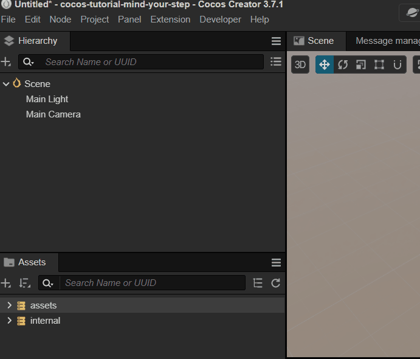
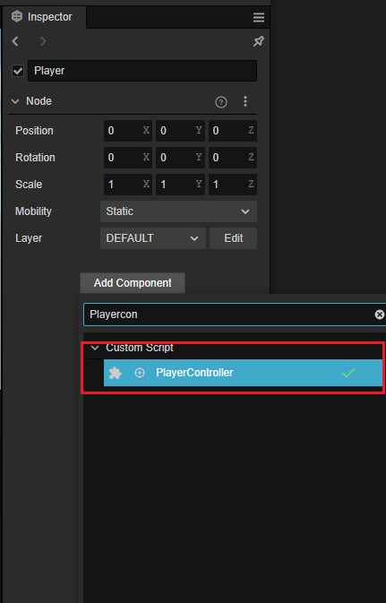
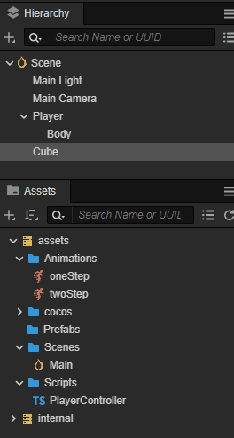
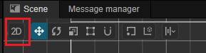

# Quick start: making your first game.

The power of the __Cocos Creator__ editor is that it allows developers to quickly prototype games.

Let's follow a guided tutorial to make a magical game named **Mind Your Step**. This game tests the player's reaction ability, and chooses whether to jump one step or two steps according to traffic conditions.

You can try out the completed the game [here](https://gameall3d.github.io/MindYourStep_Tutorial/index.html).


## New Project

If you still don’t know how to download and run __Cocos Creator__, please review the [Installation and Starting](../install/index.md) documentation.

To start a new project:

1. Start __Cocos Creator__ and then create a new project named **MindYourStep**. If you don’t know how to create a project, please read the [Hello World!](../helloworld/index.md) documentation.

2. After creating a new project, you should see the following editor interface:

    

## Creating a game scene

In __Cocos Creator__, **Scene** is the center for organizing game content during development and the container for presenting all game content to players. The game scene will generally include the following components:

  - Scene objects
  - Roles
  - User interface elements
  - Game logic, in the form of __scripts__, attached to __Scene__ __Nodes__ as __Components__

When the player runs the game, the game scene will be loaded. After the game scene is loaded, scripts of the included components will be automatically run. Apart from __assets__, game scenes are the foundation of all content creation. Now, to create a new __Scene__:

1. In the __Asset__ panel, click to select the __assets__ directory, click the __+__ button in the upper left corner, select the folder, and name it __Scenes__. Example:

    

2. Click the __Scenes__ directory first (the following pictures create some common folders in advance), click the right mouse button, and select __Scene Files__ from the pop-up menu. Example:

    

3. We created a __Scene__ file named __New Scene__. After the creation, the name of the scene file __New Scene__ will be in the edit state. Rename it from __New Scene__ to __Main__.

4. Double-click __Main__ to open this __Scene__ in __Scene__ panel and __Hierarchy__ panel.

## Adding a road

Our main character needs to run from left to right on a road composed of cubes (blocks). Let's make the road by using a built-in cube.

1. Right click on __Scene Node__ in the **Hierarchy** panel, then choose __Create -> 3D Object -> Cube__

    

2. Clone the cube to make two more cube with the shortcut key __Ctrl+D__.

3. Assign the __Cubes__ each a unique position:
    - First one at position __(0, -1.5, 0)__.
    - Second one at position __(1, -1.5, 0)__.
    - Third one at position __(2, -1.5, 0)__.

    The result is as follows:

    

## Add a main character

### Create a main character node

__First__, create an empty node named `Player`.

__Second__, create a __Model Component__ named `Body` under the `Player` node. For convenience, let's use the built-in __Capsule__ model as the body of our main character.



The advantage of being divided into two nodes is that we can use the script to control the `Player` node to move the main character in the horizontal direction, and do some vertical animations on the `Body` node (such as falling after jumping in place), the two are superimposed to form a jumping animation.

__Third__, set the `Player` node to the `(0, 0, 0)` position so that it can stand on the first square.

The effect is as follows:


### Writing a script for the main character

It is necessary for the main character to be affected when the mouse moves. To do this a custom script needs to be written.

#### Creating a script

1. If you have not yet created a `Scripts` folder, right-click the **assets** folder in the __Assets__ panel, select **New -> Folder**, and rename the newly created folder to `Scripts`.
2. Right-click the `Scripts` folder and select **New -> TypeScript** to create a new, blank __TypeScript__ script. For __TypeScript__ information, you can view the [TypeScript Official Website](https://www.typescriptlang.org/).
3. Change the name of the newly created script to `PlayerController` and the double-click the script to open the code editor (in, for example, __VSCode__).

    

    > **Note**: the name of the script in __Cocos Creator 3.0__ is the name of the component. This name is case sensitive! If the capitalization of the component name is incorrect, the component cannot be used correctly by the name!

#### Writing script code

There are already some pre-set code blocks in the `PlayerController` script. Example:

```ts
import { _decorator, Component } from 'cc';
const { ccclass, property } = _decorator;

@ccclass("PlayerController")
export class PlayerController extends Component {
    /* class member could be defined like this */
    // dummy = '';

    /* use `property` decorator if your want the member to be serializable */
    // @property
    // serializableDummy = 0;

    start () {
        // Your initialization goes here.
    }

    // update (deltaTime: number) {
    //     // Your update function goes here.
    // }
}
```

This code is the structure needed to write a __component__. Scripts with this structure are **Components in Cocos Creator**. They can be attached to nodes in a __Scene__ and provide various functionality for controlling nodes. For detailed information review the [Script](../../scripting/index.md) documentation.

Monitoring of mouse events needs to be added in the script to let the `Player` node move. Modify the code in `PlayerController` as follows:

```ts
import { _decorator, Component, Vec3, input, Input, EventMouse, Animation } from 'cc';
const { ccclass, property } = _decorator;

@ccclass("PlayerController")
export class PlayerController extends Component {
    /* class member could be defined like this */
    // dummy = '';

    /* use `property` decorator if your want the member to be serializable */
    // @property
    // serializableDummy = 0;

    // for fake tween
    private _startJump: boolean = false;
    private _jumpStep: number = 0;
    private _curJumpTime: number = 0;
    private _jumpTime: number = 0.1;
    private _curJumpSpeed: number = 0;
    private _curPos: Vec3 = new Vec3();
    private _deltaPos: Vec3 = new Vec3(0, 0, 0);
    private _targetPos: Vec3 = new Vec3();
    private _isMoving = false;

    start () {
        // Your initialization goes here.
        input.on(Input.EventType.MOUSE_UP, this.onMouseUp, this);
    }

    onMouseUp(event: EventMouse) {
        if (event.getButton() === 0) {
            this.jumpByStep(1);
        } else if (event.getButton() === 2) {
            this.jumpByStep(2);
        }

    }

    jumpByStep(step: number) {
        if (this._isMoving) {
            return;
        }
        this._startJump = true;
        this._jumpStep = step;
        this._curJumpTime = 0;
        this._curJumpSpeed = this._jumpStep / this._jumpTime;
        this.node.getPosition(this._curPos);
        Vec3.add(this._targetPos, this._curPos, new Vec3(this._jumpStep, 0, 0));

        this._isMoving = true;
    }

    onOnceJumpEnd() {
        this._isMoving = false;
    }

    update (deltaTime: number) {
        if (this._startJump) {
            this._curJumpTime += deltaTime;
            if (this._curJumpTime > this._jumpTime) {
                // end
                this.node.setPosition(this._targetPos);
                this._startJump = false;
                this.onOnceJumpEnd();
            } else {
                // tween
                this.node.getPosition(this._curPos);
                this._deltaPos.x = this._curJumpSpeed * deltaTime;
                Vec3.add(this._curPos, this._curPos, this._deltaPos);
                this.node.setPosition(this._curPos);
            }
        }
    }
}
```

__Next__, attach the `PlayerController` component to the `Player` node. Select the `Player` node in the **Hierarchy** panel, then click the **Add Component** button in the **Inspector** panel, select **Custom Script Component- > PlayerController** to the `Player` node to add the `PlayerController` component.



In-order to see the object at runtime, we need to adjust some parameters of the __Camera__ in the scene, set the __position__ to __(0, 0, 13)__, and set the __ClearColor__ to __(50, 90, 255, 255)__:


When the scene is finished editing, you can use the menu **File** -> **Save Scene** or use the shortcut keys(<kbd>Ctrl/Cmd</kbd> + <kbd>S</kbd>) to save the scene. For example, when running on the browser, the preview page on the browser will be refreshed automatically after saving the scene.

__Now__, click the __Play__ button. Once running, click the left and right mouse buttons on the opened web page, you can see the following screen:


For additional details please refer to the [Project Preview Debugging](../../editor/preview/index.md) documentation.

### Adding character animations

The `Player` can be moved in a horizontal direction. This is a start, but not good enough. `Player` must become more life-like. This effect can be achieved by adding a vertical animation to the character.

> **Note**: before proceeding, please read the [Animation Editor](../../animation/index.md) documentation.

After reading and understanding the capabilities of the __Animation Editor__ character animations can be implemented!

1. Locate the __Animation__ panel, at the bottom of the editor alongside the __Assets Preview__ and the __Console__ panels. Select the `Body` node in the __Scene__ and click to add an __Animation Component__ and then click again tp create a new __Animation Clip__. Give this new __Animation Clip__ a name of `oneStep`.

    

2. Enter __animation editing mode__ in-order to add the __position attribute__. Next, add three __key frames__ with position values ​​of __(0, 0, 0)__, __(0, 0.5, 0)__, __(0, 0, 0)__.

    

    > **Note**: remember to save the animation before exiting the animation editing mode, otherwise the animation will be lost.

3. __Animation Clips__ can also be created using the __Asset__ panel. Next, Create a __Clip__ named `twoStep` and add it to the __Animation__ component on `Body`.

    

    > **Note**: the panel layout was adjusted for recording convenience.

4. Enter the __animation editing mode__, select and edit the `twoStep` clip. Similar to the second step, add three key frames at positions __(0, 0, 0)__, __(0, 1, 0)__, __(0, 0, 0)__.

    

5. Reference the __Animation__ component in the` PlayerController` Component, as different animations need to be played according to the number of steps `Player` jumped.

    First, reference the __Animation__ component on the `Body` in the `PlayerController` component.

    ```ts
    @property({type: Animation})
    public BodyAnim: Animation|null = null;
    ```

    Note that the import of 'Animation' needs to be added in the 'import' section of the file. The code example is as follows:

    ```ts
    import { Animation } from "cc";
    ```

    Then in the **Inspector** panel, drag the `Animation` to the `Body` variable.

    

    Add the animation playback code to the jump function `jumpByStep`:

    ```ts
    if (this.BodyAnim) {
        if (step === 1) {
            this.BodyAnim.play('oneStep');
        } else if (step === 2) {
            this.BodyAnim.play('twoStep');
        }
    }
    ```

    Click the __Play__ button. When playing, click the left and right mouse buttons, you can see the new jump effect in action:

    

## Upgrading the road

In-order to make the gameplay longer and more enjoyable, we need a long stretch of road to let the `Player` run all the way to the right. Copying a bunch of cubes in the __Scene__ and editing the position of each cube to form the road is not a wise practice. We can, however, complete this by using a script to automatically create the road pieces.

### A "Game Manager" can help

Most games have a __manager__, which is mainly responsible for the management of the entire game life-cycle. You can put the code for the dynamic creation of the road in this same manager. Create a node named `GameManager` in the __Scene__. Next, create a TypesScript file named `GameManager` in `assets/Scripts` and add it to the `GameManager` node.

### Making a Prefab

For a node that needs to be generated repeatedly, it can be saved as a **Prefab (prefabricated)** resource. This means it can be used as a template when we dynamically generate other nodes of this same type.

> **Note**: before proceeding, please read the [Prefab Resources](../../asset/prefab.md) documentation.

It is necessary to make the basic element `cube` of the road into a __Prefab__, after which all three cubes in the __Scene__ can be deleted.



### Adding the automatic road creation

A very long road is needed. The ideal method is to dynamically increase the length of the road, so that the `Player` can run forever. First, generate a fixed-length road with a length that is arbitrary. To do so, replace the code in the `GameManager` script with the following code:

```ts
import { _decorator, Component, Prefab, instantiate, Node, CCInteger} from 'cc';
const { ccclass, property } = _decorator;

enum BlockType{
    BT_NONE,
    BT_STONE,
};

@ccclass("GameManager")
export class GameManager extends Component {

    @property({type: Prefab})
    public cubePrfb: Prefab|null = null;
    @property({type: CCInteger})
    public roadLength: Number = 50;
    private _road: number[] = [];

    start () {
        this.generateRoad();
    }

    generateRoad() {

        this.node.removeAllChildren();

        this._road = [];
        // startPos
        this._road.push(BlockType.BT_STONE);

        for (let i = 1; i < this.roadLength; i++) {
            if (this._road[i-1] === BlockType.BT_NONE) {
                this._road.push(BlockType.BT_STONE);
            } else {
                this._road.push(Math.floor(Math.random() * 2));
            }
        }

        for (let j = 0; j < this._road.length; j++) {
            let block: Node = this.spawnBlockByType(this._road[j]);
            if (block) {
                this.node.addChild(block);
                block.setPosition(j, -1.5, 0);
            }
        }
    }

    spawnBlockByType(type: BlockType) {
        if (!this.cubePrfb) {
            return null;
        }

        let block: Node|null = null;
        switch(type) {
            case BlockType.BT_STONE:
                block = instantiate(this.cubePrfb);
                break;
        }

        return block;
    }

    // update (deltaTime: number) {
    //     // Your update function goes here.
    // }
}
```

Assign the Cube prefab that made previously to the `CubePrfb` property in GameManager Inspector.


The length of the road can be changed by modifying the value of `roadLength` in the __Properties__ panel for the `GameManager`.

When previewing, the road is now automatically generated, however, because the __Camera__ does not follow the `Player`, the road behind cannot be seen. Changing the __Camera__ in the __Scene__ to be a child node of the `Player` can help solve this.


Now, the __Camera__ will follow the Player's movement.

## Adding a start menu

The __start menu__ is an indispensable part of most any game. Add the game name, game introduction, production staff and other information here. Creating a simple start menu starts with some basic steps:

1. Add a button called `Play`

    

    This operation creates a `Canvas` node, a `PlayButton` node, and a `Label` node. Because the UI component needs to be displayed under the parent node with `Canvas`, the editor will automatically add one when it finds that there is not a node with this component in the current __Scene__. After creating the button, change the `String` property of `cc.Label` on the `Label` node from `Button` to `Play.`

2. Create an empty node named `StartMenu` under `Canvas` and drag `PlayButton` under it. We can switch to the 2D editing view for UI editing operations by clicking the 2D/3D button on the toolbar.

    > **Note**: 2D View is this toolbar button .

    > **Note**: before proceeding, please read the [Scene Editing](../../editor/scene/index.md) documentation.

3. Add a background frame by creating a `Sprite` node named `BG` under `StartMenu`. Adjust `BG`'s position to above the `PlayButton`, setting the __W(width)__ and __H(height)__ of `ContentSize` to __(200, 200)__, and setting its __SpriteFrame__ to `internal/default_ui/ default_sprite_splash`.

    

    

4. Add a __Label__ called `Title` for the title of the start menu.

    

5. Modify the text for `Title` and adjust it's *position*, *text size* and *color*.

    

6. Adjust the position of the `PlayButton`. The layout of a simple __start menu__ is complete.

    

7. Add game state logic, generally it can be divided into three states:
    - **Init**: display the game menu and initialize some resources.
    - **Playing**: hide the game menu, players can operate the game.
    - **End**: end the game and display the ending menu.

    Use an enum type to represent these states.

    ```ts
    enum BlockType{
        BT_NONE,
        BT_STONE,
    };

    enum GameState{
        GS_INIT,
        GS_PLAYING,
        GS_END,
    };
    ```

    Add a private variable that represents the current state to the `GameManager` script

    ```ts
    private _curState: GameState = GameState.GS_INIT;
    ```

    In-order not to let the user operate the character at the beginning, but to allow the user to operate the character while the game is in progress, we need to dynamically turn on and off the character's monitoring of mouse messages. This can be done with the following changes to `PlayerController`:

    ```ts
    start () {
        // Your initialization goes here.
        //input.on(Input.EventType.MOUSE_UP, this.onMouseUp, this);
    }

    setInputActive(active: boolean) {
        if (active) {
            input.on(Input.EventType.MOUSE_UP, this.onMouseUp, this);
        } else {
            input.off(Input.EventType.MOUSE_UP, this.onMouseUp, this);
        }
    }
    ```

    Next, reference `PlayerController` in the `GameManager` script. Drag the `Player` variable in the __Inspector__ panel.

    ```ts
    @property({type: PlayerController})
    public playerCtrl: PlayerController = null;
    ```

    In-order to dynamically open/close the open menu, the `StartMenu` needs to be referenced in the `GameManager`. Drag the `StartMenu` of the scene into this variable in the __Inspector__ panel.

    ```ts
    @property({type: Node})
    public startMenu: Node = null;
    ```

    

    Modify the code in the `GameManager`:

    ```ts
    start () {
        this.curState = GameState.GS_INIT;
    }

    init() {
        if (this.startMenu) {
            this.startMenu.active = true;
        }

        this.generateRoad();
        if (this.playerCtrl) {
            this.playerCtrl.setInputActive(false);
            this.playerCtrl.node.setPosition(Vec3.ZERO);
        }
    }

    set curState (value: GameState) {
        switch(value) {
            case GameState.GS_INIT:
                this.init();
                break;
            case GameState.GS_PLAYING:
                if (this.startMenu) {
                    this.startMenu.active = false;
                }
                // Directly setting active will directly start monitoring
                // mouse events, and do a little delay processing
                setTimeout(() => {
                    if (this.playerCtrl) {
                        this.playerCtrl.setInputActive(true);
                    }
                }, 0.1);
                break;
            case GameState.GS_END:
                break;
        }
        this._curState = value;
    }
    ```

8. Add event monitoring to the `Play` button. In-order to start the game after clicking the `Play` button, the button needs to respond to click events. Add code that responds to the button click in the `GameManager` script, and click to enter the game's `Playing` state:

    ```ts
    onStartButtonClicked() {
        this.curState = GameState.GS_PLAYING;
    }
    ```

    Next, add the response function of __Click Events__ in the __Inspector__ panel for the `Play` button.

    

Now, preview the scene by clicking the `Play` button to start the game.

## Adding game end logic

The game character is just running forward, with no purpose. Adding game rules to make the game play more challenging would make the game more playable and give it a purpose.

1. The character needs to send a message at the end of each jump. This message should record how many steps the character jumped and its current position. This can be done in `PlayerController`.

    ```ts
    private _curMoveIndex = 0;
    // ...
    jumpByStep(step: number) {
        // ...

        this._curMoveIndex += step;
    }
    ```

    Send a message at the end of each jump:

    ```ts
    onOnceJumpEnd() {
        this._isMoving = false;
        this.node.emit('JumpEnd', this._curMoveIndex);
    }
    ```

2. Monitor the character's jumping end event in `GameManager`, and judge the winning or losing of the game, according to the rules.

    Increase the failure and ending logic to judge how the game is being played.If `Player` jumps to an empty square or exceeds the maximum length value, the game will end:

    ```ts
    checkResult(moveIndex: number) {
        if (moveIndex <= this.roadLength) {
            // Jump to the empty square
            if (this._road[moveIndex] == BlockType.BT_NONE) {
                this.curState = GameState.GS_INIT;
            }
        } else {    // skipped the maximum length
            this.curState = GameState.GS_INIT;
        }
    }
    ```

    Monitor the character's jump message and call a function to decide:

    ```ts
    start () {
        this.curState = GameState.GS_INIT;
        this.playerCtrl?.node.on('JumpEnd', this.onPlayerJumpEnd, this);
    }

    // ...
    onPlayerJumpEnd(moveIndex: number) {
        this.checkResult(moveIndex);
    }
    ```

    If you preview playing the game now, there will be a logic error when restarting the game. This is because we did not reset the `_curMoveIndex` property value in `PlayerController` when the game restarts. To fix this, add a reset function in `PlayerController`.

    ```ts
    reset() {
        this._curMoveIndex = 0;
    }
    ```

    Call `reset()` in the `init` function of `GameManager` to reset the properties of `PlayerController`.
  
    ```ts
    init() {
        // ...
        this.playerCtrl.reset();
    }
    ```

## Step counting display

We can display the current number of steps jumped in the interface. Perhaps watching the continuous growth of steps during the jump will be very fulfilling to the player.

1. Create a new label named `Steps` under __Canvas__, adjust the *position*, *font size* and *other properties*.

    

2. Reference the `Steps` label in `GameManager`

    ```ts
    @property({type: Label})
    public stepsLabel: Label|null = null;
    ```

    

3. Update the current `Step` data to appear in new `Steps` Label. A game ending interface has yet to be created, for now, reset the number of steps to __0__ when restarting playing.

    ```ts
    set curState (value: GameState) {
        switch(value) {
            case GameState.GS_INIT:
                this.init();
                break;
            case GameState.GS_PLAYING:
                if (this.startMenu) {
                    this.startMenu.active = false;
                }
                if (this.stepsLabel) {
                    //  reset the number of steps to 0
                    this.stepsLabel.string = '0';
                }
                // set active directly to start listening for mouse events directly
                setTimeout(() => {
                    if (this.playerCtrl) {
                        this.playerCtrl.setInputActive(true);
                    }
                }, 0.1);
                break;
            case GameState.GS_END:
                break;
        }
        this._curState = value;
    }
    ```

    Update the `Steps` Label in a function that responds to the character jumping. It should make sense that recording the number of `Steps` would take place after each and every jump for accuracy.

    ```ts
    onPlayerJumpEnd(moveIndex: number) {
        this.stepsLabel.string = '' + moveIndex;
        this.checkResult(moveIndex);
    }
    ```

## Lights and shadows

Where there is light, there will be a shadow. Light and shadows create a 3D world where light and dark intersect. Next, let's add a simple shadow to the character.

### Turning on shadows

1. In the **Hierarchy** panel, click the `Scene` node at the top, check `Enabled` in the `shadows` property, and modify the `Distance` and `Normal` parameters

    

2. Click the `Body` node, under the `Player` node, and set `ShadowCastingMode` under `MeshRenderer` to `ON`.

    

A patch of shadow can be seen in the in the __Scene__ editor. However, this shadow cannot be seen when previewing because it is covered by the capsule body that is directly behind the model.


### Adjusting the light

When creating a new scene, a `DirectionalLight` will be added __by default__, and the shadow will be calculated from this parallel light. The direction of this parallel light can be adjusted in-order to display the shadow in another position.

In the **Hierarchy** panel, click to select the `Main Light` node and adjust the `Rotation` parameter to __(-10, 17, 0)__.


Preview the game and you can see this effect:


## Adding a character model

Using the capsule body as the character is a bit shabby, we can change this to make a Cocos character.

### Importing model resources

Copy the `cocos` folder under the `assets` directory in [Project Engineering](https://github.com/cocos-creator/tutorial-mind-your-step-3d) to the `assets` directory of your own project.

### Adding to the scene

A prefab called `Cocos` has been included in the cocos file, drag it to the `Body` node under `Player` in the scene.


Remove the `Capsule` model at the same time.


The model is a little dark and a spotlight can be added to highlight its shiny brain.


### Adding a jumping animation

When previewing the game, the character will initially have a standby animation, but a jumping animation needs to be used during a jump.

First, add a variable in the `PlayerController` class that references the model animation:

```ts
@property({type: SkeletalAnimation})
public CocosAnim: SkeletalAnimation|null = null;
```

Then, in the __Inspector__, drag the `Cocos` node into this variable.


The jump animation needs to be used in the `jumpByStep` function.

```ts
jumpByStep(step: number) {
    if (this._isMoving) {
        return;
    }
    this._startJump = true;
    this._jumpStep = step;
    this._curJumpTime = 0;
    this._curJumpSpeed = this._jumpStep / this._jumpTime;
    this.node.getPosition(this._curPos);
    Vec3.add(this._targetPos, this._curPos, new Vec3(this._jumpStep, 0, 0));

    this._isMoving = true;

    if (this.CocosAnim) {
        // The jumping animation takes a long time, here is accelerated playback
        this.CocosAnim.getState('cocos_anim_jump').speed = 3.5;
        // Play jumping animation
        this.CocosAnim.play('cocos_anim_jump');
    }

    if (this.BodyAnim) {
        if (step === 1) {
            //this.BodyAnim.play('oneStep');
        } else if (step === 2) {
            this.BodyAnim.play('twoStep');
        }
    }

    this._curMoveIndex += step;
}
```

In the `onOnceJumpEnd` function, change to the standby state and play the standby animation.

```ts
onOnceJumpEnd() {
    this._isMoving = false;
    if (this.CocosAnim) {
        this.CocosAnim.play('cocos_anim_idle');
    }
    this.node.emit('JumpEnd', this._curMoveIndex);
}
```

When previewing, the results are as follows:


## Final Code

The final code for `PlayerController.ts` should look like this:

```ts
import { _decorator, Component, Vec3, input, Input, EventMouse, Animation, SkeletalAnimation } from 'cc';
const { ccclass, property } = _decorator;

@ccclass("PlayerController")
export class PlayerController extends Component {

    @property({type: Animation})
    public BodyAnim: Animation|null = null;
    @property({type: SkeletalAnimation})
    public CocosAnim: SkeletalAnimation|null = null;

    // for fake tween
    private _startJump: boolean = false;
    private _jumpStep: number = 0;
    private _curJumpTime: number = 0;
    private _jumpTime: number = 0.3;
    private _curJumpSpeed: number = 0;
    private _curPos: Vec3 = new Vec3();
    private _deltaPos: Vec3 = new Vec3(0, 0, 0);
    private _targetPos: Vec3 = new Vec3();
    private _isMoving = false;
    private _curMoveIndex = 0;

    start () {
    }

    reset() {
        this._curMoveIndex = 0;
    }

    setInputActive(active: boolean) {
        if (active) {
            input.on(Input.EventType.MOUSE_UP, this.onMouseUp, this);
        } else {
            input.off(Input.EventType.MOUSE_UP, this.onMouseUp, this);
        }
    }

    onMouseUp(event: EventMouse) {
        if (event.getButton() === 0) {
            this.jumpByStep(1);
        } else if (event.getButton() === 2) {
            this.jumpByStep(2);
        }

    }

    jumpByStep(step: number) {
        if (this._isMoving) {
            return;
        }
        this._startJump = true;
        this._jumpStep = step;
        this._curJumpTime = 0;
        this._curJumpSpeed = this._jumpStep / this._jumpTime;
        this.node.getPosition(this._curPos);
        Vec3.add(this._targetPos, this._curPos, new Vec3(this._jumpStep, 0, 0));

        this._isMoving = true;

        if (this.CocosAnim) {
            // The jumping animation takes a long time, here is accelerated playback
            this.CocosAnim.getState('cocos_anim_jump').speed = 3.5;
            // Play jumping animation
            this.CocosAnim.play('cocos_anim_jump');
        }
        
        if (this.BodyAnim) {
            if (step === 1) {
                //this.BodyAnim.play('oneStep');
            } else if (step === 2) {
                this.BodyAnim.play('twoStep');
            }
        }

        this._curMoveIndex += step;
    }

    onOnceJumpEnd() {
        this._isMoving = false;
        this.CocosAnim.play('cocos_anim_idle');
        this.node.emit('JumpEnd', this._curMoveIndex);
    }

    update (deltaTime: number) {
        if (this._startJump) {
            this._curJumpTime += deltaTime;
            if (this._curJumpTime > this._jumpTime) {
                // end
                this.node.setPosition(this._targetPos);
                this._startJump = false;
                this.onOnceJumpEnd();
            } else {
                // tween
                this.node.getPosition(this._curPos);
                this._deltaPos.x = this._curJumpSpeed * deltaTime;
                Vec3.add(this._curPos, this._curPos, this._deltaPos);
                this.node.setPosition(this._curPos);
            }
        }
    }
}
```

The final code for `GameManager.ts` should look like this:

```ts
import { _decorator, Component, Prefab, instantiate, Node, Label, CCInteger, Vec3 } from 'cc';
import { PlayerController } from "./PlayerController";
const { ccclass, property } = _decorator;

enum BlockType{
    BT_NONE,
    BT_STONE,
};

enum GameState{
    GS_INIT,
    GS_PLAYING,
    GS_END,
};

@ccclass("GameManager")
export class GameManager extends Component {

    @property({type: Prefab})
    public cubePrfb: Prefab|null = null;
    @property({type: CCInteger})
    public roadLength: Number = 50;
    private _road: number[] = [];
    @property({type: Node})
    public startMenu: Node|null = null;
    @property({type: PlayerController})
    public playerCtrl: PlayerController|null = null;
    private _curState: GameState = GameState.GS_INIT;
    @property({type: Label})
    public stepsLabel: Label|null = null;

    start () {
        this.curState = GameState.GS_INIT;
        this.playerCtrl?.node.on('JumpEnd', this.onPlayerJumpEnd, this);
    }

    init() {
        if (this.startMenu) {
            this.startMenu.active = true;
        }

        this.generateRoad();

        if (this.playerCtrl) {
            this.playerCtrl.setInputActive(false);
            this.playerCtrl.node.setPosition(Vec3.ZERO);
            this.playerCtrl.reset();
        }
    }

    set curState (value: GameState) {
        switch(value) {
            case GameState.GS_INIT:
                this.init();
                break;
            case GameState.GS_PLAYING:
                if (this.startMenu) {
                    this.startMenu.active = false;
                }

                if (this.stepsLabel) {
                    //  reset the number of steps to 0
                    this.stepsLabel.string = '0';
                }
                // set active directly to start listening for mouse events directly
                setTimeout(() => {
                    if (this.playerCtrl) {
                        this.playerCtrl.setInputActive(true);
                    }
                }, 0.1);
                break;
            case GameState.GS_END:
                break;
        }
        this._curState = value;
    }

    generateRoad() {

        this.node.removeAllChildren();

        this._road = [];
        // startPos
        this._road.push(BlockType.BT_STONE);

        for (let i = 1; i < this.roadLength; i++) {
            if (this._road[i-1] === BlockType.BT_NONE) {
                this._road.push(BlockType.BT_STONE);
            } else {
                this._road.push(Math.floor(Math.random() * 2));
            }
        }

        for (let j = 0; j < this._road.length; j++) {
            let block: Node = this.spawnBlockByType(this._road[j]);
            if (block) {
                this.node.addChild(block);
                block.setPosition(j, -1.5, 0);
            }
        }
    }

    spawnBlockByType(type: BlockType) {
        if (!this.cubePrfb) {
            return null;
        }

        let block: Node|null = null;
        switch(type) {
            case BlockType.BT_STONE:
                block = instantiate(this.cubePrfb);
                break;
        }

        return block;
    }

    onStartButtonClicked() {
        this.curState = GameState.GS_PLAYING;
    }

    checkResult(moveIndex: number) {
        if (moveIndex <= this.roadLength) {
            if (this._road[moveIndex] == BlockType.BT_NONE) {
                // ump to the empty square
                this.curState = GameState.GS_INIT;
            }
        } else {
            // skipped the maximum length
            this.curState = GameState.GS_INIT;
        }
    }

    onPlayerJumpEnd(moveIndex: number) {
        if (this.stepsLabel) {
            this.stepsLabel.string = '' + moveIndex;
        }
        this.checkResult(moveIndex);
    }

    // update (deltaTime: number) {
    //     // Your update function goes here.
    // }
}
```

## The end!

__Congratulations on completing your first game made with Cocos Creator!__

The complete project can be downloaded on our [GitHub](https://github.com/cocos-creator/tutorial-mind-your-step-3d). The hope is this quick start tutorial will help you understand the Cocos Creator game development process, basic concepts and workflow.

Next, you can continue to improve all aspects of the game. Here are some ideas for improvement:
- Increase the difficulty of the game, when the character stays in place for 1 second it fails.
- Change to infinite runway, dynamically delete the runway that has been run, and extend the runway behind.
- Add game sound effects.
- Add an end menu interface to the game, and count the number of jumping steps and time spent by the player.
- Replace characters and runways with prettier assets.
- Can add some pickable items to guide players to "make mistakes"
- Add some particle special effects, such as trailing when the character moves, dust when landing
- Add two operation buttons for touch screen devices instead of left and right mouse button operation

Lastly, why not share this game with your friends? You can publish the completed game to a server of your choice using the [Publishing Workflow](../../editor/publish/index.md) documentation.
