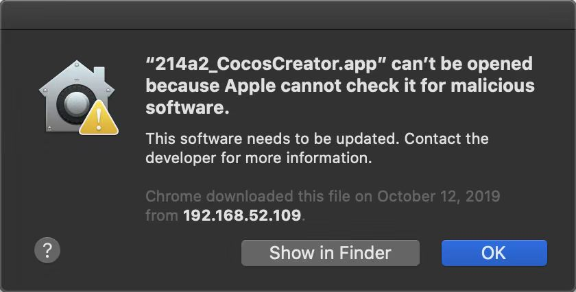

# Install and Launch

If you have not downloaded and started Cocos Creator while reading this document, please follow the steps below.

> **Note**: As of v2.3.2, Cocos Creator is equipped with a new **Dashboard** system, which will serve as a unified downloader and startup portal for all Cocos Creator, supporting the upgrade and management of multiple versions of Creator and projects at the same time! Please refer to the [Cocos Dashboard](https://docs.cocos.com/creator/3.0/manual/en/getting-started/install/) documentation for details on downloading, installation and usage.

## Download Cocos Creator

You can obtain the installation package for Cocos Creator by visiting the download link on the [Cocos Creator Products Page](http://www.cocos2d-x.org/products#creator).

Double-click the installation package after the download is complete.

### Windows installation instructions

The installer for Windows is a `.exe` executable, usually named `CocosCreator_vX.X.X_20XXXXXX_setup.exe`, where `vX.XX` is the version number of Cocos Creator, such as `v1.2.2`, followed by the version date series.

> **Notes**:
>
> 1. The date series will be updated frequently when using the beta version. If the version number of the current PC is the same as the version number of the installation package, it can not be automatically overwritten. To install package with the same version number as currently installed on your PC, You need to uninstall the current copy before proceeding with the installation.
>
>     The default installation path for the application is `C:\CocosCreator`, which can be specified during the installation process.
>
>     Cocos Creator will take up approximately 1.25 GB of space on your system disk, so you can clean up your system disk space before installation.
>
> 2. If there is an error about the digital signature of CAB file, try installing it with administrator privileges.
>
> 3. For some Windows systems that are very old and have been on the intranet for a long time or have not upgraded the operating system patch for a long time, some errors may be caused by the lack of dll at runtime, you can try to install the system patch to solve: <https://support.microsoft.com/en-us/help/2999226/update-for-universal-c-runtime-in-windows>
>
> 4. If the "Access Denied" popup appears during the installation process, or the installation fails. Please make sure that the operating system is an official Microsoft genuine.
>
> 5. If the installation still fails, try executing the installer from the command line:
>
>     ```bash
>     CocosCreator_v1.2.0_2016080301_setup.exe / exelog "exe_log.txt" / L * V "msi_log.txt"
>     ```
>
>     Then submit the resulting installation logs ( `exe_log.txt` and `msi_log.txt`) to the development team for help. If the installation logs cannot be obtained by using the above command, you can also obtain the installation log by create a shortcut for the installer, and fill the shortcut with the command line argument in the `target` attribute.

### Mac installation instructions

The installer for Cocos Creator for Mac is a .dmg (disk image) file. Double-click on the .dmg file, and drag `CocosCreator.app` to your **Application** folder shortcut, or any other location. Then double-click the copy of the `CocosCreator.app` to get started.

> **Notes**:
>
> 1. If it can not open after download, prompt that the dmg/app file is corrupted, from an unidentified developer, or contains malware, etc.
>
>     
>
>     Right-click on the dmg or app file in Finder, select **Open**, and then click **Open** again in the pop-up box. Then go to **System Preferences -> Security & Privacy**, and click **Open Anyway** so you can start normally later. Please refer to <https://support.apple.com/en-us/HT202491> for detail.
>
> 2. During the installation process, if the "Cocos Creator is corrupted and cannot be opened" popup appears, you need to check whether any software similar to Xcode is occupying the relevant files in the Creator installation directory. If so, exit first, then uninstall Creator and reinstall.

### Operating system requirements

The system environment that Cocos Creator supports is:

- The minimum Mac OS X version supported is OS X 10.9.
- The minimum Windows version supported is Windows 7 64-bit.

## Run Cocos Creator

On Windows, double-click the `CocosCreator.exe` file in the installation target folder or click `Cocos Creator` from Start menu to start Cocos Creator.

On Mac, start Cocos Creator by double-clicking the `CocosCreator.app` application icon.

### Check Graphics Card Driver

For some Windows operating systems and graphics card models, the following error may be encountered:

```js
This browser does not support WebGL ...
```

This is due to the editor's dependent on GPU rendering, which is not supported by the graphics card driver. If this happens, it is usually only necessary to ensure that the official driver of the corresponding model of the graphics card has been successfully installed.

## Sign in with the Cocos developer account

If you do not need to publish the game to the native platform, the above two simple steps can be prepared for you to use Cocos Creator game development environment for all development.

Cocos Creator starts, will enter the Cocos developer account login interface. Sign in to enjoy the variety of online services, product updates, and developer benefits that we offer developers.

If you do not have a Cocos developer account before, you can sign up for the Cocos Developer Center using the **Sign up** button in the sign-in interface. Or simply use the following links:

<https://auth.cocos.com/#/sign_up/register>

After registration, you can return to the Cocos Creator login screen to complete the login! Once you verify your identity, you'll enter the Dashboard interface. Except manually log out or login information expired, in other circumstances the editor will preserve your login session information so you can automatically login later.

## Version compatibility and fallback methods

When Cocos Creator is upgraded, the new version of the editor can open the old version of the project, but you may encounter some problems when you upgrade to a new version of Cocos Creator when the project is complicated. Because the engine and editor implementations in earlier versions may have bugs and other problems that can be bypassed by special treatment made by user scripts and setups. These bugs and problems may get fixed in subsequent releases and may cause impact on existing projects.

In addition to contacting the development team to find a solution, you can uninstall the new version of Cocos Creator and reinstall the old version when you discover a problem with this version upgrade. Problems you might encounter during the installation of an older version include:

- **Windows**: You may be prompted the error of installing an older version of the application if you already have an newer version of Cocos Creator installed. If you are sure that you have uninstalled the current version of Cocos Creator correctly from the Control Panel and still can not install the older version, please visit [Microsoft Official Fix Can not Install or Uninstall a Program](https://support.microsoft.com/en-us/help/17588/fix-problems-that-block-programs-from-being-installed-or-removed) help page. Follow the prompts to download the software and repair the damaged installation information, then you can continue to install the old version.
- The project is created or edited with a newer version of Cocos Creator. When you open it in older versions of Cocos Creator, you may encounter problems where the editor panel does not display content. Try selecting `Layout -> Restore Default Layout` in the main menu to fix it.

## Setup native development environment

If you only want to develop Web platform games, complete the above steps is sufficient. If you would like to publish the game to your native platform, please read the setup instructions for the development environment [Setup Native Development Environment](../publish/setup-native-development.md)
