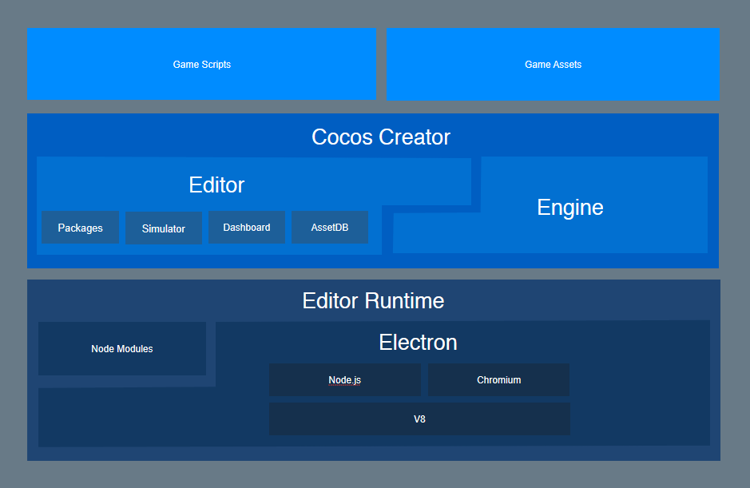

# About Cocos Creator

- **Q**: Is Cocos Creator a game engine? 
  **A**: It's a complete game development solution, which includes the JavaScript implementation of Cocos2d-x, and various UI tools that can help you develop games more quickly.

- **Q**: What kind of editor does Cocos Creator have? 
  **A**: It's completely customized for the engine. It's an all-in-one editor that can serve the whole workflow from design, development, preview, debug and all the way to cross-platform publishing.

- **Q**: Can I use Cocos Creator even if I don't know how to programming? 
  **A**: Of course! Cocos Creator provides two kinds of workflows: one design-oriented and one develop-oriented, and a simple and smooth cooperative method (with an appropriate division of labor).

- **Q**: Which platform can we choose to publish the games developed by Cocos Creator? 
  **A**: Currently, Cocos Creator can publish games to the Web, Android, iOS, desktops (Mac and windows) and Instant Games. The goal is to develop once and publish to all platforms.

## Product Positioning

Cocos Creator is a game development environment focused on content creation, which has features like scripting, componentization and uses a data driven model with the power of Cocos2d-x under the hood.

## Workflow introduction 工作流程说明

In the development phase, Cocos Creator has already been able to greatly improve efficiency and creativity for users. The workflows provided are not limited to a development level. For a successful game, not only workflows that form development and adjustment, but the assembly of commercialized SDKs, multi-platform releases and testing.

Cocos Creator integrates web-based games of Cocos Play into the editor tools, so there is no need to switch between various software. Just open the Cocos Creator editor, various one-click automatic flows can solve all the above problems with the least time and energy. Developers can focus on the development phase, and improve the competitiveness and creativity of the product!

### Create or import resources

You can complete resource import by dragging resources such as pictures, sounds, and so on to the **Assets** in the editor.

In addition, you can create scenes, prefabs, animations, scripts, particles, and other resources directly in the editor.

### Create scene content

With some basic resources in the project, we can start to build the scene, the scene is the game content most basic organization way, and it is also the basic form of showing the game to the player.

### Adding component scripts to enable interactive functionality

We can mount a variety of built-in components and custom scripting components for the nodes in the scene to enable the game logic to run and interact. This includes the most basic animation playback, the button response, the main loop script that drives the entire game logic, and the control of the player role. Almost all of the game logic functions are implemented by mounting scripts to the nodes in the scene.

### One-click preview and publish

In the process of setting up the scene and developing the function, you can click the preview at any time to see how the current scene works. Use mobile phone scan two-dimensional code, you can immediately preview the game on the phone. When development comes to an end, through the **build** panel you can publish the game to include desktop, mobile phone, Web and many other platforms.

## Highlight Features

The highlight features of Cocos Creator include:

- Data properties that can be adjusted in the editor at anytime can be easily declared in the script. The adjustments to parameters can be independently finished by designers.
- A UI system that supports smart canvas adaptation and spares the alignment of coding elements can perfectly adapt to device screens of any resolution.
- Animation system that is specially made for 2D games supports animation trajectory preview and editing of complicated curves.
- Scriptable development supported by a dynamic language makes dynamic adjustment and the remote adjustment of mobile devices amazingly easy.
- By using the Cocos2d-x engine, when enjoying the convenience of scriptable development, you can also release games on various desktop platforms and mobile terminal platforms with one-click, with their superb features on the original level preserved.
- Componentization of script and open plugin system provides developers with methods of customizing workflows at different depths. The editor can be adjusted on a large scale to adapt to the needs of different groups and projects.

## Framework Structure

Cocos Creator contains all the functions needed for game development, including: a game engine, resource management, scene editing, game previewing and game releasing. All of this in a single, unifed tool that eases your games development.

The editor provides not only a strong and complete toolchains, but also an open plugin framework. Developers can use generic front end technologies like HTML + JavaScript to conveniently extend the functionality of the editor and provide customized personalized workflows.

Chart 1

Chart 2

What the combination of engine and editor brings is the functional development method of data driven and componentization, and the perfect cooperation (with an appropriate division of labor) of designers and programmers:

- Designers build the visual presentation of game scenes in the editor
- Programmers develop functional components that can be mounted to any object in the scene
- Designers are responsible for mounting components to objects that need to perform a particular action and improving each parameter by adjustment
- Programmers develop the data structure and resource management needed for the game
- Designers set up all the data and resources using the graphic interface
- (In this way, from the simple to the complex, all the workflows that you can imagine can be realized)

The development idea that focusing on workflows can help developers, of different duties, quickly find the breakthrough point to maximize their work and smoothly cooperate with other group members.

## Usage instructions

Cocos Creator supports cross-platform operation between Windows and Mac, with a single one double click. Comparing to traditional Cocos2d-x workflows, it completely spares the requirements of setting up a development environment. After running, developers can immediately start game content creation or functional development.

On the basis of data driven workflows, the creation and editing of the scene has become the core of game development. The design work and functional development can be done synchronously and seamlessly. Regardless if your teammates are artworkers, directors or programmers, they can all click the Preview button at anytime in the production process to test the lastest form of the game in browsers, mobile device simulators or mobile devices.

Programmers and designers can realize various kinds of cooperative methods. Whether they are building the scene before adding functionality or creating functional modules to let designers assemble and adjust them, Cocos Creator can always meet the needs of the development group. Features defined in the script can present themselves in the editor with the most suitable visual effects, which provides convenience for content creators.

Content resources outside the scene can be imported in, such as: photos, sounds, altases, skeleton animations, etc. Moreover, we are continuously improving the editor's ability of creating resources, which includes the animation editor. Designers can use this tool to make very exquisite and vivid animation resources, and preview the animation in the scene at anytime.

In the end, the finished game can be released on various platforms by using the on-click in the graph tool. From design and development, to testing and releasing, Cocos Creator can handle everything for you.

---

Continue on to read about the [Installation](install.md).
