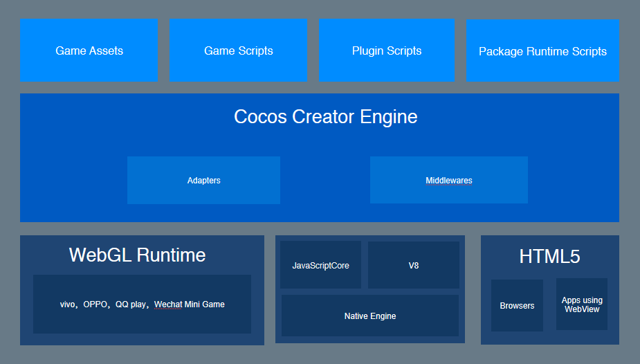

# About __Cocos Creator__

- **Q**: Is __Cocos Creator__ a game engine?
- **A**: It's a complete game development solution that includes the JavaScript implementation of the __Cocos2d-x__ engine (no need to learn a new engine), interface builder and the various graphics you need to develop your game faster. 

- **Q**: What is the editor of __Cocos Creator__?
- **A**: Fully custom built for the engine, including the full-featured all-in-one editor for the entire workflow from design, development, preview, debugging to release

- **Q**: I can't write programs, can I use __Cocos Creator__?
- **A**: Of course! The __Cocos Creator__ editor provides two workflows for design and development, providing a simple and smooth way of working together.

- **Q**: What platform can __Cocos Creator__ let me develop for?
- **A**: __Cocos Creator__ currently supports publishing games to the Web, iOS, Android, various "mini game" platforms, PC desktops and other platforms.

## What is Cocos Cretaor?

__Cocos Creator__ is a game development tool with content creation at its core. It is fully scripted, componentized and data driven. __Cocos Creator__ uses data-driven and component-based game development methods. 

## Workflow Description

In the development phase, __Cocos Creator__ has been able to bring great efficiency and creativity to users. Successful games include development and debugging, commercial SDK integration, multi-platform release, testing, and the online workflow that __Cocos Creator__ has to offer.

__Cocos Creator__ integrates the entire mobile page navigation solution into the editor tool, eliminating the need to shuttle between multiple software applications. With the __Cocos Creator__ editor open, a one-click automated process takes the least amount of time and effort to solve All the above questions. Developers can focus on the development phase and increase product competitiveness and creativity!

### Creating or importing resources

You can complete resource importing by dragging and dropping resources such as images and sounds into the editor's **Explorer** panel.

In addition, you can create scenes, prefabs, animations, scripts, particles and other resources directly within the __Cocos Creator__ editor.

### Building scene content

After having some basic resources in the project, we can start to set up the scene. The scene is the most basic organization of the game content, and it is also the basic form of showing the game to the player.

We will add various types of nodes through the **Scene Editor**, which is responsible for displaying the game's fine sound effects resources and hosting them as a follow-up interactive function.

### Add component scripts to implement interactive functions

We can include various built-in components and custom script components for the nodes in the scene. This includes everything from the most basic animation playback and button responses, to the main loop script that drives the entire game logic and the control of the player's character. Almost all game logic functions are implemented by adding scripts to nodes in the scene.

### One-click preview and release

In the process of setting up the scene and developing functions, you can click to preview your work, at any time, to see the current scene running. Use your phone to scan the QR code and instantly preview the game on your phone. When the development comes to an end, the **Build Publish** panel allows you to publish games to multiple platforms, including desktops, mobile phones, and the Web.

## Features

Highlights of __Cocos Creator's__ features include:

- Data properties can be adjusted at any time in the editor and can be easily declared in scripts. Designers can even adjust parameters without interferring with code.
- UI system that support smart canvas adaptation and programming-free element alignment are perfectly adapted to device screens of any resolution.
- An animation system for 2D games that supports animated track preview and complex curve editing.
- Scripting development using dynamic language support, making dynamic debugging and remote debugging on mobile devices extremely easy.
- With the Cocos2d-x engine, you can enjoy the convenience of scripted development, and also publish to all kinds of desktop and mobile platforms with one click, and maintain the super-performance of the native level.
- Script componentization and an open plugin system provide developers with a way to customize workflows at different depths. The editor can be tuned to fit the needs of different teams and projects.

## Architecture Features

__Cocos Creator__ includes the full set of features required for game development such as the game engine, resource management, scene editing, game preview, game publishing, and integrates all functions and toolchains into one unified application.

While providing a powerful and complete toolchain, the editor provides an open plug-in architecture that allows developers to easily extend the editor's functionality and allows customizations to personalize workflows using front-end common technologies such as HTML + JavaScript.

Below is the technical architecture diagram of __Cocos Creator__

Figure 1

Figure 2

As you can see from the figure, the editor is a development environment built on top of the Electron framework. The engine is responsible for providing many easy-to-use components and a unified interface for each platform.

The combination of the engine and the editor brings the data-driven and component-based approach to functional development, as well as the perfect division of labor between the design and the program:

- The designer's imagines the scene in the scene editor
- Programmers develop functional components that can be added to any object in the scene
- The designer is responsible for adding the components for objects that need to exhibit specific behavior and improving the parameters through debugging
- The data structures and resources that programmers need to develop games
- Designers configure various data and resources through a graphical interface
- From simple to complex, all kinds of workflows you can imagine can be implemented

Workflow-centric development concepts allow developers of different functions to quickly find work entry points that maximize their role, and fluently coordinate with other team members.

## Instructions for use

__Cocos Creator__ supports Windows and Mac cross-platform applications and can be launched by double-clicking. Compared to the traditional Cocos2d-x workflow, the requirements and configuration of a development environment are completely eliminated, with some game content creation tasks or development functions can be started immediately after launching __Cocos Creator__.

The data-driven workflow becomes the creation and editing of the scene becomes the center of game development. The design work and functional development can be carried out simultaneously and seamlessly. Whether it is art, planning or programming, it can all be done in the production process. Always click on the preview button to test the latest state of the game on your browser, mobile device simulator or mobile device.

Programmers and designers can now implement a wide range of division of labor, whether it is to build the scene first, then add functions, or to first produce functional modules and then combined debugging by designers, __Cocos Creator__ can meet the needs of the development team. The properties defined in the script can be presented in the editor with the most appropriate visual experience to facilitate the content producer.

Content resources outside the scene can be imported from outside, such as pictures, sounds, atlas, skeletal animation, etc. In addition, we are constantly improving the editor's production resources, including the currently completed animation editor, art People can use this tool to create very delicate and expressive animation resources, and you can see the preview of the animation in the scene at any time.

Finally, the developed game can be published to each platform through a graphical tool, from design development to test release, __Cocos Creator__ will help you.