# Quick Start: Make your first game

This document is a systematic introductions of the editor panel and the functions and workflows of Cocos Creator. Completing this chapter will help you quickly learn the general flow and methods for developing games with Cocos Creator. After finishing this tutorial you have enough information to get started creating basic games. It is strongly recommended you continue reading this guide to understand the details of each functional block and the complete workflows. Now, let's begin!

Following the tutorial, we will create a game that is named **Pick Up the Stars**. Players of this game need to manipulate an **obtuse** monster that never stops jumping to touch the continuously appearing stars. The dazzling acceleration will bring great challenges to players. Play with your friends and see who can obtain the most stars!

The completed form of this game can be played here:

<http://fbdemos.leanapp.cn/star-catcher/>

## Prepare project and resources

We have prepared for you all the resources needed for creating this game. Download **Original Project** and decompress it to the location you want. Then we can start:

[Download the original project](https://github.com/cocos-creator/tutorial-first-game/releases/download/v1.2/start_project.zip)

You can also download the completed project. If there is any confusion when following the tutorial to create the game, you can open the completed project for reference:

[Download the completed project](https://github.com/cocos-creator/tutorial-first-game/releases/download/v1.2/complete_project.zip)

## Open the original project

If you still don't know how to obtain and start Cocos Creator, please read the [Install](install.md) section.

1. First, start Cocos Creator, and choose **Open other projects**
2. In the pop up input field for selecting folder, choose `start_project` that has just been downloaded and decompressed, and click the **Open** button
3. The main window of Cocos Creator editor will be opened, and you will see the project status as follows


## Check game resources

Our original project has included all the game resources needed, therefore you don't need to import any other resources. For details on importing resources, please read content related to [Asset Workflow](../asset-workflow/index.md).

Next, let's get to know the resources of the project. Please pay attention to the **Assets** panel, on which all the resource allocation graphs of the project are shown.

We can see that the root directory of the project resources is named as **assets**, which is in accordance with the `assets` directory in the decompressed original project. Only resources under this directory can be imported by Cocos Creator into the project and be managed.

The **Assets** panel can display the directory structure of any hierarchy. An icon like  represents a folder. Clicking the triangle icon on the left side of the folder, you can unfold the contents of the folder. After completely unfolding the folder, the **Assets** panel will present itself as illustrated below.

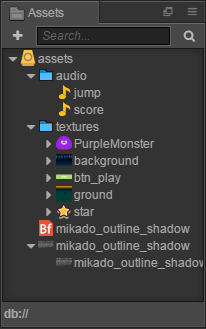

Every resource is a document, which, after being imported into the project, will be recognized as different types of resources according to the differences in extension name. Its icon will be differentiated too. Next, let's take a look at the respective types and usages of the resources in the project.

-  audio document, which is an mp3 document generally. Audio documents named as `jump` and `score` will be played respectively when the character jumps and scores.
-  bitmap font, which is jointly formed by a fnt document and png document. Bitmap font is a commonly used font resource in game development. For detailed information, please read [Font](../asset-workflow/font.md)
- There are various kinds of abbreviated icons, all of which are image resources, normally a png or jpg document. After being imported into the project, the image document will be crudely processed into the resource of **texture** type. Then these resources can be dragged into scenes or component properties for use.

## Creating a game scene

In Cocos Creator, the game scene is the core of organizing the game contents when developing games, which is also the carrier for all the game contents presented to players. The game scene will normally include the following contents:

- Scene images and words (Sprite, Label)
- Characters
- Game logic scripts attached to scene nodes in the form of components

When players run the game, the game scene will be loaded. After that, the game scripts of included components will automatically run to realize various kinds of logic functions set up by developers. Therefore, apart from resources, the game scene is the foundation of all content creation. Now let's create a new scene.

1. Click the **assets** directory in the **Assets** panel, making sure the scene will be created under this directory

2. Click the plus sign on the top left corner of the **Assets** panel, and choose **Scene** in the pop up menu

    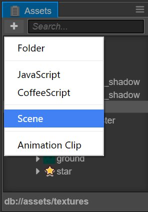

3. We created a scene document named as `New Scene`. Right click it and choose **Rename** to rename it as `game`.

4. Double click `game` and the scene will be opened in the **scene editor** and the **Node Tree**.

### To understand Canvas

After opening the scene, all the nodes (and their hierarchical relations) of the current scene will be shown in the the **Node Tree**. The newly created scene has only one node called `Canvas`. **Canvas** can be called the canvas node or rendering root node. Click **Canvas**, its properties will display in the **Properties** panel.


The `Design Resolution` property here stipulates the design resolution of the game. `Fit Height` and `Fit Width` stipulate how we should zoom **Canvas** to adjust to different resolutions when running on screens of different sizes.

Being provided with the function of adjusting to different resolutions, we will normally put all the nodes in charge of image display in the scene under **Canvas**. In this way, when the `scale` property of **Canvas** changes, all the images, as its subnodes, will zoom together to adjust to the sizes of different screens.

For more detailed information, please read [Canvas](../components/canvas.md). Currently, we only need to know that the scene images added next will all be put under the **Canvas** node.

## Setting up a scene image

### Adding a background

First, find the background image resource according to the path of `assets/textures/background` in the **Assets** panel. Click and drag this resource to the **Canvas** node in **Arrangement editor**. Don't release the mouse until the **Canvas** node is highlighted orange, which means a subnode using `background` as the image resource will be added.

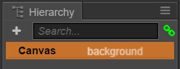

Now you can release the mouse button, and you will see a node named `background` has been added under **Canvas**. When we use the way of dragging a resource to add a node, the node will be automatically named as the name of the image resource.

When we edit and modify the scene, we can promptly save our modifications by main menu `document->save scene`. Or we can save by shortcut keys: <kbd>Ctrl+S</kbd> (Windows) or <kbd>Cmd + S</kbd> (Mac).

### Modify background size

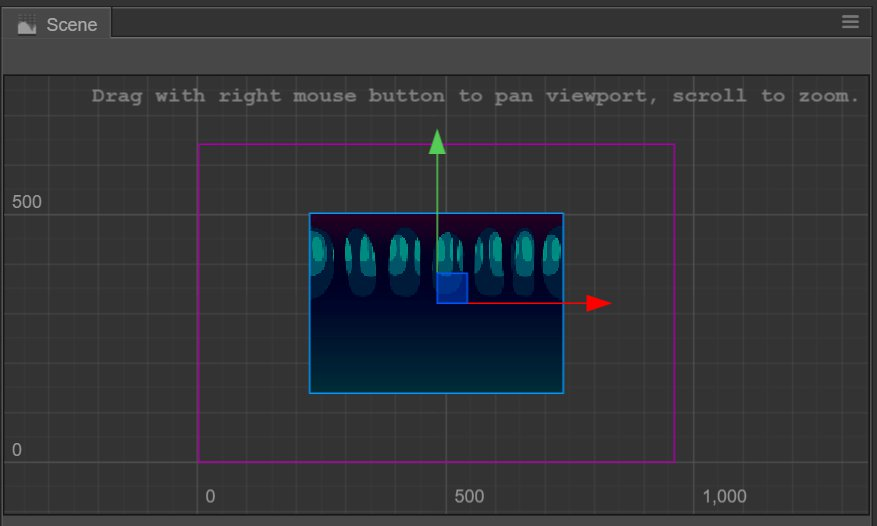

In **scene editor**, the newly added background images can be seen. Next we will modify the size of the background image to make it cover the whole screen.

Firstly, click the `background` node, and click the fourth **rectangle tool** at the top left corner of the main window:

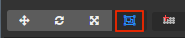

By using this tool we can conveniently modify the size of the image node. Move the mouse to rest on the left side of `background` in **scene editor**, click and drag it to the left until the left side of `background` exceeds the blue frame that represents the design resolution. Then we can drag the right side of `background` to the right using the same method.

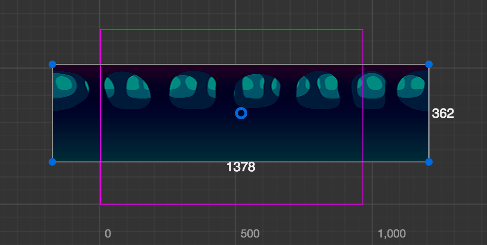

Then we need to drag the upper and lower sides to make the size of the background image fully cover the frame of the designing resolution.

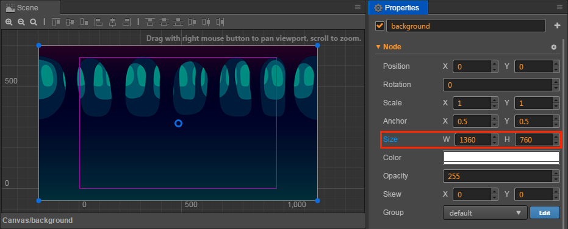

When using **rectangle tool** to modify the size of the background image, we can see the `Size` property of **Node** in the **Properties** panel is changing accordingly. After completion, the size of the background image is approximately `(1360, 760)`. You can also directly input a numeric value into the input field of the `Size` property, which will achieve the same effect as that of using **rectangle tool**. A background image of this size can cover the whole screen of all the phones on the market, with no exceptions.

### Add ground

Our main character needs a ground that it can jump on. We will add one instantly. By the same method of adding a background image, drag the `assets/textures/ground` resource in the **Assets** panel to `Canvas` in the **Node Tree**. When dragging, we can choose the order relation of newly added nodes and `background` nodes. When in the state of dragging the resource, move the mouse pointer to the bottom of the `background` node until a highlighted orange frame appears on `Canvas` and a green line representing the insert position appears below `background`, and then release the mouse. In this way, `ground` will be put under the `background` in the scene hierarchy, which is also a subnode of `Canvas`.

In the **Node Tree**, the rendering order of the nodes displayed below is behind the upper nodes, that is, the lower nodes are drawn after the upper nodes. We can see the `ground` object at the bottom is the first to appear in **scene editor**. Besides, the subnode will permanently display before the parent node. We can adjust the hierarchical order and relation of nodes at anytime to control their show order.

According to the method of modifying the background, we can also use **rectangle tool** to set a suitable size for the ground node. When activating **rectangle tool**, by dragging the vertices and the parts other than the four sides of nodes, we can change the position of nodes. The state of set ground nodes is as illustrated below:

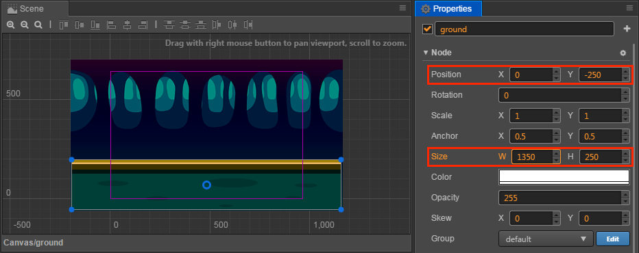

Apart from **rectangle tool**, we can also use **move tool** to change the positions of the nodes.


Try to hold down the arrow of **move tool** shown on the node and drag it, then we can change the position of the node on a single coordinate axis at one time.

When setting up the position and size of the background and ground, we don't need precise numeric values and can drag them by guessing. If you prefer whole numbers, you can directly input numeric values of `position` and `size` according to the screenshot.

### Adding a main character

Next our main character the little monster will make its debut. Drag `assets/texture/PurpleMonster` from the **Assets** panel and put it under `Canvas` in the **Node Tree**, and make sure its position is below `ground`, in this way our main character will be shown at the very front.

To highlight the aura of the main character in the scene nodes, we right click the newly added `PurpleMonster` node, choose `rename` and rename it as `Player`.

Next we will set up the properties of the main character. First, we change the position of **Anchor**. The anchor point of any node will be at the center of itself by default, which means the position of the center of the node is the position of the node. We hope to manipulate the position of the base of the main character to simulate the effect of jumping on the ground; therefore, we need to set up the anchor point of the main character under its foot now. Find **Anchor** property in the **Properties** panel and set up the value of `y` as `0`. We will see that in **scene editor**, the arrow of the **move tool** that represents the position of the main character appears under the foot of the main character.

Next, drag `Player` from **scene editor** and put it on the ground. The effect is as illustrated below:

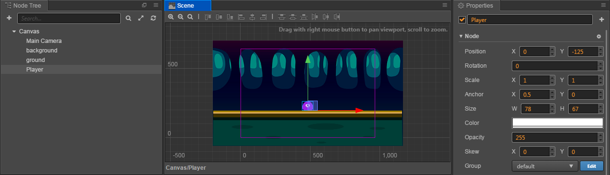

In this way our scene's basic artistic content is set up. In the next section we will write code to vivify the contents of the game.

## Writing the main character's script

One of the core ideas of developing games by Cocos Creator is to let the content creation and function development undergo parallel cooperation smoothly. In the last section we focused on artistic content. Next we will write script to develop the flow of functions, and we will see that the finished program script can be used by content creators easily.

Even if you have never written a program before, there's no need to worry. We will provide all the necessary codes in the tutorial. You only need to copy and paste them to the correct position. Then in this part you can ask your programmer partners for help. Next let's start creating script that drives the main character to act.

### Create script

1. First, right click the `assets` folder in the **Assets** panel and choose `Create->folder`

    

2. Right click `New Folder`, choose `Rename` and rename it as `scripts`, under which all our scripts will be saved.

3. Right click the `scripts` folder, choose `Create->JavaScript` and create a JavaScript script

4. Rename the newly created script as `Player`. Double click this script and open the code editor.

### Writing component property

The opened script already has some preset code blocks. These codes are the structure needed for writing a component script. Scripts of such a structure are the components in Cocos creator, which can be mounted on the nodes in the scene and provide various functions that manipulate nodes. First, we will set up some properties and see how to adjust them in the scene.

Find the portion of `properties` in the `Player` script in **code editor**, change it to the following content and press <kbd>Ctrl + S</kbd> (Windows) or <kbd>Cmd + S</kbd> (Mac) to save it:

```js
// Player.js
    //...
    properties: {
        // main character's jump height
        jumpHeight: 0,
        // main character's jump duration
        jumpDuration: 0,
        // maximal movement speed
        maxMoveSpeed: 0,
        // acceleration
        accel: 0,
    },
    //...
```

These newly added properties will stipulate the movement of the main character. In code, we don't have to care about how much these numeric values are, because we will directly set up these numeric values in the **Properties** panel later.

Now we can add the `Player` component to the node of the main character. Choose the `Player` node in the **Node Tree**, click the **add component** button in the **Properties** panel and choose `add user's script component->Player` to add the `Player` component to the node of the main character.

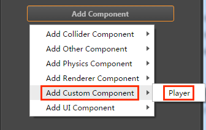

Now we can see the newly added `Player` component in the **Properties** panel of the `Player` node. Set up properties related to the jumping and movement of the main character according to the image below:


Only jumpDuration's unit is seconds. The unit of the other values is pixels. According to the current setting of the `Player` component: Our main character will have a jump height of 200 pixels. The time needed for jumping to the highest point is 0.3 seconds. Its maximum horizontal movement speed is 400 pixels per second. Its horizontal acceleration is 350 pixels per second.

All these numeric values are suggestions. Later when the game is running, you can modify these numeric values in the **Properties** panel at anytime according to your preference, no need to change any codes. How convenient it is, right?

### Writing code for jumping and movement

Next we will add a method to make the main character jump. Add a method called `setJumpAction` and put it below the `properties: {...},` code block:

```js
// Player.js
    properties: {
        //...
    },

    setJumpAction: function () {
        // jump up
        var jumpUp = cc.moveBy(this.jumpDuration, cc.p(0, this.jumpHeight)).easing(cc.easeCubicActionOut());
        // jump down
        var jumpDown = cc.moveBy(this.jumpDuration, cc.p(0, -this.jumpHeight)).easing(cc.easeCubicActionIn());
        // repeat
        return cc.repeatForever(cc.sequence(jumpUp, jumpDown));
    },
```

Here some Action in the Cocos2d-js engine is used to realize the jumping animation of the main character. For detailed information, please check [Cocos2d-js API](http://www.cocos2d-x.org/reference/html5-js/V3.8/index.html).

Next invoke the newly added `setJumpAction` method in the `onLoad` method and implement `runAction` to start action:

```js
// Player.js
    onLoad: function () {
        // initialize jump action
        this.jumpAction = this.setJumpAction();
        this.node.runAction(this.jumpAction);
    },
```

The `onLoad` method will be immediately implemented after loading the scene. So we will put operations and logic concerning initialization into it.

After the script is saved, we can start running the game for the first time!

Click the **preview** button at the top of Cocos Creator editor, which looks like a "play" button. Cocos Creator will automatically open your default browser and run the game in it. Now we should see the main character --- a purple monster jumping lively and continuously in the scene.

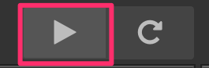

### Manipulation of movement

A main character that can only jump foolishly up and down on the same spot is not very promising. Let us add keyboard input for the main character, using <kbd>A</kbd> and <kbd>D</kbd> to manipulate its jump direction. Below the `setJumpAction` method, add a new `setInputControl` method:

```js
// Player.js
    setJumpAction: function () {
        //...
    },

    setInputControl: function () {
        var self = this;
        // add keyboard event listener
        // When there is a key being pressed down, judge if it's the designated directional button and set up acceleration in the corresponding direction
        cc.systemEvent.on(cc.SystemEvent.EventType.KEY_DOWN, function (event){
            switch(event.keyCode) {
                case cc.KEY.a:
                    self.accLeft = true;
                    break;
                case cc.KEY.d:
                    self.accRight = true;
                    break;
            }
        });

        // when releasing the button, stop acceleration in this direction
        cc.systemEvent.on(cc.SystemEvent.EventType.KEY_UP, function (event){
            switch(event.keyCode) {
                case cc.KEY.a:
                    self.accLeft = false;
                    break;
                case cc.KEY.d:
                    self.accRight = false;
                    break;
            }
        });        
    },
```

Then modify the `onLoad` method, into which we add the switch of accelerating to the left/right and the current horizontal speed of the main character. Then invoke the newly added `setInputControl` method. Start monitoring keyboard input after loading the scene:

```js
// Player.js
    onLoad: function () {
        // initialize jump action
        this.jumpAction = this.setJumpAction();
        this.node.runAction(this.jumpAction);

        // switch of acceleration direction
        this.accLeft = false;
        this.accRight = false;
        // current horizontal speed of main character
        this.xSpeed = 0;

        // initialize keyboard input listener
        this.setInputControl();
    },
```

Finally, modify the content of the `update` method by adding settings for the acceleration, speed and the current position of the main character:

```js
// Player.js
    update: function (dt) {
        // update speed of each frame according to the current acceleration direction
        if (this.accLeft) {
            this.xSpeed -= this.accel * dt;
        } else if (this.accRight) {
            this.xSpeed += this.accel * dt;
        }
        // restrict the movement speed of the main character to the maximum movement speed
        if ( Math.abs(this.xSpeed) > this.maxMoveSpeed ) {
            // if speed reaches its limit, use the max speed with current direction
            this.xSpeed = this.maxMoveSpeed * this.xSpeed / Math.abs(this.xSpeed);
        }

        // update the position of the main character according to the current speed
        this.node.x += this.xSpeed * dt;
    },
```

`update` will be invoked once for each frame after loading the scene. We normally put the logic contents that need to be frequently calculated or timely updated here. In our game, after obtaining the acceleration direction by keyboard input, we need to calculate the speed and position of the main character in `update` for each frame.

After saving the script, you can brew a cup of tea and click **preview** to check the latest outcome. After opening the preview in your browser, click the game scene with the mouse (due to the restrictions of browsers, keyboard input can only be accepted after clicking the game scene), then you can press the <kbd>A</kbd> and <kbd>D</kbd> buttons to manipulate the main character to move to the left/right!

Is the movement a little bit too slow? Does the main character not jump high enough? Hope to extend jump duration? No problem! All these can be adjusted at anytime. Just set up different property values for the `Player` component, then you can adjust the game at your will. Here is a set of settings for reference:

```
Jump Height: 150
Jump Duration: 0.3
Max Move Speed: 400
Accel: 1000
```

This set of property settings will make the main character as agile as possible. As for how to choose the values, it all depends on what style of game you want.

## Making stars

The main character can jump freely now so we need to set up a goal for players. The stars will appear continuously in the scene and players need to manipulate the monster to touch the stars to collect points. The star touched by the main character will disappear and a new one will be immediately re-created at a random position.

### Create Prefab

As for the nodes that need to be created repeatedly, we can save it as a **Prefab** resource, which can be a template for the dynamic generation of nodes. For more information about **Prefab**, please read [Prefab](../asset-workflow/prefab.md).

Firstly, drag the `assets/textures/star` texture from the **Assets** panel into the scene. Anywhere in the **Node Tree** is fine. We only need the scene to be the operating platform for creating Prefab. After creation we will delete this node from the scene.

We don't need to modify the position of the stars or its render properties. But to make the stars disappear after being touched by the main character, we need to add a special component to the star. By the same method of adding the `Player` script, add a JavaScript script named `Star` to `assets/scripts/` (in the **Properties** panel of the `star`, select **Add component** and then **Add custom component** and then **`Star`**).


Next, double click this script to start editing. Only one property is needed for the star component to stipulate the distance for collecting points by the main character. Modify `properties` and add the following content:

```js
// Star.js
    properties: {
        // When the distance between the star and main character is less than this value, collection of the point will be completed
        pickRadius: 0,
        // The game object
        game: {
            default: null,
            serializable: false
        }
    },
```

After saving the script, add this script to the newly created `star` node. Then set up the property value of `Pick Radius` in the **Properties** panel as `60`:

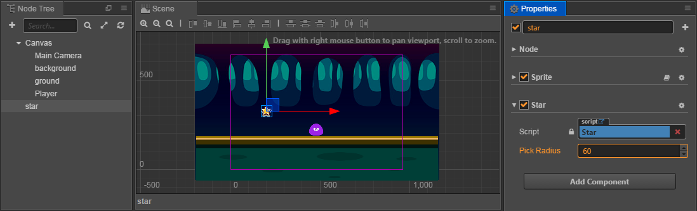

The settings needed by Star Prefab are now finished. Now drag the `star` node from the **Node Tree** and drop it into the `assets` folder in the **Assets** panel. This should generate a Prefab resource named `star`, as shown below.

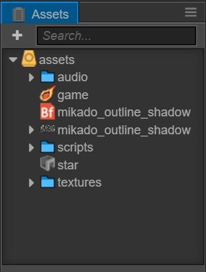

Now the `star` node can be deleted from the scene. We can double click the `star` Prefab resource directly to edit.

We can dynamically use the Prefab resource of stars in the script to generate stars.

### Adding game control script

The generation of stars is a part of the game's main logic. Therefore we need to add a script named `Game` and make it the script of the game's main logic. Logic concerning scoring, failure and restarting will be added to this script later.

Add a new `Game` script inside the `assets/scripts` folder (next to `Star` and `Player`). Double click to open the script. First, add the properties needed for generating stars:

```js
// Game.js
    properties: {
        // this property quotes the PreFab resource of stars
        starPrefab: {
            default: null,
            type: cc.Prefab
        },
        // the random scale of disappearing time for stars
        maxStarDuration: 0,
        minStarDuration: 0,
        // ground node for confirming the height of the generated star's position
        ground: {
            default: null,
            type: cc.Node
        },
        // player node for obtaining the jump height of the main character and controlling the movement switch of the main character
        player: {
            default: null,
            type: cc.Node
        }
    },
```

After saving the script, add the `Game` component to the `Canvas` node in the **Node Tree** (after choosing the `Canvas` node, drag the script to the **Properties** panel or click the **Add component** button in the **Properties** panel and choose `Game` in `Add Custom Component`).

Next, drag the `star` Prefab resource from the **Assets** panel into the `Star Prefab` property of the newly created `Game` component. This is the first time we have set up a quotation for the property. Only when setting `type` as quote type when declaring a property (such as the `cc.Prefab` type written here) can an asset or a node be dragged to the property.)

Then, drag the `ground` and `Player` nodes from the **Node Tree** to properties of the same name in the component, to finish the node quotation.

Finally, set the values of the `Min Star Duration` and `Max Star Duration` properties as `3` and `5`. Later when generating stars, we will choose a random value between these two values, for the duration of each star.

### Generate stars at a random position

Next, we will continue to modify the `Game` script by adding the logic of generating stars and putting it after the `onLoad` method:

```js
// Game.js
    onLoad: function () {
        // obtain the anchor point of ground level on the y axis
        this.groundY = this.ground.y + this.ground.height/2;   // this.ground.top may also work
        // generate a new star
        this.spawnNewStar();
    },

    spawnNewStar: function() {
        // generate a new node in the scene with a preset template
        var newStar = cc.instantiate(this.starPrefab);
        // put the newly added node under the Canvas node
        this.node.addChild(newStar);
        // set up a random position for the star
        newStar.setPosition(this.getNewStarPosition());
    },

    getNewStarPosition: function () {
        var randX = 0;
        // According to the position of the ground level and the main character's jump height, randomly obtain an anchor point of the star on the y axis
        var randY = this.groundY + cc.random0To1() * this.player.getComponent('Player').jumpHeight + 50;
        // according to the width of the screen, randomly obtain an anchor point of star on the x axis
        var maxX = this.node.width/2;
        randX = cc.randomMinus1To1() * maxX;
        // return to the anchor point of the star
        return cc.p(randX, randY);
    }
```

After saving the script, click the **preview** button. Then in the browser you will see that a star is dynamically generated after the game is started! By the same method, you can dynamically generate any preset node with a Prefab template in the game.

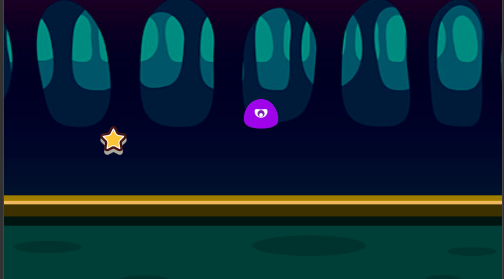

### Adding the action of the main character's touching and collecting of stars

Now we will add the action logic of the main character's collecting of stars. The essential point here lies in the fact that the star needs to obtain the position of the main character's node at any time to judge if the distance between them is shorter than the collectable distance. How do we obtain the quotation of the main character's node? Don't forget that we have done two things before:

1. There is a property named `player` in the `Game` component, which saved the quotation of the main character's node.
2. Each star is dynamically generated in the `Game` script.

Therefore, we only need to deliver the concrete example in the `Game` component into a star and save it after the concrete example of the `Star` node is generated in the `Game` script. Then we can visit the main character's node by `game.player` at anytime. Let's open the `Game` script, and add the following code to the end of the `spawnNewStar` method:

```js
// Game.js
    spawnNewStar: function() {
        // ...
        // deliver the concrete example of the Game component into the star component
        newStar.getComponent('Star').game = this;
    },
```

Open the `Star` script after saving, now we can use the `player` node quoted in the `Game` component to judge the distance. Add the methods named `getPlayerDistance` and `onPicked` and put them below the `onLoad` method:

```js
// Star.js
    getPlayerDistance: function () {
        // judge the distance according to the position of the player node
        var playerPos = this.game.player.getPosition();
        // calculate the distance between two nodes according to their positions
        var dist = cc.pDistance(this.node.position, playerPos);
        return dist;
    },

    onPicked: function() {
        // When the stars are being collected, invoke the interface in the Game script to generate a new star
        this.game.spawnNewStar();
        // then destroy the current star's node
        this.node.destroy();
    },
```

Then add the judging distance for each frame to the `update` method. If the distance is shorter than the collectable distance set by the `pickRadius` property, implement collecting behavior:

```js
// Star.js
    update: function (dt) {
        // judge if the distance between the star and main character is shorter than the collecting distance for each frame
        if (this.getPlayerDistance() < this.pickRadius) {
            // invoke collecting behavior
            this.onPicked();
            return;
        }
    },
```

Save the script, then preview and test again. You will see that when the main character gets close to the star, the star will disappear and a new one will be generated at a random position!

## Adding score

The little monster makes a great effort to collect the stars. But how come it receives no reward? Now, let's add the logic and display of scoring when collecting stars.

### Adding a score label (Label)

The score will start from 0 when the game is started. 1 point will be added for 1 star collected. To display the score, we should first create a **Label** node. Choose the `Canvas` node in the **Node Tree**, right click and choose `Create -> Create Renderer Nodes -> Node With Label`. A new Label node will be created under `Canvas`, and it will be located at the bottom. Next we will use the following steps to set up this Label node:

1. Change the node's name to `score`.
2. Select the `score` node, and set the X,Y of the `position` property to `(0, 180)`.
<!-- 0. Set the X,Y of the `size` property to `(300, 80)`. -->
3. Edit the `String` property of the **Label** component and input `Score: 0`.
4. Set the `Font Size` property of the **Label** component to `50`.
5. Drag the `assets/mikado_outline_shadow` bitmap font resource from the **Assets** panel (pay attention! the icon is ) into the `Font` property of the **Label** component, to change the font used to render the score.

The completed effect is as illustrated below (don't worry about the `Size`):

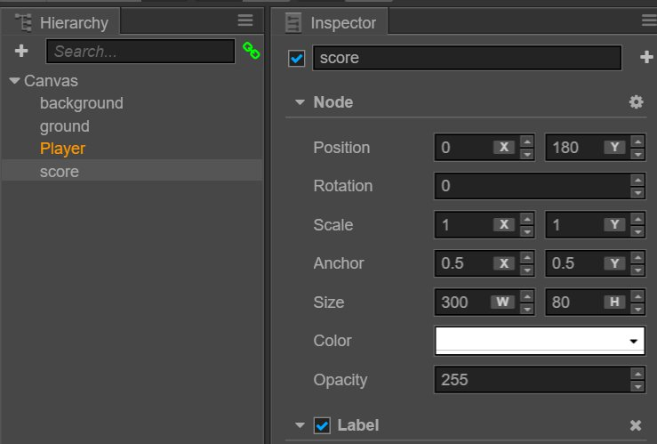

### Adding scoring logic to Game script

We will put the logic of scoring and updating the score display in the `Game` script. Open the `Game` script to start editing. First, add a reference property of the score display Label to the end of the `properties` block:

```js
// Game.js
    properties: {
        // ...
        // quotation of score label
        scoreDisplay: {
            default: null,
            type: cc.Label
        }
    },
```

Next, add the initialization of variables for scoring in the `onLoad` method:

```js
// Game.js
    onLoad: function () {
        // ...
        // initialize scoring
        this.score = 0;
    },
```

Then add a new method named `gainScore` to the back of the `update` method:

```js
// Game.js
    gainScore: function () {
        this.score += 1;
        // update the words of the scoreDisplay Label
        this.scoreDisplay.string = 'Score: ' + this.score.toString();
    },
```

Don't forget to drag the score node into the "Score Display" property in "Canvas" properties panel.

### Invoke the scoring logic of the Game in Star script

Open the `Star` script after saving the `Game` script. Add the invoking of `gainScore` to the `onPicked` method:

```js
// Star.js
    onPicked: function() {
        // when the stars are being collected, invoke the interface in the Game script to generate a new star
        this.game.spawnNewStar();
        // invoke the scoring method of the Game script
        this.game.gainScore();
        // then destroy the current star's node
        this.node.destroy();
    },
```

Preview after saving. You will see that when collecting stars, the scores displayed at the top of screen will increase now!


## Judgement of failure and restarting

Now our game has taken shape. But no matter how many scores one may get, a game without the possibility of failure won't give players any fulfillment. Now let's add the action of the stars' regular disappearance. And if all the stars disappear, the game will be viewed as failed. In other words, players need to finish collecting the star before the star disappears and repeat this procedure unceasingly to finish the loop of the play method.

### Adding the logic of disappearing in a limited time to the star

Open the `Game` script, and add the variable declaration needed for counting time before invoking `spawnNewStar` of the `onLoad` method:

```js
// Game.js
    onLoad: function () {
        // ...
        // initialize timer
        this.timer = 0;
        this.starDuration = 0;
        // generate a new star
        this.spawnNewStar();
        // initialize scoring
        this.score = 0;
    },
```

Then add the logic of resetting the timer to the end of the `spawnNewStar` method, in which `this.minStarDuration` and `this.maxStarDuration` are properties of the `Game` component that was declared at the beginning. They are used to stipulate the random scale of star duration:

```js
// Game.js
    spawnNewStar: function() {
        // ...
        // reset timer, randomly choose a value according the scale of star duration
        this.starDuration = this.minStarDuration + cc.random0To1() * (this.maxStarDuration - this.minStarDuration);
        this.timer = 0;
    },
```

Add the logic of updating the timer and judgement of exceeding the duration to the `update` method:

```js
// Game.js
    update: function (dt) {
        // update timer for each frame, when a new star is not generated after exceeding duration
        // invoke the logic of game failure
        if (this.timer > this.starDuration) {
            this.gameOver();
            return;
        }
        this.timer += dt;
    },
```

In the end, add the `gameOver` method. Reload the scene when failure occurs.

```js
// Game.js
    gameOver: function () {
        this.player.stopAllActions(); // stop the jumping action of the player node
        cc.director.loadScene('game');
    }
```

Modification of the `Game` script is now finished. Save the script and open the `Star` script, because we need to add a simple visual prompt effect to the star that is about to disappear. Add the following code to the end of the `update` method:

```js
// Star.js
    update: function() {
        // ...
        // update the transparency of the star according to the timer in the Game script
        var opacityRatio = 1 - this.game.timer/this.game.starDuration;
        var minOpacity = 50;
        this.node.opacity = minOpacity + Math.floor(opacityRatio * (255 - minOpacity));
    }
```

Save the `Star` script, and the logic of this game's play method will now be completely finished. Now click the **preview** button, we will see a qualified game with a core play method, incentive mechanism and failure mechanism in the browser.

## Adding sound effects

Although lots of people will ignore sound when playing smartphone games, for the completeness of the workflow presented in this tutorial, we still have to supplement the task of adding sound effects.

### Jumping sound effect

Firstly, add the jumping sound effect. Open the `Player` script and add the `jumpAudio` property that quotes the sound document resource:

```js
// Player.js
    properties: {
        // ...
        // jumping sound effect resource
        jumpAudio: {
            default: null,
            url: cc.AudioClip
        },
    },
```

Then rewrite the `setJumpAction` method, insert the callback of playing the sound effect and play the sound by adding the `playJumpSound` method:

```js
// Player.js
    setJumpAction: function () {
        // jump up
        var jumpUp = cc.moveBy(this.jumpDuration, cc.p(0, this.jumpHeight)).easing(cc.easeCubicActionOut());
        // jump down
        var jumpDown = cc.moveBy(this.jumpDuration, cc.p(0, -this.jumpHeight)).easing(cc.easeCubicActionIn());
        // add a callback function to invoke other defined methods after the action is finished
        var callback = cc.callFunc(this.playJumpSound, this);
        // repeat unceasingly, and invoke callback to play sound after landing each time
        return cc.repeatForever(cc.sequence(jumpUp, jumpDown, callback));
    },

    playJumpSound: function () {
        // invoke sound engine to play the sound
        cc.audioEngine.playEffect(this.jumpAudio, false);
    },
```

### Scoring sound effect

After saving the `Player` script, open the `Game` script to add the scoring sound effect. Firstly, we still add a property to `properties` to quote the sound document resource:

```js
// Game.js
    properties: {
        // ...
        // scoring sound effect resource
        scoreAudio: {
            default: null,
            url: cc.AudioClip
        }
    },
```

Then insert the code of playing the sound into the `gainScore` method:

```js
// Game.js
    gainScore: function () {
        this.score += 1;
        // update the words of the scoreDisplay Label
        this.scoreDisplay.string = 'Score: ' + this.score.toString();
        // play the scoring sound effect
        cc.audioEngine.playEffect(this.scoreAudio, false);
    },
```

Save the script. Go back to the **Node Tree**, choose the `Player` node, and drag the `assets/audio/jump` resource from the **Assets** panel to the `Jump Audio` property of the `Player` component.

Then choose the `Canvas` node, drag the `assets/audio/score` resource to the `Score Audio` property of the `Game` component.

Now it's done! The scene hierarchy of the completed form and properties of each key component are as follows:


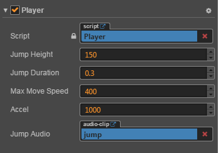

Now we can fully enjoy the newly created game. How many scores can you get? Don't forget that you can modify game parameters like movement control and star duration, etc. in the `Player` and `Game` components at anytime to quickly adjust the game's degree of difficulty. The scene needs to be saved after modifications of component properties. Only the saved values can be recorded.

## Summary

Congratulations! You have finished the first game created by Cocos Creator. We hope this quick start tutorial for beginners can help you understand the basic concepts and workflows in the game development process of Cocos Creator. If you are not interested in writing and learning script programming, you can directly copy and paste the completed script from the completed project.

Next, you can continue to perfect this game. The following are some recommended improving methods:

- Add a simple start menu, display a start button when the game starts running. Only after clicking the button will the game start
- Add a simple menu interface for the failure of the game. Only after clicking the button will the game restart after failure
- Restrict the movement of the main character to the window's boundaries
- Add more exquisite animation performance to the jumping action of the main character
- Add a countdown progress bar to the state when a star disappears
- Add more gorgeous effects when collecting stars
- Add input controls for touch screen devices

For editions that have been improved in all the above aspects, you can download [evolution edition project](https://github.com/cocos-creator/tutorial-first-game/releases/download/v1.2/polished_project.zip) for reference and learning, which will not be discussed in detail here.

Moreover, if you want to release the completed game on a server to share with your friends, you can read the content of the [Preview Build](basics/preview-build.md) section.

Today's tutorial ends here. You can immediately start creating your second Cocos Creator game or continue reading this guide. For any questions on this quick start tutorial, you can send feedback on [Warehouse of this tutorial on Github](https://github.com/cocos-creator/tutorial-first-game).
