# Cocos Creator Quick Guide for Unity Developers

With the increasing variety of game platforms and portals, developers want to be able to write their games once and publish them multiple times to different platforms and portals, and Cocos Creator is a great way to fulfill this need.

In this article, we will compare the following perspectives from a Unity developer's point of view to help Unity developers quickly get started with the Cocos Creator engine.

- Installation and Versioning
- Editors
- Editor Workflow
- Scripting and Debugging
- Shaders

## Installation and Versioning

The Unity Hub can be used to manage Unity's editor versions, projects, and templates. In Cocos Creator, you can also manage the engine, projects, and templates via the [Cocos Dash Board](https://www.cocos.com/creator-download).

| Unity Hub | Cocos Dashboard |
| :-- | :-- |
| 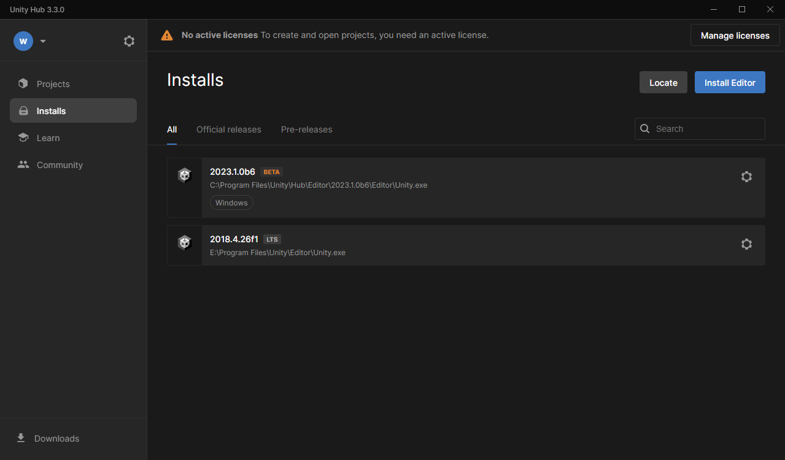 | 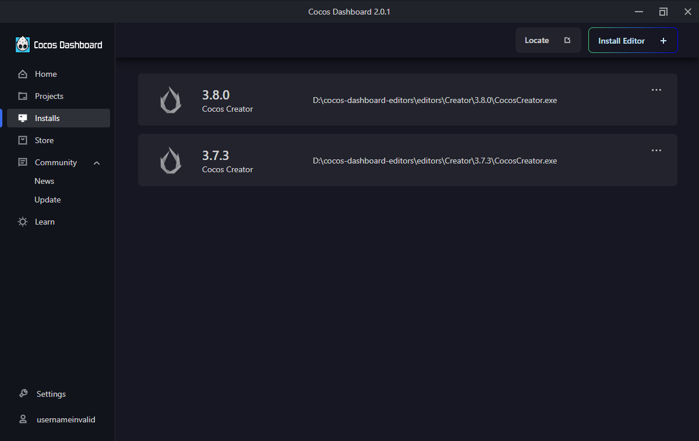 |

You can also find a large selection of extensions, resources and source code in the Store page, as well as more material to learn in the Learn page.

## Editor

As a Unity developer, you can seamlessly use Cocos Creator's editor in most cases, and they have a similar editor layout and usage.

| Unity Editor | Cocos Creator Editor |
| :-- | :-- |
| 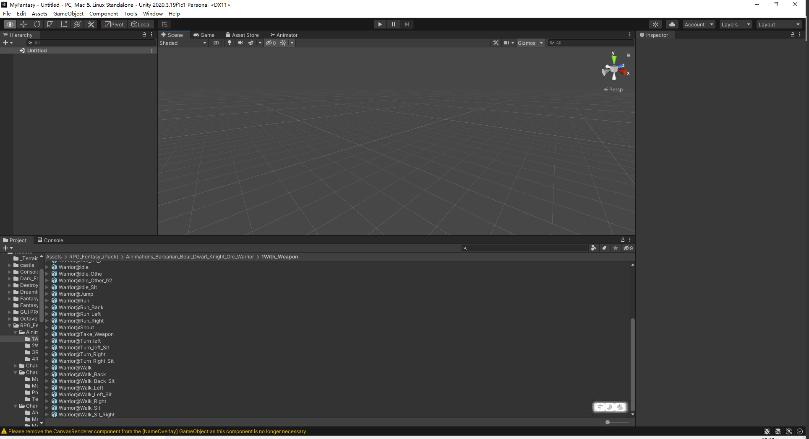 | 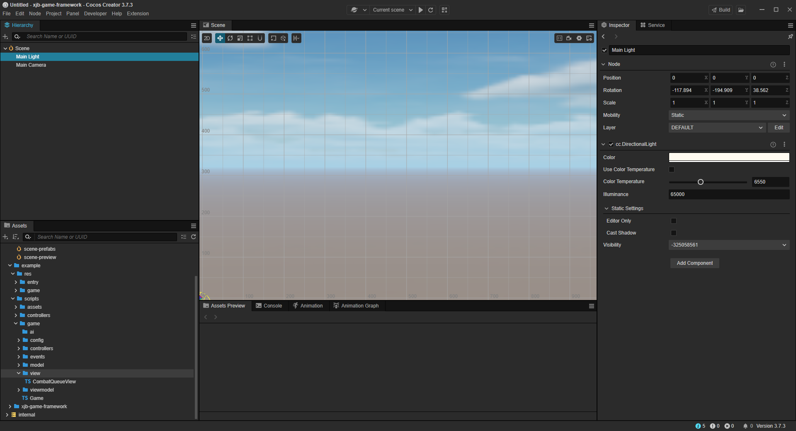

A slight difference is that Cocos Creator, because it is developed in Electronic+Chromium, allows you to both preview the game in a browser and run it directly in the editor.

## Workflows

Cocos Creator's 2D and 3D workflows are similar to Unity's, as you can read [Scene Creation Workflow](../../concepts/scene/index.md) to see Cocos Creator's workflow.

### Texture Assets

Importing texture assets is similar to Unity.

| Unity | Cocos |
| :-- | :-- |
| 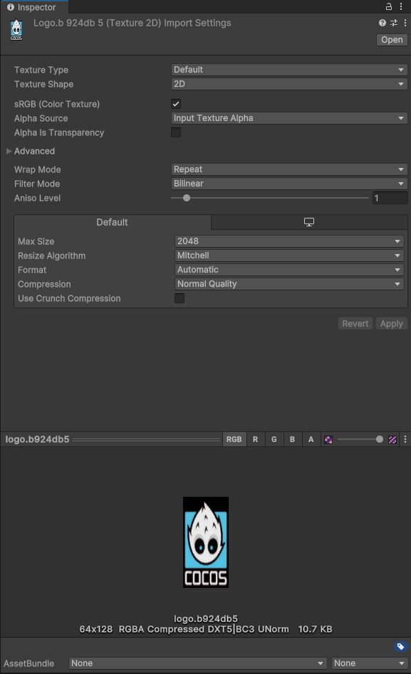 | 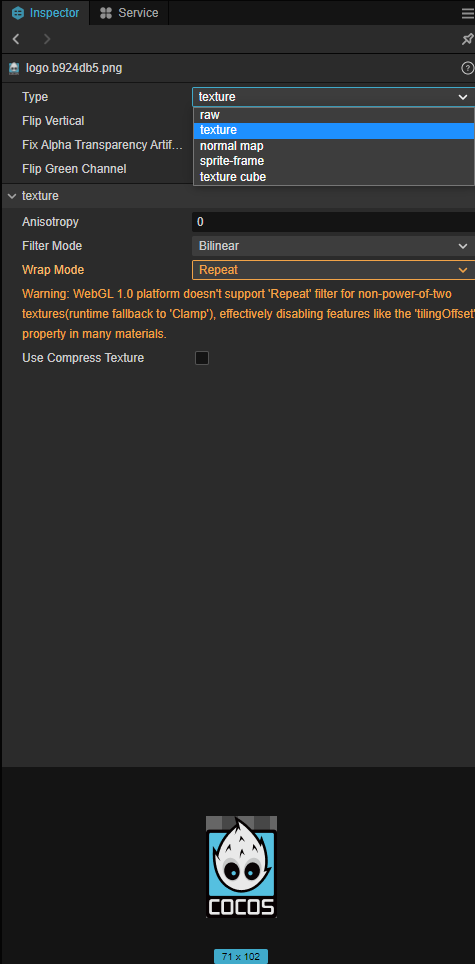 |

Global texture compression can also be configured in the project settings


### Models and animations

Importing FBX in Cocos Creator is the same as Unity, just drag and drop or copy the files into the Assets directory of your project.

| Unity | Cocos |
| :-- | :-- |
|  |  |

Cocos Creator also supports glTF format files, as well as standard materials for DCC tools such as Maya and 3DMax.

### Spine Animations

Cocos Creator has a built-in Spine animation component, which you can use directly through the `spine.Skeleton` component.

### Animation and State machine

Cocos Creator supports keyframe animations, skeletal animations.You can edit and preview these animations directly in the editor.

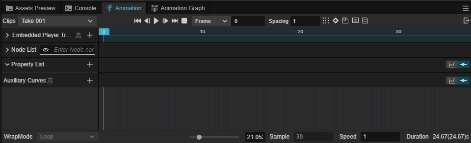

Similar to Unity's Animator, Cocos Creator supports the editing of animation state machines, which you can find in the [Marionette Animation System](../../animation/marionette/index.md).

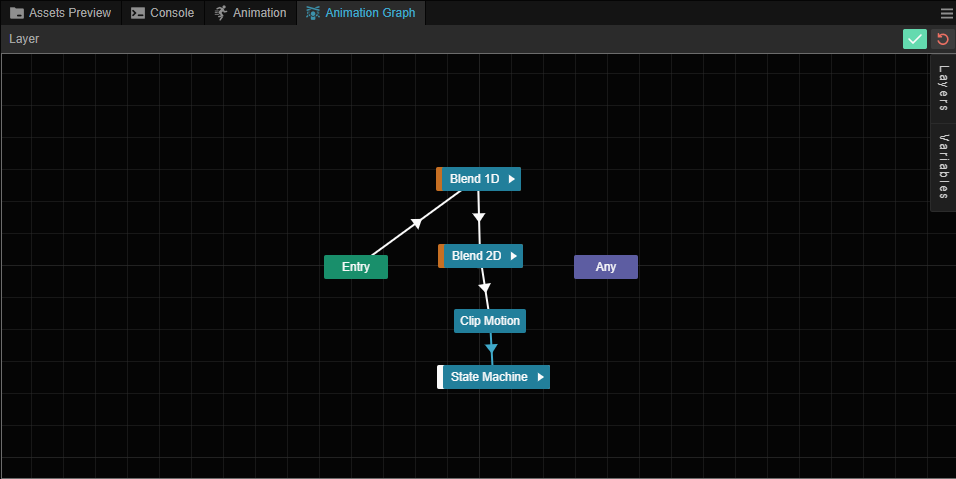

### Music and sound effects

Cocos Creator also supports Audio Source components for playing music and sound effects.

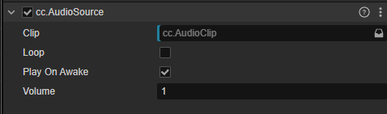

### Assets Package

Similar to Unity, Cocos Creator supports co-development by importing assets packages from the outside of the editor.

| Unity | Cocos |
| :-- | :-- |
| 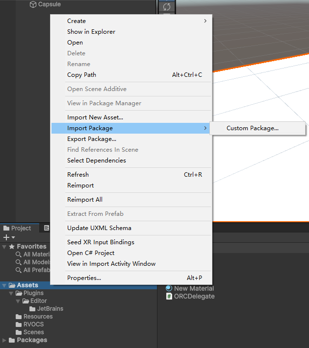 | 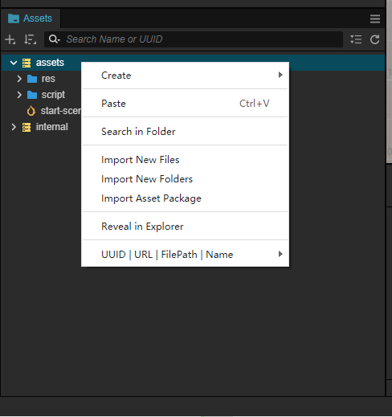 |

### Build and Publish

In addition to being published on various native platforms like Unity, Cocos Creator also supports publishing on small game platforms such as WeChat Small Games and TikTok Small Games.

| Unity | Cocos |
| :-- | :-- |
| 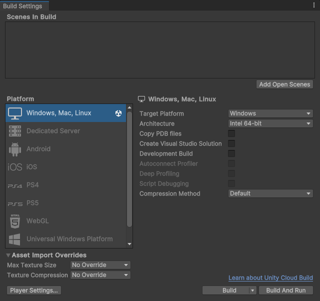 | 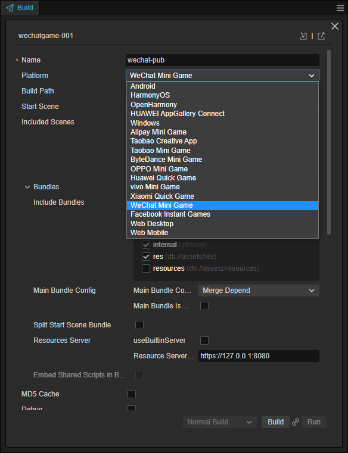 |

## Scripting and Debugging

Unlike Unity's GameObject, in Cocos Creator the entities in the scene are named Node, but similar to Unity, Cocos Creator is an ECS (Entity-Component-System) architecture, and you can add different components to a Node to realize the functionality of the game.

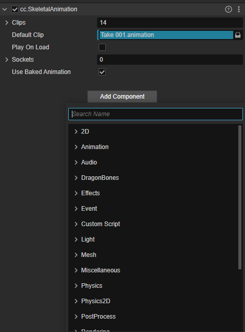

### Component Lifecycle

Similar to Unity, Cocos Creator's components have their own lifecycle. The system facilitates the developer's business logic by calling back registered methods within the component.

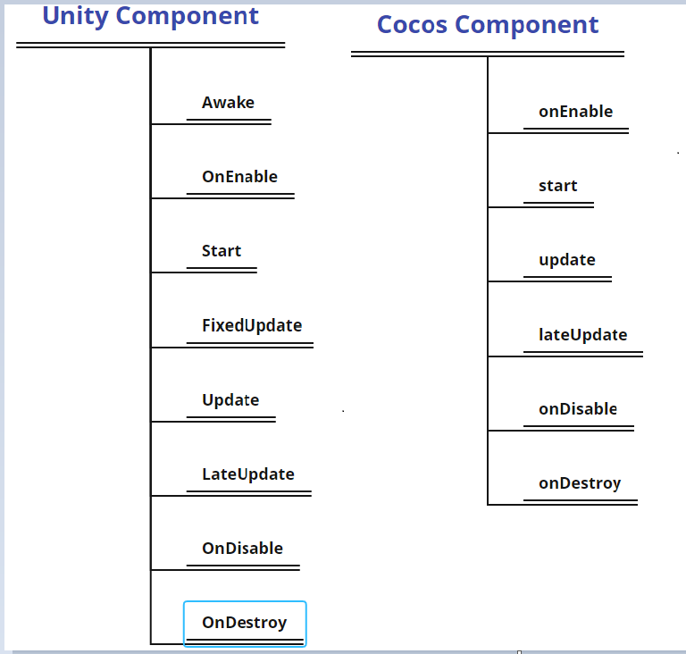

### Writing Custom Components

In Unity, we inherit from Monobehavior to implement our own game scripts.

```csharp
public class Player : NetworkBehaviour
{
    Animation _animation;

    Start(){
      
        _animation = gameObject.GetComponent<Animation>();
    }
}
```

Cocos Creator uses Typescript to write scripts.

The following example shows how to implement a custom component using Typescript.

```ts
@ccclass('MotionController')
export  class MotionController extends Component {  

    animation: SkeletalAnimation;

     start() {

        this.animation = this.getComponent(SkeletalAnimation);        
    }    
}
```

C# and Typescript are both programming languages developed by Microsoft and their ease of use is similar.

### Debugging and Logging

#### Logging Debugging

To use logging in Unity we can use the `Debug.Log` method.

To use logging in Cocos Creator, you can either use js's log printing `console.log()` or Cocos Creator's logging methods:

```ts
cc.log()
cc.debug()
cc.error()
```

#### Breakpoint Debugging

Unity can be debugged at breakpoints using Visual Studio or VSCode.

Cocos Creator uses VSCode or developer tools directly in the browser.

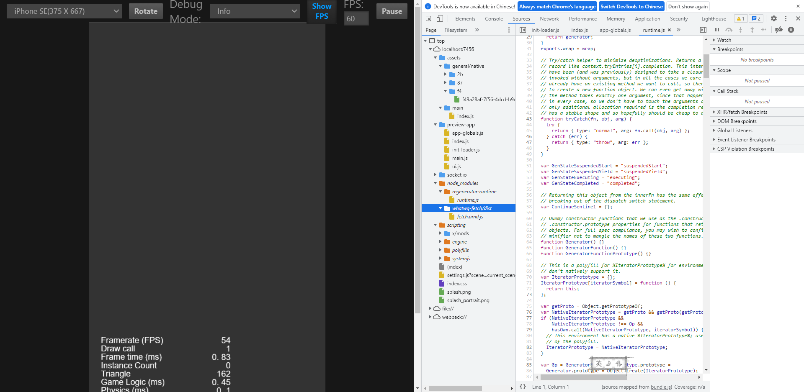

## Material and shader writing

### Materials

Cocos Creator materials have a similar preview and properties panel to Unity materials.

| Unity | Cocos |
| :-- | :-- |
| 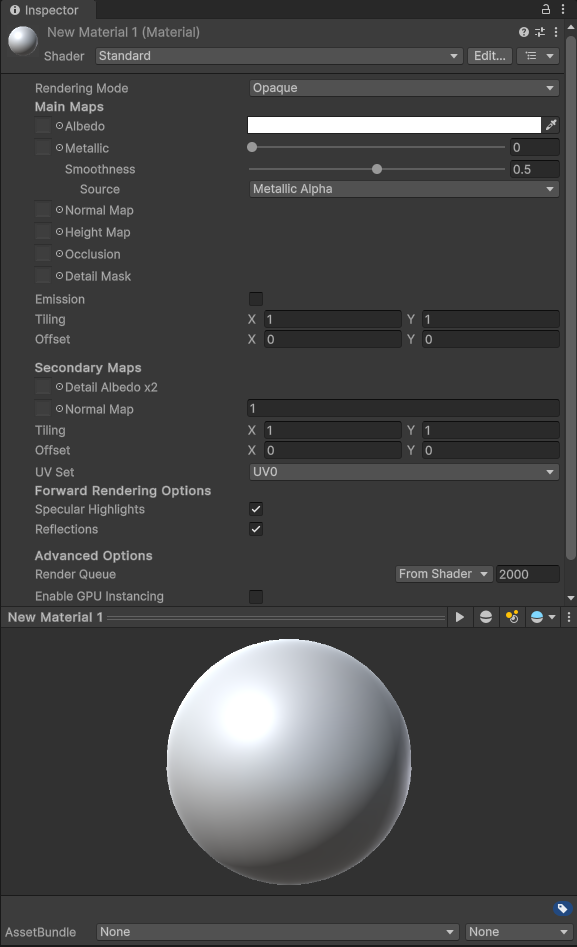 | 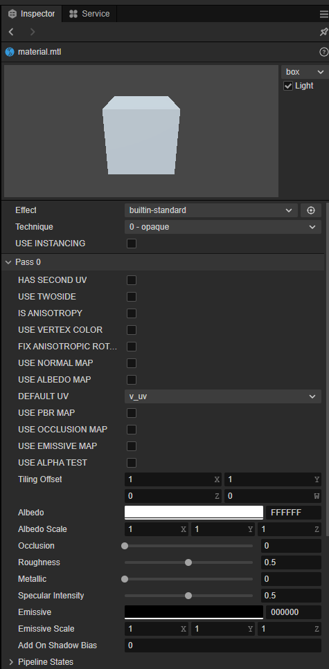 |

Unlike Unity, Cocos Creator makes it easier to view and define the state of the rendering in the pipeline in materials.

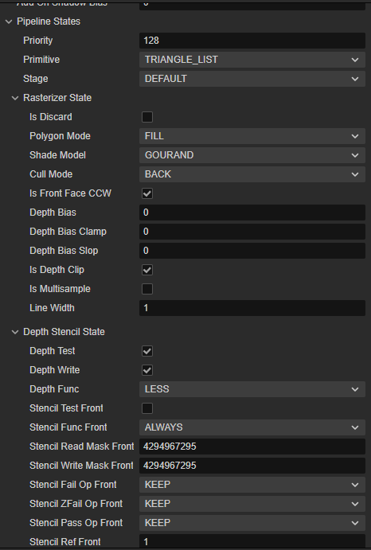

### Shaders

Unlike Unity, which supports CG, GLSL, and HLSL, Cocos Creator only supports GLSL as a shader programming language.

The table below compares the file formats they use and the differences in DSL.

| | Unity | Cocos |
| :--- | :--- | :--- |
| File Format  | *.shader | *.effect |
| DSL  | Cg/HLSL/GLSL + Unity Shader Format | GLSL + Yaml |

Unity uses a custom shader file as the DSL, while Cocos creator uses Yaml as the DSL file format.

#### Shader syntax rules

Unity Shader syntax rules.

```shader
Shader "Transparent/Cutout/DiffuseDoubleside" {
Properties {
 _Color ("Main Color", Color) = (1,1,1,1)
 _MainTex ("Base (RGB) Trans (A)", 2D) = "white" {}
 _Cutoff ("Alpha cutoff", Range(0,1)) = 0.5
}

SubShader {
 Tags {"IgnoreProjector"="True" "RenderType"="TransparentCutout"}
 LOD 200
 Cull Off
 
CGPROGRAM
#pragma surface surf Lambert alphatest:_Cutoff

sampler2D _MainTex;
float4 _Color;

struct Input {
 float2 uv_MainTex;
};

void surf (Input IN, inout SurfaceOutput o) {
 half4 c = tex2D(_MainTex, IN.uv_MainTex) * _Color;
 o.Albedo = c.rgb;
 o.Alpha = c.a;
}
ENDCG
}

Fallback "Transparent/Cutout/VertexLit"
}

```

Cocos Creator Shader syntax rules:

```
// Effect Syntax Guide: https://github.com/cocos-creator/docs-3d/blob/master/zh/material-system/effect-syntax.md

CCEffect %{
  techniques:
  - name: opaque
    passes:
    - vert: general-vs:vert # builtin header
      frag: unlit-fs:frag
      properties: &props
        mainTexture:    { value: white }
        mainColor:      { value: [1, 1, 1, 1], editor: { type: color } }
  - name: transparent
    passes:
    - vert: general-vs:vert # builtin header
      frag: unlit-fs:frag
      blendState:
        targets:
        - blend: true
          blendSrc: src_alpha
          blendDst: one_minus_src_alpha
          blendSrcAlpha: src_alpha
          blendDstAlpha: one_minus_src_alpha
      properties: *props
}%

CCProgram unlit-fs %{`
  precision highp float;
  #include <output>
  #include <cc-fog-fs>

  in vec2 v_uv;
  uniform sampler2D mainTexture;

  uniform Constant {
    vec4 mainColor;
  };

  vec4 frag () {
    vec4 col = mainColor * texture(mainTexture, v_uv);
    CC_APPLY_FOG(col);
    return CCFragOutput(col);
  }
}%

```

### Shader Syntax Comparison

This subsection compares the file structure of UnityShader and Cocos Effect.

### Structural Comparisons

Defining Shader Objects.

- Unity shader:

  ```shader
  Shader "<name>"
  {
      <optional: Material properties>
      <One or more SubShader definitions>
      <optional: custom editor>
      <optional: fallback>
  }
  ```

- Cocos Shader:

  ```yaml
  CCEffect %{
      <techniques>
          <passes>
      <techniques>
          <passes>

      <shader program>
  }

  ```

### Pass Structure

- Unity Shader：

  ```shader
  SubShader{

      <optional>Tag {}    

      <optionall> Pass
  }

  ```

  Pass：

  ```shader
  Pass{
      <name>

      <tag>    

      <code>
  }
  ```

- CocosCreator Shader:

  ```
  CCProgram <name> %{

      <in parameters>
      <out parameters>

      <uniforms>  

      function vert();

      function frag();
  }%
  ```
