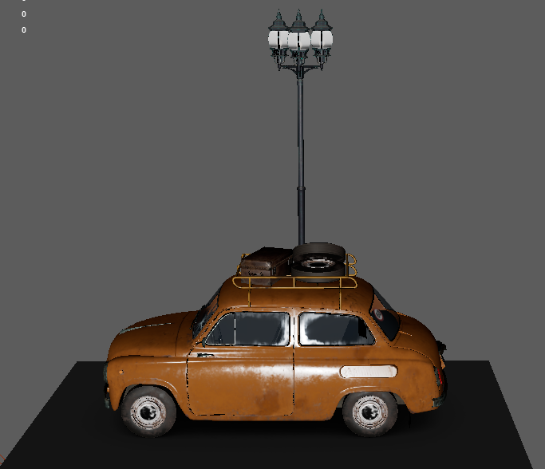
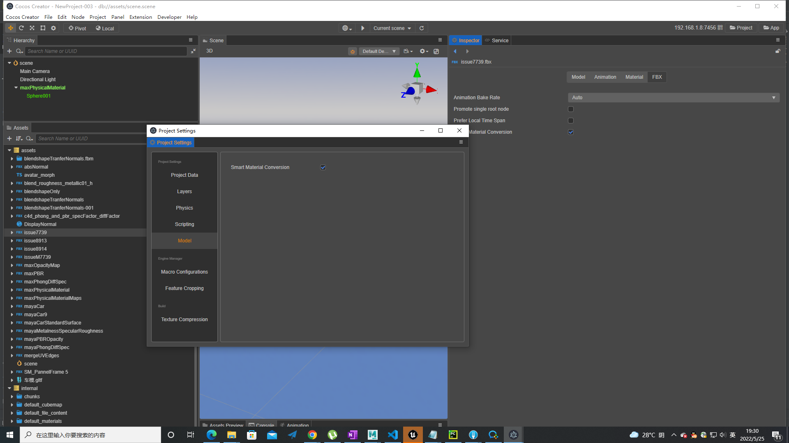
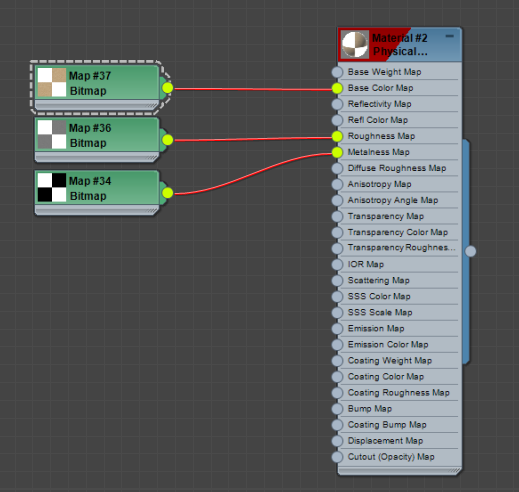
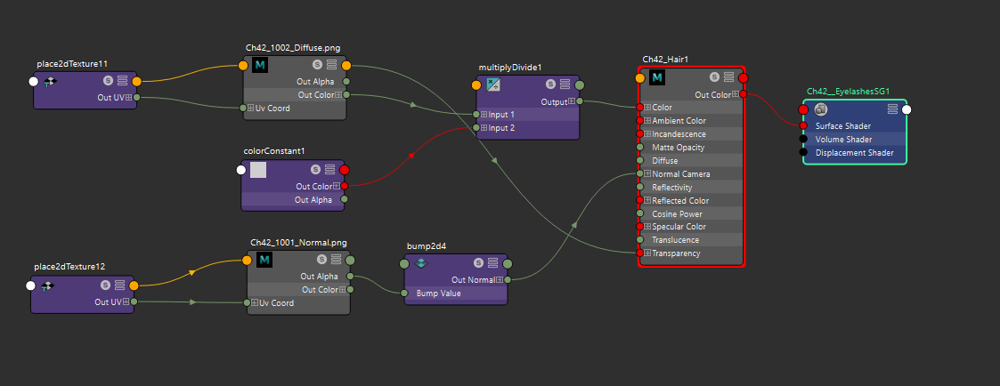
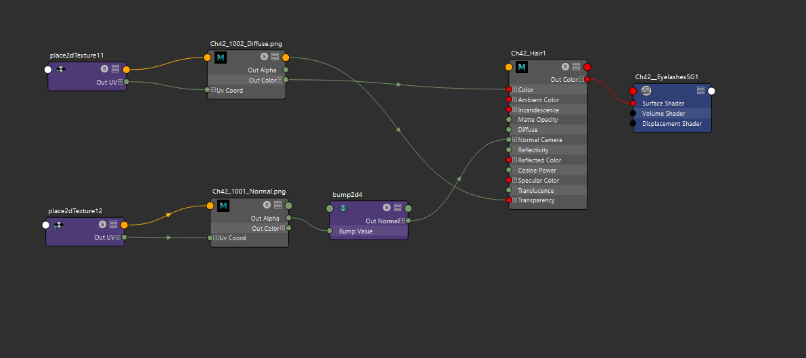
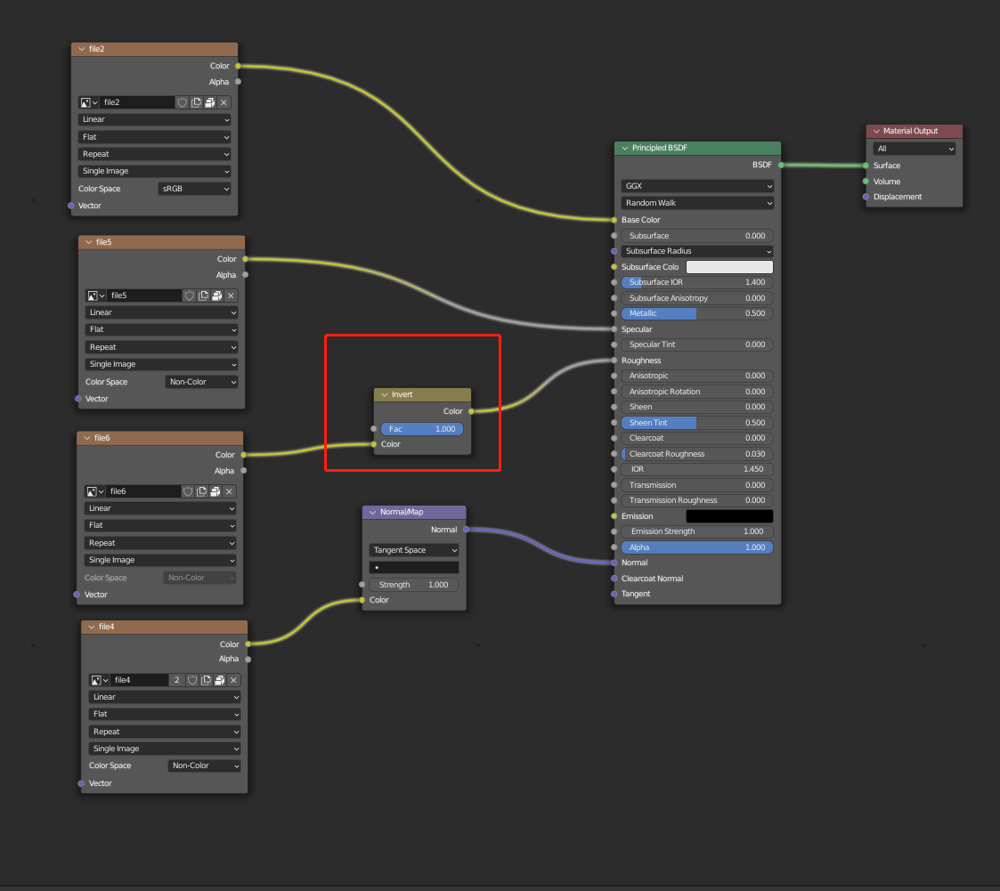
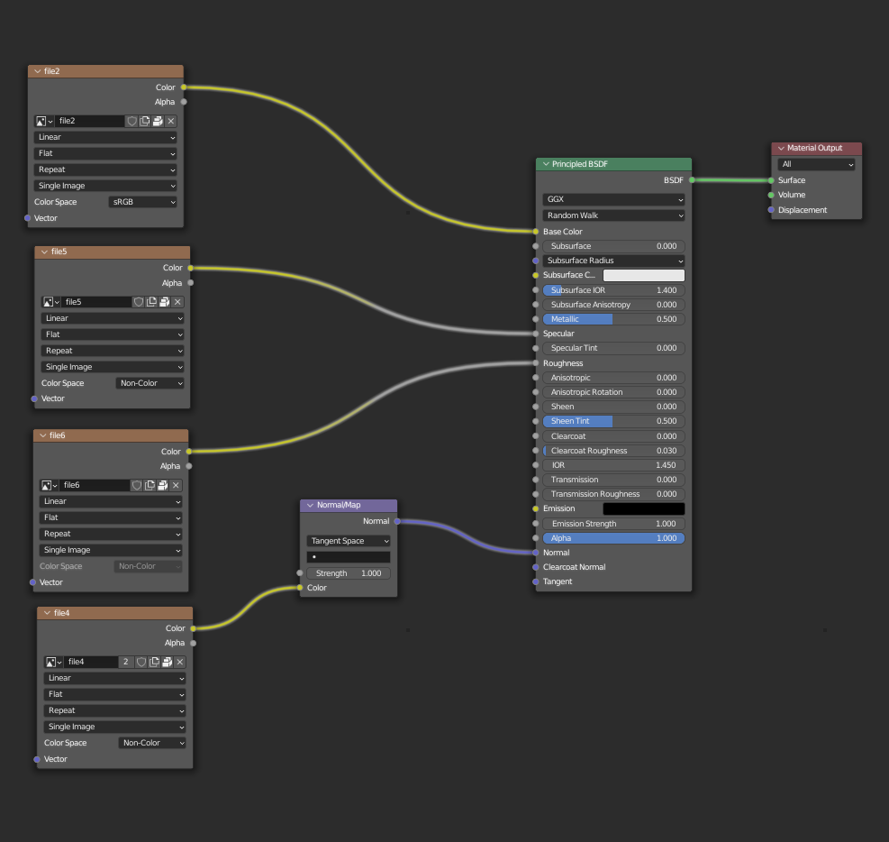

# FBX Smart Material Conversion
##  Smart Material Conversion in Importer is a feature of model importer, which can map some standard materials in DCC tools to Cocos Creator's built-in materials, and restore the effects of materials in DCC tools.
* The following materials are supported:

|         | Phong               | PBR               |
|---------|---------------------|-------------------|
| 3ds Max | Standard(legacy)    | Physical Material |
| Blender | None                | Principled BSDF   |
| C4D     | Standard            | None              |
| Maya    | Lambert/Blinn/Phong | Standard Surface  |
 
* Here is the comparison of maya standard surface in Maya and Cocos Creator:

| Maya Viewport              | Cocos Creator Viewport       |
|----------------------------|------------------------------|
|  |  |

You can refer to the following project files to ensure the importer can import Maya Standard Surface correctly.
 [Maya Car Demo](maya_car.zip)

## FBX Smart Material Conversion Importer Configuration and Process
1. In the Cocos Creator main menu, go to Project -> Project Settings -> Model -> Smart Material Conversion and make sure the option is enabled.
2. Select the FBX file in Cocos Creator, and make sure the Smart Material Conversion option is enabled in the Inspector panel of the FBX file.
The following is the final settings:

---
## Different DCC materials support in detail
### Autodesk 3ds Max
- Material:The following material types are supported:
  - Standard（Legacy）
  - Physical Material (Recommended)
  - Multi/SubObject
    - Multi/SubObject's sub-material type can only be Standard or Physical Material, and can't be Multi/SubObject, otherwise, the material will be lost.
- Texture:
  - The following texture channels are supported for Standard（Legacy） material:
    - Diffuse Color
    - Specular Color 
    - Glossiness 
    - Opacity 
    - Bump
  - The following texture channels are supported for Physical Material:
    - Base Color 
    - Roughness
    - Metalness
    - Bump
    - Opacity
  - Texture simplification requirements:
    - Before exporting FBX, please make sure the texture nodes on the right side of the material are all Bitmap nodes. 
    - Simplification method: [Convert a Procedural texture into a bitmap image texture in 3ds Max](https://knowledge.autodesk.com/support/3ds-Max/learn-explore/caas/sfdcarticles/sfdcarticles/How-to-convert-a-Procedural-texture-into-a-bitmap-image-texture-in-3ds-Max-for-fbx-export.html)
        

| Before Simplification | After Simplification    |
|-----------------------|-------------------------|
|    |  |

Rendering Note: For Max Physical Material, you need to enable High Quality Rendering in Max Viewport to get a relatively accurate preview. For a more accurate preview, you can pair Max and Cocos Creator rendering environment.
* For more information on Max Viewport Rendering Settings, you can refer to [tutorial](https://www.youtube.com/watch?v=82hhg8Q1nus&list=PL9xXzsdQ6pbZGBnVSKMBO_BCYjzmFTj0R&index=2)
* For more information on Cocos Creator Viewport Rendering Settings, you can refer to [Cocos Creator 官方文档](https://docs.cocos.com/creator/manual/zh/module-map/graphics.html)

### Autodesk Maya
- Material:The following material types are supported:
  - Lambert,Blinn,Phong,Phong-E
  - Standard Surface (Recommended)
- Texture:
  - The following texture channels are supported for lambert，blinn，phong：
    - Color
    - Normal
    - Transparency
    - SpecularColor
    - Cosine Power
  - The following texture channels are supported for Standard Surface:
    - Base Color
    - Specular Roughness 
    - Metalness
    - Normal 
    - Alpha
  - Texture simplification requirements:
    - Before exporting FBX, please make sure the texture nodes on the right side of the material are all File nodes. 
    - Simplification method: [Convert a Procedural texture into a File Texture in Maya](https://knowledge.autodesk.com/support/Maya/learn-explore/caas/CloudHelp/cloudhelp/2016/ENU/Maya/files/GUID-0F504570-CB7A-49D3-A7A2-83438C353A9C-htm.html)

| Before Simplification   | After Simplification     |
|-------------------------|--------------------------|
|  |   |

Rendering Note: For transparent material, you need to enable Depth peeling and Alpha Cut Prepass in maya. In order to get a more accurate preview, you can pair Maya and Cocos Creator rendering environment.
* For more information on Maya Viewport Rendering Settings, you can refer to [Maya 官方文档](https://help.autodesk.com/view/MayaUL/2022/ENU/index.html?contextId=Viewport20RendererDisplay)
* For more information on Cocos Creator Viewport Rendering Settings, you can refer to [Cocos Creator 官方文档](https://docs.cocos.com/creator/manual/zh/module-map/graphics.html)

### Cinema 4D
- Material:The following material type is supported:
  - Standard Material
- Texture:
  - The following texture channels are supported :
    - Diffuse Color
    - Specular Color 
    - Glossiness 
    - Opacity 
    - Bump
  - Texture export requirements: Before exporting to FBX, if a model has more than one material, you need to ensure that the faces and materials in the UV set have a unique correspondence.
    - [Example](https://github.com/cocos-creator/3d-tasks/issues/11267)

### Blender
   - Material:The following material type is supported:
     - Principled bsdf
   - Texture:
     - The following texture channels are supported :
       - Base Color
       - Roughness
       - Metallic
       - Normal
       - Alpha
     - Texture simplification requirements: Only file texture node and normal map node are supported. 
       - Simplification method: [Baking Procedural Materials to Image Textures in Blender](https://www.youtube.com/watch?v=AB24ITZHtuE)

| Before Simplification   | After Simplification    |
|-------------------------|-------------------------|
|  |  |

