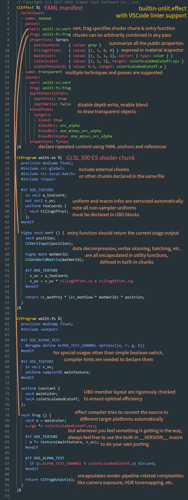

# Effect Syntax Guide

**Cocos Effect** is a single-source embedded domain-specific language, based on __YAML__ and __GLSL__. The __YAML__ part declares the general framework, while __GLSL__ part specifies the actual shader. Together they form a complete specification for the rendering process.

If you want to implement a custom shading effect in the engine, you need to write your own custom Effect. We recommend editing effect files using __Visual Studio Code__ with the official **Cocos Effect** plugin from the marketplace.

> **Note**: this document is targeted at Technical Artists or Graphics developers. If you are a design artist who needs specific shader customizations, please contact your Technical Artist or Programmer for support.

## Framework Syntax

Using `builtin-unlit.effect` as an example, it looks something like this:



## Effect Name

Effect name is automatically generated based on the **filename** and **path** of the effect, the path is a relative path based on the `assets/effects` directory, the filename does not include an extension.

Effect names can be directly used at runtime to acquire/use the `EffectAsset`:

```js
const effect = EffectAsset.get('builtin-unlit'); // this is the EffectAsset resource instance
const mat = new Material();
mat.initialize({ effectName: 'builtin-standard' }); // now `mat` is a valid standard material
```

> **Note**: the builtin effects of the editor are located directly inside the `assets/effects` folder in the internal database, so the effect names don't contain a path.

Select the material in the **Assets** panel, and then you can see all currently available effect names in the `Effect` property drop-down list in the **Inspector** panel.

## About YAML

YAML is a human-readable data-serialization language, with a flexible, minimal syntax and easily configurable, which makes it an ideal choice. However, the syntax maybe somewhat unique, at first for those who are unfamiliar with the language. For an introduction to the most commonly used syntaxes and language features, please refer to the [YAML 101](yaml-101.md) documentation.

## Configurable Pass Parameters

The shader entries are the only required fields, namely `vert` and `frag`, in the format of `shaderChunkName:entryFunctionName`.

Normally the `main` function shouldn't be specified in shader, for version-specific wrappers will be inserted at compile-time.

assigning the return value of the specified function to the output of current shader stage. (`gl_Position` or the final output color).

You can find all of the optional parameters in the [pass parameter list](pass-parameter-list.md) documentation.

## Shader Chunks

Syntactically shader chunks are a superset of GLSL, all the extended features will be processed immediately at resource compile-time. It can either be written inside the `CCProgram` block in `.effect` file, or directly in a separate `.chunk` file.

We recommend limiting the syntax within GLSL version 300 ES range to maintain best portability, although you can always write your own porting using GLSL built-in macro `__VERSION__`.

This section will introduce the 'domain-specific' extended features, all of which will be processed immediately at resource compile-time. Also feel free to look around the built-in effects, which are always excellent concrete examples.

On top of GLSL, the following c-style extensions are naturally introduced:

### Chunk Include

Just like the `include` directive in C/C++, you can include other shader chunks:

```c
#include <cc-global>
#include "../headers/my-shading-algorithm.chunk"
```

Relevant details:

- The `.chunk` extension can be omitted; quotation marks and angle brackets means the same.
- Every included header is guaranteed to be expanded only once; so every module could (and in fact should) include all its dependencies, even if there are overlaps.
- Dead code elimination is done at compile-time too, so including lots of unused utility functions shouldn't be of concern.
- There are two ways to reference a external chunk file: using the relative path to current file ('relative path'), or the relative path to `assets/chunks` folder of current project ('project absolute path'). If the specified file interpreted under both rules are present, the latter is preferred.
- When including files from other databases (like the internal database), only project absolute path is supported. When there are multiple databases have the same specified file, the priority is: **User Project DB > Plugin DB > Internal DB**.
- The built-in chunks are located directly inside `assets/chunks` in the internal database. Include these without path prefix.
- All `CCProgram` blocks in the same effect file can include each other.

### Pre-processing Macros

Currently the effect system tends to take advantage of the language built-in pre-processing macros to create shader variants. The effect compiler will collect the macros that appear in shaders, and declarations will be inserted accordingly at runtime.

For the most part, use them without thinking about the effect compiler, while material inspector will automatically integrate both macros and shader properties into a natural editing interface.

Relevant details:
- To type check as many branches as possible at effect compile-time, the strategy currently taken is to set all macros to `1` (or its given default value) before doing the actual check; so make sure this combination works (or if not, maybe you need numerical macros, specified in the next section).
- All the macros that are not enabled at runtime will be explicitly given a value of 0, so please avoid using `#ifdef` or `#if defined` (**except the GLSL built-in macros, like extension indicators with `GL_` prefix**), for they would alway be true.
- Hash values will be calculated for each macro combination at runtime. For a single shader, the process is the most efficient when there are less than **2^32** combinations (a standard integer range), that means 32 boolean macros switches (or less if there are numerical macros). Try to keep in this range to maintain optimal performance.

### Macro Tags

Although the effect compiler will try to be smart and collect all pre-processing branches, sometimes there are more complicated cases:

```glsl
// macro defined within certain numerical 'range'
#if LAYERS == 4
  // ...
#elif LAYERS == 5
  // ...
#endif
// multiple discrete 'options'
float metallic = texture(pbrMap, uv).METALLIC_SOURCE;
```

For these special usages, you'll have to explicitly declare the macro, using macro tags:

| Tag     | Description | Default Value | Usage |
| :------ | :---------- | :------------ | :---- |
| **range**   | A two-element array, specifying minimum and maximum value, both inclusive | [0, 3] | For macros with bounded range. The bound should be as tight as possible |
| **options** | An arbitrary-length array, specifying every possible options | nothing | For macros with discrete, explicit choices |

Declarations for the above case are:

```glsl
#pragma define-meta LAYERS range([4, 5])
#pragma define-meta METALLIC_SOURCE options([r, g, b, a])
```

The first line declares a macro named `LAYERS`, with possible range of [4, 5].

The second line declares a macro named `METALLIC_SOURCE`, with four possible options: 'r', 'g', 'b', 'a'.

> **Note**: every tag accepts a single parameter, in the syntax of YAML.

> **Note**：Before v3.5, the syntax for Macro Tags feature is `#pragma define`, but from v3.5, the syntax will be automatically upgraded to `#pragma define-meta` during effect migration process, please pay attention to use the right syntax if you are writing new effect or using external effects without meta file.

### Functional Macros

Due to lack of native support in WebGL platform, functional macros are provided as an effect compile-time feature, all references will be expanded in the output shader.

This is an good match for inlining some simple utility functions, or similar code repeating several times.

In fact, many built-in utility functions are functional macros:

```glsl
#pragma define CCDecode(position) \
  position = vec4(a_position, 1.0)
#pragma define CCVertInput(position) \
  CCDecode(position);         \
  #if CC_USE_SKINNING         \
    CCSkin(position);         \
  #endif                      \
  #pragma // empty pragma trick to get rid of trailing semicolons at effect compile time
```

Meanwhile, same as the macro system in C/C++, the mechanism does nothing on checking the [Hygienic Macro WikiPedia Entry](https://en.wikipedia.org/wiki/Hygienic_macro). Any issues will have to be dealt with by developers manually:

```glsl
// please do be careful with unhygienic macros like this
#pragma define INCI(i) do { int a=0; ++i; } while(0)
// when invoking
int a = 4, b = 8;
INCI(b); // correct, b would be 9 after this
INCI(a); // wrong! a would still be 4
```

> **Note**：Before v3.5, the syntax for Functional Macros feature is `#define`, but from v3.5, the syntax will be automatically upgraded to `#pragma define` during effect migration process, please pay attention to use the right syntax if you are writing new effect or using external effects without meta file.

### Vertex Input[^1]

To encapsulate in-shader data pre-processing like data decompression and vertex skinning, utility function `CCVertInput` is provided.

For all shaders used to draw mesh assets, you need something like this:

```glsl
#include <input>
vec4 vert () {
  vec3 position;
  CCVertInput(position);
  // ... do your thing with `position` (models space, after skinning)
}
```

If normals are required, use the standard version:

```glsl
#include <input-standard>
vec4 vert () {
  StandardVertInput In;
  CCVertInput(In);
  // ... now use `In.position`, etc.
}
```

This will acquire position, normal and tangent data, all after vertex skinning.

Other vertex data (uv, color, etc.) can be declared directly.

To support dynamic instancing & batching, use `CCGetWorldMatrix`:

```glsl
#include <cc-local-batch>

vec4 vert () {
  // ...
  // unlit version (when normal is not needed)
  mat4 matWorld;
  CCGetWorldMatrix(matWorld);
  // standard version
  mat4 matWorld, matWorldIT;
  CCGetWorldMatrixFull(matWorld, matWorldIT);
  // ...
}
```

You can find the complete built-in shader uniform list [in this](builtin-shader-uniforms.md) documentation.

### Fragment Output[^1]

To encapsulate render pipeline complexities, use `CCFragOutput`.

For unlit shaders:

```glsl
#include <output>
vec4 frag () {
  vec4 o = vec4(0.0);
  // ... do the computation
  return CCFragOutput(o);
}
```

The code can work in both the __HDR__ and __LDR__ pipelines.

If lighting is involved, combine with `CCStandardShading` to form a surface shader structure:

```glsl
#include <shading-standard>
#include <output-standard> // note the header file change
void surf (out StandardSurface s) {
  // fill in your data here
}
vec4 frag () {
  StandardSurface s; surf(s);
  vec4 color = CCStandardShading(s);
  return CCFragOutput(color);
}
```

Under the framework writing your own surface shader or even shading algorithm becomes straightforward.

> **Note**: the `CCFragOutput` function should not be overridden, unless using custom render pipelines.

### Custom Instancing Attribute

Dynamic instancing is a very flexible batching framework, which allows user-defined instanced properties on top of the built-in ones. If you want to define them in shader, all the related processing code need to be wrapped inside the agreed upon macro `USE_INSTANCING`:

```glsl
#if USE_INSTANCING // when instancing is enabled
  #pragma format(RGBA8) // normalized unsigned byte
  in vec4 a_instanced_color;
#endif
```

> **Notes**:
> 1. The actual data format can be specified using compiler hint `format` tag, which accepts a single parameter in the form of `GFXFormat` enum name[^2]. 32-bytes float type will be assumed if the tag is omitted.
> 2. All instanced properties are input attributes of the vertex shader, so if some property is needed in fragment shader, you need to pass it as variables.
> 3. Make sure the code works for all branches, regardless of the actual state of `USE_INSTANCING`.

The instanced property value will be initialized to all zeros by default. Use the `setInstancedAttribute` on `MeshRenderer` to assign new values:

```ts
const comp = node.getComponent(MeshRenderer);
comp.setInstancedAttribute('a_instanced_color', [100, 150, 200, 255]); // should match the specified format
```

> **Note**: the instanced properties will be reset to all zeros whenever creating a new PSO (the most common case is when assigning a new material).

### WebGL 1 fallback Support

The effect compiler provides fallback conversion from GLSL 300 ES to GLSL 100 automatically, for WebGL 1.0 only support GLSL 100 syntax. this should be transparent to developers for the most time.

Currently the automatic conversion only supports some basic usage, and if some post-100 features or extensions were used, (texelFetch, textureGrad, etc.) Developers have to do your own porting using the language built-in `\_\_VERSION__` macro:

```glsl
vec4 fragTextureLod (samplerCube tex, vec3 coord, float lod) {
  #if __VERSION__ < 130
    #ifdef GL_EXT_shader_texture_lod
      return textureCubeLodEXT(tex, coord, lod);
    #else
      return textureCube(tex, coord, lod); // fallback to bias
    #endif
  #else
    return textureLod(tex, coord, lod);
  #endif
}
```

The effect compiler will finally split these compile-time constant branches into different output versions.

### About UBO Memory Layout

First the conclusion, the final rules are, every non-sampler uniform should be specified in UBO blocks, and for every UBO block:

1. There should be no vec3 typed members.
2. For array typed members, size of each element should be no less than a vec4.
3. Any member ordering that introduces a padding will be rejected.

These rules will be checked rigorously at effect compile-time and throws detailed, implicit padding related compile error.

This might sound overly-strict at first, but it's for a few good reasons:

__First__, UBO is a much better basic unit to efficiently reuse data, so discrete declaration is no longer an option.

__Second__, currently many platforms, including WebGL 2.0 only support one platform-independent memory layout, namely **std140**, and it has many restrictions[^3]:

- All vec3 members will be aligned to vec4

  ```glsl
  uniform ControversialType {
    vec3 v3_1; // offset 0, length 16 [IMPLICIT PADDING!]
  }; // total of 16 bytes
  ```

- Any array member with element size less than a vec4 is aligned to vec4 element-wise

  ```glsl
  uniform ProblematicArrays {
    float f4_1[4]; // offset 0, stride 16, length 64 [IMPLICIT PADDING!]
  }; // total of 64 bytes
  ```

- All UBO members are aligned to the size of itself[^4]:

  ```glsl
  uniform IncorrectUBOOrder {
    float f1_1; // offset 0, length 4 (aligned to 4 bytes)
    vec2 v2; // offset 8, length 8 (aligned to 8 bytes) [IMPLICIT PADDING!]
    float f1_2; // offset 16, length 4 (aligned to 4 bytes)
  }; // total of 32 bytes

  uniform CorrectUBOOrder {
    float f1_1; // offset 0, length 4 (aligned to 4 bytes)
    float f1_2; // offset 4, length 4 (aligned to 4 bytes)
    vec2 v2; // offset 8, length 8 (aligned to 8 bytes)
  }; // total of 16 bytes
  ```

This means lots of wasted space, and some driver implementation might not completely conform to the standard[^5], hence all the strict checking procedure help to clear some pretty insidious bugs.

**The actual uniform type can differ from the public interfaces the effect exposes to artists and runtime properties. Through the [property target](pass-parameter-list.md#Properties) system, every single channel can be manipulated independently, without restriction of the original uniform.**

[^1]: Shaders for systems with procedurally generated mesh, like particles, sprites, post-effects, etc. may handle things a bit differently.
[^2]: Integer-typed attributes are not supported on WebGL 1.0 platform, so use the default float type if targeting this platform.
[^3]: [OpenGL 4.5, Section 7.6.2.2, page 137](http://www.opengl.org/registry/doc/glspec45.core.pdf#page=159)
[^4]: In the example code, UBO `IncorrectUBOOrder` has a total size 32. Actually this is still a platform-dependent data, due to what it seems like an oversight in the GLSL specification. More discussions can be found [here](https://bugs.chromium.org/p/chromium/issues/detail?id=988988).
[^5]: **Interface Block - OpenGL Wiki**: <https://www.khronos.org/opengl/wiki/Interface_Block_(GLSL)#Memory_layout>
