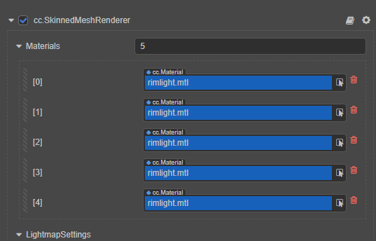

# Programmatic use of materials

## Materials creation

Material resources can be regarded as resource instances of shader resources (EffectAsset) in the scene.

Creator supports manually [creating material resources](../asset/material.md) in **Assets**, and also supports [IMaterialInfo](__APIDOC__/zh/#/docs/3.4/zh/material/Interface/IMaterialInfo) interface to create materials programmatically in a script module. Configurable parameters for `IMaterialInfo` include:

- `effectAsset`/`effectName`：An effect asset reference that specifies which EffectAsset describes the process to use for rendering. (either `effectAsset` or `effectName` must be selected)
- `technique`：Specifies which technique in the EffectAsset to use, defaults to 0.
- `defines`：List of macro definitions, specifying which [preprocessing macro definitions](../shader/macros.md) to enable, all are disabled by default.
- `states`：List of pipeline state overloads, specifying which overloads are available for rendering pipeline states (depth, stencil, transparent blending, etc.), the default is consistent with the effect declaration.

Code example to create a material is as follows:

```ts
const mat = new Material();
mat.initialize({
    // Specifies the shader resource used by the material by the effect name
    effectName: 'pipeline/skybox',
    defines: {
        USE_RGBE_CUBEMAP: true
    }
});
```

## Use material



Any renderer component can be accessed programmatically in the script module. The code example is as follows:

```ts
// Materials for 3D objects are accessible through mesh renderer components (MeshRenderer, SkinnedMeshRenderer, SkinnedMeshBatchRenderer)
let renderable = this.getComponent(MeshRenderer);

// Get the material with index 0
let material = renderable.getMaterial(0)

// Set the material with index 0
renderable.setMaterial(mat, 0);

let sprite = this.node.getComponent(Sprite)

// Get a custom material for a 2D renderer component
let customMaterial = sprite.customMaterial;

// Set custom materials for 2D renderer components
sprite.customMaterial = mat;

// Get and set the material of the particle renderer
let particleSystem = this.getComponent(ParticleSystem);
const material = particleSystem.material;
particleSystem.material = material;

// Set and get particle trailing material
const trailMaterial = particleSystem.renderer.trailMaterial;
particleSystem.renderer.trailMaterial = trailMaterial;
```

> **Notes**:
> 1. What is accessed here is the shared material.
> 2. There are two situations in the material: shared material and material instance. Shared material cannot be batched with material instance.

## Set material properties

After the material is initialized through the `IMaterialInfo` interface, the `Uniform` variable of the material can only be set through `Material.setProperty`. The code example is as follows:

```ts
mat.setProperty("uniform name", uniformValue)
```

`Uniform` corresponds to `Uniform`-qualified variables declared within `Shader`. To learn more about `Uniform` please refer to:

- [Cocos Effect builtin Uniform](../shader/uniform.md)
- [GLSL storage qualifier](../shader/glsl.md#存储限定符)

If you need to set the value of `Uniform` frequently, use `Pass.setUniform` for better performance.

## Shared material & material instance

In the renderer component, materials exist as **shared materials** and **material instances**.

- **Shared materials**

    A shared material is used by multiple renderer components, and modifying the shared material affects all renderer components that use it. By default, the same material is shared among multiple renderer components.

    The code example to get the shared material is as follows:

    ```ts
    // Get the renderer component
    let renderableComponent = this.node.getComponent(MeshRenderer) as RenderableComponent
    // Get the element at index 0 in the shared material array
    let sharedMaterial = renderableComponent.sharedMaterial
    // Get an array of shared materials
    let sharedMaterials = renderableComponent.sharedMaterials
    // Get the element at index 0 in the shared material array
    let sharedMaterial = renderableComponent.getMaterial(0)
    ```

- **Material instance**

    Material instances are used solely by a single renderer component, and modifying a material instance affects only the renderer components that use it. The material defaults to a shared material. When the shared material is modified, the engine will create a material instance according to the material, for example:

    - When the `getter` of `RenderableComponent.getMaterialInstance` or `RenderableComponent.material` is called, the engine will create a material instance based on the current material
    - When the `setter` of `RenderableComponent.material` is called, the engine will create a material instance based on the passed in material

    The code example is as follows:

    ```ts
    // Get the renderer component
    let renderableComponent = this.node.getComponent(MeshRenderer) as RenderableComponent
    // Get the array of material instances, if not, create it according to the current material array
    let materialInstances = renderableComponent.materials
    // Get the element with index 0 in the material instance array, if not, create it according to the current material
    let materialInstance = renderableComponent.material     
    // Get the material instance, if not, create it according to the current material
    let materialInstance = renderableComponent.getMaterialInstance(materialIndex);
    ```

### FAQ

**Q**：Why the DrawCall is increased after modifying the properties of the material? <br>
**A**：It may be because the `getMaterialInstance` of the renderer component or the `getter` method of `RenderableComponent.material` is used, resulting in the generation of a new material instance, which affects the batching process.
