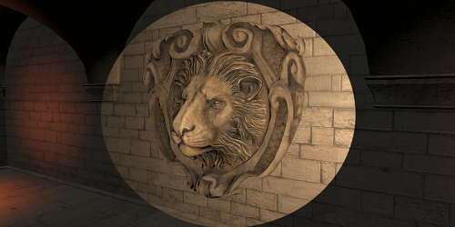

# Graphics Rendering

||||
|:-|:-|:-|
|[ Material The properties of the model surface controlled by the shader.](../material-system/overview.md)|[ Light Lighting, shading control and environment settings.](./light.md)|[ Particle Create and use various types of particle effects.](../particle-system/overview.md)
