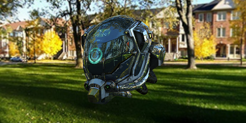
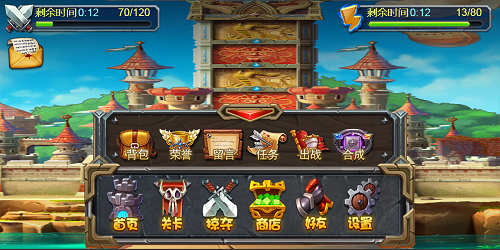
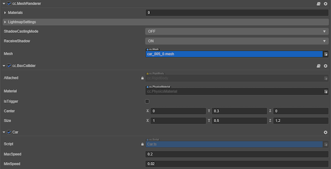

# Engine Features Map Guide

||||
|:-|:-|:-|
|[ Graphics Render Rendering system, including materials, lighting, particles, etc.](./graphics.md)|[ UI System UI system, including all UI-related content.](../ui-system/components/engine/index.md)|[ Animation System Generic animation and skeletal animation system based on animation frame data and skeletal vertex data.](../animation/index.md)
|[ Audio Control the playback, pause, etc. of sound clips.](../audio-system/overview.md)|[ Physical Simulation Physical simulation, mainly including rigidbody and collision, etc.](../physics/physics.md)|[ Scripting Guide and Event System Guidelines for scripting to implement user-defined behaviors, including triggering mechanisms for events, etc.](../scripting/index.md)
|[ Components Components for adding different functions to game objects.](../editor/components/index.md)|[ Assets An introduction to the different resources used by the engine and an overview of the overall resource workflow.](../asset/index.md)|[ Scene and Environment Settings Scene structure and environment related settings.](../concepts/scene/index.md)
