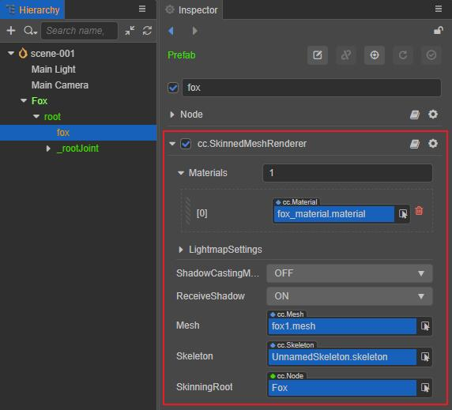

# SkinnedMeshRenderer

The SkinnedMeshRenderer component is mainly used for rendering skinned model meshes.

After [Import Model Assets](../../asset/model/mesh.md), the SkinnedMeshRenderer component will be automatically added to the model nodes when the model is used if the model mesh has skinning information.

## Properties

| Properties | Description |
| :--- | :--- |
| **Materials** | Mesh assets allow multiple materials, all of which are in the `materials` array.  If the mesh asset has more than one sub-mesh, then the Mesh Renderer will get the corresponding material from the `materials` array to render this sub-mesh. |
| **LightmapSettings** | For baking Lightmap, please refer to [Lightmap](../../concepts/scene/light/lightmap.md) for details |
| **ShadowCastingMode** | Specify whether the current model will cast shadows, you need to [Enable Shadow Effect](../../concepts/scene/light/shadow.md#Enable%20Shadow%20Effect) in the scene first |
| **ReceiveShadow** | Specify whether the current model will receive and display shadow effects generated by other objects, you need to [Enable Shadow Effect](../../concepts/scene/light/shadow.md#Enable%20Shadow%20Effect) in the scene first. This property only takes effect when the shadow type is **ShadowMap**. |
| **Mesh** |Specify the mesh asset used for rendering, [Mesh Assets](../../engine/renderable/model-component.md#Mesh%20Assets) in the mesh renderer component section.|
| **Skeleton** | The skeletal data of the current model, usually directly from the imported glTF or FBX model file |
| **SkinningRoot** | Reference to the skeleton root node, corresponding to the node that controls the animation component of the model |

Please refer to [SkinnedMeshRenderer API](__APIDOC__/en/class/SkinnedMeshRenderer) for API reference.

The difference between SkinnedMeshRenderer component and MeshRenderer component are as follows:

- The MeshRenderer component renders a static model, consisting of 3D model data
- The SkinnedMeshRenderer component renders not only the model but also the bones, so in addition to the 3D model data, it also includes data such as bone data and vertex weights.  However, if there is no skeleton data mounted on the SkinnedMeshRenderer, it is no different from a normal MeshRenderer component.
