# ShapeModule

The shape module is mainly used to set the particle emitter shape, particle emission direction and velocity.

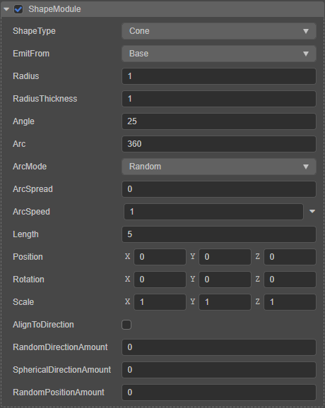

## Public properties

There are a number of properties that are common to all types of emitters, including:

Property | Features
:---|:---
| **ShapeType** | Emitter shapes. The types **Box**, **Circle**, **Cone**, **Sphere**, **Hemisphere** are currently supported. |
| **Position** | The position of the emitter relative to the node where it is located |
| **Rotation** | Rotation of the emitter relative to its node, which can be used to adjust the particle emission direction |
| **Scale** | Scaling of the emitter relative to the node it is on can be used to adjust the size of the emitter shape, i.e. the particle emission range |
| **AlignToDirection** | The direction of particle movement is determined by the initial direction of particle emission, which can be used to simulate an effect similar to water spilling out of a bucket |
| **RandomDirectionAmount** | Particle generation direction random mix setting.  No effect when set to 0;  Random direction when set to 1 |
| **SphericalDirectionAmount** | Indicates the interpolation between the current emission direction and the direction of the line from the current position to the center of the node. When this value is set to 1, particles are emitted from the center to the outside (the same behavior as when **ShapeType** is set to **Sphere**) |
| **RandomPositionAmount** | The particle generation position is set randomly, when this value is set **not 0**, the particle generation position will be out of the size range of the generator |

## Box

When the **ShapeType** property is set to **Box**, it is a box emitter.

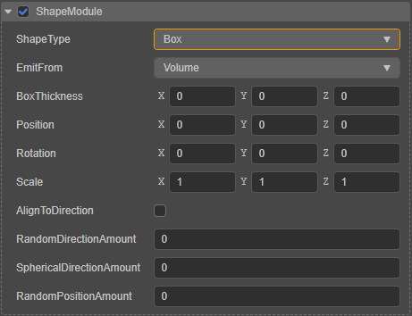

The special property items if box emitter are described as follows.

| Properties | Description |
| :---|:--- |
| **EmitFrom** | The part of the box from which the emitter emits particles, including:  **Volume**: Emitted from inside the box **Shell**: Emitted from the box surface **Edge**: Emitted from the box edge |
| **BoxThickness** | The thickness of the box in each emitting direction, effective only when **EmitFrom** is selected for **Shell** mode |

Also in the **Scene Editor** there will be a box Gizmo that shows the shape size of the box emitter.

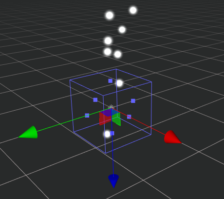

The **Scale** property of the box emitter can be adjusted by dragging the box Gizmo's square control point directly:

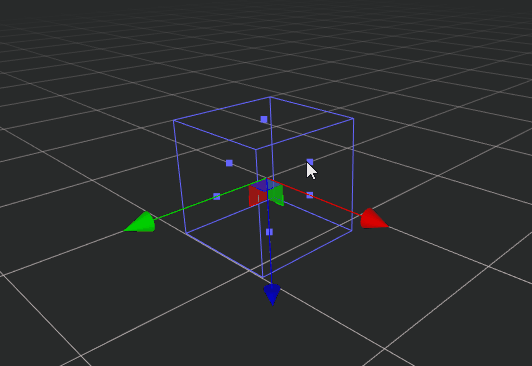

## Circle

When the **ShapeType** property is set to **Circle**, it is a circle emitter.

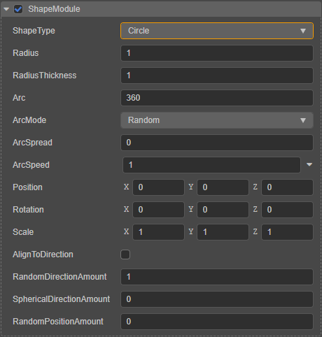

The special property items are described as follows:

| Properties | Description |
| :--- | :--- |
| **Radius**          | Set the radius of the circle emitter |
| **RadiusThickness** | The position of the round emitter emitting particles. When set to **0**, it means firing from the circumference of the circle When set to **1**, it means firing from the center of the circle When set to between **0~1**, it means firing from the center of the circle to the circumference of the circle, within a certain proportional range |
| **Arc**             | Set the fan area where the circle emitter emits particles
| **ArcMode**         | Sets how the particles are emitted in the sector, including. **Random**: random firing **Loop**: cyclic firing in a certain direction, each cycle in the same direction **PingPong**: cyclic firing, each cycle in the opposite direction of the previous one |
| **ArcSpread**       | Sets the discrete interval around the arcs where particles may be generated. Example: When set to 0, particles can be generated anywhere in the arc; when set to 0.2, particles are generated only at 20% intervals around the arc. |
| **ArcSpeed**        | Indicates the velocity of the particle emitted along the arc. Click the down icon button on the right to open the curve editor to edit the curve for this property.

Also in the **Scene Editor** there will be a circular Gizmo showing the shape size of the emitter.

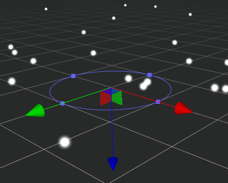

The **Radius** property of the circle emitter can be adjusted by directly dragging the square control point of the circular Gizmo.

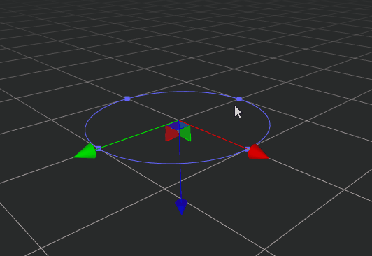

## Cone

When the **ShapeType** property is set to **Cone**, we call it a cone emitter. In the **Scene Editor** there will be a Cone Gizmo that shows the shape size of the emitter:

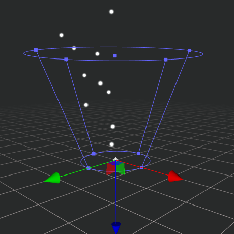

> The cross section below the cone with the smaller radius is called the bottom of the cone, as shown in the above illustration.

The properties of the cone emitter are shown in the **Inspector** panel as follows.

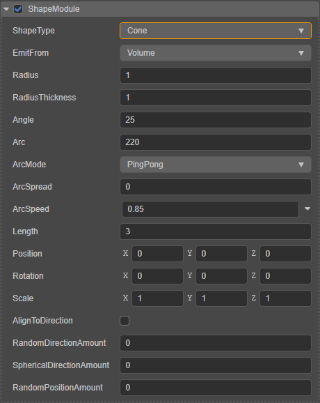

The special property items are described as follows.

| Properties | Description |
| :---|:--- |
| **EmitFrom**  | From which part of the cone the emitter emits particles, including： **Base**: Emitted from the bottom of the cone **Shell**: Emitted from the circumference of the bottom of the cone **Volume**: Emitted from the inside of the cone |
| **Radius**    | Set the radius of the bottom cross section of the cone |
| **RadiusThickness** | The position of the emitted particles from the cone emitter. When set to **0**, it means emitting from the surface of the cone When set to **1**, it means emitting from the center of the cone When set to between **0~1**, it means emitting from the center of the cone to the surface, within a certain proportional range |
| **Angle**     | The angle between the axis of the cone and the bus, the larger the value the greater the angle, the greater the degree of opening and closing of the cone emitter |
| **Arc**       | Set the fan area where the cone emitter emits particles |
| **ArcMode**   | indicates how the particles are emitted in the fan area. **Random**: random position **Loop**: Emitted cyclically in a certain direction, each cycle in the same direction **PingPong**: Emitted cyclically, each cycle in the opposite direction **spread**: indicates that the particle is emitted at a certain interval, for example, 0 means it can be emitted at any position; 0.1 means it is emitted every tenth of the circumference of the circle |
| **ArcSpeed**  | The speed of the particle emitted along the arc
| **ArcSpread** | indicates the velocity of the particle along the arc. Click the down icon button on the right to open the curve editor to edit the curve |
| **Length**    | The axis length of the top section of the cone from the bottom |

The **Angle**, **Length**, and **Radius** properties of the cone emitter can also be set by directly dragging the cone Gizmo's square control point in the scene.

## Sphere / Hemisphere

When the **ShapeType** property is set to **Sphere**/**Hemisphere**, we call it a sphere/hemisphere emitter.

The properties of the sphere emitter and the hemisphere emitter are the same, and here we use the sphere emitter as an example.

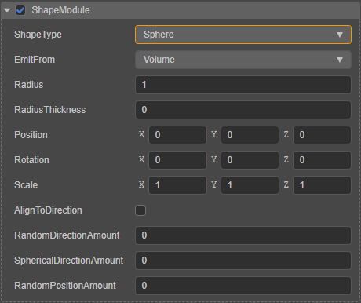

The special property items are described as follows.

| Properties | Description |
| :---|:--- |
| **EmitFrom**  | From which part of the sphere the emitter emits particles, including: **Volume**: Emits from inside the sphere **Shell**: Emits from the surface of the sphere (not in effect yet, can be set by **RadiusThickness**) |
| **Radius**    | The radius of the sphere. You can also set it by dragging the control point of the sphere Gizmo in the **Scene Editor** directly |
| **RadiusThickness** | The position of the particle emitted by the sphere emitter. When set to **0**, it means emitting from the surface of the ball When set to **1**, it means emitting from the center of the sphere When set to between **0~1**, it means emitting from the surface to the center of the sphere, within a certain proportional range |

The sphere emitter will have a sphere Gizmo in the **Scene Editor** that shows the shape size of the emitter.

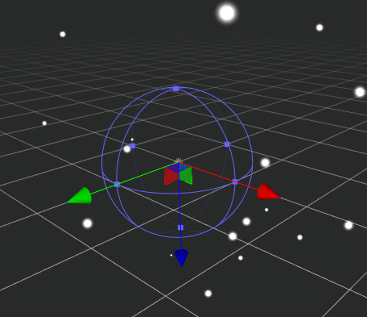

Similarly, the hemisphere emitter has a hemisphere Gizmo in the **Scene Editor** that shows the shape size of the emitter:

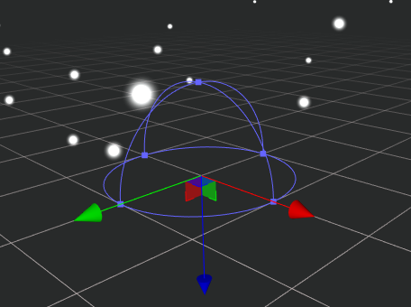
