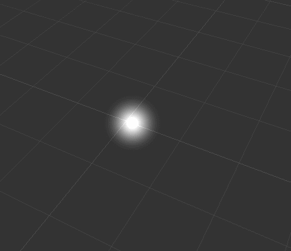
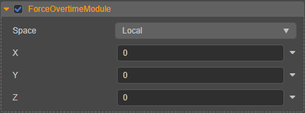

# Force Overtime Module

The module allows acceleration of particles to simulate a wind-like effect.

## Properties

| Properties | Description |
| :--- | :--- |
| **Space** | The acceleration calculation is based on **World Coordinate System** or **Local Coordinate System**  (**Custom** is not supported at this time) |
| **X** | Acceleration in the X-axis |
| **Y** | Acceleration in the Y-axis |
| **Z** | Acceleration in the Z-axis |

Click the  button to the right of the property input box, you can choose to edit the curves of the property, please refer to [curve editor](./editor/curve-editor.md) for details.
