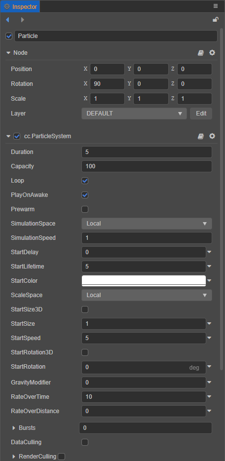
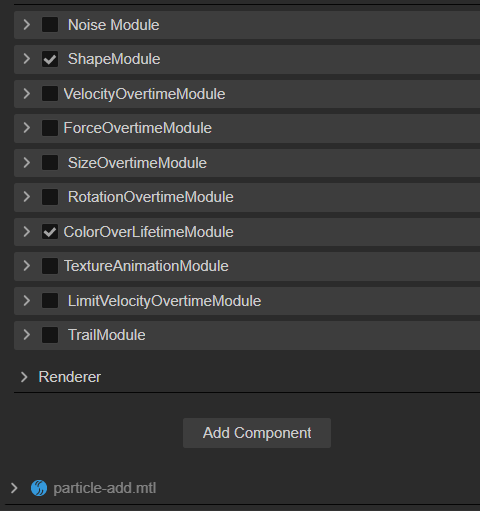

# Particle System Function Introduction

Particle System stores the initial state of particle emission and the state update submodule after particle emission.

## Particle System Module

The Cocos Creator particle system operation panel is as follows:

 

The particle system uses modules to organize functionality, including the following modules:

| Module | Description |
| :--- | :--- |
| Node | Particle node, used to set the position, direction, size, rendering level and other properties of the particle emitter. |
| [ParticleSystem](main-module.md) (main module) | Used to store all the data displayed in the **Inspector** panel, manage particle generation, update, destroy related modules, and control particle playback |
| [ShapeModule](emitter.md) (emitter module) | Used to control particle emitting, including emitting direction and speed, support predefined emitting direction, including square, circle, cone, ball, hemisphere. |
| AnimatorModule | Used to control the state update after the particle is launched. Supported features include: [VelocityOvertimeModule](velocity-module.md) [ForceOvertimeModule](force-module.md) [SizeOvertimeModule](size-module.md) [RotationOvertimeModule](rotation-module.md) [ColorOvertimeModule](color-module.md) [TextureAnimationModule](texture-animation-module.md) [LimitVelocityOvertimeModule](limit-velocity-module.md) [TrailModule](trail-module.md) | [Renderer]<br
| [Renderer](renderer.md) | The data needed to generate particle rendering. Including VB, IB, render state related control. |
