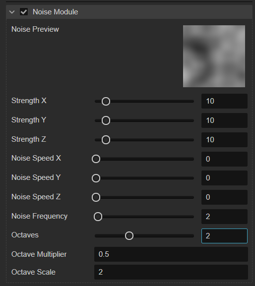

# Noise Module  

Noise Module is used to enhance particle motion effect. This option will be disabled when we select **UseGPU** in [Renderer Module](./renderer.md).  

## Properties  

| Property | Description |
| :--- | :--- |
| **Strength X** | Noise strength on X axis |
| **Strength Y** | Noise strength on Y axis |
| **Strength Z** | Noise strength on Z axis |
| **Noise Speed X** | Rolling speed of noise texture coordinate on X axis |
| **Noise Speed Y** | Rolling speed of noise texture coordinate on Y axis  |
| **Noise Speed Z** | Rolling speed of noise texture coordinate on Z axis  |
| **Noise Frequency** | Noise texture frequency |
| **Octaves** | Specify how many layers of overlapping noise are combined to produce the final noise values |
| **Octave Multiplier** | For each additional noise layer, reduce the strength by this proportion |
| **Octave Scale** | For each additional noise layer, adjust the frequency by this multiplier |