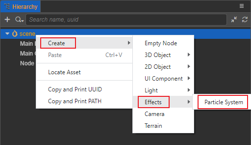

# 3D Particle System Overview

The particle system is the basis of the game engine's special effects. It can be used to simulate natural phenomena such as fire, smoke, water, clouds, snow, and fallen leaves. It can also be used to simulate abstract visual effects such as luminous tracks and speed lines.

## Basic Structure

The basic unit of a particle system is a particle. A particle generally has attributes such as position, size, color, velocity, acceleration, and life cycle. In each frame, the particle system generally performs the following steps:

1. Generate new particles and initialize.
2. Delete particles beyond the life cycle.
3. Update the dynamic properties of particles.
4. Render all valid particles.

The general particle system will consist of the following parts:

1. Emitter, used to create particles and initialize particle properties.
2. Influencer, used to update the properties of particles.
3. Renderer, render particles.
4. Particle class, which stores the properties of particles.
5. The particle system class manages the above modules.

## Adding the particle system

There are two ways to add the particle system:

1. Select the node in the __Hierarchy__ panel and click the __Add Component__ button on the __Inspector__ panel, as shown below:

    

2. You can also right-click the **Hierarchy** panel and select __Create -> Effects-> Particle System__ to create a node with the particle system component, as shown below:

    

## Contents

The particle system consists of the following two main parts:

- [Particle System Module](./module.md)

- [Particle Property Editor](./editor/index.md)
