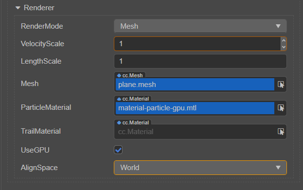

# Particle Renderer

The particle rendering part is controlled by **ParticleSystemRenderer**, which is divided into **CPU renderer** and **GPU renderer**.

The CPU renderer maintains all particles through an object pool, generates corresponding vb and ib data according to the current state of the particles, holds the materials to be rendered by the particles, and saves the relevant rendering state.

The GPU renderer generates particles on the CPU side, and only submits the vb and ib data of initial parameter, but the calculations related to the module are in the form of pre-sampled data. The data is submitted once during initialization, and the subsequent module system extracts and simulates the data on the GPU side to reduce the computing pressure on the CPU side. The subsequent versions will continue to optimize and improve the particle system. The current GPU version does not support `TrailModule` and `LimitVelocityOvertimeModule`.

| Property | Description |
| :--- | :--- |
| **RenderMode** | Set a particle patch generation method.  **Billboard** particles always face the camera **StretchedBillboard** particles always face the camera, but will be stretched according to the relevant parameters **HorizontalBillboard** particles patches are always in the x-z plane parallel **VerticalBillboard** particles patch is always parallel to the Y axis, but will face the camera **Mesh** particles are a model. |
| **VelocityScale** | In **stretchedBillboard** mode, the particles are stretched according to the speed in the direction of motion. |
| **LengthScale** | In **StretchedBillboard** mode, the particles are stretched by the size of the particles in the direction of motion. |
| **Mesh** | When **RenderMode** is set to **Mesh**, specify the model of particles to be rendered. |
| **ParticleMaterial** | The material used for particle rendering. When use the CPU renderer, that is, when **UseGPU** option is not selected, the effect used by the material can only be `builtin-particle`, and other effects are not supported. When use the GPU renderer, that is, when **UseGPU** option is checked, the effect used by the material can only be `builtin-particle-gpu`, and other effects are not supported. |
| **TrailMaterial** | The material used for trail rendering. The effect of the material only supports `builtin-particle-trail`, not other effects. |
| **UseGPU** | Whether to use the GPU renderer for particle rendering, it is not selected by default. When this option is not checked, use the CPU renderer **ParticleSystemRendererCPU** to render particles. When this option is checked, use the GPU renderer **ParticleSystemRendererGPU** to render particles. |
