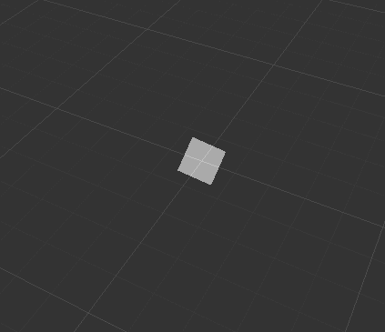
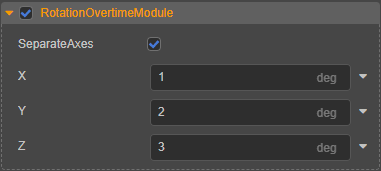

# Rotation Overtime Module

The rotate module is used to set the particles to rotate on the fly when running, and can be used to simulate random rotating effects like falling snowflakes.

## Properties

| Properties | Description |
| :--- | :--- |
| **SeparateAxes** | Whether to set the particle rotation of the three axes separately |
| **X、Y、Z** | Sets the angular velocity of rotation around the X, Y, and Z axes. Where **X**, **Y** are only displayed when the **SeparateAxes** property is checked. |

Click the  button to the right of the property input box, you can choose to edit the curves of the property, please refer to [curve editor](./editor/curve-editor.md) for details.
