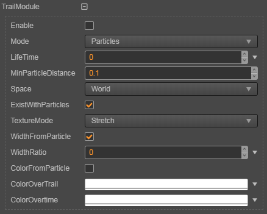

# Trail Module0

The trail module is used to add a trail effect to the tail of the particle to achieve a trailing effect similar to the one in the following figure.

## Properties

Property | Role
---|---
| **Mode** | The way the particle system generates trailing, currently only supports **Particles**, which means that a trailing effect is formed on the motion track of each particle.
| **LifeTime** | The lifetime of the generated trailing.
| **MinParticleDistance** | The shortest distance that particles travel each time they generate a trailing node.
| **Space** | Choose to run trailing based on **World coordinate system** (World) or **Local coordinate system** (Local)  (**Custom** is currently not supported)
| **TextureMode** | When a **TrialMaterial** texture is specified in the [renderer module](./renderer.md), the unwrapped form of the texture on the trail. Currently only **Stretch** is supported, which means to overlay the texture on the entire trail.
| **WidthFromParticle** | Trail width follows particle size
| **WidthRatio** | Trailing width. If **WidthFromParticle** is checked, the trailing width is the sample size multiplied by the ratio.
| **ColorFromParticle** | Whether the trailing color follows the initial particle color
| **ColorOverTrail** | The trail color changes with the length of the trail itself
| **ColorOvertime** | trailing color changes over time

Click the  button to the right of the attribute input box, you can choose to edit the curve/gradient color of the attribute, please refer to [Particle Property Editor](./editor/index.md).
