# 2D Collider

## Create Collider

The engine currently supports three different colliders: **BoxCollider2D**, **CircleCollider2D** and **PolygonCollider2D**. Click the **Add Component** button on the **Inspector** panel and enter the name of the collider to add it.

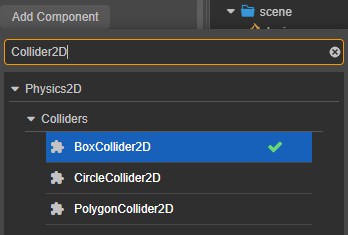

## Properties

The different colliders have the following properties in common:

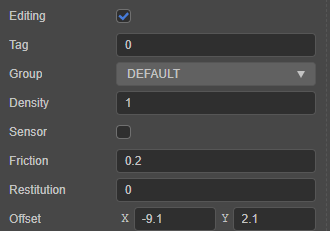

| Properties | Description |
|:-- | :-- |
| **Editing** | Whether to edit the collider. Check this option to edit the position, style and size of the collider in the scene. For details, please refer to **Editing Collider** below |
| **Tag** | Tag. When a collision occurs, you can distinguish different colliders according to **Tag**. |
| **Group** | Collider group. By [Collision Matrix](../editor/project/physics-configs.md), you can set the possibility of collision between different groups. |
| **Sensor** | Specify whether the collider is of sensor type, the collider of sensor type will generate a collision callback, but no physical collision effect will occur |
| **Density** | The density of the collider, used to calculate the mass of the rigid body. |
| **Friction** | The friction factor of the collider, the motion of the collider will be affected by the friction when it touches. |
| **Restitution**| The elasticity coefficient of the collider, specifying whether the collider will be affected by the elasticity when it collides. |
| **Offset** | The offset of the collider with respect to the center of the node. |

## BoxCollider

The Box Collider component is a common collider used to simulate a rectangle-like collider. It can be added by clicking **Add Component -> BoxCollider2D** on the **Inspector** panel of the 2D node.

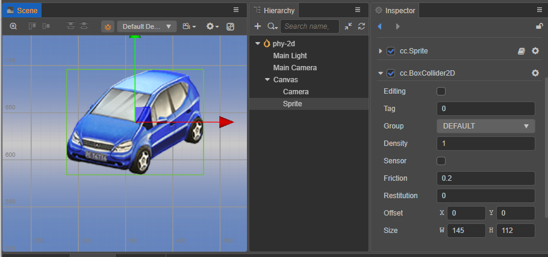

### Properties

| Properties | Description |
| :-- | :-- |
| **Size** | The size of the box collider component |

Please refer to [BoxCollider2D API](__APIDOC__/zh/#/docs/3.4/zh/physics2d/Class/BoxCollider2D) for details.

### Editing Collider

For all colliders, check **Editing** to edit them within the scene.

Press the left mouse button and drag within the collider to adjust the offset of the collider, and on 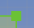 and drag the left mouse button to adjust the shape and size of the collider.

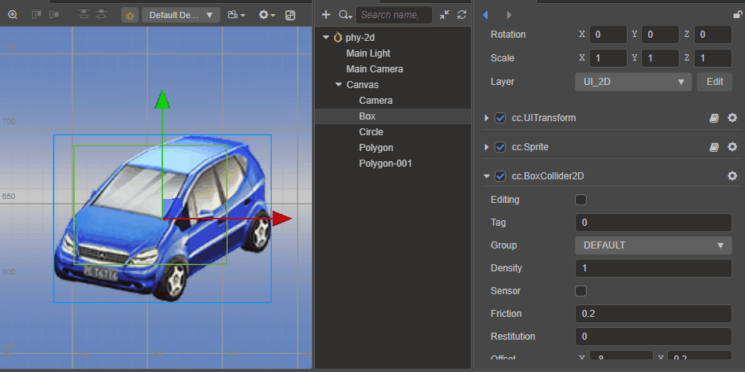

Holding down the <kbd>Alt</kbd> button while dragging will keep the **rectangle center position** unchanged during the dragging process.

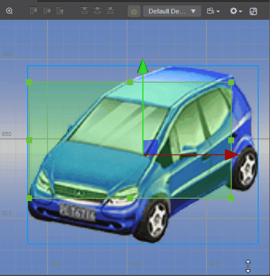

Entering on the **Inspector** panel also refines the size and offset of the collider.

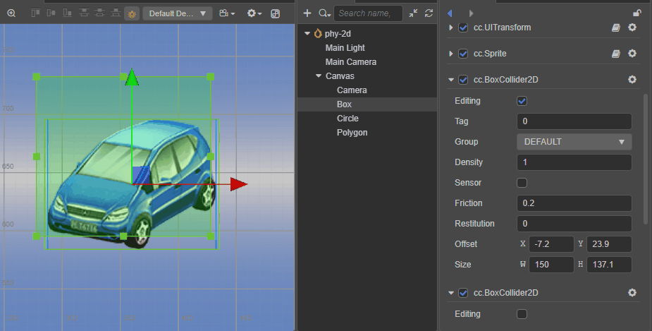

## CircleCollider2D

Click **Add Component** on the **Inspector** panel and enter CircleCollider2D to add a circle collider.

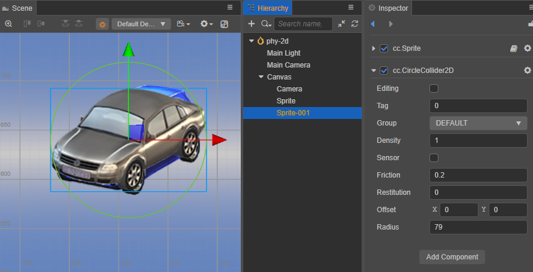

### Properties

| Properties | Description |
| :-- | :-- |
| **Radius** | radius of the circle |

Please refer to [CircleCollider2D API](__APIDOC__/zh/#/docs/3.4/zh/physics2d/Class/CircleCollider2D) for details.

### Editing Collider

When holding down the <kbd>Alt</kbd> button to drag, the **circle center position** will be maintained during the dragging process.

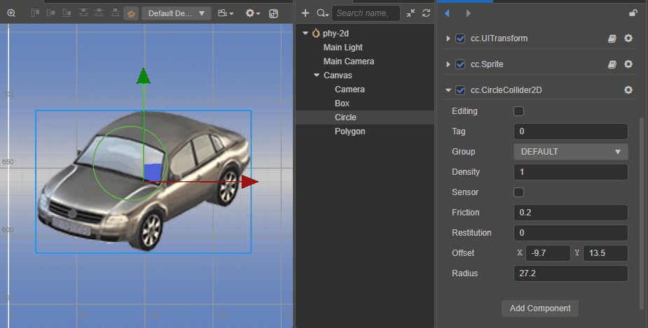

## PolygonCollider2D

The Polygon Collider component allows you to edit more detailed physics shapes for more accurate physics simulation of objects.

Click **Add Component** on the **Inspector** panel and enter PolygonCollider2D to add a polygon collider.

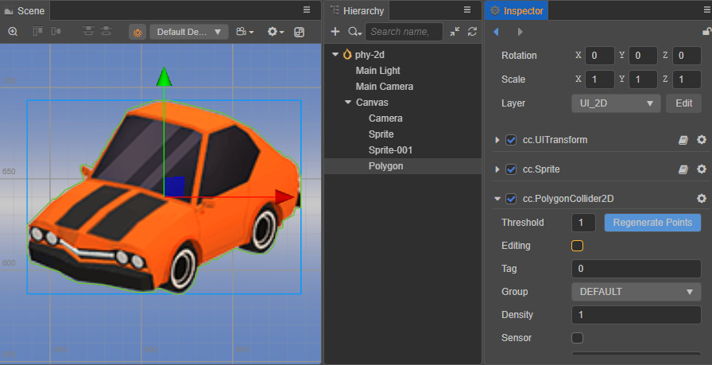

### Properties

| Properties | Description |
| :-- | :-- |
| **Threshold** | Specifies the minimum distance between the vertices of the generated map outline, the larger the value, the fewer points will be generated, adjustable according to requirements |
| **Points** | The vertices of the polygon can be edited within the scene by checking **Editing**, and can also be adjusted by entering values on the **Inspector** panel |

Please refer to [PolygonCollider2D API](__APIDOC__/zh/#/docs/3.4/zh/physics2d/Class/PolygonCollider2D) for details.

### Edit Collider

In the case of Sprite components, the engine generates outlines based on the Sprite.

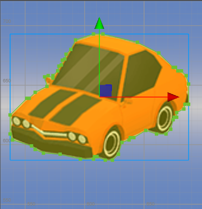

By dragging the mouse  you can adjust the position of the outline points.

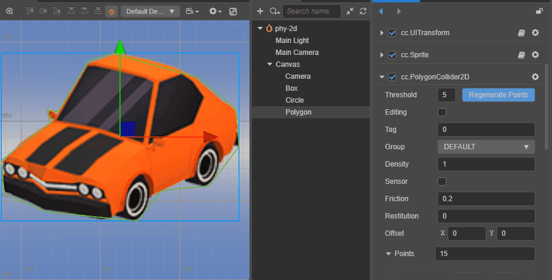

By adjusting the **Threshold** and clicking the  button, you can adjust the shape of the outline and the number of points.

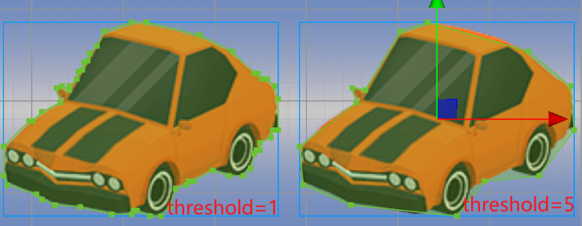

When you mouse over a line segment of a polygon, the line segment will be highlighted and the mouse will change to add style, then click the left mouse button to insert a new point in the line segment.

## Details

Box2D physics colliders are internally composed of Box2D b2Fixture. Due to some limitations inside Box2D, a polygon physics collider may be composed of more than one b2Fixture.

These cases are as follows:

1. when the shape of the vertices of a polygon physics collider is a concave polygon, the physics system automatically splits these vertices into multiple concave polygon.
2. When the polygon physics collider has more vertices than `b2.maxPolygonVertices` (typically 8), the physics system automatically splits these vertices into multiple concave polygon.

Normally these details are of no concern, but when ray detection is used and the detection type is `ERaycast2DType.All`, a collider may detect multiple collision points because multiple b2Fixtures are detected.
