# 2D Joint

The physics system contains a series of joint components for connecting two rigid bodies. Joint components can be used to simulate the interaction between real-world objects such as hinges, pistons, ropes, wheels, pulleys, motor vehicles, chains, etc. Learning how to use joint components can create a realistic and interesting scenario.

> **Note**.
> 1. Joint components are not available in the Builtin 2D physics module.
> 2. Joint components are required with [rigid body](./physics-2d-rigid-body.md) to work correctly. As shown in the following figure.
>    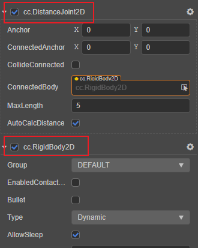

## Adding joints

Click the **Add Component** button on the **Inspector** panel and enter the component name of the 2D joint.

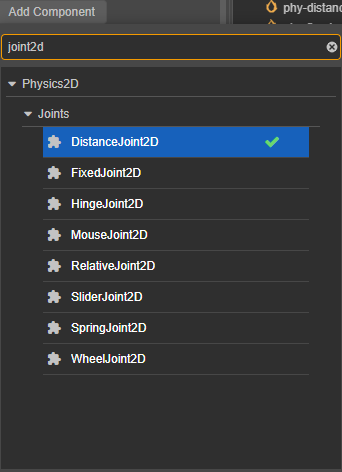

## Common Properties of Joints

Although each joint has different representations, they also share some common properties:

| Properties | Description |
| :-- | :-- |
| **ConnectedBody** | The rigid body at the other end of the joint connected |
| **Anchor** | The anchor point of the rigid body connected to the local end of the joint |
| **ConnectedAnchor** | Anchor point of the rigid body at the other end of the joint connected |
| **CollideConnected** | Can the rigid bodies at the two ends of the joint collide with each other |

Each joint needs to connect two rigid bodies to perform its function. We consider the rigid body hanging under the same node as the joint as the joint's home end, and **ConnectedBody** as the rigid body on the other end. Usually, each rigid body picks a location around itself and sets it as an anchor point. Depending on the type of joint component, the anchor point determines the center of rotation of the object, or a coordinate point used to maintain a certain distance, etc.

The **CollideConnected** property is used to determine whether the rigid bodies at the ends of the joints need to continue to follow the regular collision rules.

If you are now going to make a ragdoll, you might want the thighs and lower legs to partially overlap and then connect together at the knees, then you would set the **CollideConnected** property to false. If you are going to make a lift and want the lift platform and floor to collide, then you would set the **CollideConnected** property to true.

## Adjusting anchor points

Anchor points can be adjusted in the scene by clicking and dragging the 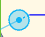 to adjust the **Anchor** property, and by 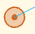 to adjust the **ConnectedAnchor**.

## DistanceJoint2D

Click **Add Component** on the **Inspector** panel and enter **DistanceJoint2D** to add a distance joint.

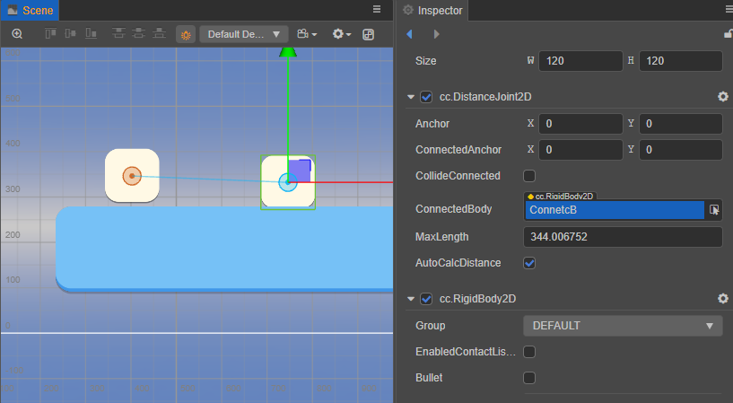

**DistanceJoint** constrains the rigid bodies at both ends of the joint to a maximum range. Beyond this range, the motion of the rigid bodies will interact with each other.

Below this range, they will not interact with each other.

### Properties

| Properties | Description |
| :-- | :-- |
| **MaxLength** | The maximum distance |
| **AutoCalcDistance** | Whether to automatically calculate the distance between two rigid bodies connected by a joint |

## FixedJoint2D

Click **Add Component** on the **Inspector** panel and enter **FixedJoint2D** to add a fixed joint.

**Fixed Joint** holds two points on two objects together based on their initial angles.

### Properties

| Properties | Description |
| :-- | :-- |
| **Frequency** | coefficient of elasticity |
| **DampingRatio** | Damping, indicating the resistance to return to the initial state after the joint has been deformed |

## HingeJoint2D

Click **Add Component** on the **Inspector** panel and enter **HingeJoint2D** to add a hinge joint.

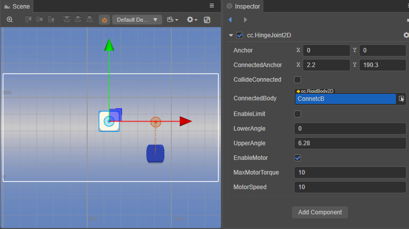

A **Hinge Joint** can be seen as a hinge or peg, where the rigid body rotates around a shared point.

### Properties

| Properties | Description |
| :-- | :-- |
| **EnableLimit** | Whether to enable the limit of the joint |
| **LowerAngle** | The minimum limit of the angle |
| **UpperAngle** | The maximum limit of the angle |
| **EnableMotor** | Whether to turn on the joint motor |
| **MaxMotorTorque** | Maximum torque that can be applied to a rigid body |
| **MotorSpeed** | Desired motor speed |

When motor speed is enabled, the jointed rigid body will try to gradually accelerate to the desired speed.

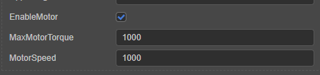

## RelativeJoint2D

Relative joints can be added by clicking **Add Component** on the **Inspector** panel and entering **RelativeJoint2D**.

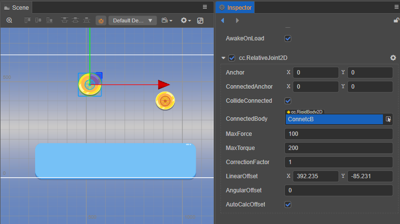

**Relative Joint** controls the relative motion between two rigid bodies.

### Properties

| Properties | Description |
| :-- | :-- |
| **MaxForce** | The maximum force value that can be applied to a rigid body |
| **MaxTorque** | The maximum torque value that can be applied to the rigid body |
| **CorrectionFactor** | Position correction factor, in the range [0, 1] |
| **LinearOffset** | The position offset of the rigid body at the other end of the joint with respect to the rigid body at the starting end |
| **AngularOffset** | The angle offset of the rigid body at the other end of the joint with respect to the starting rigid body |
| **AutoCalcOffset** | Automatically calculate the angularOffset and linearOffset between two rigid bodies connected by a joint |

## SliderJoint2D

Click **Add Component** on the **Inspector** panel and enter **SliderJoint2D** to add a sliding joint.

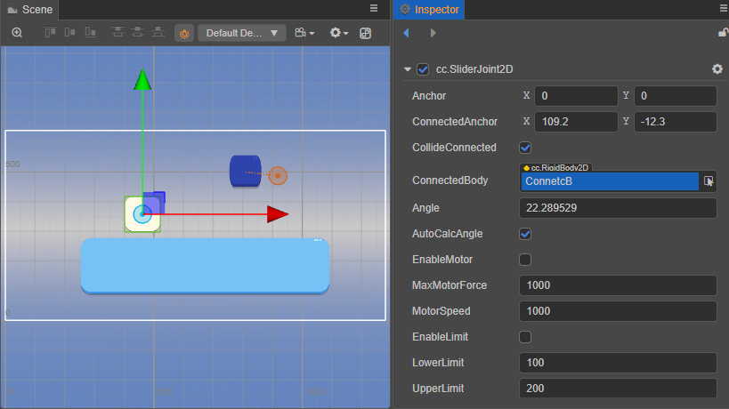

With a **Slider Joint**, the angle between the two rigid bodies is fixed and they can only slide on a specified axis. The blue square in the figure below is subject to gravity but can actually only move in the set direction due to the constraints of the joint.

### Properties

| Properties | Description |
| :-- | :-- |
| **Angle** | Direction of sliding |
| **AutoCalcAngle** | Automatically calculates the sliding direction based on the two rigid bodies connected |
| **EnableMotor** | Whether to turn on the joint motor
| **MaxMotorForce** | The maximum force that can be applied to the rigid body
| **MotorSpeed** | Desired motor speed
| **EnableLimit** | Enables or disables the distance limit of the joint
| **LowerLimit** | The minimum value that the rigid body can move
| **UpperLimit** | The maximum value that the rigid body can move |

## SpringJoint2D

Click **Add Component** on the **Inspector** panel and enter **SpringJoint2D** to add a spring joint.

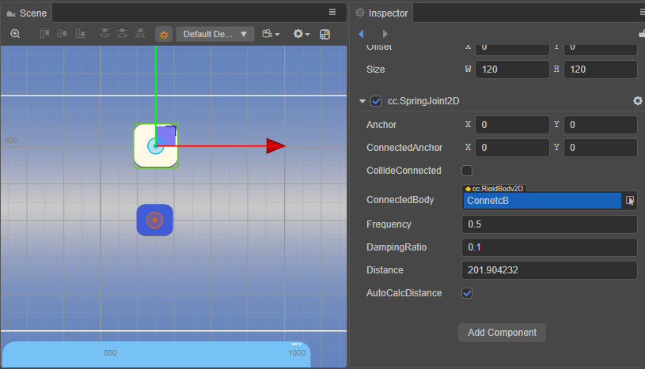

The **Spring Joint** connects objects at the ends of the joint like a spring.

### Properties

| Properties | Description |
| :-- | :-- |
| **Frequency** | Elasticity factor |
| **DamingRatio** | Damping, the resistance to return to the initial state after the joint has been deformed |
| **Distance** | The distance between the two ends of the joint
| **AutoCalcDistance** | Automatically calculates the distance between two rigid bodies connected by a joint.

## WheelJoint2D

Click **Add Component** on the **Inspector** panel and enter **WheelJoint2D** to add a wheel joint.

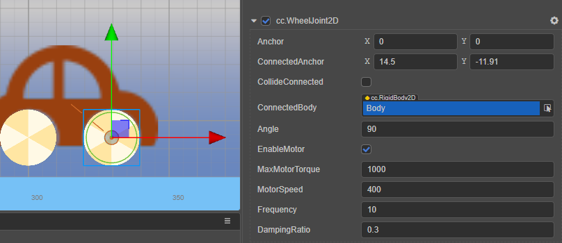

The **Wheel Joint** is used to simulate the wheels of a motor vehicle.

Consider enabling **EnableMotor** for both front and rear wheels in the case of simulated realistic 4WD, and **EnableMotor** for only the drive wheels in the case of non-4WD. The illustration shows only the front wheels with **EnableMotor** enabled, thus simulating a front-wheel drive situation.

### Properties

| Properties | Description |
| :-- | :-- |
| **Angle** | Wheel vibration direction |
| **EnableMotor** | Whether to enable the joint motor |
| **MaxMotorTorque** | The maximum torque that can be applied to the rigid body
| **MotorSpeed** | Desired motor speed
| **Frequency** | Elasticity factor
| **DampingRatio** | Damping, indicating the resistance to return to the initial state after joint deformation |
