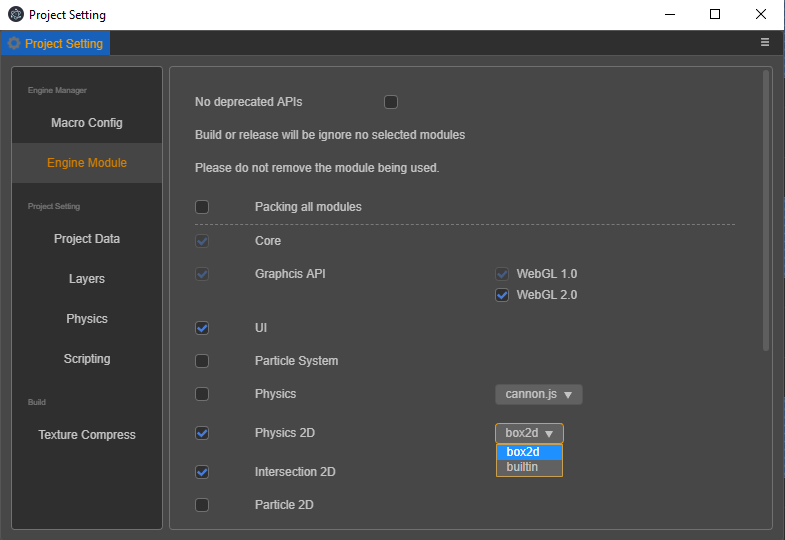

# Introduction to Physics 2D

__Cocos Creator__ supports the built-in lightweight builtin physics system and the powerful __Box2D__ physics system. For simpler physics calculations, we recommend that users use the built-in physics module, which avoids the runtime overhead of loading large __Box2D__ physics modules and building physics worlds. The __Box2D__ physics module provides a more complete interaction with the interface and pre-defined components such as rigid bodies and joints.

Choose the physics module that suits development needs, and switch the physics module you use through the __Project -> Project Setting -> Feature Cropping__ settings.

## Details

- [2D Physics System](./physics-2d-system.md)
- [2D Rigid Body](./physics-2d-rigid-body.md)
- [2D Collision Components](./physics-2d-collider.md)
- [2D Contact Callback](./physics-2d-contact-callback.md)
- [2D Physics Joints](./physics-2d-joint.md)

## Physics 2D Examples

Examples are available on [physics-samples](https://github.com/cocos-creator/physics-samples/tree/v3.x/2d).
