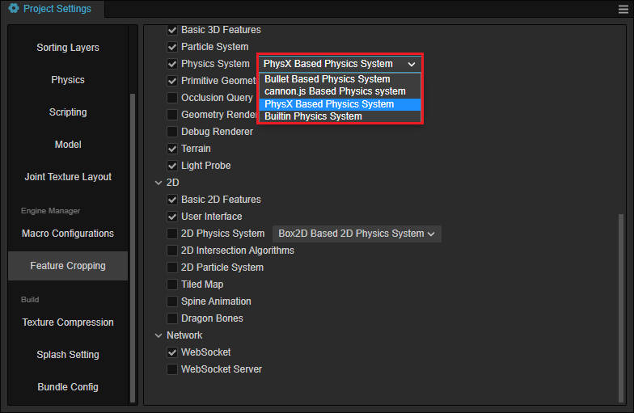
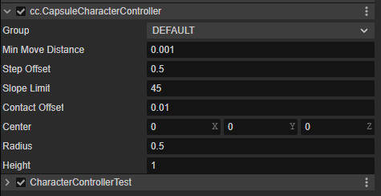
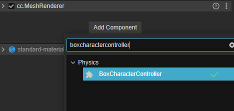
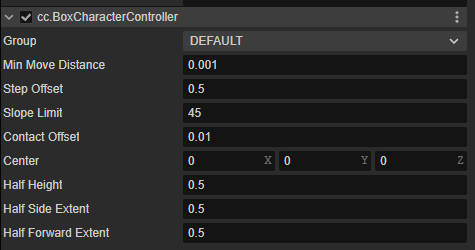

# Character Controller

> Cocos Creator supports character controllers since v3.8.

The character controllers provide a simple way to add a character controller to you game.

## Add Character Controller

There are to types of character controller in Cocos Creator , box character controller and capsule character controller, both of them are inherited from the base class `CharacterController`.

It is recommended that character controllers are invalid only in the **Bullet** and **PhysX** backends. By clicking on the **Project** menu, open the **Project Setting** panel, and find **Physics System** in the **Feature Cropping** page, choose **Bullet** or **PhysX** in the drop-down menu.



### Common Properties

The following properties are the common properties of character controller which can be found in the **Inspector** panel of **Box Character Controller** and **Capsule Character Controller** component.

| Properties | Description |
| :-- | :-- |
| Group | Physics group，refer to [Collision Matrix](physics-configs.md#collision-matrix) for more details. |
| Min Move Distance | The minimum movement distance of the character controller. If the move distance invoked by the method if smaller than this value, the character controller will not move. |
| Center  | The center of the character controller in local space |
| Step Offset | The maximum height the character controller can automatically climb. |
| Slope Limit | The slope limit of the character controller in degree. |
| Contact Offset | the contact offset of the character controller, please see below for more details|

### Capsule Character Controller

By clicking the **Add Component** button in the **Inspector** panel to add a **CapsuleCharacterController**.


#### Properties



| Properties | Description |
| :--- | :---- |
| Radius  | The radius of the sphere of the capsule shape of the CharacterController in local space |
| Height | The distance between the center of two half-sphere |

### Box Character Controller

By clicking the **Add Component** button in the **Inspector** panel to add a **BoxCharacterController**.



#### Properties



| Properties | Description |
| :--- | :---- |
| Half Height  | The half height of the box shape of the CharacterController in local space |
| Half Side Extent | The half side extent of box shape of the CharacterController in local space |
| Half Forward Extent | The half forward extent of the box on the CharacterController in local space |

## Manipulating the Character Controllers

To drive a character controller to move, you can use the `move` method with the following code.

```ts
const movement = v3(1.0, 0, 0);
let characterController = this.node.getComponent(CharacterController);
characterController.move(movement);
```

The `move` method which uses the algorithm of the `sweep` method as its internal takes into all the colliders on its path. On the one hand, it will judge the angle between the character controller and the collider, if it is smaller than the slope limit, the character controller will continue to walk along the surface of the collider, on the other hand, if the height difference between the character controller and the collider is smaller than the step offset, the character controller also automatically climbing the step. But if the two conditions above are not satisfied, the controller will stop.

To reset the position of a character controller, use the `setPosition` method of the character controller instead of using `setPosition` of node, as follows.

```
let characterController = this.node.getComponent(CharacterController);
characterController.setPosition(new Vec3(-3,5,6));
```

When a character controller node is moved via the `setPosition` method, it will automatically set the position of the physics world simultaneously, however the `setPosition` or `setWorldPosition` method of the node may cause the scene and physics world position out of sync.

> That because when every frame when the synchronization of the position from render scene to physics world, the center offset must be taken into consideration.

## Determine if on the Ground

Use the `onGround` method to determine whether if a character controller is stand on some colliders with the following code.

```ts
let characterController = this.node.getComponent(CharacterController);
const isOnGround = characterController.onGround();
```

## Collision Callback

The `onColliderHit` event will be emitted when a collision occurs between the character controller and the collider, the code example is as follows.

```ts
let characterController = this.node.getComponent(CharacterController)!;
characterController.on('onColliderHit', this.onColliderHit, this);
```

The callback of the collision is declared as follows:

```ts
onColliderHit (selfCCT, hitCollider, contact){}
```

The description ot the callback is below.

- selfCCT: the character controller that the event belongs.
- otherCollider: other colliders, for more [Collider](../physics-collider.md)
- contact: the contact information when the collision occurs, refer to [CharacterControllerContact](__APIDOC__/api/en/classes/CharacterControllerContact.html)

## Details

Normally a character is not a fully simulated physics object when we try to simulate a character, which means it will not exhibit fully physics characteristics. This means that when the collision occurs, the force situation of the character controller is different from a dynamic rigidbody. Simulate the force, or the velocity in the collision callback to implement the fore effect.

To simulate the full physics effect, please use [Dynamic Rigibody](../physics-rigidbody.md). Note that if you attach a rigibody component to the node containing a character controller, this may cause unexpected error which normally we do not recommended.

There is no physics effect between character controllers, and this feature will be added in the future version.

### Contact Offset

The **Contact Offset** property allows slight penetration between a character controller and a collider to avoid shaking or stuck.

It is usually a small, floating number above zero.

If stuck frequently, you can adjust the **Contact Offset** to a large number to avoid precision problems with floating-point number.

## Example

The address of the character controller is [GIT](https://github.com/cocos/cocos-example-projects). Import the project, and run the **case-character-controller.scene** scene to see the character controller example.

## API

For the API of the character controller, please refer to [Character Controller](__APIDOC__/api/en/classes/charactercontroller.html), [Box Character Controller](__APIDOC__/api/en/classes/boxcharactercontroller.html) and [Capsule Character Controller](__APIDOC__/api/en/classes/capsulecharactercontroller.html).
